# Create a Modal Dialog System with Focus Management and Accessibility


## 📋 Table of Contents

- [Create a Modal Dialog System with Focus Management and Accessibility](#create-a-modal-dialog-system-with-focus-management-and-accessibility)
  - [Table of Contents](#table-of-contents)
  - [Clarify the Problem and Requirements](#clarify-the-problem-and-requirements)
    - [Problem Understanding](#problem-understanding)
    - [Functional Requirements](#functional-requirements)
    - [Non-Functional Requirements](#non-functional-requirements)
    - [Key Assumptions](#key-assumptions)
  - [High-Level Architecture](#high-level-architecture)
    - [Modal System Architecture](#modal-system-architecture)
    - [Focus Management Flow](#focus-management-flow)
  - [UI/UX and Component Structure](#uiux-and-component-structure)
    - [Component Architecture](#component-architecture)
    - [Responsive Modal Layout](#responsive-modal-layout)
  - [Real-Time Sync, Data Modeling & APIs](#real-time-sync-data-modeling-apis)
    - [Modal State Management](#modal-state-management)
      - [State Machine Implementation](#state-machine-implementation)
    - [Focus Trap Algorithm](#focus-trap-algorithm)
      - [Advanced Focus Management](#advanced-focus-management)
    - [Animation System](#animation-system)
      - [Physics-Based Animations](#physics-based-animations)
    - [Data Models](#data-models)
      - [Modal Configuration Schema](#modal-configuration-schema)
      - [Focus Management State](#focus-management-state)
  - [Performance and Scalability](#performance-and-scalability)
    - [Memory Management](#memory-management)
      - [Component Lifecycle Optimization](#component-lifecycle-optimization)
    - [Performance Monitoring](#performance-monitoring)
      - [Real-time Performance Metrics](#real-time-performance-metrics)
  - [Security and Privacy](#security-and-privacy)
    - [Security Considerations](#security-considerations)
      - [Content Security and XSS Prevention](#content-security-and-xss-prevention)
  - [Testing, Monitoring, and Maintainability](#testing-monitoring-and-maintainability)
    - [Comprehensive Testing Strategy](#comprehensive-testing-strategy)
      - [Multi-Layer Testing Approach](#multi-layer-testing-approach)
  - [Trade-offs, Deep Dives, and Extensions](#trade-offs-deep-dives-and-extensions)
    - [Modal vs Alternative Patterns](#modal-vs-alternative-patterns)
    - [Advanced Features](#advanced-features)
      - [Intelligent Modal Behavior](#intelligent-modal-behavior)
    - [Future Extensions](#future-extensions)
      - [Next-Generation Modal Features](#next-generation-modal-features)

---

## Table of Contents
1. [Clarify the Problem and Requirements](#clarify-the-problem-and-requirements)
2. [High-Level Architecture](#high-level-architecture)
3. [UI/UX and Component Structure](#uiux-and-component-structure)
4. [Real-Time Sync, Data Modeling & APIs](#real-time-sync-data-modeling--apis)
5. [Performance and Scalability](#performance-and-scalability)
6. [Security and Privacy](#security-and-privacy)
7. [Testing, Monitoring, and Maintainability](#testing-monitoring-and-maintainability)
8. [Trade-offs, Deep Dives, and Extensions](#trade-offs-deep-dives-and-extensions)

---

## Clarify the Problem and Requirements

[⬆️ Back to Top](#--table-of-contents)

---


### Problem Understanding

[⬆️ Back to Top](#--table-of-contents)

---

Design a comprehensive modal dialog system that provides accessible, performant, and flexible overlay interfaces for web applications. The system must handle complex focus management, keyboard navigation, screen reader compatibility, and support various modal types while maintaining excellent user experience across devices.

### Functional Requirements

[⬆️ Back to Top](#--table-of-contents)

---

- **Modal Types**: Alert, confirm, prompt, custom content, forms, image galleries
- **Focus Management**: Automatic focus trapping, restore previous focus, tab navigation
- **Accessibility**: ARIA compliance, screen reader support, keyboard navigation
- **Stacking**: Multiple modal support, z-index management, modal-over-modal
- **Animations**: Smooth enter/exit transitions, customizable animations
- **Responsive Design**: Mobile-optimized layouts, touch-friendly interactions
- **Portal Rendering**: Render outside DOM hierarchy, avoid z-index conflicts
- **Escape Mechanisms**: ESC key, backdrop click, programmatic close

### Non-Functional Requirements

[⬆️ Back to Top](#--table-of-contents)

---

- **Performance**: <16ms render time, 60fps animations, minimal layout shifts
- **Accessibility**: WCAG 2.1 AA compliance, screen reader compatibility
- **Browser Support**: Modern browsers, graceful degradation for older versions
- **Memory Efficiency**: Proper cleanup, no memory leaks, optimized DOM manipulation
- **Customization**: Theming support, flexible layouts, extensible architecture
- **Bundle Size**: <10KB gzipped for core functionality

### Key Assumptions

[⬆️ Back to Top](#--table-of-contents)

---

- Maximum concurrent modals: 5 (practical UX limit)
- Animation duration: 200-300ms (optimal perception)
- Focus restoration: Required for accessibility compliance
- Mobile breakpoint: 768px for responsive adaptations
- Browser support: IE11+ (with polyfills), modern browsers native
- Framework agnostic: Core system works with React, Vue, Angular

---

## High-Level Architecture

[⬆️ Back to Top](#--table-of-contents)

---


### Modal System Architecture

[⬆️ Back to Top](#--table-of-contents)

---


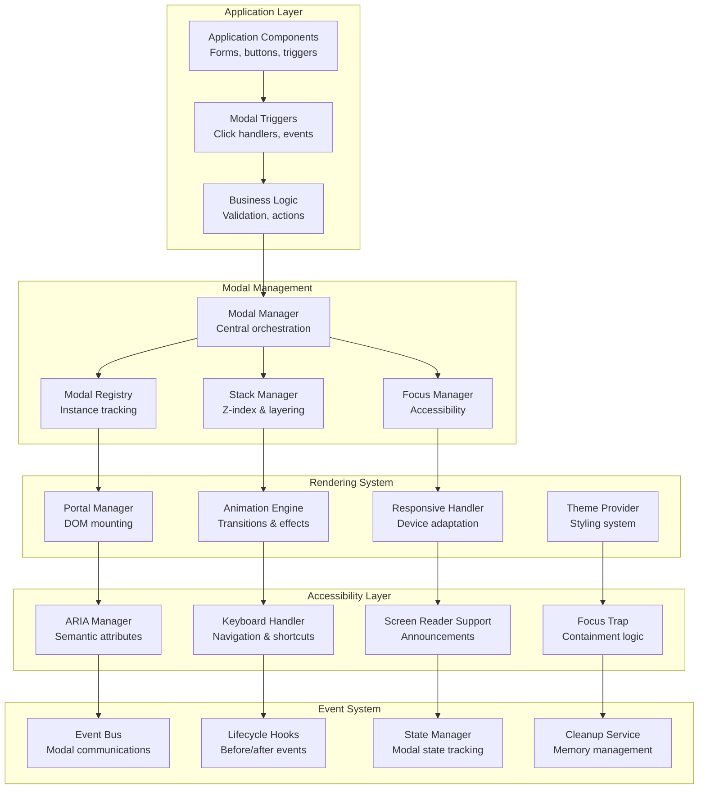

### Focus Management Flow

[⬆️ Back to Top](#--table-of-contents)

---


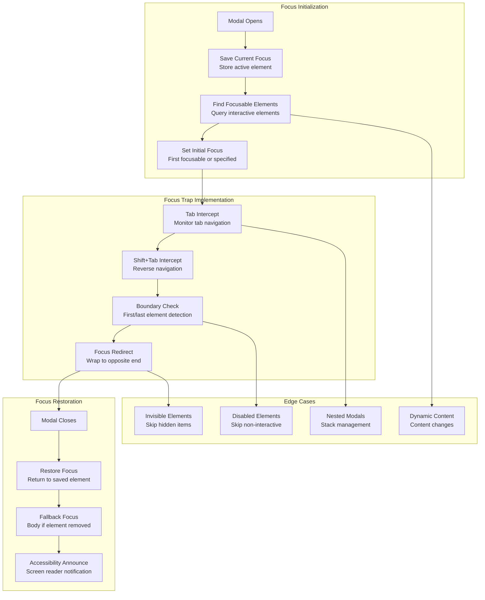

---

## UI/UX and Component Structure

[⬆️ Back to Top](#--table-of-contents)

---


### Component Architecture

[⬆️ Back to Top](#--table-of-contents)

---


```mermaid
graph TD
    subgraph "Core Components"
        MODAL_PROVIDER[Modal Provider<br/>Context & state management]
        MODAL_CONTAINER[Modal Container<br/>Wrapper & positioning]
        MODAL_BACKDROP[Modal Backdrop<br/>Overlay & click handling]
        MODAL_CONTENT[Modal Content<br/>Main content area]
    end
    
    subgraph "Specialized Modals"
        ALERT_MODAL[Alert Modal<br/>Simple notifications]
        CONFIRM_MODAL[Confirm Modal<br/>Yes/no decisions]
        PROMPT_MODAL[Prompt Modal<br/>Text input dialogs]
        CUSTOM_MODAL[Custom Modal<br/>Flexible content]
        FORM_MODAL[Form Modal<br/>Complex forms]
        GALLERY_MODAL[Gallery Modal<br/>Image/media viewer]
    end
    
    subgraph "UI Components"
        MODAL_HEADER[Modal Header<br/>Title & close button]
        MODAL_BODY[Modal Body<br/>Scrollable content]
        MODAL_FOOTER[Modal Footer<br/>Action buttons]
        CLOSE_BUTTON[Close Button<br/>Accessible close action]
        LOADING_SPINNER[Loading Spinner<br/>Async operations]
    end
    
    subgraph "Accessibility Components"
        FOCUS_TRAP_COMPONENT[Focus Trap<br/>Keyboard navigation]
        ARIA_LIVE_REGION[ARIA Live Region<br/>Status announcements]
        SKIP_LINK[Skip Link<br/>Navigation assistance]
        HIGH_CONTRAST[High Contrast Mode<br/>Visual accessibility]
    end
    
    subgraph "Animation Components"
        FADE_TRANSITION[Fade Transition<br/>Opacity animation]
        SCALE_TRANSITION[Scale Transition<br/>Size animation]
        SLIDE_TRANSITION[Slide Transition<br/>Position animation]
        SPRING_ANIMATION[Spring Animation<br/>Physics-based motion]
    end
    
    subgraph "Utility Hooks/Services"
        USE_MODAL[useModal Hook<br/>Modal state management]
        USE_FOCUS_TRAP[useFocusTrap Hook<br/>Focus management]
        USE_ESCAPE_KEY[useEscapeKey Hook<br/>Keyboard handling]
        USE_LOCK_SCROLL[useLockScroll Hook<br/>Body scroll prevention]
        USE_PORTAL[usePortal Hook<br/>DOM portal rendering]
    end
    
    MODAL_PROVIDER --> MODAL_CONTAINER
    MODAL_CONTAINER --> MODAL_BACKDROP
    MODAL_BACKDROP --> MODAL_CONTENT
    
    MODAL_CONTENT --> ALERT_MODAL
    MODAL_CONTENT --> CONFIRM_MODAL
    MODAL_CONTENT --> PROMPT_MODAL
    MODAL_CONTENT --> CUSTOM_MODAL
    MODAL_CONTENT --> FORM_MODAL
    MODAL_CONTENT --> GALLERY_MODAL
    
    MODAL_CONTENT --> MODAL_HEADER
    MODAL_CONTENT --> MODAL_BODY
    MODAL_CONTENT --> MODAL_FOOTER
    MODAL_HEADER --> CLOSE_BUTTON
    MODAL_BODY --> LOADING_SPINNER
    
    MODAL_CONTAINER --> FOCUS_TRAP_COMPONENT
    MODAL_CONTAINER --> ARIA_LIVE_REGION
    MODAL_CONTAINER --> SKIP_LINK
    MODAL_CONTAINER --> HIGH_CONTRAST
    
    MODAL_BACKDROP --> FADE_TRANSITION
    MODAL_CONTENT --> SCALE_TRANSITION
    MODAL_CONTENT --> SLIDE_TRANSITION
    MODAL_CONTENT --> SPRING_ANIMATION
    
    ALERT_MODAL --> USE_MODAL
    CONFIRM_MODAL --> USE_FOCUS_TRAP
    PROMPT_MODAL --> USE_ESCAPE_KEY
    CUSTOM_MODAL --> USE_LOCK_SCROLL
    FORM_MODAL --> USE_PORTAL
```

#### React Component Implementation

[⬆️ Back to Top](#--table-of-contents)

---

**ModalProvider.jsx**
```jsx
import React, { createContext, useContext, useState, useCallback } from 'react';
import ModalContainer from './ModalContainer';

const ModalContext = createContext();

export const useModal = () => {
  const context = useContext(ModalContext);
  if (!context) {
    throw new Error('useModal must be used within a ModalProvider');
  }
  return context;
};

**ModalProvider.jsx**

**What this code does:**
• **Main Purpose**: Global modal management system with stacking and utility functions
• **Modal Stack**: Manages multiple overlapping modals with proper layering
• **Key Functions**:
  - `openModal()` - Creates and displays modal with unique ID
  - `closeModal()` - Removes modal from stack and cleans up
  - `alert()` - Shows simple alert modal with message
  - `confirm()` - Displays confirmation modal returning Promise for user choice
  - Automatic modal ID generation and cleanup

export const ModalProvider = ({ children }) => {
  const [modals, setModals] = useState([]);

  const openModal = useCallback((modalComponent, props = {}) => {
    const id = Date.now().toString();
    const modal = {
      id,
      component: modalComponent,
      props: {
        ...props,
        id,
        onClose: () => closeModal(id)
      }
    };
    
    setModals(prev => [...prev, modal]);
    return id;
  }, []);

  const closeModal = useCallback((id) => {
    setModals(prev => prev.filter(modal => modal.id !== id));
  }, []);

  const alert = useCallback((message, title = 'Alert') => {
    return openModal('AlertModal', { message, title });
  }, [openModal]);

  const confirm = useCallback((message, title = 'Confirm') => {
    return new Promise((resolve) => {
      openModal('ConfirmModal', {
        message,
        title,
        onConfirm: () => resolve(true),
        onCancel: () => resolve(false)
      });
    });
  }, [openModal]);

  return (
    <ModalContext.Provider value={{
      modals,
      openModal,
      closeModal,
      alert,
      confirm
    }}>
      {children}
      <ModalContainer />
    </ModalContext.Provider>
  );
};
```

**Modal.jsx**

**What this code does:**
• **Main Purpose**: Accessible modal component with focus management and keyboard navigation
• **Accessibility**: Implements focus trapping, escape key handling, and scroll locking
• **Key Functions**:
  - `useFocusTrap()` - Traps keyboard focus within modal for accessibility
  - `useEscapeKey()` - Closes modal when Escape key is pressed
  - `useLockScroll()` - Prevents background scrolling when modal is open
  - Backdrop click detection for close-on-click functionality
  - Animation support for enter/exit transitions

```jsx
import React, { useEffect, useRef, useCallback } from 'react';
import { useFocusTrap } from './hooks/useFocusTrap';
import { useEscapeKey } from './hooks/useEscapeKey';
import { useLockScroll } from './hooks/useLockScroll';

const Modal = ({
  isOpen,
  onClose,
  children,
  title,
  size = 'medium',
  closable = true,
  closeOnBackdrop = true,
  closeOnEscape = true,
  animation = 'fade',
  className = ''
}) => {
  const modalRef = useRef(null);
  const backdropRef = useRef(null);

  useFocusTrap(modalRef, isOpen);
  useEscapeKey(isOpen && closeOnEscape ? onClose : null);
  useLockScroll(isOpen);

  const handleBackdropClick = useCallback((e) => {
    if (closeOnBackdrop && e.target === backdropRef.current) {
      onClose();
    }
  }, [closeOnBackdrop, onClose]);

  if (!isOpen) return null;

  return (
    <div
      ref={backdropRef}
      className={`modal-backdrop ${animation}`}
      onClick={handleBackdropClick}
      role="presentation"
    >
      <div
        ref={modalRef}
        className={`modal ${size} ${className}`}
        role="dialog"
        aria-modal="true"
        aria-labelledby={title ? 'modal-title' : undefined}
      >
        {title && (
          <div className="modal-header">
            <h2 id="modal-title" className="modal-title">
              {title}
            </h2>
            {closable && (
              <button
                className="modal-close-button"
                onClick={onClose}
                aria-label="Close modal"
              >
                ×
              </button>
            )}
          </div>
        )}
        
        <div className="modal-body">
          {children}
        </div>
      </div>
    </div>
  );
};

export default Modal;
```

**Custom Hooks**
```jsx
// hooks/useFocusTrap.js
import { useEffect } from 'react';

export const useFocusTrap = (containerRef, isActive) => {
  useEffect(() => {
    if (!isActive || !containerRef.current) return;

    const container = containerRef.current;
    const focusableElements = container.querySelectorAll(
      'button, [href], input, select, textarea, [tabindex]:not([tabindex="-1"])'
    );
    
    const firstElement = focusableElements[0];
    const lastElement = focusableElements[focusableElements.length - 1];

    const handleTabKey = (e) => {
      if (e.key !== 'Tab') return;

      if (e.shiftKey) {
        if (document.activeElement === firstElement) {
          e.preventDefault();
          lastElement.focus();
        }
      } else {
        if (document.activeElement === lastElement) {
          e.preventDefault();
          firstElement.focus();
        }
      }
    };

    document.addEventListener('keydown', handleTabKey);
    return () => document.removeEventListener('keydown', handleTabKey);
  }, [isActive, containerRef]);
};

// hooks/useEscapeKey.js
export const useEscapeKey = (callback) => {
  useEffect(() => {
    if (!callback) return;

    const handleEscape = (e) => {
      if (e.key === 'Escape') {
        callback();
      }
    };

    document.addEventListener('keydown', handleEscape);
    return () => document.removeEventListener('keydown', handleEscape);
  }, [callback]);
};

// hooks/useLockScroll.js
export const useLockScroll = (isLocked) => {
  useEffect(() => {
    if (isLocked) {
      const originalStyle = window.getComputedStyle(document.body).overflow;
      document.body.style.overflow = 'hidden';
      
      return () => {
        document.body.style.overflow = originalStyle;
      };
    }
  }, [isLocked]);
};
```

### Responsive Modal Layout

[⬆️ Back to Top](#--table-of-contents)

---


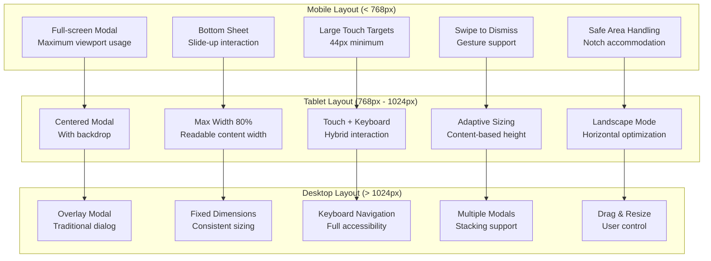

---

## Real-Time Sync, Data Modeling & APIs

[⬆️ Back to Top](#--table-of-contents)

---


### Modal State Management

[⬆️ Back to Top](#--table-of-contents)

---


#### State Machine Implementation

[⬆️ Back to Top](#--table-of-contents)

---


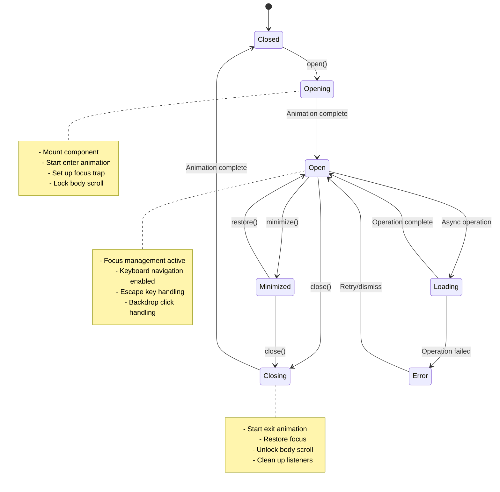

### Focus Trap Algorithm

[⬆️ Back to Top](#--table-of-contents)

---


#### Advanced Focus Management

[⬆️ Back to Top](#--table-of-contents)

---


```mermaid
graph TD
    A[Initialize Focus Trap] --> B[Query Focusable Elements<br/>Selectors: input, button, select, textarea, [tabindex]]
    B --> C[Filter Visible Elements<br/>Check offsetParent, visibility, display]
    C --> D[Sort by Tab Index<br/>Positive tabindex first, then DOM order]
    D --> E[Set Initial Focus<br/>data-autofocus or first element]
    
    E --> F[Listen for Tab Key]
    F --> G{Tab Direction}
    G -->|Forward Tab| H[Current Index + 1]
    G -->|Shift + Tab| I[Current Index - 1]
    
    H --> J{At End?}
    I --> K{At Start?}
    
    J -->|Yes| L[Focus First Element]
    J -->|No| M[Focus Next Element]
    
    K -->|Yes| N[Focus Last Element]
    K -->|No| O[Focus Previous Element]
    
    L --> P[Prevent Default Event]
    M --> P
    N --> P
    O --> P
    
    P --> Q[Update Current Index]
    Q --> F
    
    subgraph "Edge Cases"
        R[Dynamic Content Changes]
        S[Programmatic Focus Changes]
        T[Elements Becoming Disabled]
        U[Nested Interactive Elements]
    end
    
    B --> R
    C --> S
    D --> T
    E --> U
```

### Animation System

[⬆️ Back to Top](#--table-of-contents)

---


#### Physics-Based Animations

[⬆️ Back to Top](#--table-of-contents)

---


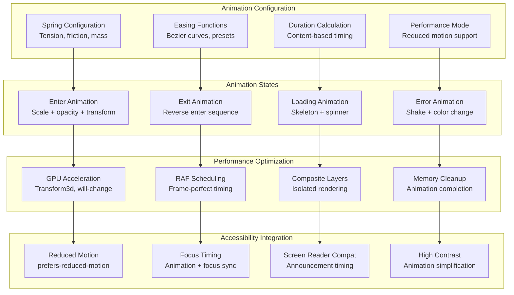

### Data Models

[⬆️ Back to Top](#--table-of-contents)

---


#### Modal Configuration Schema

[⬆️ Back to Top](#--table-of-contents)

---

```typescript
interface ModalConfig {
  id: string
  type: 'alert' | 'confirm' | 'prompt' | 'custom'
  
  // Content
  title?: string
  message?: string
  content?: ReactNode
  
  // Behavior
  closable: boolean
  closeOnEscape: boolean
  closeOnBackdrop: boolean
  persistent: boolean
  
  // Styling
  size: 'small' | 'medium' | 'large' | 'fullscreen'
  theme: 'light' | 'dark' | 'auto'
  className?: string
  style?: CSSProperties
  
  // Animation
  animation: {
    type: 'fade' | 'scale' | 'slide' | 'spring'
    duration: number
    easing: string
    reducedMotion?: boolean
  }
  
  // Accessibility
  accessibility: {
    role: string
    labelledBy?: string
    describedBy?: string
    autoFocus?: boolean | string
    restoreFocus: boolean
    announceOpen?: string
    announceClose?: string
  }
  
  // Callbacks
  onOpen?: () => void
  onClose?: (reason: CloseReason) => void
  onConfirm?: () => void
  onCancel?: () => void
  
  // Stack management
  zIndex?: number
  level: number
  parent?: string
}
```

#### Focus Management State

[⬆️ Back to Top](#--table-of-contents)

---

```typescript
interface FocusState {
  activeModal: string | null
  focusStack: Array<{
    modalId: string
    previousFocus: HTMLElement | null
    focusableElements: HTMLElement[]
    currentIndex: number
    restoreElement: HTMLElement | null
  }>
  trapEnabled: boolean
  lastUserAction: 'keyboard' | 'mouse' | 'touch'
}
```

---

## Performance and Scalability

[⬆️ Back to Top](#--table-of-contents)

---


### Memory Management

[⬆️ Back to Top](#--table-of-contents)

---


#### Component Lifecycle Optimization

[⬆️ Back to Top](#--table-of-contents)

---


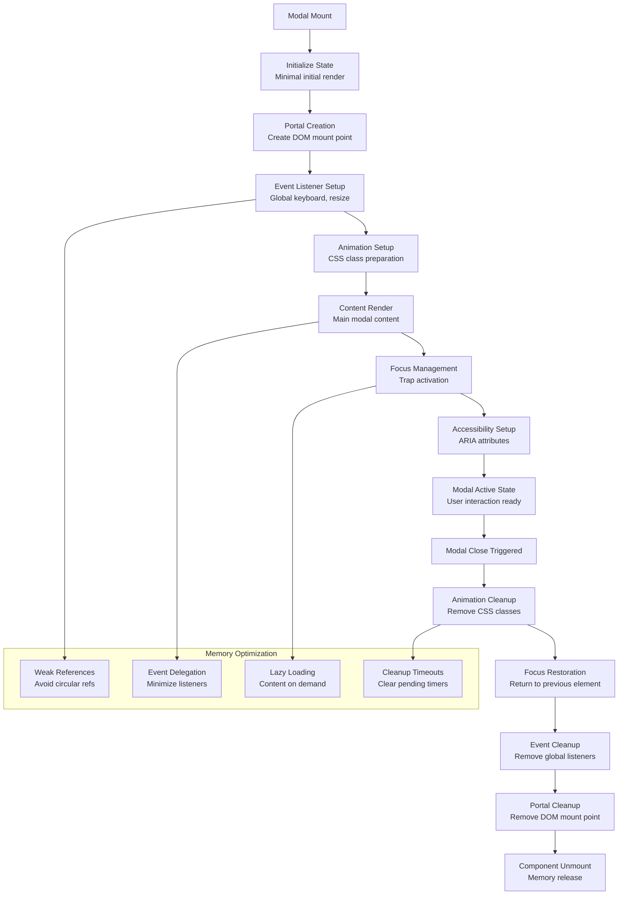

### Performance Monitoring

[⬆️ Back to Top](#--table-of-contents)

---


#### Real-time Performance Metrics

[⬆️ Back to Top](#--table-of-contents)

---


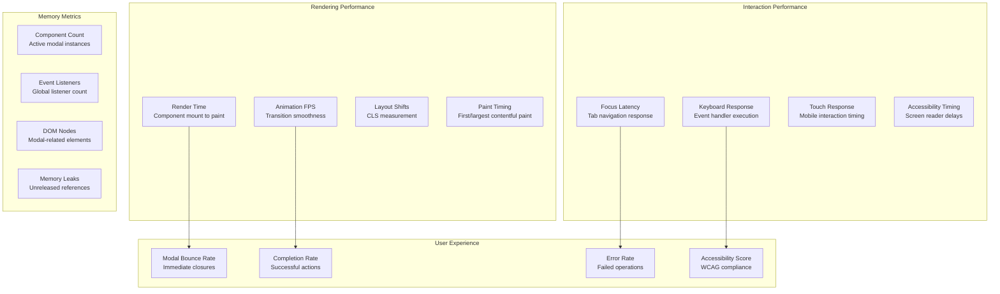

---

## Security and Privacy

[⬆️ Back to Top](#--table-of-contents)

---


### Security Considerations

[⬆️ Back to Top](#--table-of-contents)

---


#### Content Security and XSS Prevention

[⬆️ Back to Top](#--table-of-contents)

---


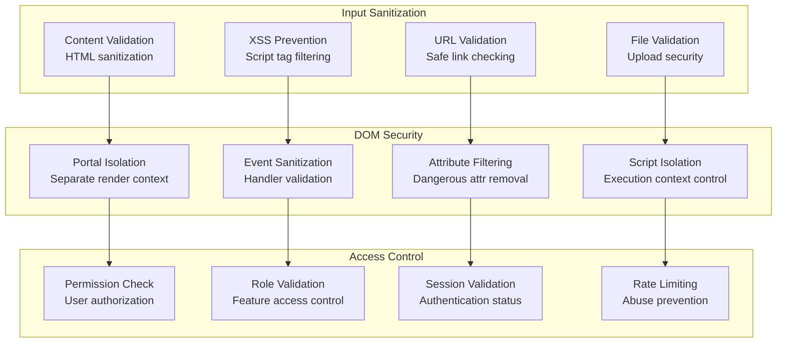

---

## Testing, Monitoring, and Maintainability

[⬆️ Back to Top](#--table-of-contents)

---


### Comprehensive Testing Strategy

[⬆️ Back to Top](#--table-of-contents)

---


#### Multi-Layer Testing Approach

[⬆️ Back to Top](#--table-of-contents)

---


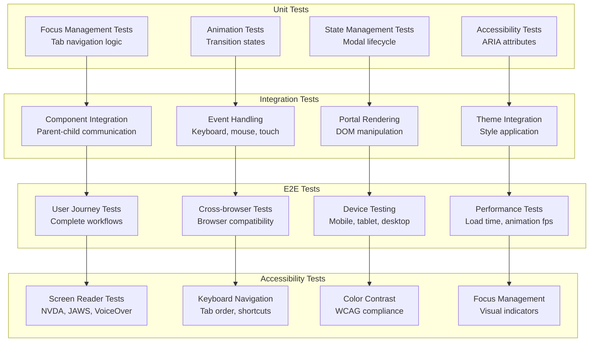

---

## Trade-offs, Deep Dives, and Extensions

[⬆️ Back to Top](#--table-of-contents)

---


### Modal vs Alternative Patterns

[⬆️ Back to Top](#--table-of-contents)

---


| Pattern | Modal Dialog | Slide Panel | Inline Expansion | New Page |
|---------|-------------|-------------|------------------|----------|
| **Context Preservation** | Excellent | Good | Excellent | Poor |
| **Mobile Experience** | Good | Excellent | Good | Excellent |
| **Accessibility** | Complex | Moderate | Simple | Simple |
| **Performance** | Good | Good | Excellent | Variable |
| **SEO Impact** | None | None | None | Positive |
| **Deep Linking** | Difficult | Difficult | Possible | Natural |

### Advanced Features

[⬆️ Back to Top](#--table-of-contents)

---


#### Intelligent Modal Behavior

[⬆️ Back to Top](#--table-of-contents)

---


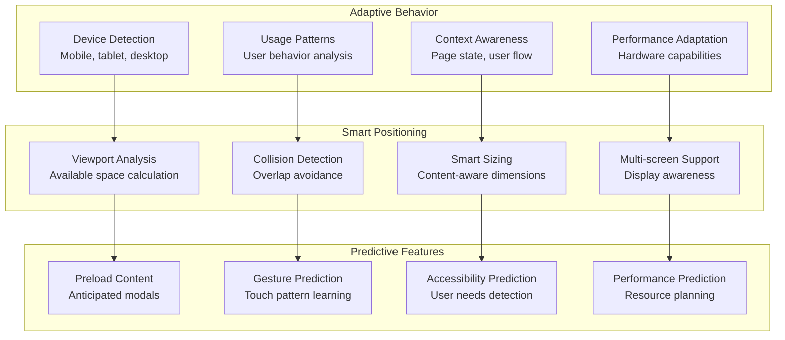

### Future Extensions

[⬆️ Back to Top](#--table-of-contents)

---


#### Next-Generation Modal Features

[⬆️ Back to Top](#--table-of-contents)

---


1. **Voice Integration**:
   - Voice-controlled modal navigation
   - Speech-to-text for form inputs
   - Audio feedback for actions
   - Voice accessibility features

2. **Gesture Recognition**:
   - Touch gesture controls
   - Eye tracking navigation
   - Hand gesture detection
   - Spatial interaction support

3. **AI-Powered UX**:
   - Intent prediction for modal content
   - Adaptive layouts based on usage
   - Personalized interaction patterns
   - Intelligent focus management

4. **Immersive Technologies**:
   - AR/VR modal overlays
   - 3D spatial positioning
   - Haptic feedback integration
   - Immersive interaction paradigms

This comprehensive design provides a robust foundation for building an accessible, performant, and flexible modal dialog system that handles complex focus management, provides excellent user experience across all devices, and maintains high accessibility standards while being extensible for future enhancements. 

### TypeScript Interfaces & Component Props

[⬆️ Back to Top](#--table-of-contents)

---

#### Core Data Interfaces

```typescript
interface ModalConfig {
  id: string;
  type: 'alert' | 'confirm' | 'prompt' | 'custom';
  title?: string;
  content: React.ReactNode | string;
  size: 'sm' | 'md' | 'lg' | 'xl' | 'fullscreen';
  position: 'center' | 'top' | 'bottom' | 'custom';
  backdrop: boolean | 'static';
  keyboard: boolean;
  animation: 'fade' | 'slide' | 'zoom' | 'none';
  zIndex?: number;
}

interface ModalAction {
  id: string;
  label: string;
  variant: 'primary' | 'secondary' | 'danger' | 'success';
  onClick: (modal: ModalInstance) => void | Promise<void>;
  disabled?: boolean;
  loading?: boolean;
  autoClose?: boolean;
}

interface ModalInstance {
  id: string;
  config: ModalConfig;
  isOpen: boolean;
  isAnimating: boolean;
  openedAt: Date;
  data?: any;
  resolve?: (value: any) => void;
  reject?: (reason: any) => void;
}

interface ModalState {
  instances: ModalInstance[];
  activeModalId?: string;
  maxZIndex: number;
  focusHistory: HTMLElement[];
  bodyScrollY: number;
  isBodyScrollLocked: boolean;
}

interface DialogResult<T = any> {
  confirmed: boolean;
  data?: T;
  action?: string;
}
```

#### Component Props Interfaces

```typescript
interface ModalProps {
  isOpen: boolean;
  onClose: () => void;
  title?: string;
  size?: ModalSize;
  backdrop?: boolean | 'static';
  keyboard?: boolean;
  animation?: AnimationType;
  className?: string;
  style?: React.CSSProperties;
  children: React.ReactNode;
  zIndex?: number;
}

interface ModalHeaderProps {
  title?: string;
  showCloseButton?: boolean;
  onClose?: () => void;
  className?: string;
  children?: React.ReactNode;
}

interface ModalBodyProps {
  className?: string;
  scrollable?: boolean;
  maxHeight?: string;
  children: React.ReactNode;
}

interface ModalFooterProps {
  actions?: ModalAction[];
  align?: 'left' | 'center' | 'right' | 'space-between';
  className?: string;
  children?: React.ReactNode;
}

interface ConfirmDialogProps {
  title?: string;
  message: string;
  confirmText?: string;
  cancelText?: string;
  variant?: 'default' | 'danger';
  onConfirm?: () => void | Promise<void>;
  onCancel?: () => void;
}

interface PromptDialogProps {
  title?: string;
  message: string;
  placeholder?: string;
  defaultValue?: string;
  validator?: (value: string) => string | null;
  onSubmit?: (value: string) => void | Promise<void>;
  onCancel?: () => void;
}
```

### API Reference

[⬆️ Back to Top](#--table-of-contents)

---

#### Modal Management
- `ModalService.open(config)` - Open new modal with configuration options
- `ModalService.close(modalId?)` - Close specific modal or topmost modal
- `ModalService.closeAll()` - Close all open modals in stack
- `ModalService.update(modalId, config)` - Update modal configuration dynamically
- `ModalService.isOpen(modalId?)` - Check if modal is open by ID or any modal

#### Dialog Utilities
- `ModalService.alert(message, options?)` - Show alert dialog with OK button
- `ModalService.confirm(message, options?)` - Show confirmation dialog with Yes/No
- `ModalService.prompt(message, options?)` - Show input prompt dialog
- `ModalService.custom(component, props?)` - Open custom modal component
- `ModalService.loading(message?, options?)` - Show loading modal with spinner

#### Stack Management
- `ModalService.getStack()` - Get current modal stack information
- `ModalService.setMaxModals(limit)` - Set maximum concurrent modals allowed
- `ModalService.bringToFront(modalId)` - Bring specific modal to front of stack
- `ModalService.sendToBack(modalId)` - Send modal to back of stack
- `ModalService.getActiveModal()` - Get currently active (topmost) modal

#### Event Management
- `ModalService.on(event, callback)` - Subscribe to modal events
- `ModalService.off(event, callback)` - Unsubscribe from modal events
- `ModalService.emit(event, data)` - Emit custom modal event
- Events: `'open' | 'close' | 'beforeClose' | 'afterOpen' | 'stackChange'`

#### Configuration
- `ModalService.setDefaults(config)` - Set default modal configuration
- `ModalService.getDefaults()` - Get current default configuration
- `ModalService.registerAnimation(name, config)` - Register custom animation
- `ModalService.setTheme(theme)` - Apply theme to all modals
- `ModalService.resetConfig()` - Reset to factory default configuration

#### Accessibility
- `ModalService.setA11yConfig(config)` - Configure accessibility options
- `ModalService.enableFocusTrap(modalId)` - Enable focus trapping for modal
- `ModalService.disableFocusTrap(modalId)` - Disable focus trapping
- `ModalService.announceToScreenReader(message)` - Announce message to screen readers
- `ModalService.setAriaLabels(labels)` - Configure ARIA labels for components

#### Performance
- `ModalService.preload(components)` - Preload modal components for faster opening
- `ModalService.enableVirtualization()` - Enable virtualization for large modal stacks
- `ModalService.setAnimationConfig(config)` - Configure animation performance settings
- `ModalService.measurePerformance()` - Get performance metrics for modal operations
- `ModalService.optimize()` - Apply automatic performance optimizations

---

## Performance and Scalability

[⬆️ Back to Top](#--table-of-contents)

---


### Memory Management

[⬆️ Back to Top](#--table-of-contents)

---


#### Component Lifecycle Optimization

[⬆️ Back to Top](#--table-of-contents)

---


### Performance Monitoring

[⬆️ Back to Top](#--table-of-contents)

---


#### Real-time Performance Metrics

[⬆️ Back to Top](#--table-of-contents)

---


---

## Security and Privacy

[⬆️ Back to Top](#--table-of-contents)

---


### Security Considerations

[⬆️ Back to Top](#--table-of-contents)

---


#### Content Security and XSS Prevention

[⬆️ Back to Top](#--table-of-contents)

---


---

## Testing, Monitoring, and Maintainability

[⬆️ Back to Top](#--table-of-contents)

---


### Comprehensive Testing Strategy

[⬆️ Back to Top](#--table-of-contents)

---


#### Multi-Layer Testing Approach

[⬆️ Back to Top](#--table-of-contents)

---


---

## Trade-offs, Deep Dives, and Extensions

[⬆️ Back to Top](#--table-of-contents)

---


### Modal vs Alternative Patterns

[⬆️ Back to Top](#--table-of-contents)

---


| Pattern | Modal Dialog | Slide Panel | Inline Expansion | New Page |
|---------|-------------|-------------|------------------|----------|
| **Context Preservation** | Excellent | Good | Excellent | Poor |
| **Mobile Experience** | Good | Excellent | Good | Excellent |
| **Accessibility** | Complex | Moderate | Simple | Simple |
| **Performance** | Good | Good | Excellent | Variable |
| **SEO Impact** | None | None | None | Positive |
| **Deep Linking** | Difficult | Difficult | Possible | Natural |

### Advanced Features

[⬆️ Back to Top](#--table-of-contents)

---


#### Intelligent Modal Behavior

[⬆️ Back to Top](#--table-of-contents)

---


### Future Extensions

[⬆️ Back to Top](#--table-of-contents)

---


#### Next-Generation Modal Features

[⬆️ Back to Top](#--table-of-contents)

---


1. **Voice Integration**:
   - Voice-controlled modal navigation
   - Speech-to-text for form inputs
   - Audio feedback for actions
   - Voice accessibility features

2. **Gesture Recognition**:
   - Touch gesture controls
   - Eye tracking navigation
   - Hand gesture detection
   - Spatial interaction support

3. **AI-Powered UX**:
   - Intent prediction for modal content
   - Adaptive layouts based on usage
   - Personalized interaction patterns
   - Intelligent focus management

4. **Immersive Technologies**:
   - AR/VR modal overlays
   - 3D spatial positioning
   - Haptic feedback integration
   - Immersive interaction paradigms

This comprehensive design provides a robust foundation for building an accessible, performant, and flexible modal dialog system that handles complex focus management, provides excellent user experience across all devices, and maintains high accessibility standards while being extensible for future enhancements. 

### TypeScript Interfaces & Component Props

[⬆️ Back to Top](#--table-of-contents)

---

#### Core Data Interfaces

```typescript
interface ModalConfig {
  id: string;
  type: 'alert' | 'confirm' | 'prompt' | 'custom';
  title?: string;
  content: React.ReactNode | string;
  size: 'sm' | 'md' | 'lg' | 'xl' | 'fullscreen';
  position: 'center' | 'top' | 'bottom' | 'custom';
  backdrop: boolean | 'static';
  keyboard: boolean;
  animation: 'fade' | 'slide' | 'zoom' | 'none';
  zIndex?: number;
}

interface ModalAction {
  id: string;
  label: string;
  variant: 'primary' | 'secondary' | 'danger' | 'success';
  onClick: (modal: ModalInstance) => void | Promise<void>;
  disabled?: boolean;
  loading?: boolean;
  autoClose?: boolean;
}

interface ModalInstance {
  id: string;
  config: ModalConfig;
  isOpen: boolean;
  isAnimating: boolean;
  openedAt: Date;
  data?: any;
  resolve?: (value: any) => void;
  reject?: (reason: any) => void;
}

interface ModalState {
  instances: ModalInstance[];
  activeModalId?: string;
  maxZIndex: number;
  focusHistory: HTMLElement[];
  bodyScrollY: number;
  isBodyScrollLocked: boolean;
}

interface DialogResult<T = any> {
  confirmed: boolean;
  data?: T;
  action?: string;
}
```

#### Component Props Interfaces

```typescript
interface ModalProps {
  isOpen: boolean;
  onClose: () => void;
  title?: string;
  size?: ModalSize;
  backdrop?: boolean | 'static';
  keyboard?: boolean;
  animation?: AnimationType;
  className?: string;
  style?: React.CSSProperties;
  children: React.ReactNode;
  zIndex?: number;
}

interface ModalHeaderProps {
  title?: string;
  showCloseButton?: boolean;
  onClose?: () => void;
  className?: string;
  children?: React.ReactNode;
}

interface ModalBodyProps {
  className?: string;
  scrollable?: boolean;
  maxHeight?: string;
  children: React.ReactNode;
}

interface ModalFooterProps {
  actions?: ModalAction[];
  align?: 'left' | 'center' | 'right' | 'space-between';
  className?: string;
  children?: React.ReactNode;
}

interface ConfirmDialogProps {
  title?: string;
  message: string;
  confirmText?: string;
  cancelText?: string;
  variant?: 'default' | 'danger';
  onConfirm?: () => void | Promise<void>;
  onCancel?: () => void;
}

interface PromptDialogProps {
  title?: string;
  message: string;
  placeholder?: string;
  defaultValue?: string;
  validator?: (value: string) => string | null;
  onSubmit?: (value: string) => void | Promise<void>;
  onCancel?: () => void;
}
```

### API Reference

[⬆️ Back to Top](#--table-of-contents)

---

#### Modal Management
- `ModalService.open(config)` - Open new modal with configuration options
- `ModalService.close(modalId?)` - Close specific modal or topmost modal
- `ModalService.closeAll()` - Close all open modals in stack
- `ModalService.update(modalId, config)` - Update modal configuration dynamically
- `ModalService.isOpen(modalId?)` - Check if modal is open by ID or any modal

#### Dialog Utilities
- `ModalService.alert(message, options?)` - Show alert dialog with OK button
- `ModalService.confirm(message, options?)` - Show confirmation dialog with Yes/No
- `ModalService.prompt(message, options?)` - Show input prompt dialog
- `ModalService.custom(component, props?)` - Open custom modal component
- `ModalService.loading(message?, options?)` - Show loading modal with spinner

#### Stack Management
- `ModalService.getStack()` - Get current modal stack information
- `ModalService.setMaxModals(limit)` - Set maximum concurrent modals allowed
- `ModalService.bringToFront(modalId)` - Bring specific modal to front of stack
- `ModalService.sendToBack(modalId)` - Send modal to back of stack
- `ModalService.getActiveModal()` - Get currently active (topmost) modal

#### Event Management
- `ModalService.on(event, callback)` - Subscribe to modal events
- `ModalService.off(event, callback)` - Unsubscribe from modal events
- `ModalService.emit(event, data)` - Emit custom modal event
- Events: `'open' | 'close' | 'beforeClose' | 'afterOpen' | 'stackChange'`

#### Configuration
- `ModalService.setDefaults(config)` - Set default modal configuration
- `ModalService.getDefaults()` - Get current default configuration
- `ModalService.registerAnimation(name, config)` - Register custom animation
- `ModalService.setTheme(theme)` - Apply theme to all modals
- `ModalService.resetConfig()` - Reset to factory default configuration

#### Accessibility
- `ModalService.setA11yConfig(config)` - Configure accessibility options
- `ModalService.enableFocusTrap(modalId)` - Enable focus trapping for modal
- `ModalService.disableFocusTrap(modalId)` - Disable focus trapping
- `ModalService.announceToScreenReader(message)` - Announce message to screen readers
- `ModalService.setAriaLabels(labels)` - Configure ARIA labels for components

#### Performance
- `ModalService.preload(components)` - Preload modal components for faster opening
- `ModalService.enableVirtualization()` - Enable virtualization for large modal stacks
- `ModalService.setAnimationConfig(config)` - Configure animation performance settings
- `ModalService.measurePerformance()` - Get performance metrics for modal operations
- `ModalService.optimize()` - Apply automatic performance optimizations

---

## Performance and Scalability

[⬆️ Back to Top](#--table-of-contents)

---


### Memory Management

[⬆️ Back to Top](#--table-of-contents)

---


#### Component Lifecycle Optimization

[⬆️ Back to Top](#--table-of-contents)

---


### Performance Monitoring

[⬆️ Back to Top](#--table-of-contents)

---


#### Real-time Performance Metrics

[⬆️ Back to Top](#--table-of-contents)

---


---

## Security and Privacy

[⬆️ Back to Top](#--table-of-contents)

---


### Security Considerations

[⬆️ Back to Top](#--table-of-contents)

---


#### Content Security and XSS Prevention

[⬆️ Back to Top](#--table-of-contents)

---


---

## Testing, Monitoring, and Maintainability

[⬆️ Back to Top](#--table-of-contents)

---


### Comprehensive Testing Strategy

[⬆️ Back to Top](#--table-of-contents)

---


#### Multi-Layer Testing Approach

[⬆️ Back to Top](#--table-of-contents)

---


```mermaid
graph TD
    subgraph "Unit Tests"
        UT1[Focus Management Tests<br/>Tab navigation logic]
        UT2[Animation Tests<br/>Transition states]
        UT3[State Management Tests<br/>Modal lifecycle]
        UT4[Accessibility Tests<br/>ARIA attributes]
    end
    
    subgraph "Integration Tests"
        IT1[Component Integration<br/>Parent-child communication]
        IT2[Event Handling<br/>Keyboard, mouse, touch]
        IT3[Portal Rendering<br/>DOM manipulation]
        IT4[Theme Integration<br/>Style application]
    end
    
    subgraph "E2E Tests"
        E2E1[User Journey Tests<br/>Complete workflows]
        E2E2[Cross-browser Tests<br/>Browser compatibility]
        E2E3[Device Testing<br/>Mobile, tablet, desktop]
        E2E4[Performance Tests<br/>Load time, animation fps]
    end
    
    subgraph "Accessibility Tests"
        AT1[Screen Reader Tests<br/>NVDA, JAWS, VoiceOver]
        AT2[Keyboard Navigation<br/>Tab order, shortcuts]
        AT3[Color Contrast<br/>WCAG compliance]
        AT4[Focus Management<br/>Visual indicators]
    end
    
    UT1 --> IT1
    UT2 --> IT2
    UT3 --> IT3
    UT4 --> IT4
    
    IT1 --> E2E1
    IT2 --> E2E2
    IT3 --> E2E3
    IT4 --> E2E4
    
    E2E1 --> AT1
    E2E2 --> AT2
    E2E3 --> AT3
    E2E4 --> AT4
```

---

## Trade-offs, Deep Dives, and Extensions

[⬆️ Back to Top](#--table-of-contents)

---


### Modal vs Alternative Patterns

[⬆️ Back to Top](#--table-of-contents)

---


| Pattern | Modal Dialog | Slide Panel | Inline Expansion | New Page |
|---------|-------------|-------------|------------------|----------|
| **Context Preservation** | Excellent | Good | Excellent | Poor |
| **Mobile Experience** | Good | Excellent | Good | Excellent |
| **Accessibility** | Complex | Moderate | Simple | Simple |
| **Performance** | Good | Good | Excellent | Variable |
| **SEO Impact** | None | None | None | Positive |
| **Deep Linking** | Difficult | Difficult | Possible | Natural |

### Advanced Features

[⬆️ Back to Top](#--table-of-contents)

---


#### Intelligent Modal Behavior

[⬆️ Back to Top](#--table-of-contents)

---


```mermaid
graph TD
    subgraph "Adaptive Behavior"
        DEVICE_DETECTION[Device Detection<br/>Mobile, tablet, desktop]
        USAGE_PATTERNS[Usage Patterns<br/>User behavior analysis]
        CONTEXT_AWARENESS[Context Awareness<br/>Page state, user flow]
        PERFORMANCE_ADAPTATION[Performance Adaptation<br/>Hardware capabilities]
    end
    
    subgraph "Smart Positioning"
        VIEWPORT_ANALYSIS[Viewport Analysis<br/>Available space calculation]
        COLLISION_DETECTION[Collision Detection<br/>Overlap avoidance]
        SMART_SIZING[Smart Sizing<br/>Content-aware dimensions]
        MULTI_SCREEN[Multi-screen Support<br/>Display awareness]
    end
    
    subgraph "Predictive Features"
        PRELOAD_CONTENT[Preload Content<br/>Anticipated modals]
        GESTURE_PREDICTION[Gesture Prediction<br/>Touch pattern learning]
        ACCESSIBILITY_PREDICTION[Accessibility Prediction<br/>User needs detection]
        PERFORMANCE_PREDICTION[Performance Prediction<br/>Resource planning]
    end
    
    DEVICE_DETECTION --> VIEWPORT_ANALYSIS
    USAGE_PATTERNS --> COLLISION_DETECTION
    CONTEXT_AWARENESS --> SMART_SIZING
    PERFORMANCE_ADAPTATION --> MULTI_SCREEN
    
    VIEWPORT_ANALYSIS --> PRELOAD_CONTENT
    COLLISION_DETECTION --> GESTURE_PREDICTION
    SMART_SIZING --> ACCESSIBILITY_PREDICTION
    MULTI_SCREEN --> PERFORMANCE_PREDICTION
```

### Future Extensions

[⬆️ Back to Top](#--table-of-contents)

---


#### Next-Generation Modal Features

[⬆️ Back to Top](#--table-of-contents)

---


1. **Voice Integration**:
   - Voice-controlled modal navigation
   - Speech-to-text for form inputs
   - Audio feedback for actions
   - Voice accessibility features

2. **Gesture Recognition**:
   - Touch gesture controls
   - Eye tracking navigation
   - Hand gesture detection
   - Spatial interaction support

3. **AI-Powered UX**:
   - Intent prediction for modal content
   - Adaptive layouts based on usage
   - Personalized interaction patterns
   - Intelligent focus management

4. **Immersive Technologies**:
   - AR/VR modal overlays
   - 3D spatial positioning
   - Haptic feedback integration
   - Immersive interaction paradigms

This comprehensive design provides a robust foundation for building an accessible, performant, and flexible modal dialog system that handles complex focus management, provides excellent user experience across all devices, and maintains high accessibility standards while being extensible for future enhancements. 