# Image Carousel Component with Animations and Touch Support


## 📋 Table of Contents

- [Image Carousel Component with Animations and Touch Support](#image-carousel-component-with-animations-and-touch-support)
  - [Table of Contents](#table-of-contents)
  - [Clarify the Problem and Requirements](#clarify-the-problem-and-requirements)
    - [Problem Understanding](#problem-understanding)
    - [Functional Requirements](#functional-requirements)
    - [Non-Functional Requirements](#non-functional-requirements)
    - [Key Assumptions](#key-assumptions)
  - [High-Level Design (HLD)](#high-level-design-hld)
    - [System Architecture Overview](#system-architecture-overview)
    - [Carousel Data Model](#carousel-data-model)
  - [Low-Level Design (LLD)](#low-level-design-lld)
    - [Touch Gesture Recognition](#touch-gesture-recognition)
    - [Animation State Machine](#animation-state-machine)
    - [Image Loading Pipeline](#image-loading-pipeline)
  - [Core Algorithms](#core-algorithms)
    - [1. Touch Gesture Recognition Algorithm](#1-touch-gesture-recognition-algorithm)
    - [2. Smooth Animation Algorithm](#2-smooth-animation-algorithm)
    - [3. Image Preloading Strategy](#3-image-preloading-strategy)
    - [4. Responsive Layout Algorithm](#4-responsive-layout-algorithm)
    - [5. Accessibility Navigation Algorithm](#5-accessibility-navigation-algorithm)
  - [Component Architecture](#component-architecture)
    - [Carousel Component Hierarchy](#carousel-component-hierarchy)
    - [State Management Architecture](#state-management-architecture)
  - [Advanced Features](#advanced-features)
    - [Autoplay with Smart Pausing](#autoplay-with-smart-pausing)
    - [Gesture Customization](#gesture-customization)
  - [Performance Optimizations](#performance-optimizations)
    - [Memory Management](#memory-management)
    - [Animation Performance](#animation-performance)
    - [Network Optimization](#network-optimization)
  - [Security Considerations](#security-considerations)
    - [Content Security](#content-security)
    - [Data Protection](#data-protection)
  - [Accessibility Implementation](#accessibility-implementation)
    - [Screen Reader Support](#screen-reader-support)
    - [Keyboard Navigation](#keyboard-navigation)
  - [Testing Strategy](#testing-strategy)
    - [Unit Testing Focus Areas](#unit-testing-focus-areas)
    - [Integration Testing](#integration-testing)
    - [End-to-End Testing](#end-to-end-testing)
  - [Trade-offs and Considerations](#trade-offs-and-considerations)
    - [Performance vs Features](#performance-vs-features)
    - [Accessibility vs UX](#accessibility-vs-ux)
    - [Scalability Considerations](#scalability-considerations)

---

## Table of Contents
1. [Clarify the Problem and Requirements](#clarify-the-problem-and-requirements)
2. [High-Level Design (HLD)](#high-level-design-hld)
3. [Low-Level Design (LLD)](#low-level-design-lld)
4. [Core Algorithms](#core-algorithms)
5. [Component Architecture](#component-architecture)
6. [Advanced Features](#advanced-features)
7. [Performance Optimizations](#performance-optimizations)
8. [Security Considerations](#security-considerations)
9. [Accessibility Implementation](#accessibility-implementation)
10. [Testing Strategy](#testing-strategy)
11. [Trade-offs and Considerations](#trade-offs-and-considerations)

---

## Clarify the Problem and Requirements

[⬆️ Back to Top](#--table-of-contents)

---

### Problem Understanding

[⬆️ Back to Top](#--table-of-contents)

---

Design a flexible and performant image carousel component that provides smooth animations, touch/swipe support, and excellent user experience across all devices and input methods. The component should be reusable, accessible, and capable of handling various content types while maintaining consistent performance with large image sets.

### Functional Requirements

[⬆️ Back to Top](#--table-of-contents)

---

- **Navigation Controls**: Previous/next buttons, dot indicators, thumbnail navigation
- **Touch Gestures**: Swipe navigation, pinch-to-zoom, long press interactions
- **Keyboard Support**: Arrow keys, Enter/Space, Tab navigation, focus management
- **Autoplay Features**: Auto-advance with pause on hover/focus, configurable timing
- **Image Support**: Multiple formats (JPEG, PNG, WebP, GIF), lazy loading, responsive images
- **Customization**: Transition effects, animation timing, layout options, theming
- **Content Flexibility**: Images, videos, mixed content, custom slide components
- **Responsive Design**: Adaptive layout for different screen sizes and orientations

### Non-Functional Requirements

[⬆️ Back to Top](#--table-of-contents)

---

- **Performance**: <16ms frame time, 60fps animations, <200ms image load time
- **Accessibility**: WCAG 2.1 AA compliance, screen reader support, keyboard navigation
- **Cross-platform**: Consistent experience across desktop, tablet, mobile devices
- **Browser Support**: Modern browsers with graceful degradation for older versions
- **Memory Efficiency**: Optimal memory usage for large image sets, proper cleanup
- **Bundle Size**: Lightweight component, tree-shakeable, minimal dependencies
- **Touch Responsiveness**: <100ms touch response time, smooth gesture tracking

### Key Assumptions

[⬆️ Back to Top](#--table-of-contents)

---

- Typical carousel size: 5-50 images, maximum 200 images
- Image sizes: 100KB-2MB per image, various aspect ratios
- Usage patterns: Browse-focused with occasional deep exploration
- Device capabilities: Modern smartphones to high-end desktops
- Network conditions: 3G to high-speed connections
- User interactions: Mix of touch, mouse, and keyboard navigation
- Content types: Primarily images with occasional video or rich media

---

## High-Level Design (HLD)

[⬆️ Back to Top](#--table-of-contents)

---


### System Architecture Overview

[⬆️ Back to Top](#--table-of-contents)

---


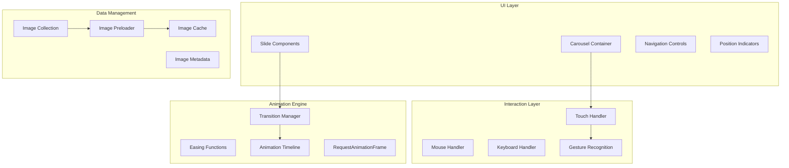

### Carousel Data Model

[⬆️ Back to Top](#--table-of-contents)

---


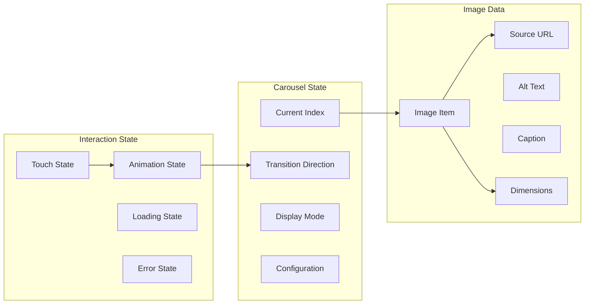

## Low-Level Design (LLD)

[⬆️ Back to Top](#--table-of-contents)

---


### Touch Gesture Recognition

[⬆️ Back to Top](#--table-of-contents)

---


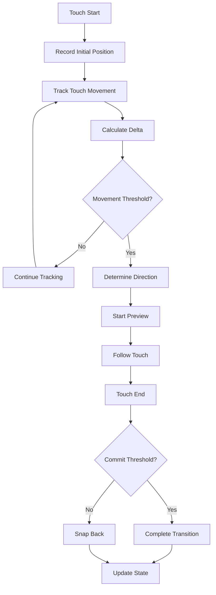

### Animation State Machine

[⬆️ Back to Top](#--table-of-contents)

---


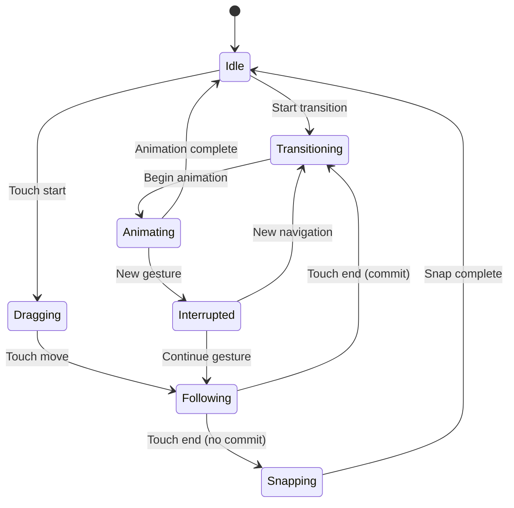

### Image Loading Pipeline

[⬆️ Back to Top](#--table-of-contents)

---


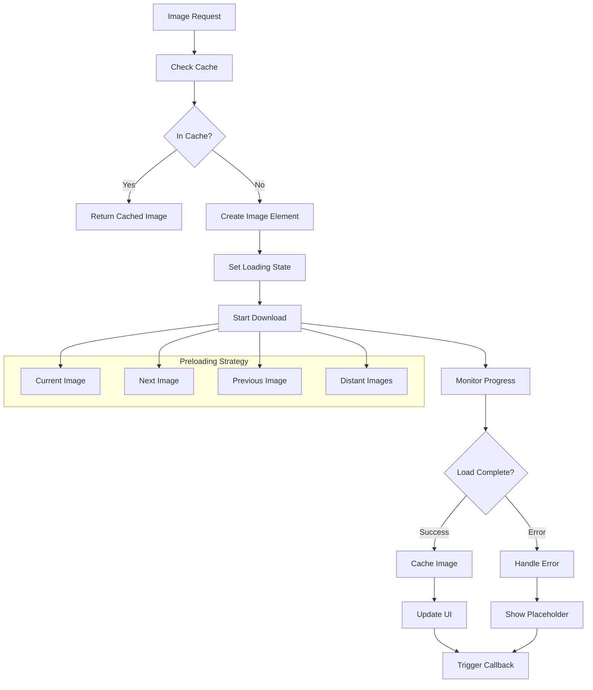

## Core Algorithms

[⬆️ Back to Top](#--table-of-contents)

---


### 1. Touch Gesture Recognition Algorithm

[⬆️ Back to Top](#--table-of-contents)

---


**Purpose**: Accurately detect and respond to touch gestures for carousel navigation.

**Touch State Structure**:
```
TouchState = {
  startX: number,
  startY: number,
  currentX: number,
  currentY: number,
  deltaX: number,
  deltaY: number,
  velocity: number,
  timestamp: number,
  isTracking: boolean
}
```

**Gesture Detection Algorithm**:
```
function processTouchMove(touch):
  currentTime = Date.now()
  deltaTime = currentTime - touch.timestamp
  
  touch.deltaX = touch.currentX - touch.startX
  touch.deltaY = touch.currentY - touch.startY
  
  // Calculate velocity
  if deltaTime > 0:
    touch.velocity = touch.deltaX / deltaTime
  
  // Determine if horizontal swipe
  isHorizontalSwipe = Math.abs(touch.deltaX) > Math.abs(touch.deltaY)
  
  // Check movement threshold
  hasMinMovement = Math.abs(touch.deltaX) > SWIPE_THRESHOLD
  
  if isHorizontalSwipe and hasMinMovement:
    startTransition(touch.deltaX > 0 ? 'prev' : 'next', touch.deltaX)
```

**Velocity-based Momentum**:
- Calculate touch velocity for momentum scrolling
- Apply easing based on velocity magnitude
- Implement inertial scrolling for natural feel
- Consider device capabilities for performance optimization

### 2. Smooth Animation Algorithm

[⬆️ Back to Top](#--table-of-contents)

---


**Easing Functions**:
```
EasingType = 'linear' | 'ease-in' | 'ease-out' | 'ease-in-out' | 'cubic-bezier'

function calculateEasing(progress, type):
  switch type:
    case 'ease-out':
      return 1 - Math.pow(1 - progress, 3)
    case 'ease-in':
      return Math.pow(progress, 3)
    case 'ease-in-out':
      return progress < 0.5 
        ? 4 * Math.pow(progress, 3)
        : 1 - Math.pow(-2 * progress + 2, 3) / 2
```

**Animation Timeline Management**:
```
function animateTransition(fromIndex, toIndex, duration):
  startTime = performance.now()
  startPosition = getCurrentPosition()
  endPosition = calculateTargetPosition(toIndex)
  distance = endPosition - startPosition
  
  function animate(currentTime):
    elapsed = currentTime - startTime
    progress = Math.min(elapsed / duration, 1)
    
    easedProgress = calculateEasing(progress, 'ease-out')
    currentPosition = startPosition + (distance * easedProgress)
    
    updateCarouselPosition(currentPosition)
    
    if progress < 1:
      requestAnimationFrame(animate)
    else:
      onAnimationComplete()
  
  requestAnimationFrame(animate)
```

**Frame Rate Optimization**:
- Use RequestAnimationFrame for smooth 60fps animations
- Implement frame skipping for performance on slower devices
- Batch DOM updates to minimize reflow/repaint
- Use CSS transforms for hardware acceleration

### 3. Image Preloading Strategy

[⬆️ Back to Top](#--table-of-contents)

---


**Intelligent Preloading Algorithm**:
```
function preloadImages(currentIndex, images):
  priorities = [
    { index: currentIndex, priority: 1 },
    { index: currentIndex + 1, priority: 2 },
    { index: currentIndex - 1, priority: 2 },
    { index: currentIndex + 2, priority: 3 },
    { index: currentIndex - 2, priority: 3 }
  ]
  
  for priority in priorities:
    if isValidIndex(priority.index):
      scheduleImageLoad(images[priority.index], priority.priority)
```

**Adaptive Loading Strategy**:
```
function adaptiveImageLoading(image, viewport):
  // Calculate optimal image size based on viewport
  optimalWidth = viewport.width * devicePixelRatio
  optimalHeight = viewport.height * devicePixelRatio
  
  // Select appropriate image source
  if image.srcSet:
    selectedSrc = selectFromSrcSet(image.srcSet, optimalWidth)
  else:
    selectedSrc = image.src
  
  // Apply lazy loading based on network conditions
  if isSlowConnection():
    return loadImageProgressive(selectedSrc)
  else:
    return loadImageDirect(selectedSrc)
```

**Memory Management**:
- Implement LRU cache for loaded images
- Unload distant images to conserve memory
- Use WeakMap for automatic garbage collection
- Monitor memory usage and adjust cache size

### 4. Responsive Layout Algorithm

[⬆️ Back to Top](#--table-of-contents)

---


**Viewport Adaptation**:
```
function calculateLayout(containerWidth, images):
  layouts = []
  
  for image in images:
    aspectRatio = image.width / image.height
    
    // Calculate dimensions to fit container
    if aspectRatio > 1:
      // Landscape image
      width = containerWidth
      height = containerWidth / aspectRatio
    else:
      // Portrait image
      height = containerWidth / aspectRatio
      width = containerWidth
    
    layouts.push({
      width: width,
      height: height,
      objectFit: calculateObjectFit(image, { width, height })
    })
  
  return layouts
```

**Breakpoint Management**:
```
Breakpoints = {
  mobile: { max: 768, columns: 1, gap: 10 },
  tablet: { min: 769, max: 1024, columns: 2, gap: 15 },
  desktop: { min: 1025, columns: 3, gap: 20 }
}

function getLayoutConfig(screenWidth):
  for breakpoint in Breakpoints:
    if matchesBreakpoint(screenWidth, breakpoint):
      return breakpoint
  
  return Breakpoints.desktop // default
```

### 5. Accessibility Navigation Algorithm

[⬆️ Back to Top](#--table-of-contents)

---


**Keyboard Navigation**:
```
function handleKeyboardNavigation(event):
  switch event.key:
    case 'ArrowLeft':
      navigateTo(currentIndex - 1)
      announceSlideChange('previous')
    case 'ArrowRight':
      navigateTo(currentIndex + 1)
      announceSlideChange('next')
    case 'Home':
      navigateTo(0)
      announceSlideChange('first')
    case 'End':
      navigateTo(images.length - 1)
      announceSlideChange('last')
    case 'Enter':
    case 'Space':
      triggerSlideAction(currentIndex)
```

**Screen Reader Announcements**:
```
function announceSlideChange(direction):
  message = `Slide ${currentIndex + 1} of ${images.length}`
  
  if images[currentIndex].alt:
    message += `, ${images[currentIndex].alt}`
  
  if images[currentIndex].caption:
    message += `, ${images[currentIndex].caption}`
  
  ariaLiveRegion.textContent = message
```

## Component Architecture

[⬆️ Back to Top](#--table-of-contents)

---


### Carousel Component Hierarchy

[⬆️ Back to Top](#--table-of-contents)

---


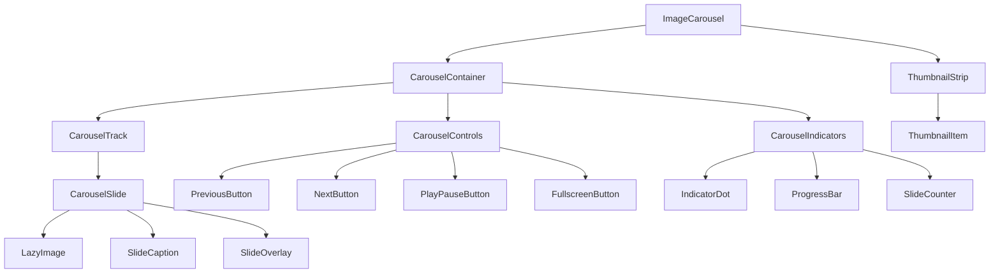

### State Management Architecture

[⬆️ Back to Top](#--table-of-contents)

---


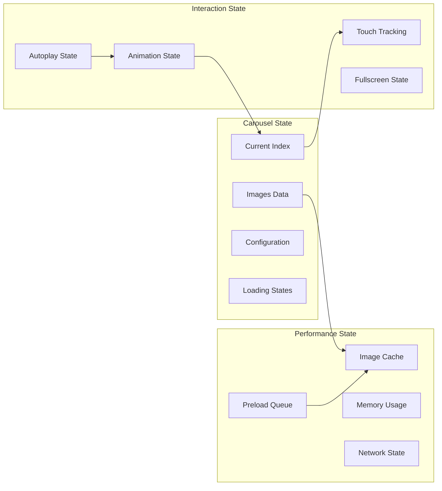

#### React Component Implementation

[⬆️ Back to Top](#--table-of-contents)

---

**ImageCarousel.jsx**

**What this code does:**
• **Main Purpose**: Feature-rich image carousel with autoplay, gestures, and fullscreen support
• **Interactive Controls**: Supports swipe gestures, keyboard navigation, and touch interactions
• **Key Functions**:
  - `useImagePreloader()` - Preloads adjacent images for smooth transitions
  - `useSwipeGestures()` - Handles touch/mouse swipe for navigation
  - `handleAutoplay()` - Manages automatic slideshow progression
  - `toggleFullscreen()` - Enters/exits fullscreen viewing mode
  - `goToSlide()` - Navigates to specific slide with animation
  - Thumbnail navigation and indicator dots

```jsx
import React, { useState, useEffect, useCallback, useRef } from 'react';
import { CarouselProvider } from './CarouselContext';
import CarouselContainer from './CarouselContainer';
import { useImagePreloader } from './hooks/useImagePreloader';
import { useSwipeGestures } from './hooks/useSwipeGestures';

const ImageCarousel = ({ 
  images = [], 
  initialIndex = 0,
  autoplay = false,
  autoplayInterval = 3000,
  showThumbnails = true,
  showIndicators = true,
  showControls = true,
  loop = true,
  swipeEnabled = true,
  lazy = true,
  aspectRatio = '16:9'
}) => {
  const [currentIndex, setCurrentIndex] = useState(initialIndex);
  const [isPlaying, setIsPlaying] = useState(autoplay);
  const [isFullscreen, setIsFullscreen] = useState(false);
  const [direction, setDirection] = useState('next');
  const [isTransitioning, setIsTransitioning] = useState(false);
  const [loadedImages, setLoadedImages] = useState(new Set());
  
  const carouselRef = useRef(null);
  const autoplayTimerRef = useRef(null);
  const touchStartRef = useRef(null);
  
  const { preloadImages } = useImagePreloader();
  const { onTouchStart, onTouchMove, onTouchEnd } = useSwipeGestures({
    onSwipeLeft: () => goToNext(),
    onSwipeRight: () => goToPrevious(),
    enabled: swipeEnabled
  });

  // Preload images
  useEffect(() => {
    if (lazy) {
      preloadImages(images, currentIndex, 2); // Preload 2 images ahead/behind
    } else {
      preloadImages(images);
    }
  }, [images, currentIndex, lazy, preloadImages]);

  // Handle autoplay
  useEffect(() => {
    if (isPlaying && images.length > 1) {
      autoplayTimerRef.current = setInterval(() => {
        goToNext();
      }, autoplayInterval);
    } else {
      clearInterval(autoplayTimerRef.current);
    }

    return () => clearInterval(autoplayTimerRef.current);
  }, [isPlaying, autoplayInterval, images.length]);

  // Pause autoplay on user interaction
  useEffect(() => {
    const handleUserInteraction = () => {
      if (isPlaying) {
        setIsPlaying(false);
        setTimeout(() => setIsPlaying(autoplay), 5000); // Resume after 5s
      }
    };

    const carousel = carouselRef.current;
    if (carousel) {
      carousel.addEventListener('mouseenter', handleUserInteraction);
      carousel.addEventListener('focus', handleUserInteraction);
      
      return () => {
        carousel.removeEventListener('mouseenter', handleUserInteraction);
        carousel.removeEventListener('focus', handleUserInteraction);
      };
    }
  }, [isPlaying, autoplay]);

  const goToSlide = useCallback((index, slideDirection = 'next') => {
    if (isTransitioning) return;
    
    const newIndex = Math.max(0, Math.min(images.length - 1, index));
    
    if (newIndex !== currentIndex) {
      setDirection(slideDirection);
      setIsTransitioning(true);
      setCurrentIndex(newIndex);
      
      setTimeout(() => {
        setIsTransitioning(false);
      }, 300); // Match transition duration
    }
  }, [currentIndex, images.length, isTransitioning]);

  const goToNext = useCallback(() => {
    if (currentIndex < images.length - 1) {
      goToSlide(currentIndex + 1, 'next');
    } else if (loop) {
      goToSlide(0, 'next');
    }
  }, [currentIndex, images.length, loop, goToSlide]);

  const goToPrevious = useCallback(() => {
    if (currentIndex > 0) {
      goToSlide(currentIndex - 1, 'prev');
    } else if (loop) {
      goToSlide(images.length - 1, 'prev');
    }
  }, [currentIndex, images.length, loop, goToSlide]);

  const togglePlay = useCallback(() => {
    setIsPlaying(!isPlaying);
  }, [isPlaying]);

  const toggleFullscreen = useCallback(() => {
    if (!isFullscreen) {
      if (carouselRef.current?.requestFullscreen) {
        carouselRef.current.requestFullscreen();
      }
    } else {
      if (document.exitFullscreen) {
        document.exitFullscreen();
      }
    }
    setIsFullscreen(!isFullscreen);
  }, [isFullscreen]);

  const handleImageLoad = useCallback((index) => {
    setLoadedImages(prev => new Set(prev).add(index));
  }, []);

  const handleKeyDown = useCallback((e) => {
    switch (e.key) {
      case 'ArrowLeft':
        e.preventDefault();
        goToPrevious();
        break;
      case 'ArrowRight':
        e.preventDefault();
        goToNext();
        break;
      case ' ':
        e.preventDefault();
        togglePlay();
        break;
      case 'Escape':
        if (isFullscreen) {
          toggleFullscreen();
        }
        break;
    }
  }, [goToPrevious, goToNext, togglePlay, isFullscreen, toggleFullscreen]);

  useEffect(() => {
    document.addEventListener('keydown', handleKeyDown);
    return () => document.removeEventListener('keydown', handleKeyDown);
  }, [handleKeyDown]);

  const canGoNext = currentIndex < images.length - 1 || loop;
  const canGoPrevious = currentIndex > 0 || loop;

  const value = {
    images,
    currentIndex,
    direction,
    isPlaying,
    isFullscreen,
    isTransitioning,
    loadedImages,
    canGoNext,
    canGoPrevious,
    showThumbnails,
    showIndicators,
    showControls,
    aspectRatio,
    goToSlide,
    goToNext,
    goToPrevious,
    togglePlay,
    toggleFullscreen,
    onImageLoad: handleImageLoad
  };

  return (
    <CarouselProvider value={value}>
      <div
        ref={carouselRef}
        className={`image-carousel ${isFullscreen ? 'fullscreen' : ''}`}
        onTouchStart={onTouchStart}
        onTouchMove={onTouchMove}
        onTouchEnd={onTouchEnd}
        tabIndex={0}
      >
        <CarouselContainer />
      </div>
    </CarouselProvider>
  );
};

export default ImageCarousel;
```

**CarouselContainer.jsx**
```jsx
import React, { useContext } from 'react';
import { CarouselContext } from './CarouselContext';
import CarouselTrack from './CarouselTrack';
import CarouselControls from './CarouselControls';
import CarouselIndicators from './CarouselIndicators';
import ThumbnailStrip from './ThumbnailStrip';

const CarouselContainer = () => {
  const { 
    showControls, 
    showIndicators, 
    showThumbnails, 
    aspectRatio 
  } = useContext(CarouselContext);

  const aspectRatioStyle = {
    aspectRatio: aspectRatio.replace(':', '/')
  };

  return (
    <div className="carousel-container">
      <div className="carousel-main" style={aspectRatioStyle}>
        <CarouselTrack />
        {showControls && <CarouselControls />}
        {showIndicators && <CarouselIndicators />}
      </div>
      
      {showThumbnails && <ThumbnailStrip />}
    </div>
  );
};

export default CarouselContainer;
```

**CarouselTrack.jsx**
```jsx
import React, { useContext, useRef, useEffect } from 'react';
import { CarouselContext } from './CarouselContext';
import CarouselSlide from './CarouselSlide';

const CarouselTrack = () => {
  const { 
    images, 
    currentIndex, 
    direction, 
    isTransitioning 
  } = useContext(CarouselContext);
  
  const trackRef = useRef(null);

  useEffect(() => {
    if (trackRef.current) {
      const translateX = -currentIndex * 100;
      trackRef.current.style.transform = `translateX(${translateX}%)`;
    }
  }, [currentIndex]);

  return (
    <div className="carousel-track-container">
      <div 
        ref={trackRef}
        className={`carousel-track ${isTransitioning ? 'transitioning' : ''} ${direction}`}
      >
        {images.map((image, index) => (
          <CarouselSlide
            key={`${image.id || index}-${image.src}`}
            image={image}
            index={index}
            isActive={index === currentIndex}
            isVisible={Math.abs(index - currentIndex) <= 1}
          />
        ))}
      </div>
    </div>
  );
};

export default CarouselTrack;
```

**CarouselSlide.jsx**
```jsx
import React, { useContext, useState } from 'react';
import { CarouselContext } from './CarouselContext';
import LazyImage from './LazyImage';

const CarouselSlide = ({ image, index, isActive, isVisible }) => {
  const { onImageLoad } = useContext(CarouselContext);
  const [isLoaded, setIsLoaded] = useState(false);

  const handleImageLoad = () => {
    setIsLoaded(true);
    onImageLoad(index);
  };

  return (
    <div 
      className={`carousel-slide ${isActive ? 'active' : ''}`}
      role="tabpanel"
      aria-label={`Slide ${index + 1} of ${image.length}`}
    >
      {isVisible && (
        <>
          <LazyImage
            src={image.src}
            alt={image.alt || `Slide ${index + 1}`}
            onLoad={handleImageLoad}
            className="slide-image"
          />
          
          {!isLoaded && (
            <div className="slide-loading">
              <div className="loading-spinner" />
            </div>
          )}
          
          {image.caption && (
            <div className="slide-caption">
              <h3>{image.title}</h3>
              <p>{image.caption}</p>
            </div>
          )}
          
          {image.overlay && (
            <div className="slide-overlay">
              {image.overlay}
            </div>
          )}
        </>
      )}
    </div>
  );
};

export default CarouselSlide;
```

**LazyImage.jsx**
```jsx
import React, { useState, useRef, useEffect } from 'react';

const LazyImage = ({ src, alt, onLoad, className, placeholder }) => {
  const [isLoaded, setIsLoaded] = useState(false);
  const [isInView, setIsInView] = useState(false);
  const [error, setError] = useState(false);
  const imgRef = useRef(null);

  useEffect(() => {
    const observer = new IntersectionObserver(
      ([entry]) => {
        if (entry.isIntersecting) {
          setIsInView(true);
          observer.disconnect();
        }
      },
      { threshold: 0.1 }
    );

    if (imgRef.current) {
      observer.observe(imgRef.current);
    }

    return () => observer.disconnect();
  }, []);

  const handleLoad = () => {
    setIsLoaded(true);
    onLoad?.();
  };

  const handleError = () => {
    setError(true);
  };

  return (
    <div ref={imgRef} className={`lazy-image-container ${className}`}>
      {isInView && (
        <>
          
          
          {error && (
            <div className="image-error">
              <span>Failed to load image</span>
            </div>
          )}
          
          {!isLoaded && !error && (
            <div className="image-placeholder">
              {placeholder || <div className="placeholder-shimmer" />}
            </div>
          )}
        </>
      )}
    </div>
  );
};

export default LazyImage;
```

## Advanced Features

[⬆️ Back to Top](#--table-of-contents)

---


### Autoplay with Smart Pausing

[⬆️ Back to Top](#--table-of-contents)

---


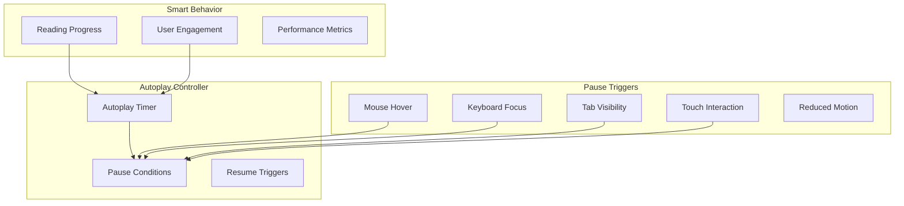

### Gesture Customization

[⬆️ Back to Top](#--table-of-contents)

---


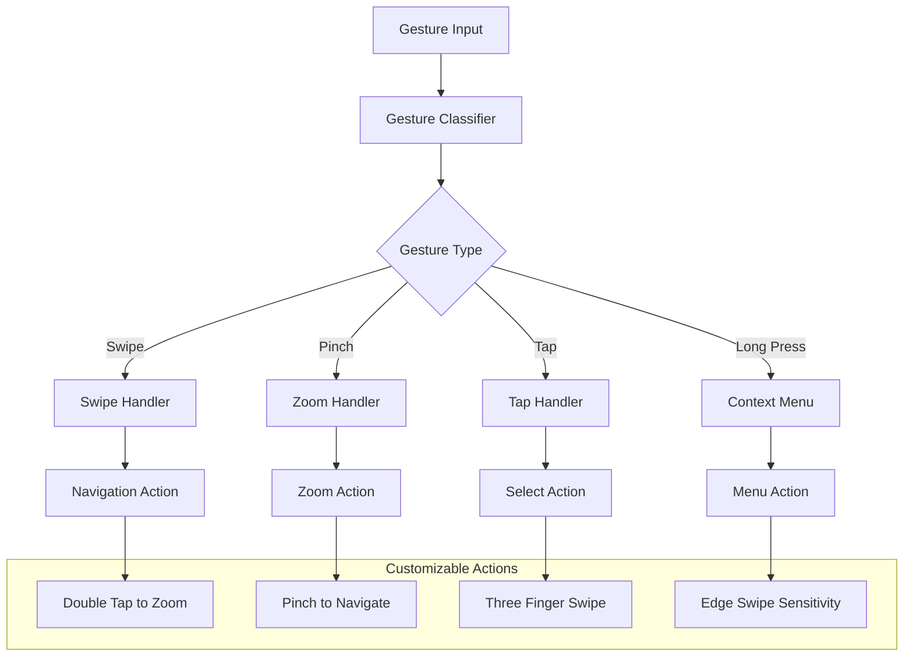

### TypeScript Interfaces & Component Props

[⬆️ Back to Top](#--table-of-contents)

---

#### Core Data Interfaces

```typescript
interface CarouselImage {
  id: string;
  src: string;
  alt: string;
  width: number;
  height: number;
  caption?: string;
  thumbnailSrc?: string;
  srcSet?: string[];
  sizes?: string;
  blurDataURL?: string;
  metadata?: ImageMetadata;
}

interface CarouselState {
  currentIndex: number;
  images: CarouselImage[];
  isAutoPlaying: boolean;
  isLoading: boolean;
  direction: 'prev' | 'next';
  touchStartX: number;
  isDragging: boolean;
  dragOffset: number;
  zoomLevel: number;
  isZoomed: boolean;
}

interface CarouselSettings {
  autoPlay: boolean;
  autoPlayInterval: number;
  infinite: boolean;
  showThumbnails: boolean;
  showDots: boolean;
  showArrows: boolean;
  keyboard: boolean;
  swipe: boolean;
  zoom: boolean;
  fade: boolean;
  lazy: boolean;
}

interface TouchGesture {
  startX: number;
  startY: number;
  currentX: number;
  currentY: number;
  deltaX: number;
  deltaY: number;
  velocity: number;
  direction: 'left' | 'right' | 'up' | 'down';
  distance: number;
}

interface ZoomState {
  scale: number;
  translateX: number;
  translateY: number;
  minScale: number;
  maxScale: number;
  centerX: number;
  centerY: number;
}
```

#### Component Props Interfaces

```typescript
interface ImageCarouselProps {
  images: CarouselImage[];
  initialIndex?: number;
  onImageChange?: (index: number, image: CarouselImage) => void;
  onImageLoad?: (image: CarouselImage) => void;
  onImageError?: (image: CarouselImage, error: Error) => void;
  settings?: Partial<CarouselSettings>;
  className?: string;
  style?: React.CSSProperties;
  width?: number | string;
  height?: number | string;
}

interface CarouselControlsProps {
  currentIndex: number;
  totalImages: number;
  onPrevious: () => void;
  onNext: () => void;
  onGoTo: (index: number) => void;
  showArrows?: boolean;
  showDots?: boolean;
  showCounter?: boolean;
  disabled?: boolean;
}

interface ThumbnailStripProps {
  images: CarouselImage[];
  currentIndex: number;
  onThumbnailClick: (index: number) => void;
  thumbnailSize?: 'sm' | 'md' | 'lg';
  orientation?: 'horizontal' | 'vertical';
  maxVisible?: number;
  showScrollbar?: boolean;
}

interface ZoomControlsProps {
  zoomLevel: number;
  minZoom: number;
  maxZoom: number;
  onZoomIn: () => void;
  onZoomOut: () => void;
  onResetZoom: () => void;
  onFitToContainer: () => void;
  showControls?: boolean;
  position?: 'top-left' | 'top-right' | 'bottom-left' | 'bottom-right';
}
```

### API Reference

[⬆️ Back to Top](#--table-of-contents)

---

#### Image Management
- `loadImage(src: string)` - Preload image with caching and error handling
- `preloadImages(indices: number[])` - Preload multiple images for smooth navigation
- `optimizeImage(image, size)` - Get optimized image URL for current viewport
- `generateThumbnail(image, size)` - Generate thumbnail with specified dimensions
- `validateImageSrc(src)` - Validate image URL and check accessibility

#### Carousel Navigation
- `goToSlide(index: number)` - Navigate to specific slide with animation
- `nextSlide()` - Move to next slide with wrap-around support
- `previousSlide()` - Move to previous slide with wrap-around support
- `startAutoPlay()` - Begin automatic slide progression
- `stopAutoPlay()` - Stop automatic slide progression and preserve state

#### Touch & Gesture Controls
- `enableSwipeGestures()` - Activate touch/mouse swipe navigation
- `disableSwipeGestures()` - Disable gesture controls temporarily
- `configureTouchSensitivity(threshold)` - Set swipe distance threshold
- `enableKeyboardNavigation()` - Activate arrow key and space bar controls
- `handlePinchZoom(event)` - Process pinch-to-zoom gesture events

#### Zoom & Transform
- `zoomIn(factor?: number)` - Increase zoom level with optional factor
- `zoomOut(factor?: number)` - Decrease zoom level with bounds checking
- `resetZoom()` - Reset zoom to original scale and center position
- `fitToContainer()` - Scale image to fit container dimensions
- `panImage(deltaX, deltaY)` - Pan zoomed image within viewport bounds

#### Performance & Loading
- `setLazyLoading(enabled: boolean)` - Configure lazy loading behavior
- `prefetchImages(strategy)` - Prefetch images with specified strategy
- `measurePerformance()` - Get timing metrics for carousel operations
- `optimizeForDevice()` - Apply device-specific performance settings
- `clearImageCache()` - Clear cached images to free memory

#### Events & Callbacks
- `addEventListener(event, callback)` - Subscribe to carousel events
- `removeEventListener(event, callback)` - Unsubscribe from events
- `onSlideChange(callback)` - Register slide change event handler
- `onImageLoad(callback)` - Register image load completion handler
- `onZoomChange(callback)` - Register zoom level change handler

#### Configuration
- `updateSettings(settings)` - Update carousel configuration dynamically
- `getSettings()` - Get current carousel configuration
- `resetToDefaults()` - Reset all settings to default values
- `exportConfiguration()` - Export current settings as JSON
- `importConfiguration(config)` - Import and apply configuration

---

## Performance Optimizations

[⬆️ Back to Top](#--table-of-contents)

---


### Memory Management

[⬆️ Back to Top](#--table-of-contents)

---


**Image Cache Strategy**:
```
ImageCache = {
  active: Map<string, HTMLImageElement>,
  preloaded: WeakMap<string, HTMLImageElement>,
  maxMemory: number,
  currentUsage: number
}
```

**Optimization Techniques**:
- Implement intelligent image unloading
- Use intersection observer for lazy loading
- Compress images based on device capabilities
- Implement progressive image enhancement
- Monitor memory usage and adjust cache size

### Animation Performance

[⬆️ Back to Top](#--table-of-contents)

---


**Hardware Acceleration**:
- Use CSS transforms instead of changing layout properties
- Leverage GPU acceleration for smooth animations
- Implement will-change CSS property strategically
- Use translate3d for force hardware acceleration
- Minimize paint and layout operations

**Frame Rate Optimization**:
```
PerformanceMonitor = {
  frameTime: number[],
  averageFrameTime: number,
  droppedFrames: number,
  adaptiveQuality: boolean
}
```

**Adaptive Quality Settings**:
- Reduce animation complexity on slower devices
- Disable effects when frame rate drops
- Use lower quality images for smooth transitions
- Implement progressive enhancement based on capabilities

### Network Optimization

[⬆️ Back to Top](#--table-of-contents)

---


**Smart Preloading**:
- Consider network speed for preload strategy
- Use service workers for advanced caching
- Implement image format negotiation (WebP, AVIF)
- Use compression and lazy loading
- Prioritize critical path images

## Security Considerations

[⬆️ Back to Top](#--table-of-contents)

---


### Content Security

[⬆️ Back to Top](#--table-of-contents)

---


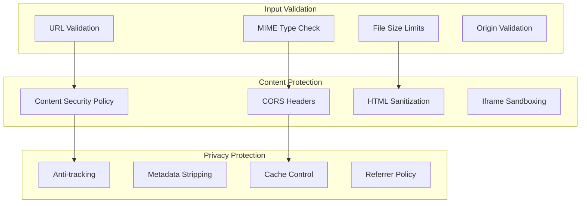

### Data Protection

[⬆️ Back to Top](#--table-of-contents)

---


**Image Source Validation**:
- Validate image URLs against whitelist
- Implement proper CORS policies
- Sanitize image metadata
- Use secure image proxy when necessary
- Implement rate limiting for image requests

## Accessibility Implementation

[⬆️ Back to Top](#--table-of-contents)

---


### Screen Reader Support

[⬆️ Back to Top](#--table-of-contents)

---


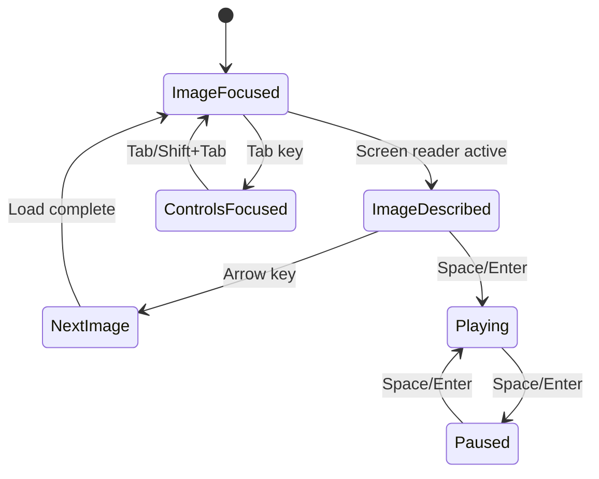

**Accessibility Features**:
- Comprehensive ARIA labels and roles
- Keyboard navigation support
- High contrast mode compatibility
- Reduced motion support
- Screen reader announcements
- Focus management during transitions

### Keyboard Navigation

[⬆️ Back to Top](#--table-of-contents)

---


**Navigation Patterns**:
- Arrow keys for slide navigation
- Tab key for control focus
- Enter/Space for activation
- Home/End for first/last slide
- Escape for fullscreen exit

## Testing Strategy

[⬆️ Back to Top](#--table-of-contents)

---


### Unit Testing Focus Areas

[⬆️ Back to Top](#--table-of-contents)

---


**Core Algorithm Testing**:
- Touch gesture recognition accuracy
- Animation timing and easing
- Image preloading logic
- Layout calculation correctness

**Component Testing**:
- Carousel navigation behavior
- Touch interaction handling
- Keyboard accessibility
- Responsive layout adaptation

### Integration Testing

[⬆️ Back to Top](#--table-of-contents)

---


**Cross-browser Testing**:
- Touch device compatibility
- Animation performance across browsers
- Image loading behavior
- Accessibility compliance

**Performance Testing**:
- Memory usage patterns
- Animation frame rates
- Image loading times
- Large dataset handling

### End-to-End Testing

[⬆️ Back to Top](#--table-of-contents)

---


**User Experience Testing**:
- Complete navigation flows
- Touch gesture interactions
- Accessibility workflows
- Performance on various devices

## Trade-offs and Considerations

[⬆️ Back to Top](#--table-of-contents)

---


### Performance vs Features

[⬆️ Back to Top](#--table-of-contents)

---

- **Smooth animations**: GPU usage vs battery life
- **Image quality**: File size vs visual fidelity
- **Preloading**: Memory usage vs loading speed
- **Touch responsiveness**: CPU usage vs interaction quality

### Accessibility vs UX

[⬆️ Back to Top](#--table-of-contents)

---

- **Autoplay**: User experience vs accessibility guidelines
- **Gestures**: Touch convenience vs keyboard accessibility
- **Animations**: Visual appeal vs motion sensitivity
- **Navigation**: Intuitive controls vs comprehensive accessibility

### Scalability Considerations

[⬆️ Back to Top](#--table-of-contents)

---

- **Image count**: Performance vs feature richness
- **File sizes**: Loading speed vs image quality
- **Device support**: Feature coverage vs performance
- **Network conditions**: Functionality vs loading speed

This image carousel system provides a comprehensive foundation for modern image display with advanced features like smooth touch interactions, intelligent preloading, and robust accessibility while maintaining high performance across all devices and network conditions. 