# Develop a System for Real-Time Notifications and Toasts


## 📋 Table of Contents

- [Develop a System for Real-Time Notifications and Toasts](#develop-a-system-for-real-time-notifications-and-toasts)
  - [Table of Contents](#table-of-contents)
  - [Clarify the Problem and Requirements](#clarify-the-problem-and-requirements)
    - [Problem Understanding](#problem-understanding)
    - [Functional Requirements](#functional-requirements)
    - [Non-Functional Requirements](#non-functional-requirements)
    - [Key Assumptions](#key-assumptions)
  - [High-Level Architecture](#high-level-architecture)
    - [Global Notification Infrastructure](#global-notification-infrastructure)
    - [Real-Time Delivery Architecture](#real-time-delivery-architecture)
  - [UI/UX and Component Structure](#uiux-and-component-structure)
    - [Frontend Notification Components](#frontend-notification-components)
    - [Toast Management System](#toast-management-system)
    - [Cross-Platform Notification Rendering](#cross-platform-notification-rendering)
  - [Real-Time Sync, Data Modeling & APIs](#real-time-sync-data-modeling-apis)
    - [Intelligent Delivery Algorithm](#intelligent-delivery-algorithm)
      - [Smart Channel Selection](#smart-channel-selection)
    - [Real-Time Synchronization](#real-time-synchronization)
      - [Cross-Device State Sync](#cross-device-state-sync)
    - [Notification Deduplication Algorithm](#notification-deduplication-algorithm)
    - [Data Models](#data-models)
      - [Notification Schema](#notification-schema)
      - [User Preferences Schema](#user-preferences-schema)
  - [Performance and Scalability](#performance-and-scalability)
    - [High-Throughput Delivery Pipeline](#high-throughput-delivery-pipeline)
      - [Scalable Processing Architecture](#scalable-processing-architecture)
    - [WebSocket Connection Management](#websocket-connection-management)
      - [Connection Scaling Strategy](#connection-scaling-strategy)
    - [Mobile Push Optimization](#mobile-push-optimization)
      - [Batch Processing for FCM/APNs](#batch-processing-for-fcmapns)
  - [Security and Privacy](#security-and-privacy)
    - [Notification Security Framework](#notification-security-framework)
      - [Multi-Layer Security Architecture](#multi-layer-security-architecture)
    - [Privacy-Preserving Analytics](#privacy-preserving-analytics)
      - [Anonymous Engagement Tracking](#anonymous-engagement-tracking)
  - [Testing, Monitoring, and Maintainability](#testing-monitoring-and-maintainability)
    - [Comprehensive Testing Strategy](#comprehensive-testing-strategy)
      - [Multi-Platform Testing Framework](#multi-platform-testing-framework)
    - [Real-Time Monitoring Dashboard](#real-time-monitoring-dashboard)
      - [Notification System KPIs](#notification-system-kpis)
  - [Trade-offs, Deep Dives, and Extensions](#trade-offs-deep-dives-and-extensions)
    - [Delivery Method Trade-offs](#delivery-method-trade-offs)
    - [Real-Time vs Batch Processing](#real-time-vs-batch-processing)
    - [Advanced Features](#advanced-features)
      - [AI-Powered Notification Intelligence](#ai-powered-notification-intelligence)
    - [Future Extensions](#future-extensions)
      - [Next-Generation Notification Features](#next-generation-notification-features)

---

## Table of Contents
1. [Clarify the Problem and Requirements](#clarify-the-problem-and-requirements)
2. [High-Level Architecture](#high-level-architecture)
3. [UI/UX and Component Structure](#uiux-and-component-structure)
4. [Real-Time Sync, Data Modeling & APIs](#real-time-sync-data-modeling--apis)
5. [Performance and Scalability](#performance-and-scalability)
6. [Security and Privacy](#security-and-privacy)
7. [Testing, Monitoring, and Maintainability](#testing-monitoring-and-maintainability)
8. [Trade-offs, Deep Dives, and Extensions](#trade-offs-deep-dives-and-extensions)

---

## Clarify the Problem and Requirements

[⬆️ Back to Top](#-table-of-contents)

---


### Problem Understanding

[⬆️ Back to Top](#-table-of-contents)

---

Design a comprehensive real-time notification system that delivers instant alerts, messages, and updates across web, mobile, and desktop platforms. The system must handle multiple notification types, user preferences, delivery channels, and provide rich interactive experiences similar to modern platforms like Slack, Discord, or mobile OS notification systems.

### Functional Requirements

[⬆️ Back to Top](#-table-of-contents)

---

- **Multi-Channel Delivery**: Push notifications, in-app toasts, email, SMS, webhooks
- **Real-Time Updates**: Instant delivery via WebSocket, Server-Sent Events, Push API
- **Rich Notifications**: Images, actions, deep links, interactive elements
- **User Preferences**: Granular controls, quiet hours, do-not-disturb modes
- **Notification Center**: Persistent history, read/unread status, categories
- **Cross-Platform Sync**: Status synchronization across all user devices
- **Batch Operations**: Bulk notifications, digest emails, summary reports
- **Analytics & Tracking**: Delivery rates, engagement metrics, A/B testing

### Non-Functional Requirements

[⬆️ Back to Top](#-table-of-contents)

---

- **Performance**: <100ms notification delivery, <50ms toast rendering
- **Scalability**: 100M+ users, 1B+ notifications/day, 10M+ concurrent connections
- **Availability**: 99.95% delivery success rate with retry mechanisms
- **Reliability**: Guaranteed delivery, deduplication, ordering preservation
- **Battery Efficiency**: Optimized for mobile devices, background processing
- **Compliance**: GDPR, push notification permissions, opt-out mechanisms

### Key Assumptions

[⬆️ Back to Top](#-table-of-contents)

---

- Average user: 50 notifications/day across all channels
- Peak traffic: 100K+ notifications/second during events
- Delivery channels: 70% push, 20% in-app, 10% email/SMS
- Device diversity: 60% mobile, 30% web, 10% desktop
- Engagement rate: 15% click-through rate on notifications
- Retention window: 30 days for notification history

---

## High-Level Architecture

[⬆️ Back to Top](#-table-of-contents)

---


### Global Notification Infrastructure

[⬆️ Back to Top](#-table-of-contents)

---


### Real-Time Delivery Architecture

[⬆️ Back to Top](#-table-of-contents)

---


---

## UI/UX and Component Structure

[⬆️ Back to Top](#-table-of-contents)

---


### Frontend Notification Components

[⬆️ Back to Top](#-table-of-contents)

---


### Toast Management System

[⬆️ Back to Top](#-table-of-contents)

---


### Cross-Platform Notification Rendering

[⬆️ Back to Top](#-table-of-contents)

---


---

## Real-Time Sync, Data Modeling & APIs

[⬆️ Back to Top](#-table-of-contents)

---


### Intelligent Delivery Algorithm

[⬆️ Back to Top](#-table-of-contents)

---


#### Smart Channel Selection

[⬆️ Back to Top](#-table-of-contents)

---


### Real-Time Synchronization

[⬆️ Back to Top](#-table-of-contents)

---


#### Cross-Device State Sync

[⬆️ Back to Top](#-table-of-contents)

---


### Notification Deduplication Algorithm

[⬆️ Back to Top](#-table-of-contents)

---


```mermaid
graph TD
    A[Incoming Notification] --> B[Generate Content Hash<br/>Title + Body + Type]
    B --> C[Check Time Window<br/>Last 5 minutes]
    C --> D{Duplicate Found?}
    
    D -->|Yes| E[Merge Strategy]
    D -->|No| F[Process Normally]
    
    E --> G{Merge Type}
    G -->|Count| H[Update Count Badge<br/>"3 new messages"]
    G -->|Replace| I[Replace Content<br/>Keep latest version]
    G -->|Accumulate| J[Combine Content<br/>Multiple items]
    
    H --> K[Update Existing Notification]
    I --> K
    J --> K
    
    F --> L[Store Hash in Cache<br/>TTL: 5 minutes]
    L --> M[Deliver Notification]
    K --> M
    
    style D fill:#ffcccc
    style E fill:#ffffcc
    style M fill:#ccffcc
```

### Data Models

[⬆️ Back to Top](#-table-of-contents)

---


#### Notification Schema

[⬆️ Back to Top](#-table-of-contents)

---

```
Notification {
  id: UUID
  user_id: UUID
  type: 'info' | 'warning' | 'error' | 'success' | 'marketing'
  category: String
  priority: 'low' | 'normal' | 'high' | 'critical'
  content: {
    title: String
    body: String
    image_url?: String
    icon?: String
    badge?: String
    actions?: [{
      id: String
      title: String
      action: String
      icon?: String
    }]
  }
  metadata: {
    created_at: DateTime
    expires_at?: DateTime
    deep_link?: String
    payload?: Object
    source_app: String
    campaign_id?: String
  }
  delivery: {
    channels: ['push', 'email', 'sms', 'websocket']
    scheduled_at?: DateTime
    delivered_at?: DateTime
    read_at?: DateTime
    clicked_at?: DateTime
    dismissed_at?: DateTime
  }
  targeting: {
    user_segments?: [String]
    device_types?: [String]
    geographic_filters?: Object
    time_constraints?: Object
  }
}
```

#### User Preferences Schema

[⬆️ Back to Top](#-table-of-contents)

---

```
NotificationPreferences {
  user_id: UUID
  global_settings: {
    enabled: Boolean
    quiet_hours: {
      start_time: String
      end_time: String
      timezone: String
      days: [String]
    }
    summary_digest: {
      enabled: Boolean
      frequency: 'daily' | 'weekly'
      time: String
    }
  }
  channel_preferences: {
    push: {
      enabled: Boolean
      sound: Boolean
      vibration: Boolean
      led: Boolean
      categories: [String]
    }
    email: {
      enabled: Boolean
      categories: [String]
      frequency: 'immediate' | 'hourly' | 'daily'
    }
    sms: {
      enabled: Boolean
      categories: [String]
      emergency_only: Boolean
    }
    in_app: {
      enabled: Boolean
      categories: [String]
      auto_dismiss: Boolean
      duration: Integer
    }
  }
  category_preferences: {
    [category]: {
      enabled: Boolean
      channels: [String]
      priority_override?: String
    }
  }
}
```

---

## Performance and Scalability

[⬆️ Back to Top](#-table-of-contents)

---


### High-Throughput Delivery Pipeline

[⬆️ Back to Top](#-table-of-contents)

---


#### Scalable Processing Architecture

[⬆️ Back to Top](#-table-of-contents)

---


### WebSocket Connection Management

[⬆️ Back to Top](#-table-of-contents)

---


#### Connection Scaling Strategy

[⬆️ Back to Top](#-table-of-contents)

---


### Mobile Push Optimization

[⬆️ Back to Top](#-table-of-contents)

---


#### Batch Processing for FCM/APNs

[⬆️ Back to Top](#-table-of-contents)

---


---

## Security and Privacy

[⬆️ Back to Top](#-table-of-contents)

---


### Notification Security Framework

[⬆️ Back to Top](#-table-of-contents)

---


#### Multi-Layer Security Architecture

[⬆️ Back to Top](#-table-of-contents)

---


### Privacy-Preserving Analytics

[⬆️ Back to Top](#-table-of-contents)

---


#### Anonymous Engagement Tracking

[⬆️ Back to Top](#-table-of-contents)

---


---

## Testing, Monitoring, and Maintainability

[⬆️ Back to Top](#-table-of-contents)

---


### Comprehensive Testing Strategy

[⬆️ Back to Top](#-table-of-contents)

---


#### Multi-Platform Testing Framework

[⬆️ Back to Top](#-table-of-contents)

---


### Real-Time Monitoring Dashboard

[⬆️ Back to Top](#-table-of-contents)

---


#### Notification System KPIs

[⬆️ Back to Top](#-table-of-contents)

---


---

## Trade-offs, Deep Dives, and Extensions

[⬆️ Back to Top](#-table-of-contents)

---


### Delivery Method Trade-offs

[⬆️ Back to Top](#-table-of-contents)

---


| Channel | Push Notifications | Email | SMS | In-App |
|---------|-------------------|-------|-----|--------|
| **Immediacy** | Excellent | Good | Excellent | Excellent |
| **Rich Content** | Limited | Excellent | Poor | Excellent |
| **Reliability** | Good | Excellent | Excellent | Poor |
| **Cost** | Low | Low | High | Free |
| **User Control** | High | Medium | Low | High |
| **Battery Impact** | Low | None | None | Medium |

### Real-Time vs Batch Processing

[⬆️ Back to Top](#-table-of-contents)

---




```mermaid
graph LR
    subgraph "Real-Time Processing"
        RT_PROS[Pros:<br/>• Immediate delivery<br/>• Better user experience<br/>• Time-sensitive content<br/>• Higher engagement]
        RT_CONS[Cons:<br/>• Higher resource usage<br/>• Complex infrastructure<br/>• Scalability challenges<br/>• Error handling complexity]
    end
    
    subgraph "Batch Processing"
        BATCH_PROS[Pros:<br/>• Resource efficiency<br/>• Better throughput<br/>• Simpler error handling<br/>• Cost optimization]
        BATCH_CONS[Cons:<br/>• Delivery delays<br/>• Reduced urgency<br/>• Batching complexity<br/>• Less responsive]
    end
    
    RT_PROS -.->|Trade-off| BATCH_CONS
    BATCH_PROS -.->|Trade-off| RT_CONS
```

### Advanced Features

[⬆️ Back to Top](#-table-of-contents)

---


#### AI-Powered Notification Intelligence

[⬆️ Back to Top](#-table-of-contents)

---


### Future Extensions

[⬆️ Back to Top](#-table-of-contents)

---


#### Next-Generation Notification Features

[⬆️ Back to Top](#-table-of-contents)

---


1. **Immersive Notifications**:
   - AR/VR notification overlays
   - Spatial audio alerts
   - Haptic feedback patterns
   - Gesture-based interactions

2. **Contextual Intelligence**:
   - Location-aware notifications
   - Calendar integration
   - Activity recognition
   - Environmental adaptation

3. **Conversational Notifications**:
   - Voice-enabled responses
   - Natural language processing
   - Smart reply suggestions
   - Multi-turn conversations

4. **Blockchain Integration**:
   - Decentralized delivery networks
   - Cryptographic verification
   - Tokenized engagement rewards
   - Privacy-preserving analytics

This comprehensive design provides a robust foundation for building a scalable, intelligent notification system that can handle massive throughput while delivering personalized, timely, and engaging notifications across all platforms and channels. 