# Travel/Hotel Booking Website (Airbnb-like)


## 📋 Table of Contents

- [Travel/Hotel Booking Website (Airbnb-like)](#travelhotel-booking-website-airbnb-like)
  - [Table of Contents](#table-of-contents)
  - [Clarify the Problem and Requirements](#clarify-the-problem-and-requirements)
    - [Problem Understanding](#problem-understanding)
    - [Functional Requirements](#functional-requirements)
    - [Non-Functional Requirements](#non-functional-requirements)
    - [Key Assumptions](#key-assumptions)
  - [High-Level Design (HLD)](#high-level-design-hld)
    - [System Architecture Overview](#system-architecture-overview)
    - [Booking Data Model](#booking-data-model)
  - [Low-Level Design (LLD)](#low-level-design-lld)
    - [Property Search Algorithm](#property-search-algorithm)
    - [Dynamic Pricing Engine](#dynamic-pricing-engine)
    - [Booking State Machine](#booking-state-machine)
  - [Core Algorithms](#core-algorithms)
    - [1. Property Search and Ranking Algorithm](#1-property-search-and-ranking-algorithm)
    - [2. Availability Management Algorithm](#2-availability-management-algorithm)
    - [3. Dynamic Pricing Algorithm](#3-dynamic-pricing-algorithm)
    - [4. Review and Rating System](#4-review-and-rating-system)
    - [5. Map-based Property Discovery](#5-map-based-property-discovery)
  - [Component Architecture](#component-architecture)
    - [Booking Platform Component Hierarchy](#booking-platform-component-hierarchy)
    - [State Management Architecture](#state-management-architecture)
  - [Advanced Features](#advanced-features)
    - [Personalization Engine](#personalization-engine)
    - [Smart Notifications System](#smart-notifications-system)
  - [Performance Optimizations](#performance-optimizations)
    - [Search Performance](#search-performance)
    - [Image and Media Optimization](#image-and-media-optimization)
    - [Database Optimization](#database-optimization)
  - [Security Considerations](#security-considerations)
    - [Payment Security](#payment-security)
    - [Data Protection](#data-protection)
  - [Accessibility Implementation](#accessibility-implementation)
    - [Keyboard Navigation](#keyboard-navigation)
    - [Inclusive Design](#inclusive-design)
  - [Testing Strategy](#testing-strategy)
    - [Unit Testing Focus Areas](#unit-testing-focus-areas)
    - [Integration Testing](#integration-testing)
    - [User Experience Testing](#user-experience-testing)
  - [Trade-offs and Considerations](#trade-offs-and-considerations)
    - [Performance vs Features](#performance-vs-features)
    - [Business vs User Experience](#business-vs-user-experience)
    - [Scalability Considerations](#scalability-considerations)

---

## Table of Contents
1. [Clarify the Problem and Requirements](#clarify-the-problem-and-requirements)
2. [High-Level Design (HLD)](#high-level-design-hld)
3. [Low-Level Design (LLD)](#low-level-design-lld)
4. [Core Algorithms](#core-algorithms)
5. [Component Architecture](#component-architecture)
6. [Advanced Features](#advanced-features)
7. [TypeScript Interfaces & Component Props](#typescript-interfaces--component-props)
8. [API Reference](#api-reference)
9. [Performance Optimizations](#performance-optimizations)
10. [Security Considerations](#security-considerations)
11. [Accessibility Implementation](#accessibility-implementation)
12. [Testing Strategy](#testing-strategy)
13. [Trade-offs and Considerations](#trade-offs-and-considerations)

---

## Clarify the Problem and Requirements

[⬆️ Back to Top](#--table-of-contents)

---

### Problem Understanding

[⬆️ Back to Top](#--table-of-contents)

---

Design a comprehensive travel and accommodation booking platform that enables users to search, compare, and book properties/experiences while providing hosts with tools to manage their listings, similar to Airbnb, Booking.com, or VRBO. The system must handle complex search filters, real-time availability, dynamic pricing, and secure payment processing while delivering an intuitive user experience.

### Functional Requirements

[⬆️ Back to Top](#--table-of-contents)

---

- **Property Search**: Location-based search with maps, date/guest filters, advanced criteria
- **Listing Management**: Property creation, photo uploads, availability calendar, pricing rules
- **Booking Flow**: Multi-step booking process, payment handling, confirmation system
- **User Profiles**: Guest and host profiles, verification system, reviews and ratings
- **Communication**: In-app messaging, automated notifications, booking updates
- **Payment System**: Secure payments, multiple payment methods, refund processing
- **Review System**: Bidirectional reviews, photo uploads, response management
- **Map Integration**: Interactive maps, property locations, neighborhood information

### Non-Functional Requirements

[⬆️ Back to Top](#--table-of-contents)

---

- **Performance**: <3s page load, <500ms search results, optimized image loading
- **Scalability**: Handle millions of properties, concurrent bookings, peak traffic
- **Availability**: 99.9% uptime, graceful degradation during high traffic
- **Security**: PCI compliance, secure payment processing, data encryption
- **Mobile Optimization**: Responsive design, progressive web app features
- **SEO**: Server-side rendering, structured data, optimized meta tags
- **Accessibility**: WCAG 2.1 AA compliance, screen reader support
- **Global Support**: Multi-language, multi-currency, regional compliance

### Key Assumptions

[⬆️ Back to Top](#--table-of-contents)

---

- Property inventory: 1M+ active listings globally
- Peak concurrent users: 100K+ during booking surges
- Average booking value: $100-$500 per reservation
- Search-to-booking conversion: 2-5% industry standard
- Mobile traffic: 60-70% of total traffic
- Geographic distribution: Global with regional peaks
- Payment processing: Multiple currencies, international cards
- Image storage: 10-50 high-quality photos per property

---

## High-Level Design (HLD)

[⬆️ Back to Top](#--table-of-contents)

---


### System Architecture Overview

[⬆️ Back to Top](#--table-of-contents)

---


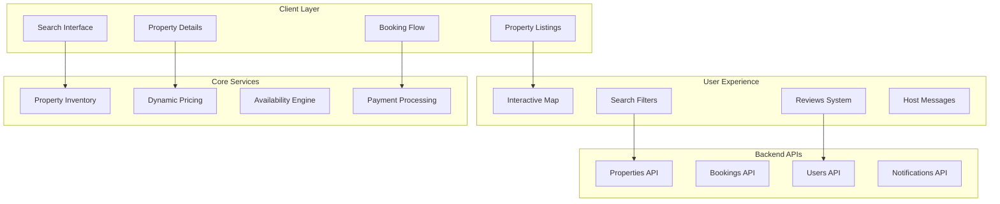

### Booking Data Model

[⬆️ Back to Top](#--table-of-contents)

---


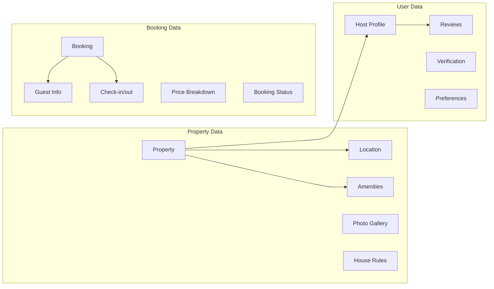

## Low-Level Design (LLD)

[⬆️ Back to Top](#--table-of-contents)

---


### Property Search Algorithm

[⬆️ Back to Top](#--table-of-contents)

---


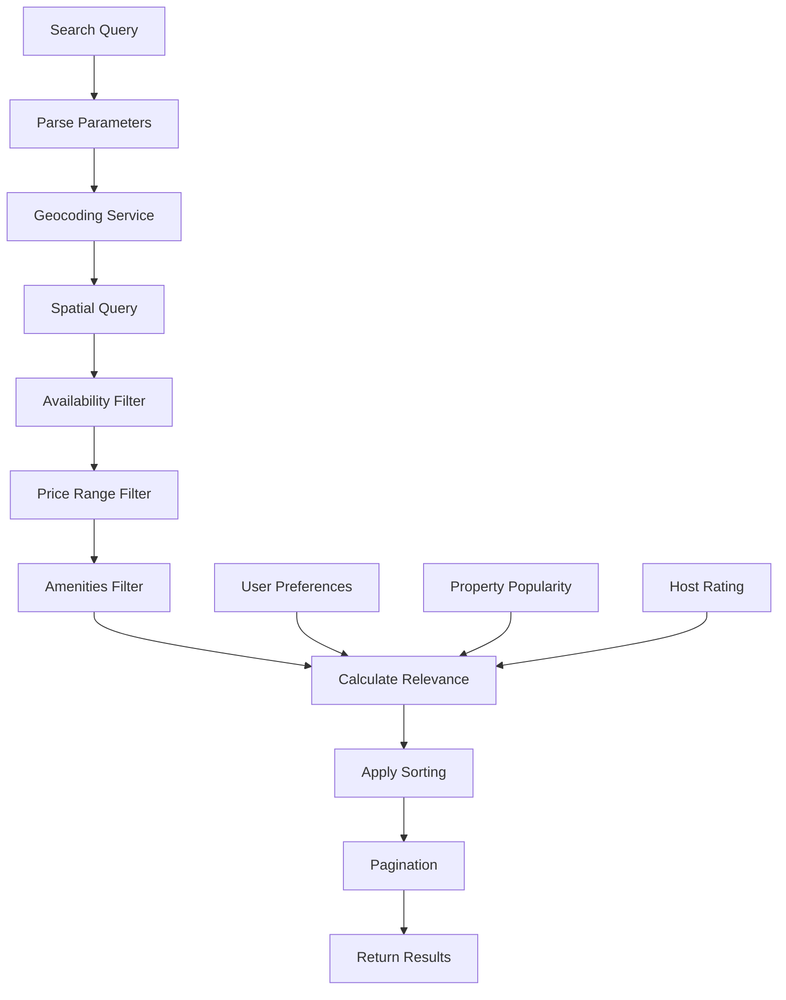

### Dynamic Pricing Engine

[⬆️ Back to Top](#--table-of-contents)

---


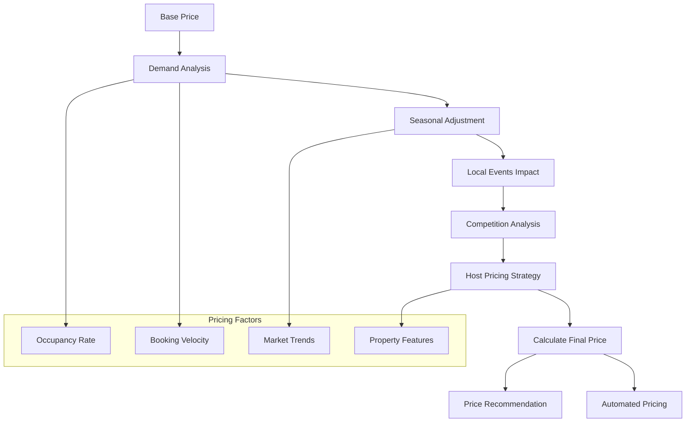

### Booking State Machine

[⬆️ Back to Top](#--table-of-contents)

---


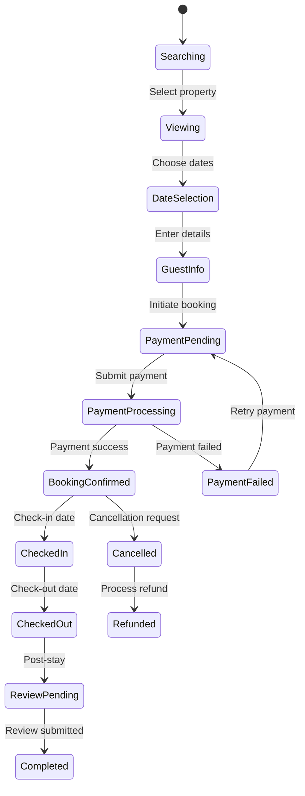

## Core Algorithms

[⬆️ Back to Top](#--table-of-contents)

---


### 1. Property Search and Ranking Algorithm

[⬆️ Back to Top](#--table-of-contents)

---


**Purpose**: Find and rank properties based on user preferences and relevance.

**Search Parameters**:
```
SearchQuery = {
  location: string,
  checkIn: Date,
  checkOut: Date,
  guests: number,
  priceRange: { min: number, max: number },
  amenities: string[],
  propertyType: string[],
  instantBook: boolean
}
```

**Ranking Algorithm**:
```
function calculatePropertyScore(property, query, userHistory):
  baseScore = 0
  
  // Location relevance (40%)
  locationScore = calculateLocationRelevance(property.location, query.location)
  baseScore += locationScore * 0.4
  
  // Price competitiveness (25%)
  priceScore = calculatePriceScore(property.price, query.priceRange, marketAverage)
  baseScore += priceScore * 0.25
  
  // Property quality (20%)
  qualityScore = (property.rating * 0.6) + (property.reviewCount * 0.4)
  baseScore += normalizeScore(qualityScore) * 0.2
  
  // Amenities match (10%)
  amenitiesScore = calculateAmenitiesMatch(property.amenities, query.amenities)
  baseScore += amenitiesScore * 0.1
  
  // Personalization (5%)
  personalScore = calculatePersonalization(property, userHistory)
  baseScore += personalScore * 0.05
  
  return baseScore
```

**Location Relevance Calculation**:
- Use geographic distance with decay function
- Consider transportation accessibility
- Weight popular neighborhoods higher
- Factor in local attractions proximity

### 2. Availability Management Algorithm

[⬆️ Back to Top](#--table-of-contents)

---


**Purpose**: Track and manage property availability across multiple platforms.

**Availability State**:
```
AvailabilityCalendar = {
  propertyId: string,
  dates: Map<Date, AvailabilityStatus>,
  blockedPeriods: DateRange[],
  minimumStay: number,
  maximumStay: number
}

AvailabilityStatus = 'available' | 'booked' | 'blocked' | 'maintenance'
```

**Conflict Resolution**:
```
function checkAvailability(propertyId, checkIn, checkOut):
  calendar = getPropertyCalendar(propertyId)
  requestedDates = generateDateRange(checkIn, checkOut)
  
  for date in requestedDates:
    status = calendar.dates.get(date)
    
    if status !== 'available':
      return { available: false, conflictDate: date, reason: status }
  
  // Check minimum/maximum stay requirements
  stayDuration = calculateDuration(checkIn, checkOut)
  
  if stayDuration < calendar.minimumStay:
    return { available: false, reason: 'minimum_stay_not_met' }
  
  if stayDuration > calendar.maximumStay:
    return { available: false, reason: 'maximum_stay_exceeded' }
  
  return { available: true }
```

**Calendar Synchronization**:
- Real-time updates across all platforms
- Handle double-booking prevention
- Implement optimistic locking for concurrent bookings
- Support bulk availability updates

### 3. Dynamic Pricing Algorithm

[⬆️ Back to Top](#--table-of-contents)

---


**Purpose**: Automatically adjust property prices based on market conditions.

**Pricing Factors**:
```
PricingFactors = {
  baseDemand: number,        // Historical booking patterns
  seasonalDemand: number,    // Seasonal variations
  localEvents: Event[],      // Conferences, festivals, etc.
  competitorPricing: number, // Market rates
  propertyFeatures: number,  // Unique selling points
  bookingVelocity: number,   // Recent booking speed
  occupancyRate: number      // Current occupancy
}
```

**Price Calculation**:
```
function calculateOptimalPrice(property, targetDate, factors):
  basePrice = property.basePrice
  
  // Demand multiplier calculation
  demandMultiplier = 1.0
  
  // Seasonal adjustment (±30%)
  seasonalFactor = calculateSeasonalFactor(targetDate, property.location)
  demandMultiplier *= (1 + seasonalFactor * 0.3)
  
  // Local events impact (±50%)
  eventsFactor = calculateEventsImpact(property.location, targetDate)
  demandMultiplier *= (1 + eventsFactor * 0.5)
  
  // Market competition (±20%)
  competitionFactor = calculateCompetitionFactor(property, targetDate)
  demandMultiplier *= (1 + competitionFactor * 0.2)
  
  // Booking velocity adjustment (±15%)
  velocityFactor = calculateVelocityFactor(property, targetDate)
  demandMultiplier *= (1 + velocityFactor * 0.15)
  
  finalPrice = basePrice * demandMultiplier
  
  // Apply pricing constraints
  return applyPriceConstraints(finalPrice, property.priceRules)
```

**Price Optimization Strategy**:
- A/B testing for price sensitivity
- Machine learning for demand prediction
- Host preferences and constraints
- Revenue maximization algorithms

### 4. Review and Rating System

[⬆️ Back to Top](#--table-of-contents)

---


**Purpose**: Manage and display authentic guest reviews with spam detection.

**Review Processing**:
```
ReviewData = {
  bookingId: string,
  guestRating: number,
  hostRating: number,
  categories: {
    cleanliness: number,
    accuracy: number,
    communication: number,
    location: number,
    checkIn: number,
    value: number
  },
  comments: string,
  photos: string[]
}
```

**Review Validation Algorithm**:
```
function validateReview(review, booking):
  validationScore = 0
  
  // Verify legitimate booking
  if not verifyBookingCompleted(review.bookingId):
    return { valid: false, reason: 'invalid_booking' }
  
  // Content authenticity check
  authenticityScore = checkContentAuthenticity(review.comments)
  if authenticityScore < 0.7:
    return { valid: false, reason: 'suspicious_content' }
  
  // Rating consistency check
  categoryAverage = calculateCategoryAverage(review.categories)
  overallRating = review.guestRating
  
  if Math.abs(categoryAverage - overallRating) > 1.5:
    return { valid: false, reason: 'inconsistent_ratings' }
  
  // Temporal validation
  timeToReview = Date.now() - booking.checkOutDate
  if timeToReview > 14 * 24 * 60 * 60 * 1000: // 14 days
    return { valid: false, reason: 'review_too_late' }
  
  return { valid: true }
```

**Spam Detection Features**:
- Natural language processing for fake reviews
- User behavior pattern analysis
- Cross-reference with other platforms
- Machine learning-based authenticity scoring

### 5. Map-based Property Discovery

[⬆️ Back to Top](#--table-of-contents)

---


**Purpose**: Enable geographic property search with interactive map interface.

**Spatial Query Optimization**:
```
function findPropertiesInBounds(bounds, filters):
  // Use spatial indexing (R-tree or geohashing)
  candidateProperties = spatialIndex.query(bounds)
  
  // Apply filters
  filteredProperties = candidateProperties.filter(property => {
    return matchesFilters(property, filters) &&
           isAvailable(property, filters.dates) &&
           meetsGuestRequirements(property, filters.guests)
  })
  
  // Cluster nearby properties for map display
  clusters = clusterPropertiesByProximity(filteredProperties, bounds.zoom)
  
  return {
    properties: filteredProperties,
    clusters: clusters,
    bounds: calculateResultBounds(filteredProperties)
  }
```

**Map Clustering Algorithm**:
```
function clusterProperties(properties, zoomLevel):
  clusterRadius = calculateClusterRadius(zoomLevel)
  clusters = []
  processedProperties = new Set()
  
  for property in properties:
    if processedProperties.has(property.id):
      continue
    
    cluster = {
      center: property.location,
      properties: [property],
      averagePrice: property.price
    }
    
    // Find nearby properties
    nearbyProperties = findPropertiesWithinRadius(
      property.location, 
      clusterRadius, 
      properties
    )
    
    for nearbyProperty in nearbyProperties:
      if not processedProperties.has(nearbyProperty.id):
        cluster.properties.push(nearbyProperty)
        processedProperties.add(nearbyProperty.id)
    
    // Calculate cluster statistics
    cluster.averagePrice = calculateAveragePrice(cluster.properties)
    cluster.center = calculateClusterCenter(cluster.properties)
    
    clusters.push(cluster)
  
  return clusters
```

## Component Architecture

[⬆️ Back to Top](#--table-of-contents)

---


### Booking Platform Component Hierarchy

[⬆️ Back to Top](#--table-of-contents)

---


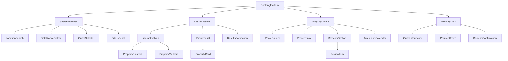

### State Management Architecture

[⬆️ Back to Top](#--table-of-contents)

---


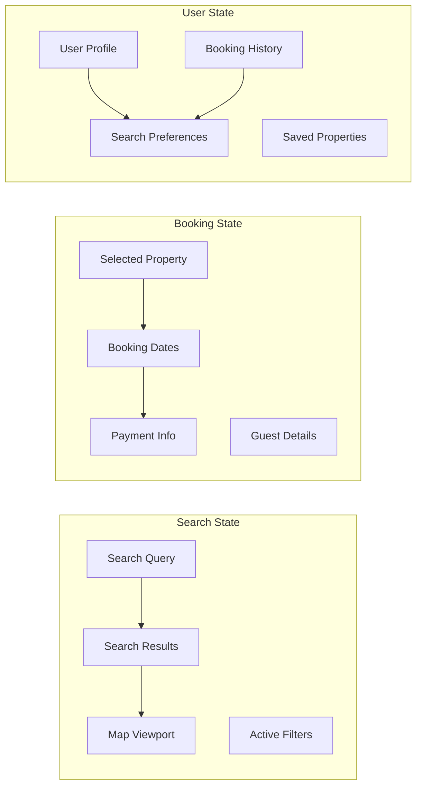

#### React Component Implementation

[⬆️ Back to Top](#--table-of-contents)

---

**BookingPlatform.jsx**

**What this code does:**
• **Main Purpose**: Travel booking platform with property search, selection, and booking flow
• **Search & Filter**: Handles location search, date selection, guest management, and filtering
• **Key Functions**:
  - `handleSearch()` - Executes property search with filters and updates map viewport
  - `calculateBounds()` - Determines map viewport from search results
  - `handlePropertySelect()` - Loads detailed property information
  - `handleBookingStart()` - Initiates booking flow with selected property
  - `calculateTotalPrice()` - Computes total booking cost including taxes
  - `handleBookingComplete()` - Finalizes reservation and payment

```jsx
import React, { useState, useEffect, useCallback } from 'react';
import { BookingProvider } from './BookingContext';
import SearchInterface from './SearchInterface';
import SearchResults from './SearchResults';
import PropertyDetails from './PropertyDetails';
import BookingFlow from './BookingFlow';
import { useLocationSearch } from './hooks/useLocationSearch';

const BookingPlatform = () => {
  const [currentView, setCurrentView] = useState('search'); // 'search', 'results', 'property', 'booking'
  const [searchQuery, setSearchQuery] = useState({
    location: '',
    coordinates: null,
    checkIn: null,
    checkOut: null,
    guests: { adults: 2, children: 0, infants: 0 }
  });
  const [filters, setFilters] = useState({
    priceRange: [0, 1000],
    propertyTypes: [],
    amenities: [],
    rating: 0,
    instantBook: false
  });
  const [searchResults, setSearchResults] = useState([]);
  const [selectedProperty, setSelectedProperty] = useState(null);
  const [mapViewport, setMapViewport] = useState({
    latitude: 37.7749,
    longitude: -122.4194,
    zoom: 10
  });
  const [loading, setLoading] = useState(false);
  const [bookingData, setBookingData] = useState({
    property: null,
    dates: null,
    guests: null,
    totalPrice: 0
  });

  const { searchLocations } = useLocationSearch();

  const handleSearch = useCallback(async (query = searchQuery) => {
    if (!query.location || !query.checkIn || !query.checkOut) return;

    setLoading(true);
    try {
      const response = await fetch('/api/properties/search', {
        method: 'POST',
        headers: { 'Content-Type': 'application/json' },
        body: JSON.stringify({
          ...query,
          filters,
          limit: 20
        })
      });

      const data = await response.json();
      setSearchResults(data.properties);
      
      if (data.properties.length > 0) {
        setCurrentView('results');
        
        // Update map viewport to show results
        const bounds = calculateBounds(data.properties);
        setMapViewport(bounds);
      }
    } catch (error) {
      console.error('Search failed:', error);
    } finally {
      setLoading(false);
    }
  }, [searchQuery, filters]);

  const calculateBounds = (properties) => {
    if (properties.length === 0) return mapViewport;
    
    const lats = properties.map(p => p.latitude);
    const lngs = properties.map(p => p.longitude);
    
    return {
      latitude: (Math.min(...lats) + Math.max(...lats)) / 2,
      longitude: (Math.min(...lngs) + Math.max(...lngs)) / 2,
      zoom: 12
    };
  };

  const handlePropertySelect = useCallback(async (propertyId) => {
    try {
      const response = await fetch(`/api/properties/${propertyId}`);
      const property = await response.json();
      setSelectedProperty(property);
      setCurrentView('property');
    } catch (error) {
      console.error('Failed to load property:', error);
    }
  }, []);

  const handleBookingStart = useCallback((property) => {
    setBookingData({
      property,
      dates: {
        checkIn: searchQuery.checkIn,
        checkOut: searchQuery.checkOut
      },
      guests: searchQuery.guests,
      totalPrice: calculateTotalPrice(property, searchQuery)
    });
    setCurrentView('booking');
  }, [searchQuery]);

  const calculateTotalPrice = (property, query) => {
    const nights = Math.ceil(
      (new Date(query.checkOut) - new Date(query.checkIn)) / (1000 * 60 * 60 * 24)
    );
    const basePrice = property.pricePerNight * nights;
    const taxes = basePrice * 0.12;
    const serviceFee = basePrice * 0.03;
    
    return basePrice + taxes + serviceFee;
  };

  const handleFilterChange = useCallback((newFilters) => {
    setFilters(prev => ({ ...prev, ...newFilters }));
  }, []);

  const handleBookingComplete = useCallback(async (bookingDetails) => {
    try {
      const response = await fetch('/api/bookings', {
        method: 'POST',
        headers: { 'Content-Type': 'application/json' },
        body: JSON.stringify(bookingDetails)
      });

      if (response.ok) {
        const booking = await response.json();
        // Redirect to confirmation page or show success message
        console.log('Booking confirmed:', booking);
      }
    } catch (error) {
      console.error('Booking failed:', error);
    }
  }, []);

  const value = {
    currentView,
    searchQuery,
    filters,
    searchResults,
    selectedProperty,
    mapViewport,
    bookingData,
    loading,
    setCurrentView,
    setSearchQuery,
    setFilters: handleFilterChange,
    setMapViewport,
    onSearch: handleSearch,
    onPropertySelect: handlePropertySelect,
    onBookingStart: handleBookingStart,
    onBookingComplete: handleBookingComplete
  };

  return (
    <BookingProvider value={value}>
      <div className="booking-platform">
        {currentView === 'search' && <SearchInterface />}
        {currentView === 'results' && <SearchResults />}
        {currentView === 'property' && <PropertyDetails />}
        {currentView === 'booking' && <BookingFlow />}
      </div>
    </BookingProvider>
  );
};

export default BookingPlatform;
```

**SearchInterface.jsx**
```jsx
import React, { useContext, useState } from 'react';
import { BookingContext } from './BookingContext';
import LocationSearch from './LocationSearch';
import DateRangePicker from './DateRangePicker';
import GuestSelector from './GuestSelector';

const SearchInterface = () => {
  const { searchQuery, setSearchQuery, onSearch, loading } = useContext(BookingContext);
  const [errors, setErrors] = useState({});

  const handleLocationChange = (location) => {
    setSearchQuery(prev => ({
      ...prev,
      location: location.name,
      coordinates: location.coordinates
    }));
  };

  const handleDateChange = (dates) => {
    setSearchQuery(prev => ({
      ...prev,
      checkIn: dates.startDate,
      checkOut: dates.endDate
    }));
  };

  const handleGuestChange = (guests) => {
    setSearchQuery(prev => ({ ...prev, guests }));
  };

  const validateSearch = () => {
    const newErrors = {};
    
    if (!searchQuery.location) {
      newErrors.location = 'Please select a destination';
    }
    
    if (!searchQuery.checkIn || !searchQuery.checkOut) {
      newErrors.dates = 'Please select check-in and check-out dates';
    }
    
    if (new Date(searchQuery.checkIn) >= new Date(searchQuery.checkOut)) {
      newErrors.dates = 'Check-out date must be after check-in date';
    }
    
    setErrors(newErrors);
    return Object.keys(newErrors).length === 0;
  };

  const handleSubmit = (e) => {
    e.preventDefault();
    
    if (validateSearch()) {
      onSearch();
    }
  };

  return (
    <div className="search-interface">
      <div className="search-hero">
        <h1>Find your perfect stay</h1>
        <p>Discover amazing places to stay around the world</p>
      </div>
      
      <form className="search-form" onSubmit={handleSubmit}>
        <div className="search-fields">
          <div className="field-group">
            <label htmlFor="location">Where</label>
            <LocationSearch
              value={searchQuery.location}
              onChange={handleLocationChange}
              placeholder="Search destinations"
              error={errors.location}
            />
          </div>
          
          <div className="field-group">
            <label htmlFor="dates">When</label>
            <DateRangePicker
              startDate={searchQuery.checkIn}
              endDate={searchQuery.checkOut}
              onChange={handleDateChange}
              error={errors.dates}
            />
          </div>
          
          <div className="field-group">
            <label htmlFor="guests">Who</label>
            <GuestSelector
              guests={searchQuery.guests}
              onChange={handleGuestChange}
            />
          </div>
        </div>
        
        <button 
          type="submit" 
          className="search-button"
          disabled={loading}
        >
          {loading ? 'Searching...' : 'Search'}
        </button>
      </form>
    </div>
  );
};

export default SearchInterface;
```

**SearchResults.jsx**
```jsx
import React, { useContext, useState } from 'react';
import { BookingContext } from './BookingContext';
import InteractiveMap from './InteractiveMap';
import PropertyList from './PropertyList';
import FiltersPanel from './FiltersPanel';

const SearchResults = () => {
  const { 
    searchResults, 
    filters, 
    setFilters, 
    mapViewport, 
    setMapViewport,
    onPropertySelect 
  } = useContext(BookingContext);
  
  const [viewMode, setViewMode] = useState('list'); // 'list' or 'map'
  const [showFilters, setShowFilters] = useState(false);

  const filteredResults = searchResults.filter(property => {
    // Apply filters
    if (property.pricePerNight < filters.priceRange[0] || 
        property.pricePerNight > filters.priceRange[1]) {
      return false;
    }
    
    if (filters.propertyTypes.length > 0 && 
        !filters.propertyTypes.includes(property.type)) {
      return false;
    }
    
    if (filters.rating > 0 && property.rating < filters.rating) {
      return false;
    }
    
    if (filters.instantBook && !property.instantBook) {
      return false;
    }
    
    return true;
  });

  return (
    <div className="search-results">
      <div className="results-header">
        <div className="results-info">
          <h2>{filteredResults.length} stays found</h2>
          <button
            className="filters-toggle"
            onClick={() => setShowFilters(!showFilters)}
          >
            Filters
          </button>
        </div>
        
        <div className="view-toggle">
          <button
            className={viewMode === 'list' ? 'active' : ''}
            onClick={() => setViewMode('list')}
          >
            List
          </button>
          <button
            className={viewMode === 'map' ? 'active' : ''}
            onClick={() => setViewMode('map')}
          >
            Map
          </button>
        </div>
      </div>
      
      {showFilters && (
        <FiltersPanel
          filters={filters}
          onFiltersChange={setFilters}
          onClose={() => setShowFilters(false)}
        />
      )}
      
      <div className="results-content">
        {viewMode === 'list' ? (
          <PropertyList
            properties={filteredResults}
            onPropertySelect={onPropertySelect}
          />
        ) : (
          <div className="results-layout">
            <div className="map-section">
              <InteractiveMap
                properties={filteredResults}
                viewport={mapViewport}
                onViewportChange={setMapViewport}
                onPropertySelect={onPropertySelect}
              />
            </div>
            <div className="list-section">
              <PropertyList
                properties={filteredResults}
                onPropertySelect={onPropertySelect}
                compact={true}
              />
            </div>
          </div>
        )}
      </div>
    </div>
  );
};

export default SearchResults;
```

## Advanced Features

[⬆️ Back to Top](#--table-of-contents)

---


### Personalization Engine

[⬆️ Back to Top](#--table-of-contents)

---


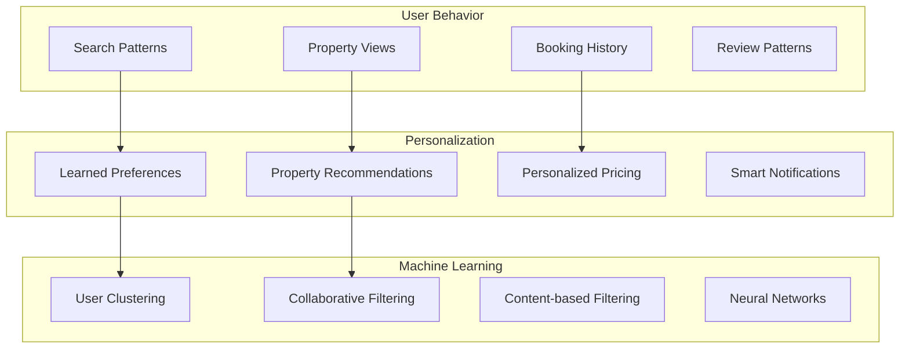

### Smart Notifications System

[⬆️ Back to Top](#--table-of-contents)

---


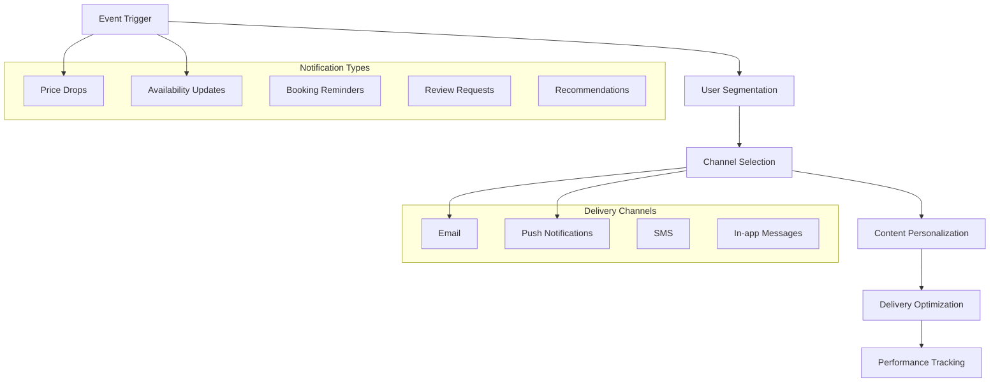

### TypeScript Interfaces & Component Props

[⬆️ Back to Top](#--table-of-contents)

---

#### Core Data Interfaces

```typescript
interface Property {
  id: string;
  title: string;
  description: string;
  type: 'hotel' | 'apartment' | 'house' | 'villa' | 'hostel';
  location: PropertyLocation;
  amenities: Amenity[];
  images: PropertyImage[];
  pricing: PricingInfo;
  availability: AvailabilityCalendar;
  host: HostInfo;
  rating: PropertyRating;
  policies: PropertyPolicies;
}

interface PropertyLocation {
  address: string;
  city: string;
  country: string;
  coordinates: {
    latitude: number;
    longitude: number;
  };
  neighborhood?: string;
  landmarks?: Landmark[];
  transportation?: TransportInfo[];
}

interface Booking {
  id: string;
  propertyId: string;
  guestId: string;
  checkIn: Date;
  checkOut: Date;
  guests: GuestInfo;
  totalPrice: number;
  status: 'pending' | 'confirmed' | 'cancelled' | 'completed';
  paymentInfo: PaymentInfo;
  specialRequests?: string;
  cancellationPolicy: CancellationPolicy;
}

interface SearchCriteria {
  destination: string;
  checkIn: Date;
  checkOut: Date;
  guests: {
    adults: number;
    children: number;
    infants: number;
  };
  filters: SearchFilters;
  sortBy: SortOption;
  priceRange: [number, number];
}

interface SearchFilters {
  propertyTypes: string[];
  amenities: string[];
  priceRange: [number, number];
  rating: number;
  instantBook: boolean;
  superhost: boolean;
  cancellation: 'flexible' | 'moderate' | 'strict';
}
```

#### Component Props Interfaces

```typescript
interface PropertySearchProps {
  onSearch: (criteria: SearchCriteria) => void;
  onFiltersChange: (filters: SearchFilters) => void;
  popularDestinations?: Destination[];
  recentSearches?: SearchCriteria[];
  enableMapView?: boolean;
  showAdvancedFilters?: boolean;
  defaultLocation?: string;
}

interface PropertyCardProps {
  property: Property;
  onPropertyClick: (propertyId: string) => void;
  onFavoriteToggle: (propertyId: string) => void;
  onShareProperty: (property: Property) => void;
  showPricing?: boolean;
  showHost?: boolean;
  layout: 'grid' | 'list' | 'map';
  isWishlisted?: boolean;
}

interface BookingFormProps {
  property: Property;
  selectedDates: {
    checkIn: Date;
    checkOut: Date;
  };
  onBookingSubmit: (booking: BookingData) => void;
  onDateChange: (dates: DateRange) => void;
  onGuestChange: (guests: GuestInfo) => void;
  showPriceBreakdown?: boolean;
  allowInstantBook?: boolean;
}

interface PropertyGalleryProps {
  images: PropertyImage[];
  onImageClick: (index: number) => void;
  showThumbnails?: boolean;
  enableZoom?: boolean;
  enableFullscreen?: boolean;
  layout: 'carousel' | 'grid' | 'masonry';
  maxVisible?: number;
}

interface MapViewProps {
  properties: Property[];
  center: [number, number];
  zoom?: number;
  onPropertySelect: (property: Property) => void;
  onMapMove: (bounds: MapBounds) => void;
  showClusters?: boolean;
  showFilters?: boolean;
  customMarkers?: boolean;
}
```

### API Reference

[⬆️ Back to Top](#--table-of-contents)

---

#### Property Search & Discovery
- `GET /api/properties/search` - Search properties with filters, dates, and location
- `GET /api/properties/:id` - Get detailed property information and availability
- `GET /api/properties/featured` - Get featured properties and promotional listings
- `GET /api/properties/recommendations` - Get personalized property recommendations
- `POST /api/properties/save` - Save property to user's wishlist or favorites

#### Availability & Pricing
- `GET /api/properties/:id/availability` - Check property availability for date range
- `GET /api/properties/:id/pricing` - Get dynamic pricing for specific dates
- `POST /api/properties/:id/price-quote` - Get detailed price quote with taxes and fees
- `GET /api/properties/:id/calendar` - Get property's availability calendar
- `POST /api/properties/:id/block-dates` - Block dates for property (host only)

#### Booking Management
- `POST /api/bookings` - Create new booking with payment processing
- `GET /api/bookings/:id` - Get booking details and current status
- `PUT /api/bookings/:id` - Modify booking dates or guest information
- `POST /api/bookings/:id/cancel` - Cancel booking and process refund
- `GET /api/bookings/user/:userId` - Get user's booking history and upcoming trips

#### Payment & Transactions
- `POST /api/payments/intent` - Create payment intent for booking
- `POST /api/payments/confirm` - Confirm payment and complete booking
- `GET /api/payments/:id/status` - Get payment status and transaction details
- `POST /api/payments/refund` - Process refund for cancelled booking
- `GET /api/payments/methods` - Get available payment methods for region

#### Reviews & Ratings
- `GET /api/properties/:id/reviews` - Get property reviews with pagination
- `POST /api/reviews` - Submit review and rating for completed booking
- `PUT /api/reviews/:id` - Update or edit existing review
- `GET /api/reviews/user/:userId` - Get reviews written by specific user
- `POST /api/reviews/:id/helpful` - Mark review as helpful or report spam

#### Host Management
- `POST /api/properties` - Create new property listing (host only)
- `PUT /api/properties/:id` - Update property details and amenities
- `GET /api/properties/:id/bookings` - Get bookings for property (host only)
- `POST /api/properties/:id/photos` - Upload property photos with optimization
- `GET /api/host/dashboard` - Get host dashboard with analytics and earnings

#### Location & Geography
- `GET /api/locations/search` - Search locations with autocomplete
- `GET /api/locations/:id/properties` - Get properties in specific location
- `GET /api/locations/popular` - Get popular destinations and trending locations
- `GET /api/locations/:id/attractions` - Get nearby attractions and landmarks
- `POST /api/locations/geocode` - Convert address to coordinates

#### User Profile & Preferences
- `GET /api/users/:id/profile` - Get user profile and travel preferences
- `PUT /api/users/:id/preferences` - Update travel preferences and settings
- `GET /api/users/:id/wishlist` - Get user's saved properties and wishlist
- `POST /api/users/:id/verify` - Verify user identity for trusted bookings
- `GET /api/users/:id/trips` - Get user's trip history and upcoming bookings

---

## Performance Optimizations

[⬆️ Back to Top](#--table-of-contents)

---


### Search Performance

[⬆️ Back to Top](#--table-of-contents)

---


**Caching Strategy**:
```
SearchCache = {
  popularQueries: LRU<string, SearchResult[]>,
  locationData: Map<string, LocationInfo>,
  propertyPreviews: Map<string, PropertyPreview>,
  priceRanges: Map<string, PriceRange>
}
```

**Optimization Techniques**:
- Implement search result caching with TTL
- Use CDN for property images and static data
- Lazy load property details and reviews
- Implement virtual scrolling for large result sets
- Pre-fetch popular locations and properties

### Image and Media Optimization

[⬆️ Back to Top](#--table-of-contents)

---


**Progressive Loading**:
- Load low-quality image placeholders first
- Progressive JPEG enhancement
- WebP format with fallbacks
- Responsive image sizing
- Lazy loading with intersection observer

**CDN Strategy**:
- Global content distribution
- Automatic image optimization
- Device-specific image variants
- Smart caching policies
- Bandwidth-aware loading

### Database Optimization

[⬆️ Back to Top](#--table-of-contents)

---


**Search Index Strategy**:
- Geospatial indexing for location queries
- Full-text search optimization
- Composite indexes for filtered searches
- Materialized views for aggregations
- Read replicas for search queries

## Security Considerations

[⬆️ Back to Top](#--table-of-contents)

---


### Payment Security

[⬆️ Back to Top](#--table-of-contents)

---


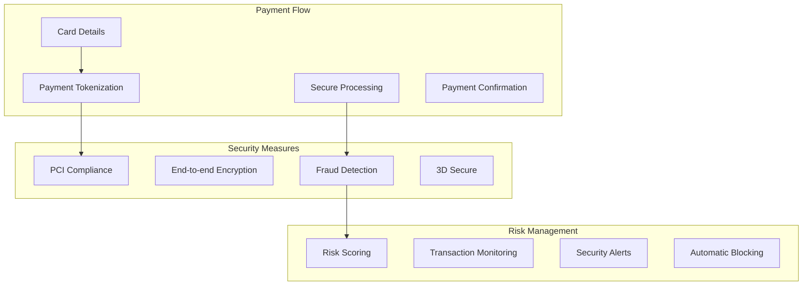

### Data Protection

[⬆️ Back to Top](#--table-of-contents)

---


**Privacy Framework**:
- GDPR compliance for EU users
- Data minimization principles
- User consent management
- Right to data deletion
- Cross-border data transfer protections

**Security Measures**:
- Input validation and sanitization
- SQL injection prevention
- XSS protection with CSP
- Rate limiting for API endpoints
- Authentication and authorization

## Accessibility Implementation

[⬆️ Back to Top](#--table-of-contents)

---


### Keyboard Navigation

[⬆️ Back to Top](#--table-of-contents)

---


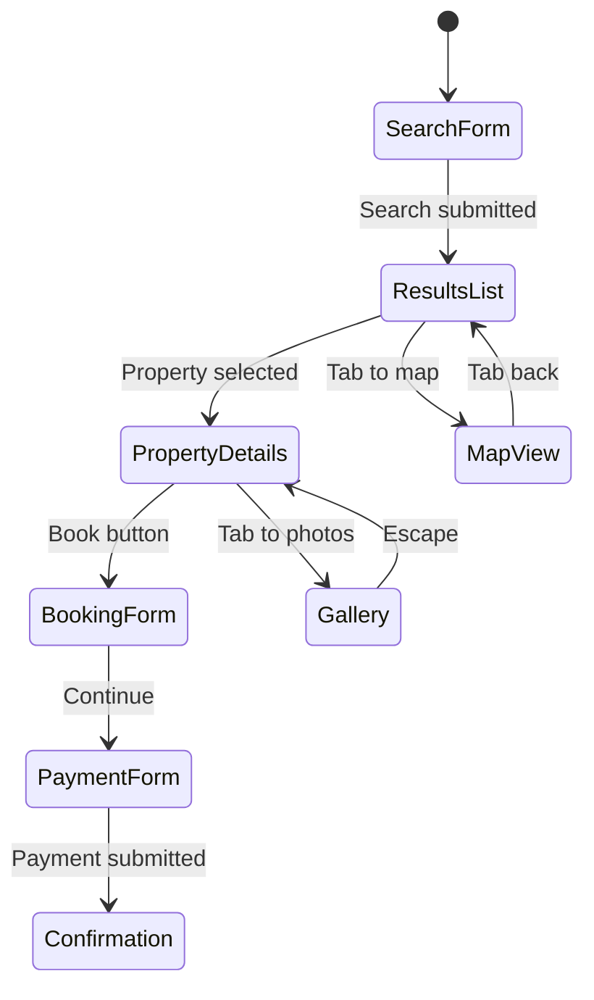

**Accessibility Features**:
- Comprehensive ARIA labels and landmarks
- Screen reader compatibility for all components
- High contrast mode support
- Keyboard navigation for all interactive elements
- Focus management during page transitions

### Inclusive Design

[⬆️ Back to Top](#--table-of-contents)

---


**Multi-language Support**:
- Right-to-left language support
- Currency and date localization
- Cultural adaptation of UI patterns
- Accessibility in all supported languages

## Testing Strategy

[⬆️ Back to Top](#--table-of-contents)

---


### Unit Testing Focus Areas

[⬆️ Back to Top](#--table-of-contents)

---


**Core Algorithm Testing**:
- Property search and ranking accuracy
- Pricing calculation correctness
- Availability conflict detection
- Review validation logic

**Component Testing**:
- Search interface interactions
- Booking flow completeness
- Map functionality
- Payment form validation

### Integration Testing

[⬆️ Back to Top](#--table-of-contents)

---


**End-to-End Booking Flow**:
- Complete user journey testing
- Cross-browser compatibility
- Mobile responsiveness
- Payment processing integration

**Performance Testing**:
- Search response times
- Large dataset handling
- Concurrent user scenarios
- Geographic distribution performance

### User Experience Testing

[⬆️ Back to Top](#--table-of-contents)

---


**Usability Testing**:
- User journey optimization
- Conversion funnel analysis
- A/B testing for UI improvements
- Accessibility compliance verification

## Trade-offs and Considerations

[⬆️ Back to Top](#--table-of-contents)

---


### Performance vs Features

[⬆️ Back to Top](#--table-of-contents)

---

- **Real-time availability**: Accuracy vs response time
- **Search filters**: Comprehensiveness vs performance
- **Image quality**: Visual appeal vs loading speed
- **Personalization**: Relevance vs privacy concerns

### Business vs User Experience

[⬆️ Back to Top](#--table-of-contents)

---

- **Dynamic pricing**: Revenue optimization vs user trust
- **Search ranking**: Business priorities vs user preference
- **Booking policies**: Flexibility vs protection
- **Reviews system**: Authenticity vs user satisfaction

### Scalability Considerations

[⬆️ Back to Top](#--table-of-contents)

---

- **Global deployment**: Regional compliance vs unified experience
- **Peak demand**: Surge capacity vs cost optimization
- **Data growth**: Storage efficiency vs query performance
- **Feature complexity**: Functionality vs maintainability

This travel booking platform provides a comprehensive foundation for modern accommodation booking with advanced features like intelligent search, dynamic pricing, and personalized recommendations while maintaining high performance, security, and accessibility standards. 