# Online Event/Calendar Management Tool


## 📋 Table of Contents

- [Online Event/Calendar Management Tool](#online-eventcalendar-management-tool)
  - [Table of Contents](#table-of-contents)
  - [Clarify the Problem and Requirements](#clarify-the-problem-and-requirements)
    - [Problem Understanding](#problem-understanding)
    - [Functional Requirements](#functional-requirements)
    - [Non-Functional Requirements](#non-functional-requirements)
    - [Key Assumptions](#key-assumptions)
  - [High-Level Design (HLD)](#high-level-design-hld)
    - [System Architecture Overview](#system-architecture-overview)
    - [Calendar Data Model](#calendar-data-model)
  - [Low-Level Design (LLD)](#low-level-design-lld)
    - [Event Scheduling Algorithm](#event-scheduling-algorithm)
    - [Recurrence Pattern Engine](#recurrence-pattern-engine)
    - [Calendar View State Machine](#calendar-view-state-machine)
  - [Core Algorithms](#core-algorithms)
    - [1. Intelligent Event Scheduling Algorithm](#1-intelligent-event-scheduling-algorithm)
    - [2. Recurrence Rule Processing (RFC 5545)](#2-recurrence-rule-processing-rfc-5545)
    - [3. Calendar View Rendering Algorithm](#3-calendar-view-rendering-algorithm)
    - [4. Timezone Management Algorithm](#4-timezone-management-algorithm)
    - [5. Smart Notification Algorithm](#5-smart-notification-algorithm)
  - [Component Architecture](#component-architecture)
    - [Calendar Application Component Hierarchy](#calendar-application-component-hierarchy)
    - [State Management Architecture](#state-management-architecture)
  - [Advanced Features](#advanced-features)
    - [Calendar Sharing and Collaboration](#calendar-sharing-and-collaboration)
    - [Intelligent Event Suggestions](#intelligent-event-suggestions)
  - [Performance Optimizations](#performance-optimizations)
    - [Efficient Date Calculations](#efficient-date-calculations)
    - [Virtual Calendar Rendering](#virtual-calendar-rendering)
    - [Data Caching Strategy](#data-caching-strategy)
  - [Security Considerations](#security-considerations)
    - [Calendar Privacy](#calendar-privacy)
    - [Event Data Security](#event-data-security)
  - [Accessibility Implementation](#accessibility-implementation)
    - [Keyboard Navigation](#keyboard-navigation)
    - [Screen Reader Support](#screen-reader-support)
  - [Testing Strategy](#testing-strategy)
    - [Unit Testing Focus Areas](#unit-testing-focus-areas)
    - [Integration Testing](#integration-testing)
    - [End-to-End Testing](#end-to-end-testing)
  - [Trade-offs and Considerations](#trade-offs-and-considerations)
    - [Performance vs Features](#performance-vs-features)
    - [Privacy vs Collaboration](#privacy-vs-collaboration)
    - [Scalability Considerations](#scalability-considerations)

---

## Table of Contents
1. [Clarify the Problem and Requirements](#clarify-the-problem-and-requirements)
2. [High-Level Design (HLD)](#high-level-design-hld)
3. [Low-Level Design (LLD)](#low-level-design-lld)
4. [Core Algorithms](#core-algorithms)
5. [Component Architecture](#component-architecture)
6. [Advanced Features](#advanced-features)
7. [TypeScript Interfaces & Component Props](#typescript-interfaces--component-props)
8. [API Reference](#api-reference)
9. [Performance Optimizations](#performance-optimizations)
10. [Security Considerations](#security-considerations)
11. [Accessibility Implementation](#accessibility-implementation)
12. [Testing Strategy](#testing-strategy)
13. [Trade-offs and Considerations](#trade-offs-and-considerations)

---

## Clarify the Problem and Requirements

[⬆️ Back to Top](#--table-of-contents)

---

### Problem Understanding

[⬆️ Back to Top](#--table-of-contents)

---

Design a comprehensive online calendar and event management system that enables users to create, organize, and share events while supporting complex scheduling scenarios, similar to Google Calendar, Outlook Calendar, or Calendly. The system must handle multiple calendars, recurring events, time zone management, and collaborative scheduling while providing an intuitive interface across devices.

### Functional Requirements

[⬆️ Back to Top](#--table-of-contents)

---

- **Event Management**: Create, edit, delete events with rich details and attachments
- **Recurring Events**: Complex recurrence patterns (daily, weekly, monthly, yearly, custom)
- **Multiple Calendars**: Personal, shared, public calendars with different permission levels
- **Time Zone Support**: Global time zone handling, automatic conversion, DST management
- **Scheduling Features**: Meeting invitations, RSVP, availability checking, conflict detection
- **Notification System**: Email reminders, push notifications, customizable alert timing
- **Calendar Sharing**: Public/private sharing, subscription links, embedded calendars
- **Integration**: Import/export (iCal, CSV), sync with external calendars (Google, Outlook)

### Non-Functional Requirements

[⬆️ Back to Top](#--table-of-contents)

---

- **Performance**: <2s calendar load time, <100ms view switching, smooth scrolling
- **Scalability**: Handle 10K+ events per user, millions of users, concurrent access
- **Availability**: 99.9% uptime with offline viewing capabilities
- **Cross-platform**: Web, mobile apps, desktop applications with sync
- **Real-time Updates**: Live collaboration, instant event updates across devices
- **Data Integrity**: No double-booking, consistent time calculations, reliable syncing
- **Accessibility**: WCAG 2.1 AA compliance, keyboard navigation, screen reader support
- **Security**: Encrypted data, secure sharing, privacy controls

### Key Assumptions

[⬆️ Back to Top](#--table-of-contents)

---

- Average events per user: 50-500 per month, maximum 10K total events
- Peak usage: Business hours with scheduling surge periods
- Calendar views: Month (primary), week, day, agenda views
- Event duration: 15 minutes to multi-day events
- Recurring events: 10-20% of all events, complex patterns supported
- Time zones: Global user base across all time zones
- Device usage: 60% desktop, 40% mobile for calendar management
- Integration needs: 70% of users sync with external calendar services

---

## High-Level Design (HLD)

[⬆️ Back to Top](#--table-of-contents)

---


### System Architecture Overview

[⬆️ Back to Top](#--table-of-contents)

---


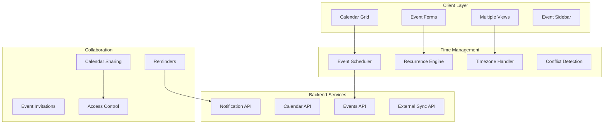

### Calendar Data Model

[⬆️ Back to Top](#--table-of-contents)

---


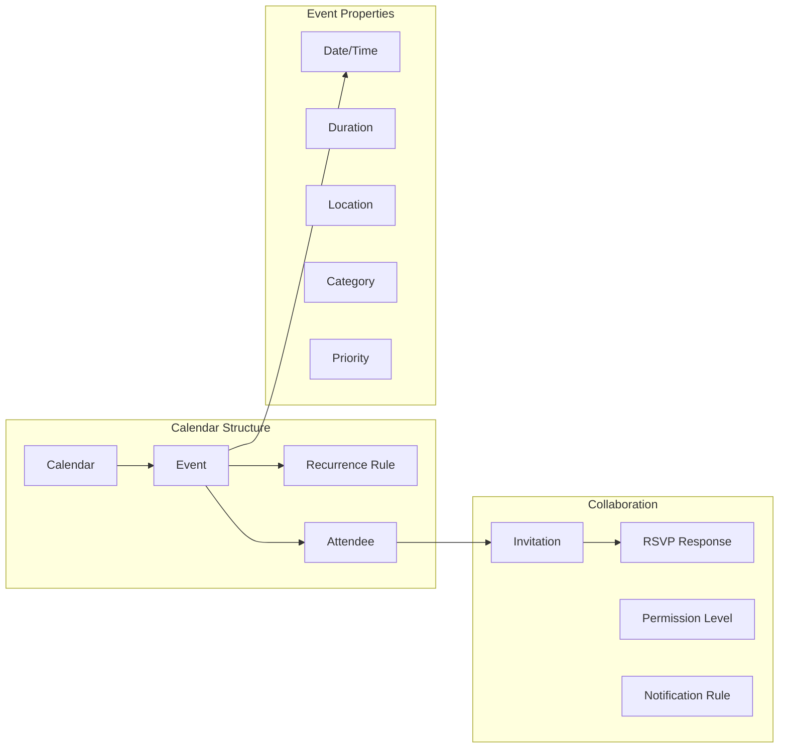

## Low-Level Design (LLD)

[⬆️ Back to Top](#--table-of-contents)

### Calendar Application Component Hierarchy

[⬆️ Back to Top](#--table-of-contents)

---


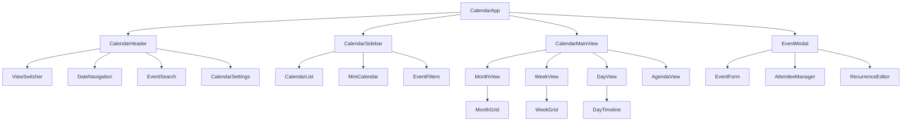

### State Management Architecture

[⬆️ Back to Top](#--table-of-contents)

---


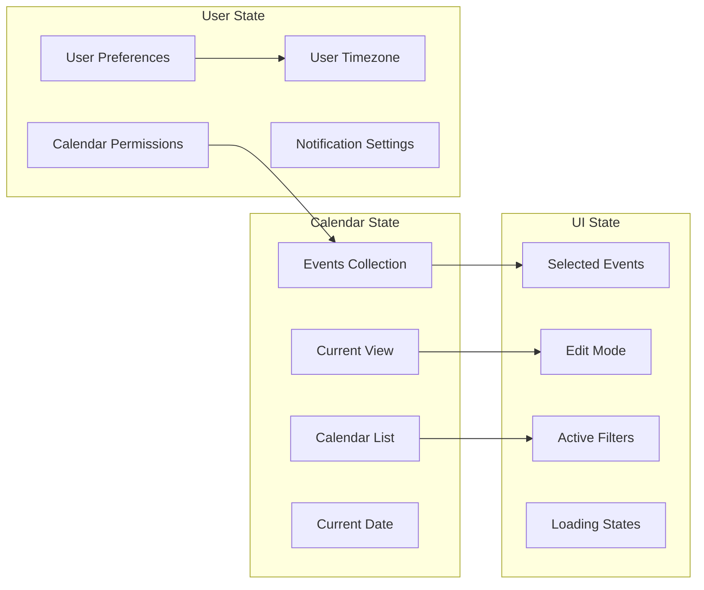


#### Core Data Interfaces

```typescript
interface CalendarEvent {
  id: string;
  title: string;
  description?: string;
  startDate: Date;
  endDate: Date;
  isAllDay: boolean;
  location?: EventLocation;
  attendees: Attendee[];
  organizer: EventOrganizer;
  recurrence?: RecurrenceRule;
  reminders: Reminder[];
  status: 'tentative' | 'confirmed' | 'cancelled';
  visibility: 'public' | 'private' | 'confidential';
  category?: string;
  color?: string;
}

interface RecurrenceRule {
  frequency: 'daily' | 'weekly' | 'monthly' | 'yearly';
  interval: number;
  daysOfWeek?: number[];
  dayOfMonth?: number;
  monthOfYear?: number;
  endDate?: Date;
  occurrences?: number;
  exceptions?: Date[];
}

interface Attendee {
  id: string;
  email: string;
  name: string;
  status: 'pending' | 'accepted' | 'declined' | 'tentative';
  role: 'required' | 'optional' | 'resource';
  responseDate?: Date;
  comment?: string;
}

interface CalendarView {
  type: 'month' | 'week' | 'day' | 'agenda' | 'year';
  currentDate: Date;
  timeZone: string;
  workingHours: WorkingHours;
  weekStart: number; // 0 = Sunday, 1 = Monday
  showWeekends: boolean;
  displayedCalendars: string[];
}

interface Calendar {
  id: string;
  name: string;
  description?: string;
  color: string;
  isVisible: boolean;
  isEditable: boolean;
  owner: string;
  permissions: CalendarPermissions;
  timeZone: string;
  type: 'personal' | 'shared' | 'public' | 'resource';
}

interface TimeSlot {
  start: Date;
  end: Date;
  isAvailable: boolean;
  isWorkingHours: boolean;
  conflictLevel: 'none' | 'soft' | 'hard';
  events?: CalendarEvent[];
}
```

#### Component Props Interfaces

```typescript
interface CalendarGridProps {
  view: CalendarView;
  events: CalendarEvent[];
  onEventClick: (event: CalendarEvent) => void;
  onTimeSlotClick: (date: Date) => void;
  onEventDrop: (eventId: string, newDate: Date) => void;
  onEventResize: (eventId: string, newDuration: number) => void;
  showTimeSlots?: boolean;
  enableDragDrop?: boolean;
  timeZone?: string;
}

interface EventFormProps {
  event?: CalendarEvent;
  onEventSave: (event: CalendarEvent) => void;
  onEventDelete?: (eventId: string) => void;
  onCancel: () => void;
  availableCalendars: Calendar[];
  suggestedTimes?: TimeSlot[];
  conflictDetection?: boolean;
  enableRecurrence?: boolean;
}

interface CalendarSidebarProps {
  calendars: Calendar[];
  onCalendarToggle: (calendarId: string) => void;
  onCalendarCreate: (calendar: Calendar) => void;
  onCalendarEdit: (calendar: Calendar) => void;
  onCalendarDelete: (calendarId: string) => void;
  showMiniCalendar?: boolean;
  showUpcomingEvents?: boolean;
}

interface EventListProps {
  events: CalendarEvent[];
  onEventClick: (event: CalendarEvent) => void;
  onEventUpdate: (event: CalendarEvent) => void;
  groupBy?: 'date' | 'calendar' | 'category';
  showTimeZone?: boolean;
  enableQuickEdit?: boolean;
  maxVisible?: number;
}

interface TimePickerProps {
  selectedTime: Date;
  onTimeChange: (time: Date) => void;
  timeZone?: string;
  workingHours?: WorkingHours;
  step?: number; // minutes
  format?: '12h' | '24h';
  showSeconds?: boolean;
  disabled?: boolean;
}
```


#### React Component Implementation

[⬆️ Back to Top](#--table-of-contents)

---

**CalendarApp.jsx**
```jsx
import React, { useState, useEffect, useCallback } from 'react';
import { CalendarProvider } from './CalendarContext';
import CalendarHeader from './CalendarHeader';
import CalendarSidebar from './CalendarSidebar';
import CalendarMainView from './CalendarMainView';
import EventModal from './EventModal';
import { useCalendarSync } from './hooks/useCalendarSync';

const CalendarApp = ({ userId }) => {
  const [currentView, setCurrentView] = useState('month'); // 'month', 'week', 'day', 'agenda'
  const [currentDate, setCurrentDate] = useState(new Date());
  const [events, setEvents] = useState([]);
  const [calendars, setCalendars] = useState([]);
  const [selectedEvent, setSelectedEvent] = useState(null);
  const [isEventModalOpen, setIsEventModalOpen] = useState(false);
  const [selectedEvents, setSelectedEvents] = useState([]);
  const [filters, setFilters] = useState({
    calendars: [],
    categories: [],
    searchQuery: ''
  });
  const [userPreferences, setUserPreferences] = useState({
    timezone: Intl.DateTimeFormat().resolvedOptions().timeZone,
    startOfWeek: 1, // Monday
    timeFormat: '24h',
    defaultDuration: 60
  });

  const { syncCalendars, isOnline } = useCalendarSync();

  useEffect(() => {
    loadCalendars();
    loadEvents();
  }, [currentDate, currentView]);

  const loadCalendars = async () => {
    try {
      const response = await fetch('/api/calendars');
      const data = await response.json();
      setCalendars(data.calendars);
    } catch (error) {
      console.error('Failed to load calendars:', error);
    }
  };

  const loadEvents = async () => {
    try {
      const startDate = getViewStartDate();
      const endDate = getViewEndDate();
      
      const response = await fetch(
        `/api/events?start=${startDate.toISOString()}&end=${endDate.toISOString()}`
      );
      const data = await response.json();
      setEvents(data.events);
    } catch (error) {
      console.error('Failed to load events:', error);
    }
  };

  const getViewStartDate = () => {
    const date = new Date(currentDate);
    switch (currentView) {
      case 'month':
        return new Date(date.getFullYear(), date.getMonth(), 1);
      case 'week':
        const startOfWeek = new Date(date);
        startOfWeek.setDate(date.getDate() - date.getDay() + userPreferences.startOfWeek);
        return startOfWeek;
      case 'day':
        return new Date(date.getFullYear(), date.getMonth(), date.getDate());
      default:
        return date;
    }
  };

  const getViewEndDate = () => {
    const date = new Date(currentDate);
    switch (currentView) {
      case 'month':
        return new Date(date.getFullYear(), date.getMonth() + 1, 0);
      case 'week':
        const endOfWeek = new Date(date);
        endOfWeek.setDate(date.getDate() - date.getDay() + userPreferences.startOfWeek + 6);
        return endOfWeek;
      case 'day':
        return new Date(date.getFullYear(), date.getMonth(), date.getDate(), 23, 59, 59);
      default:
        return date;
    }
  };

  const handleEventCreate = useCallback(async (eventData) => {
    try {
      const response = await fetch('/api/events', {
        method: 'POST',
        headers: { 'Content-Type': 'application/json' },
        body: JSON.stringify({
          ...eventData,
          timezone: userPreferences.timezone
        })
      });

      if (response.ok) {
        const newEvent = await response.json();
        setEvents(prev => [...prev, newEvent]);
        setIsEventModalOpen(false);
      }
    } catch (error) {
      console.error('Failed to create event:', error);
    }
  }, [userPreferences.timezone]);

  const handleEventUpdate = useCallback(async (eventId, updates) => {
    try {
      const response = await fetch(`/api/events/${eventId}`, {
        method: 'PUT',
        headers: { 'Content-Type': 'application/json' },
        body: JSON.stringify(updates)
      });

      if (response.ok) {
        const updatedEvent = await response.json();
        setEvents(prev => prev.map(event => 
          event.id === eventId ? updatedEvent : event
        ));
        setIsEventModalOpen(false);
      }
    } catch (error) {
      console.error('Failed to update event:', error);
    }
  }, []);

  const handleEventDelete = useCallback(async (eventId) => {
    try {
      const response = await fetch(`/api/events/${eventId}`, {
        method: 'DELETE'
      });

      if (response.ok) {
        setEvents(prev => prev.filter(event => event.id !== eventId));
        setIsEventModalOpen(false);
      }
    } catch (error) {
      console.error('Failed to delete event:', error);
    }
  }, []);

  const handleDateNavigation = useCallback((direction) => {
    const newDate = new Date(currentDate);
    
    switch (currentView) {
      case 'month':
        newDate.setMonth(newDate.getMonth() + direction);
        break;
      case 'week':
        newDate.setDate(newDate.getDate() + (direction * 7));
        break;
      case 'day':
        newDate.setDate(newDate.getDate() + direction);
        break;
    }
    
    setCurrentDate(newDate);
  }, [currentDate, currentView]);

  const handleEventSelect = useCallback((event) => {
    setSelectedEvent(event);
    setIsEventModalOpen(true);
  }, []);

  const handleTimeSlotClick = useCallback((dateTime) => {
    const newEvent = {
      title: '',
      start: dateTime,
      end: new Date(dateTime.getTime() + (userPreferences.defaultDuration * 60000)),
      calendarId: calendars[0]?.id,
      allDay: false
    };
    
    setSelectedEvent(newEvent);
    setIsEventModalOpen(true);
  }, [userPreferences.defaultDuration, calendars]);

  const getFilteredEvents = () => {
    return events.filter(event => {
      // Filter by calendar
      if (filters.calendars.length > 0 && 
          !filters.calendars.includes(event.calendarId)) {
        return false;
      }
      
      // Filter by search query
      if (filters.searchQuery && 
          !event.title.toLowerCase().includes(filters.searchQuery.toLowerCase())) {
        return false;
      }
      
      return true;
    });
  };

  const value = {
    currentView,
    currentDate,
    events: getFilteredEvents(),
    calendars,
    selectedEvent,
    selectedEvents,
    filters,
    userPreferences,
    isOnline,
    setCurrentView,
    setCurrentDate,
    setFilters,
    setUserPreferences,
    onEventCreate: handleEventCreate,
    onEventUpdate: handleEventUpdate,
    onEventDelete: handleEventDelete,
    onEventSelect: handleEventSelect,
    onTimeSlotClick: handleTimeSlotClick,
    onDateNavigation: handleDateNavigation
  };

  return (
    <CalendarProvider value={value}>
      <div className="calendar-app">
        <CalendarHeader />
        
        <div className="calendar-body">
          <CalendarSidebar />
          <CalendarMainView />
        </div>

        {isEventModalOpen && (
          <EventModal
            event={selectedEvent}
            onClose={() => setIsEventModalOpen(false)}
          />
        )}
      </div>
    </CalendarProvider>
  );
};

export default CalendarApp;
```

**CalendarMainView.jsx**
```jsx
import React, { useContext } from 'react';
import { CalendarContext } from './CalendarContext';
import MonthView from './MonthView';
import WeekView from './WeekView';
import DayView from './DayView';
import AgendaView from './AgendaView';

const CalendarMainView = () => {
  const { currentView } = useContext(CalendarContext);

  const renderView = () => {
    switch (currentView) {
      case 'month':
        return <MonthView />;
      case 'week':
        return <WeekView />;
      case 'day':
        return <DayView />;
      case 'agenda':
        return <AgendaView />;
      default:
        return <MonthView />;
    }
  };

  return (
    <div className="calendar-main-view">
      {renderView()}
    </div>
  );
};

export default CalendarMainView;
```

**MonthView.jsx**
```jsx
import React, { useContext, useMemo } from 'react';
import { CalendarContext } from './CalendarContext';
import MonthGrid from './MonthGrid';

const MonthView = () => {
  const { 
    currentDate, 
    events, 
    userPreferences, 
    onTimeSlotClick, 
    onEventSelect 
  } = useContext(CalendarContext);

  const monthData = useMemo(() => {
    const year = currentDate.getFullYear();
    const month = currentDate.getMonth();
    const firstDay = new Date(year, month, 1);
    const lastDay = new Date(year, month + 1, 0);
    
    // Calculate the grid start (might include previous month days)
    const gridStart = new Date(firstDay);
    gridStart.setDate(gridStart.getDate() - 
      (firstDay.getDay() - userPreferences.startOfWeek + 7) % 7);
    
    // Generate 6 weeks of days
    const days = [];
    const current = new Date(gridStart);
    
    for (let week = 0; week < 6; week++) {
      const weekDays = [];
      for (let day = 0; day < 7; day++) {
        const dayEvents = events.filter(event => {
          const eventDate = new Date(event.start);
          return eventDate.toDateString() === current.toDateString();
        });
        
        weekDays.push({
          date: new Date(current),
          isCurrentMonth: current.getMonth() === month,
          isToday: current.toDateString() === new Date().toDateString(),
          events: dayEvents
        });
        
        current.setDate(current.getDate() + 1);
      }
      days.push(weekDays);
    }
    
    return days;
  }, [currentDate, events, userPreferences.startOfWeek]);

  const weekdays = useMemo(() => {
    const days = ['Sun', 'Mon', 'Tue', 'Wed', 'Thu', 'Fri', 'Sat'];
    const startOfWeek = userPreferences.startOfWeek;
    return [...days.slice(startOfWeek), ...days.slice(0, startOfWeek)];
  }, [userPreferences.startOfWeek]);

  return (
    <div className="month-view">
      <div className="month-header">
        <div className="weekdays">
          {weekdays.map((day, index) => (
            <div key={index} className="weekday">
              {day}
            </div>
          ))}
        </div>
      </div>
      
      <MonthGrid
        monthData={monthData}
        onTimeSlotClick={onTimeSlotClick}
        onEventSelect={onEventSelect}
      />
    </div>
  );
};

export default MonthView;
```


### API Reference

---


### Event Scheduling Algorithm

[⬆️ Back to Top](#--table-of-contents)

---


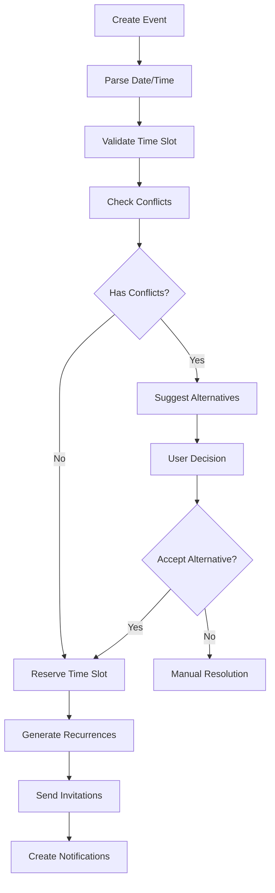

### Recurrence Pattern Engine

[⬆️ Back to Top](#--table-of-contents)

---


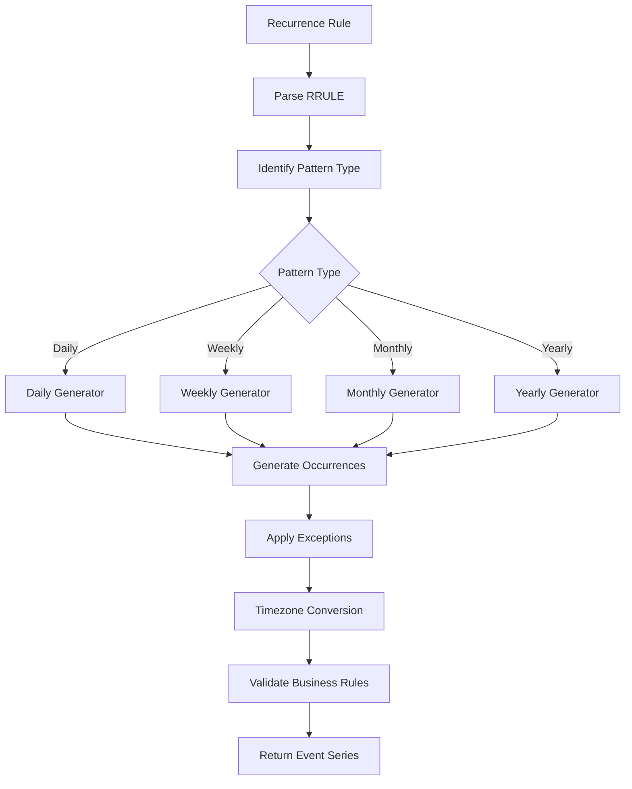

### Calendar View State Machine

[⬆️ Back to Top](#--table-of-contents)

---


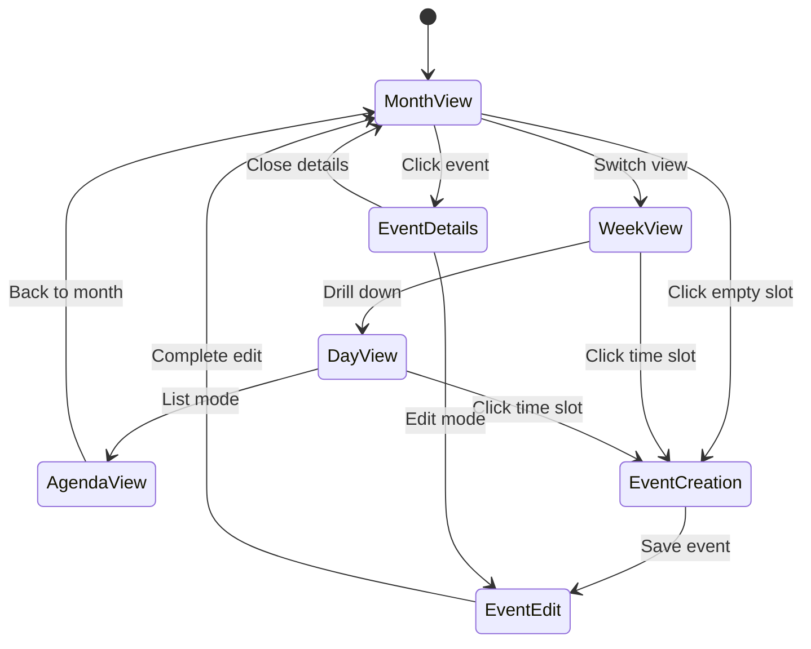

## Core Algorithms

[⬆️ Back to Top](#--table-of-contents)

---


### 1. Intelligent Event Scheduling Algorithm

[⬆️ Back to Top](#--table-of-contents)

---


**Purpose**: Automatically schedule events while avoiding conflicts and optimizing time usage.

**Scheduling Parameters**:
```
SchedulingRequest = {
  title: string,
  duration: number,
  attendees: string[],
  preferences: {
    timeRange: { start: time, end: time },
    daysOfWeek: number[],
    location: string,
    priority: 'low' | 'medium' | 'high'
  },
  constraints: {
    mustAvoid: TimeSlot[],
    mustInclude: TimeSlot[],
    bufferTime: number
  }
}
```

**Conflict Detection Algorithm**:
```
function findOptimalTimeSlot(request, existingEvents):
  candidates = []
  
  // Generate potential time slots
  timeSlots = generateTimeSlots(
    request.preferences.timeRange,
    request.duration,
    request.preferences.daysOfWeek
  )
  
  for slot in timeSlots:
    conflicts = []
    score = 0
    
    // Check for hard conflicts
    for attendee in request.attendees:
      attendeeEvents = getAttendeeEvents(attendee, slot)
      if hasOverlap(attendeeEvents, slot):
        conflicts.push({ attendee, type: 'hard' })
    
    // Calculate preference score
    score += calculateTimePreferenceScore(slot, request.preferences)
    score += calculateLocationScore(slot.location, request.preferences.location)
    score += calculateAttendeePreferenceScore(slot, request.attendees)
    
    // Apply priority weighting
    score *= getPriorityMultiplier(request.priority)
    
    if conflicts.length === 0:
      candidates.push({ slot, score, conflicts })
  
  // Sort by score and return best options
  return candidates.sort((a, b) => b.score - a.score).slice(0, 5)
```

**Smart Rescheduling**:
- Analyze attendee availability patterns
- Consider travel time between locations
- Respect individual working hours
- Minimize disruption to existing schedules

### 2. Recurrence Rule Processing (RFC 5545)

[⬆️ Back to Top](#--table-of-contents)

---


**Purpose**: Generate recurring event instances based on RRULE specifications.

**RRULE Components**:
```
RecurrenceRule = {
  frequency: 'DAILY' | 'WEEKLY' | 'MONTHLY' | 'YEARLY',
  interval: number,
  count?: number,
  until?: Date,
  byDay?: WeekDay[],
  byMonth?: number[],
  byMonthDay?: number[],
  byYearDay?: number[],
  byWeekNo?: number[]
}
```

**Recurrence Generation Algorithm**:
```
function generateRecurrences(startDate, rrule, maxOccurrences):
  occurrences = []
  currentDate = startDate
  count = 0
  
  while count < maxOccurrences and (not rrule.until or currentDate <= rrule.until):
    if count > 0:  // Skip first occurrence (original event)
      nextDate = calculateNextOccurrence(currentDate, rrule)
      
      // Apply BYXXX rules
      if passesFilters(nextDate, rrule):
        occurrences.push({
          date: nextDate,
          originalDate: startDate,
          instanceId: generateInstanceId(startDate, nextDate)
        })
      
      currentDate = nextDate
    else:
      currentDate = advanceByInterval(currentDate, rrule)
    
    count++
    
    // Prevent infinite loops
    if count > 10000:
      break
  
  return occurrences
```

**Exception Handling**:
- EXDATE (excluded dates) processing
- RDATE (additional dates) inclusion
- Modified instances tracking
- Timezone-aware calculations

### 3. Calendar View Rendering Algorithm

[⬆️ Back to Top](#--table-of-contents)

---


**Purpose**: Efficiently render calendar views with optimal performance for large datasets.

**Month View Rendering**:
```
function renderMonthView(year, month, events):
  monthGrid = generateMonthGrid(year, month)
  eventPositions = new Map()
  
  // Sort events by start time
  sortedEvents = events.sort((a, b) => a.start - b.start)
  
  for week in monthGrid.weeks:
    weekEvents = getEventsForWeek(sortedEvents, week)
    
    // Layout algorithm for overlapping events
    eventLanes = assignEventLanes(weekEvents)
    
    for event in weekEvents:
      position = calculateEventPosition(event, eventLanes, week)
      eventPositions.set(event.id, position)
  
  return {
    grid: monthGrid,
    eventPositions: eventPositions,
    metadata: calculateViewMetadata(monthGrid, events)
  }
```

**Event Lane Assignment**:
```
function assignEventLanes(events):
  lanes = []
  
  for event in events:
    assignedLane = null
    
    // Find first available lane
    for i, lane in lanes:
      if not hasTimeOverlap(lane.lastEvent, event):
        assignedLane = i
        break
    
    // Create new lane if needed
    if assignedLane === null:
      assignedLane = lanes.length
      lanes.push({ events: [], lastEvent: null })
    
    lanes[assignedLane].events.push(event)
    lanes[assignedLane].lastEvent = event
    event.laneIndex = assignedLane
  
  return lanes
```

**Virtual Scrolling for Large Calendars**:
- Render only visible date range
- Implement predictive loading
- Use efficient date calculations
- Optimize DOM manipulation

### 4. Timezone Management Algorithm

[⬆️ Back to Top](#--table-of-contents)

---


**Purpose**: Handle timezone conversions and daylight saving time transitions.

**Timezone Conversion**:
```
function convertToTimezone(dateTime, fromTz, toTz):
  // Handle special cases
  if fromTz === toTz:
    return dateTime
  
  // Get timezone offset information
  fromOffset = getTimezoneOffset(dateTime, fromTz)
  toOffset = getTimezoneOffset(dateTime, toTz)
  
  // Convert to UTC first
  utcTime = dateTime - fromOffset
  
  // Convert to target timezone
  targetTime = utcTime + toOffset
  
  // Handle DST transitions
  if isDSTTransition(targetTime, toTz):
    targetTime = adjustForDSTTransition(targetTime, toTz)
  
  return targetTime
```

**DST Transition Handling**:
```
function handleDSTTransition(eventTime, timezone):
  transitions = getDSTTransitions(eventTime.year, timezone)
  
  for transition in transitions:
    if isInTransitionWindow(eventTime, transition):
      if transition.type === 'spring_forward':
        // Handle "spring forward" - time jumps ahead
        if isInGapHour(eventTime, transition):
          return adjustTimeForward(eventTime, transition.offset)
      else:
        // Handle "fall back" - time repeats
        if isInAmbiguousHour(eventTime, transition):
          return disambiguateTime(eventTime, transition)
  
  return eventTime
```

### 5. Smart Notification Algorithm

[⬆️ Back to Top](#--table-of-contents)

---


**Purpose**: Send intelligent reminders based on user behavior and event importance.

**Notification Strategy**:
```
NotificationRule = {
  eventId: string,
  triggers: NotificationTrigger[],
  channels: ('email' | 'sms' | 'push' | 'in-app')[],
  conditions: NotificationCondition[]
}

NotificationTrigger = {
  type: 'time_before' | 'location_based' | 'condition_met',
  value: number | Location | Condition,
  unit?: 'minutes' | 'hours' | 'days'
}
```

**Smart Timing Algorithm**:
```
function calculateOptimalNotificationTime(event, user):
  baseTime = event.start
  
  // Consider user's notification preferences
  userPreferences = getUserNotificationPreferences(user.id)
  
  // Analyze historical response patterns
  responsePattern = analyzeNotificationResponse(user.id, event.category)
  
  // Calculate travel time if location is specified
  travelTime = 0
  if event.location and user.defaultLocation:
    travelTime = calculateTravelTime(user.defaultLocation, event.location)
  
  // Determine optimal notification times
  notifications = []
  
  // Primary notification
  primaryTime = baseTime - userPreferences.primaryOffset - travelTime
  notifications.push({
    time: primaryTime,
    channel: userPreferences.primaryChannel,
    urgency: 'normal'
  })
  
  // Secondary notification if event is high priority
  if event.priority === 'high' or responsePattern.needsReminder:
    secondaryTime = baseTime - userPreferences.secondaryOffset
    notifications.push({
      time: secondaryTime,
      channel: userPreferences.secondaryChannel,
      urgency: 'high'
    })
  
  return notifications
```

## Component Architecture

[⬆️ Back to Top](#--table-of-contents)

---


## Advanced Features

[⬆️ Back to Top](#--table-of-contents)

---


### Calendar Sharing and Collaboration

[⬆️ Back to Top](#--table-of-contents)

---


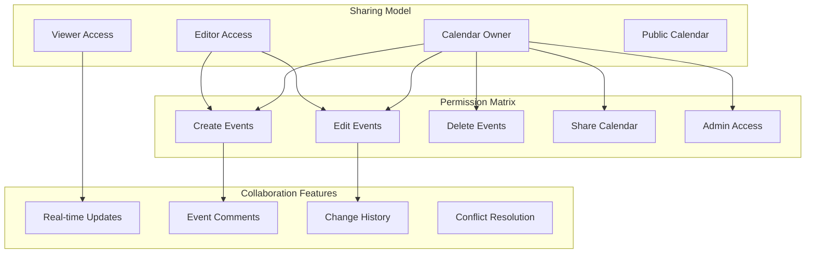

### Intelligent Event Suggestions

[⬆️ Back to Top](#--table-of-contents)

---


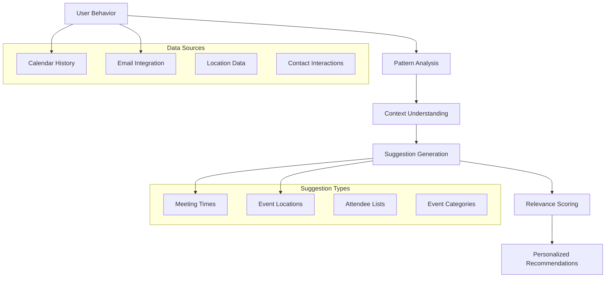

### TypeScript Interfaces & Component Props

[⬆️ Back to Top](#--table-of-contents)

---


[⬆️ Back to Top](#--table-of-contents)

---

#### Event Management
- `POST /api/events` - Create new calendar event with attendees and recurrence
- `GET /api/events` - Get events with filtering by date range and calendar
- `PUT /api/events/:id` - Update event details, time, or attendees
- `DELETE /api/events/:id` - Delete event and notify attendees
- `POST /api/events/:id/duplicate` - Duplicate event with modified details

#### Calendar Operations
- `GET /api/calendars` - Get user's calendars and shared calendar access
- `POST /api/calendars` - Create new calendar with permissions and settings
- `PUT /api/calendars/:id` - Update calendar name, color, or visibility
- `DELETE /api/calendars/:id` - Delete calendar and all associated events
- `POST /api/calendars/:id/share` - Share calendar with other users

#### Recurrence & Series
- `POST /api/events/:id/recurrence` - Add recurrence rule to existing event
- `PUT /api/events/:id/series` - Update entire event series or single occurrence
- `DELETE /api/events/:id/series` - Delete event series with options for future
- `POST /api/events/:id/exception` - Create exception for recurring event
- `GET /api/events/:id/occurrences` - Get all occurrences of recurring event

#### Attendee Management
- `POST /api/events/:id/attendees` - Add attendees to event with invitations
- `PUT /api/events/:id/attendees/:userId` - Update attendee status or role
- `DELETE /api/events/:id/attendees/:userId` - Remove attendee from event
- `POST /api/events/:id/respond` - Respond to event invitation (accept/decline)
- `GET /api/events/:id/attendees` - Get attendee list with response status

#### Availability & Scheduling
- `GET /api/availability/check` - Check availability for multiple users
- `POST /api/availability/find-time` - Find optimal meeting times for attendees
- `GET /api/availability/free-busy` - Get free/busy information for date range
- `POST /api/scheduling/suggest` - Get AI-powered scheduling suggestions
- `GET /api/scheduling/conflicts` - Detect scheduling conflicts for user

#### Time Zone & Localization
- `GET /api/timezones` - Get available time zones with current offsets
- `POST /api/events/:id/timezone` - Convert event to different time zone
- `GET /api/user/timezone` - Get user's preferred time zone setting
- `PUT /api/user/timezone` - Update user's time zone preference
- `GET /api/holidays/:region` - Get holidays for specific region and year

#### Reminders & Notifications
- `POST /api/events/:id/reminders` - Add reminders to event (email, push, SMS)
- `PUT /api/reminders/:id` - Update reminder timing or delivery method
- `DELETE /api/reminders/:id` - Remove reminder from event
- `GET /api/notifications/pending` - Get pending notification queue for user
- `POST /api/notifications/send` - Send immediate notification to attendees

#### Integration & Sync
- `POST /api/integration/google` - Sync with Google Calendar (import/export)
- `POST /api/integration/outlook` - Sync with Microsoft Outlook calendar
- `GET /api/integration/status` - Get calendar integration sync status
- `POST /api/integration/webhook` - Configure webhook for calendar events
- `GET /api/export/:calendarId` - Export calendar in iCal/CSV format

---

## Performance Optimizations

[⬆️ Back to Top](#--table-of-contents)

---


### Efficient Date Calculations

[⬆️ Back to Top](#--table-of-contents)

---


**Date Range Optimization**:
```
DateRange = {
  start: Date,
  end: Date,
  timezone: string,
  recurring: boolean
}
```

**Optimization Strategies**:
- Cache calculated date ranges
- Use efficient date libraries (date-fns, moment.js alternatives)
- Implement date arithmetic in UTC
- Minimize timezone conversions
- Pre-compute recurring event instances

### Virtual Calendar Rendering

[⬆️ Back to Top](#--table-of-contents)

---


**Viewport-based Rendering**:
- Render only visible time periods
- Implement infinite scrolling for agenda view
- Use CSS transforms for smooth animations
- Batch DOM updates for performance
- Implement efficient event positioning

### Data Caching Strategy

[⬆️ Back to Top](#--table-of-contents)

---


**Multi-level Caching**:
```
CalendarCache = {
  events: LRU<DateRange, Event[]>,
  recurrences: Map<string, RecurringEvent[]>,
  userPreferences: Map<string, UserPreferences>,
  timezoneData: Map<string, TimezoneInfo>
}
```

## Security Considerations

[⬆️ Back to Top](#--table-of-contents)

---


### Calendar Privacy

[⬆️ Back to Top](#--table-of-contents)

---


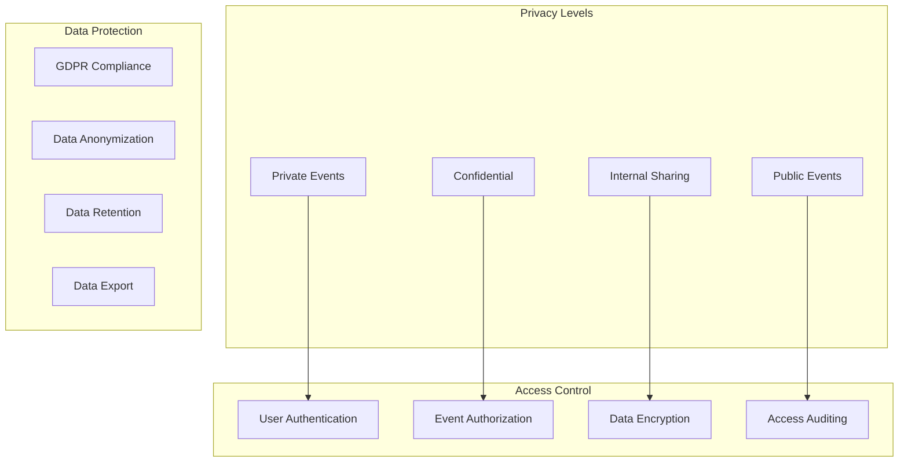

### Event Data Security

[⬆️ Back to Top](#--table-of-contents)

---


**Data Protection Measures**:
- End-to-end encryption for sensitive events
- Role-based access control
- Input validation and sanitization
- SQL injection prevention
- XSS protection for event content

## Accessibility Implementation

[⬆️ Back to Top](#--table-of-contents)

---


### Keyboard Navigation

[⬆️ Back to Top](#--table-of-contents)

---


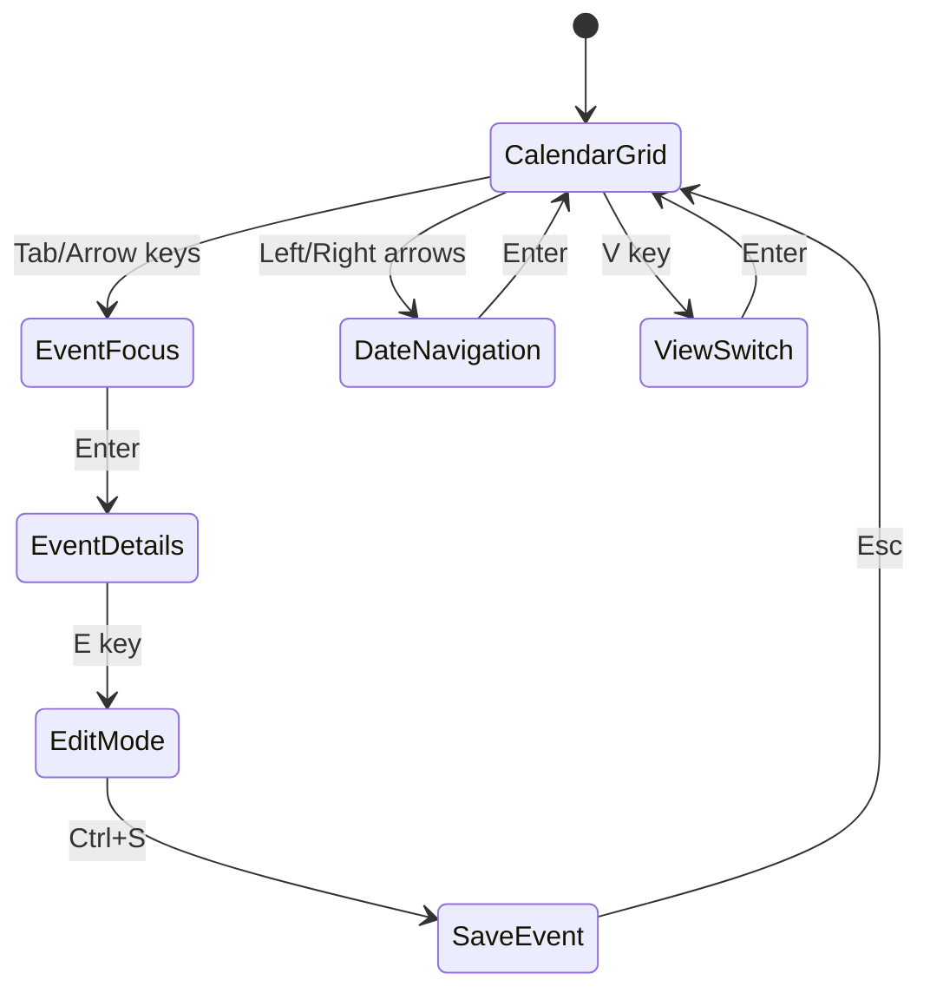

**Accessibility Features**:
- Full keyboard navigation support
- Screen reader compatibility
- ARIA labels for all calendar elements
- High contrast mode support
- Focus management during view changes

### Screen Reader Support

[⬆️ Back to Top](#--table-of-contents)

---


**Calendar Announcements**:
```
"Calendar grid, Month view, January 2024. 
Week of January 1st to 7th. 
Monday January 1st, 2 events: 
Meeting at 9 AM, Lunch at 12 PM. 
Press Enter to select date, 
Arrow keys to navigate."
```

## Testing Strategy

[⬆️ Back to Top](#--table-of-contents)

---


### Unit Testing Focus Areas

[⬆️ Back to Top](#--table-of-contents)

---


**Core Algorithm Testing**:
- Recurrence rule parsing accuracy
- Timezone conversion correctness
- Conflict detection logic
- Event scheduling algorithms

**Component Testing**:
- Calendar view rendering
- Event creation workflow
- Date navigation functionality
- Sharing and permissions

### Integration Testing

[⬆️ Back to Top](#--table-of-contents)

---


**Calendar Workflow Testing**:
- Complete event management cycle
- Cross-timezone functionality
- External calendar synchronization
- Multi-user collaboration scenarios

**Performance Testing**:
- Large calendar dataset handling
- Concurrent user access
- Real-time update performance
- Mobile device compatibility

### End-to-End Testing

[⬆️ Back to Top](#--table-of-contents)

---


**User Experience Testing**:
- Complete user workflows
- Accessibility compliance
- Cross-browser compatibility
- Mobile responsiveness

## Trade-offs and Considerations

[⬆️ Back to Top](#--table-of-contents)

---


### Performance vs Features

[⬆️ Back to Top](#--table-of-contents)

---

- **Real-time updates**: Synchronization overhead vs user experience
- **Recurrence complexity**: Feature richness vs computational cost
- **Timezone accuracy**: Precision vs performance impact
- **Offline support**: Data consistency vs offline capability

### Privacy vs Collaboration

[⬆️ Back to Top](#--table-of-contents)

---

- **Event visibility**: Privacy vs team coordination
- **Data sharing**: Collaboration vs data protection
- **External integration**: Convenience vs security risks
- **Analytics**: Insights vs user privacy

### Scalability Considerations

[⬆️ Back to Top](#--table-of-contents)

---

- **User growth**: Multi-tenancy vs performance isolation
- **Data volume**: Storage efficiency vs query performance
- **Global deployment**: Regional compliance vs unified experience
- **Feature complexity**: Functionality vs system maintainability

This calendar management system provides a comprehensive foundation for modern event scheduling with advanced features like intelligent scheduling, timezone management, and collaborative tools while maintaining high performance, security, and accessibility standards. 