# Online Event/Calendar Management Tool


## 📋 Table of Contents

- [Online Event/Calendar Management Tool](#online-eventcalendar-management-tool)
  - [High-Level Design (HLD)](#high-level-design-hld)
    - [System Architecture Overview](#system-architecture-overview)
    - [Calendar Data Model](#calendar-data-model)
  - [Low-Level Design (LLD)](#low-level-design-lld)
    - [Event Scheduling Algorithm](#event-scheduling-algorithm)
    - [Recurrence Pattern Engine](#recurrence-pattern-engine)
    - [Calendar View State Machine](#calendar-view-state-machine)
  - [Core Algorithms](#core-algorithms)
    - [1. Intelligent Event Scheduling Algorithm](#1-intelligent-event-scheduling-algorithm)
    - [2. Recurrence Rule Processing (RFC 5545)](#2-recurrence-rule-processing-rfc-5545)
    - [3. Calendar View Rendering Algorithm](#3-calendar-view-rendering-algorithm)
    - [4. Timezone Management Algorithm](#4-timezone-management-algorithm)
    - [5. Smart Notification Algorithm](#5-smart-notification-algorithm)
  - [Component Architecture](#component-architecture)
    - [Calendar Application Component Hierarchy](#calendar-application-component-hierarchy)
    - [State Management Architecture](#state-management-architecture)
  - [Advanced Features](#advanced-features)
    - [Calendar Sharing and Collaboration](#calendar-sharing-and-collaboration)
    - [Intelligent Event Suggestions](#intelligent-event-suggestions)
  - [Performance Optimizations](#performance-optimizations)
    - [Efficient Date Calculations](#efficient-date-calculations)
    - [Virtual Calendar Rendering](#virtual-calendar-rendering)
    - [Data Caching Strategy](#data-caching-strategy)
  - [Security Considerations](#security-considerations)
    - [Calendar Privacy](#calendar-privacy)
    - [Event Data Security](#event-data-security)
  - [Accessibility Implementation](#accessibility-implementation)
    - [Keyboard Navigation](#keyboard-navigation)
    - [Screen Reader Support](#screen-reader-support)
  - [Testing Strategy](#testing-strategy)
    - [Unit Testing Focus Areas](#unit-testing-focus-areas)
    - [Integration Testing](#integration-testing)
    - [End-to-End Testing](#end-to-end-testing)
  - [Trade-offs and Considerations](#trade-offs-and-considerations)
    - [Performance vs Features](#performance-vs-features)
    - [Privacy vs Collaboration](#privacy-vs-collaboration)
    - [Scalability Considerations](#scalability-considerations)

---

## High-Level Design (HLD)

[⬆️ Back to Top](#-table-of-contents)

---


### System Architecture Overview

[⬆️ Back to Top](#-table-of-contents)

---


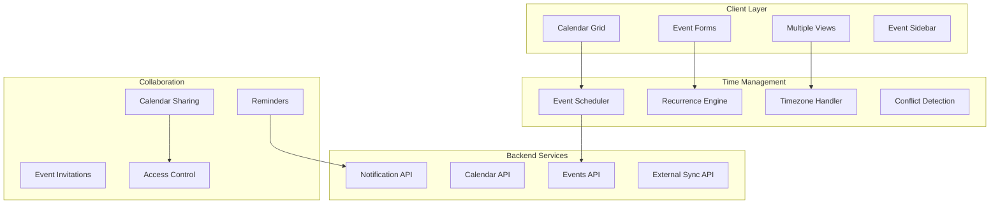

### Calendar Data Model

[⬆️ Back to Top](#-table-of-contents)

---


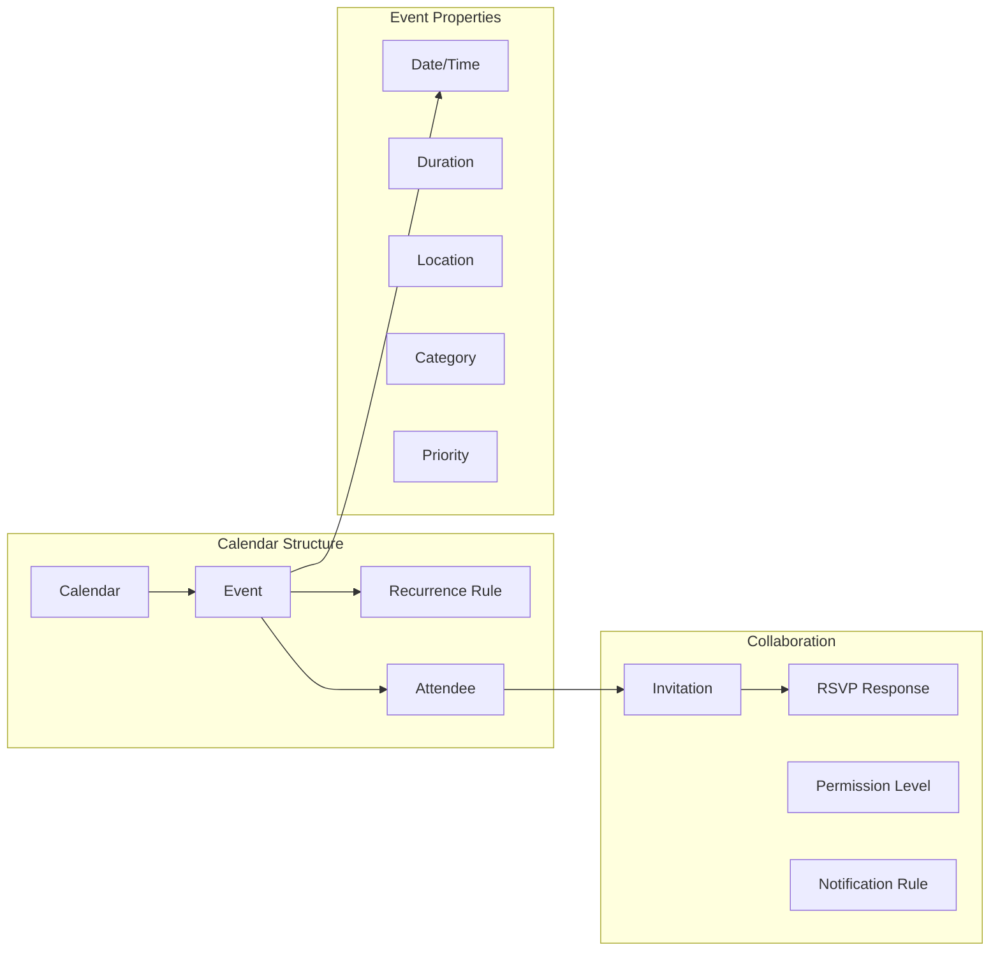

## Low-Level Design (LLD)

[⬆️ Back to Top](#-table-of-contents)

---


### Event Scheduling Algorithm

[⬆️ Back to Top](#-table-of-contents)

---


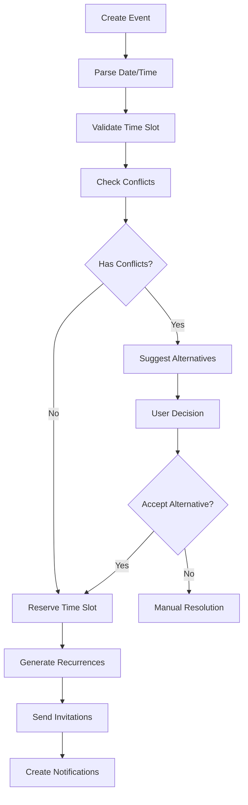

### Recurrence Pattern Engine

[⬆️ Back to Top](#-table-of-contents)

---


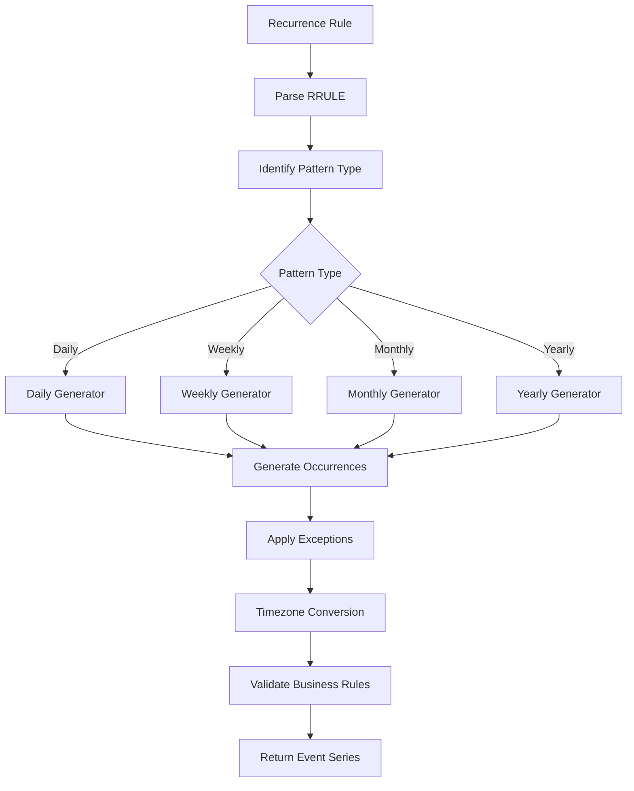

### Calendar View State Machine

[⬆️ Back to Top](#-table-of-contents)

---


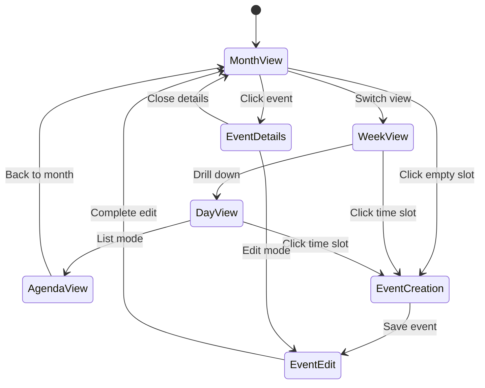

## Core Algorithms

[⬆️ Back to Top](#-table-of-contents)

---


### 1. Intelligent Event Scheduling Algorithm

[⬆️ Back to Top](#-table-of-contents)

---


**Purpose**: Automatically schedule events while avoiding conflicts and optimizing time usage.

**Scheduling Parameters**:
```
SchedulingRequest = {
  title: string,
  duration: number,
  attendees: string[],
  preferences: {
    timeRange: { start: time, end: time },
    daysOfWeek: number[],
    location: string,
    priority: 'low' | 'medium' | 'high'
  },
  constraints: {
    mustAvoid: TimeSlot[],
    mustInclude: TimeSlot[],
    bufferTime: number
  }
}
```

**Conflict Detection Algorithm**:
```
function findOptimalTimeSlot(request, existingEvents):
  candidates = []
  
  // Generate potential time slots
  timeSlots = generateTimeSlots(
    request.preferences.timeRange,
    request.duration,
    request.preferences.daysOfWeek
  )
  
  for slot in timeSlots:
    conflicts = []
    score = 0
    
    // Check for hard conflicts
    for attendee in request.attendees:
      attendeeEvents = getAttendeeEvents(attendee, slot)
      if hasOverlap(attendeeEvents, slot):
        conflicts.push({ attendee, type: 'hard' })
    
    // Calculate preference score
    score += calculateTimePreferenceScore(slot, request.preferences)
    score += calculateLocationScore(slot.location, request.preferences.location)
    score += calculateAttendeePreferenceScore(slot, request.attendees)
    
    // Apply priority weighting
    score *= getPriorityMultiplier(request.priority)
    
    if conflicts.length === 0:
      candidates.push({ slot, score, conflicts })
  
  // Sort by score and return best options
  return candidates.sort((a, b) => b.score - a.score).slice(0, 5)
```

**Smart Rescheduling**:
- Analyze attendee availability patterns
- Consider travel time between locations
- Respect individual working hours
- Minimize disruption to existing schedules

### 2. Recurrence Rule Processing (RFC 5545)

[⬆️ Back to Top](#-table-of-contents)

---


**Purpose**: Generate recurring event instances based on RRULE specifications.

**RRULE Components**:
```
RecurrenceRule = {
  frequency: 'DAILY' | 'WEEKLY' | 'MONTHLY' | 'YEARLY',
  interval: number,
  count?: number,
  until?: Date,
  byDay?: WeekDay[],
  byMonth?: number[],
  byMonthDay?: number[],
  byYearDay?: number[],
  byWeekNo?: number[]
}
```

**Recurrence Generation Algorithm**:
```
function generateRecurrences(startDate, rrule, maxOccurrences):
  occurrences = []
  currentDate = startDate
  count = 0
  
  while count < maxOccurrences and (not rrule.until or currentDate <= rrule.until):
    if count > 0:  // Skip first occurrence (original event)
      nextDate = calculateNextOccurrence(currentDate, rrule)
      
      // Apply BYXXX rules
      if passesFilters(nextDate, rrule):
        occurrences.push({
          date: nextDate,
          originalDate: startDate,
          instanceId: generateInstanceId(startDate, nextDate)
        })
      
      currentDate = nextDate
    else:
      currentDate = advanceByInterval(currentDate, rrule)
    
    count++
    
    // Prevent infinite loops
    if count > 10000:
      break
  
  return occurrences
```

**Exception Handling**:
- EXDATE (excluded dates) processing
- RDATE (additional dates) inclusion
- Modified instances tracking
- Timezone-aware calculations

### 3. Calendar View Rendering Algorithm

[⬆️ Back to Top](#-table-of-contents)

---


**Purpose**: Efficiently render calendar views with optimal performance for large datasets.

**Month View Rendering**:
```
function renderMonthView(year, month, events):
  monthGrid = generateMonthGrid(year, month)
  eventPositions = new Map()
  
  // Sort events by start time
  sortedEvents = events.sort((a, b) => a.start - b.start)
  
  for week in monthGrid.weeks:
    weekEvents = getEventsForWeek(sortedEvents, week)
    
    // Layout algorithm for overlapping events
    eventLanes = assignEventLanes(weekEvents)
    
    for event in weekEvents:
      position = calculateEventPosition(event, eventLanes, week)
      eventPositions.set(event.id, position)
  
  return {
    grid: monthGrid,
    eventPositions: eventPositions,
    metadata: calculateViewMetadata(monthGrid, events)
  }
```

**Event Lane Assignment**:
```
function assignEventLanes(events):
  lanes = []
  
  for event in events:
    assignedLane = null
    
    // Find first available lane
    for i, lane in lanes:
      if not hasTimeOverlap(lane.lastEvent, event):
        assignedLane = i
        break
    
    // Create new lane if needed
    if assignedLane === null:
      assignedLane = lanes.length
      lanes.push({ events: [], lastEvent: null })
    
    lanes[assignedLane].events.push(event)
    lanes[assignedLane].lastEvent = event
    event.laneIndex = assignedLane
  
  return lanes
```

**Virtual Scrolling for Large Calendars**:
- Render only visible date range
- Implement predictive loading
- Use efficient date calculations
- Optimize DOM manipulation

### 4. Timezone Management Algorithm

[⬆️ Back to Top](#-table-of-contents)

---


**Purpose**: Handle timezone conversions and daylight saving time transitions.

**Timezone Conversion**:
```
function convertToTimezone(dateTime, fromTz, toTz):
  // Handle special cases
  if fromTz === toTz:
    return dateTime
  
  // Get timezone offset information
  fromOffset = getTimezoneOffset(dateTime, fromTz)
  toOffset = getTimezoneOffset(dateTime, toTz)
  
  // Convert to UTC first
  utcTime = dateTime - fromOffset
  
  // Convert to target timezone
  targetTime = utcTime + toOffset
  
  // Handle DST transitions
  if isDSTTransition(targetTime, toTz):
    targetTime = adjustForDSTTransition(targetTime, toTz)
  
  return targetTime
```

**DST Transition Handling**:
```
function handleDSTTransition(eventTime, timezone):
  transitions = getDSTTransitions(eventTime.year, timezone)
  
  for transition in transitions:
    if isInTransitionWindow(eventTime, transition):
      if transition.type === 'spring_forward':
        // Handle "spring forward" - time jumps ahead
        if isInGapHour(eventTime, transition):
          return adjustTimeForward(eventTime, transition.offset)
      else:
        // Handle "fall back" - time repeats
        if isInAmbiguousHour(eventTime, transition):
          return disambiguateTime(eventTime, transition)
  
  return eventTime
```

### 5. Smart Notification Algorithm

[⬆️ Back to Top](#-table-of-contents)

---


**Purpose**: Send intelligent reminders based on user behavior and event importance.

**Notification Strategy**:
```
NotificationRule = {
  eventId: string,
  triggers: NotificationTrigger[],
  channels: ('email' | 'sms' | 'push' | 'in-app')[],
  conditions: NotificationCondition[]
}

NotificationTrigger = {
  type: 'time_before' | 'location_based' | 'condition_met',
  value: number | Location | Condition,
  unit?: 'minutes' | 'hours' | 'days'
}
```

**Smart Timing Algorithm**:
```
function calculateOptimalNotificationTime(event, user):
  baseTime = event.start
  
  // Consider user's notification preferences
  userPreferences = getUserNotificationPreferences(user.id)
  
  // Analyze historical response patterns
  responsePattern = analyzeNotificationResponse(user.id, event.category)
  
  // Calculate travel time if location is specified
  travelTime = 0
  if event.location and user.defaultLocation:
    travelTime = calculateTravelTime(user.defaultLocation, event.location)
  
  // Determine optimal notification times
  notifications = []
  
  // Primary notification
  primaryTime = baseTime - userPreferences.primaryOffset - travelTime
  notifications.push({
    time: primaryTime,
    channel: userPreferences.primaryChannel,
    urgency: 'normal'
  })
  
  // Secondary notification if event is high priority
  if event.priority === 'high' or responsePattern.needsReminder:
    secondaryTime = baseTime - userPreferences.secondaryOffset
    notifications.push({
      time: secondaryTime,
      channel: userPreferences.secondaryChannel,
      urgency: 'high'
    })
  
  return notifications
```

## Component Architecture

[⬆️ Back to Top](#-table-of-contents)

---


### Calendar Application Component Hierarchy

[⬆️ Back to Top](#-table-of-contents)

---


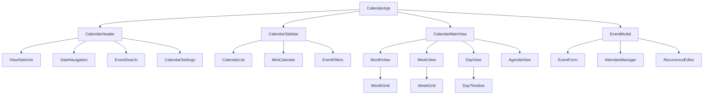

### State Management Architecture

[⬆️ Back to Top](#-table-of-contents)

---


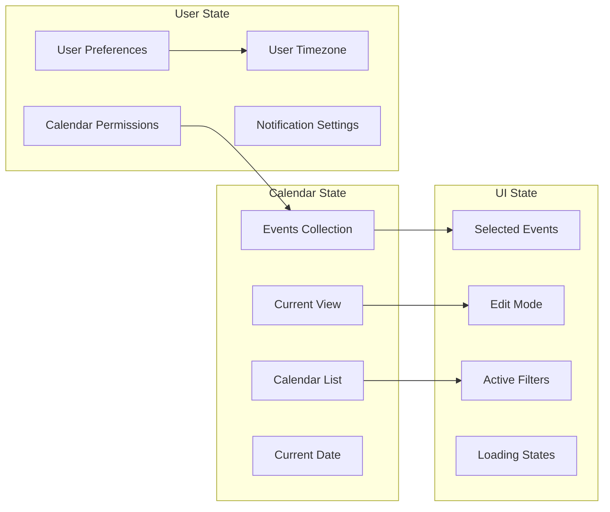

## Advanced Features

[⬆️ Back to Top](#-table-of-contents)

---


### Calendar Sharing and Collaboration

[⬆️ Back to Top](#-table-of-contents)

---


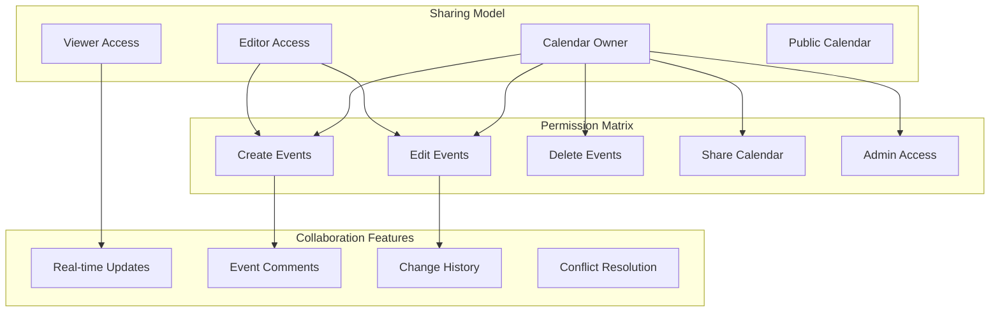

### Intelligent Event Suggestions

[⬆️ Back to Top](#-table-of-contents)

---


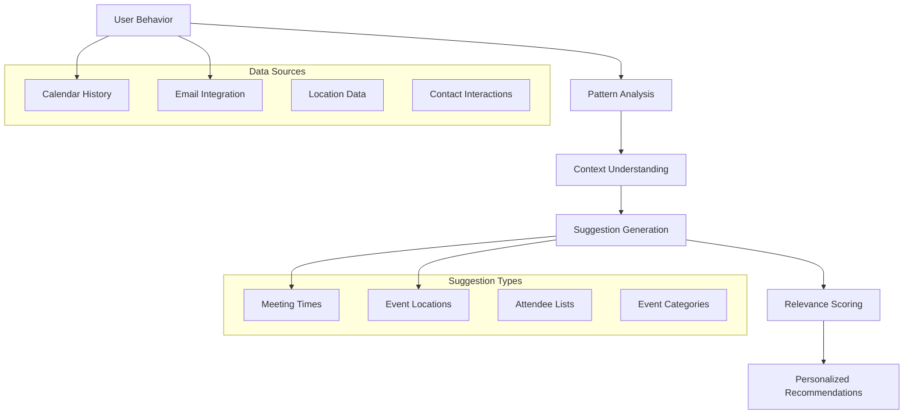

## Performance Optimizations

[⬆️ Back to Top](#-table-of-contents)

---


### Efficient Date Calculations

[⬆️ Back to Top](#-table-of-contents)

---


**Date Range Optimization**:
```
DateRange = {
  start: Date,
  end: Date,
  timezone: string,
  recurring: boolean
}
```

**Optimization Strategies**:
- Cache calculated date ranges
- Use efficient date libraries (date-fns, moment.js alternatives)
- Implement date arithmetic in UTC
- Minimize timezone conversions
- Pre-compute recurring event instances

### Virtual Calendar Rendering

[⬆️ Back to Top](#-table-of-contents)

---


**Viewport-based Rendering**:
- Render only visible time periods
- Implement infinite scrolling for agenda view
- Use CSS transforms for smooth animations
- Batch DOM updates for performance
- Implement efficient event positioning

### Data Caching Strategy

[⬆️ Back to Top](#-table-of-contents)

---


**Multi-level Caching**:
```
CalendarCache = {
  events: LRU<DateRange, Event[]>,
  recurrences: Map<string, RecurringEvent[]>,
  userPreferences: Map<string, UserPreferences>,
  timezoneData: Map<string, TimezoneInfo>
}
```

## Security Considerations

[⬆️ Back to Top](#-table-of-contents)

---


### Calendar Privacy

[⬆️ Back to Top](#-table-of-contents)

---


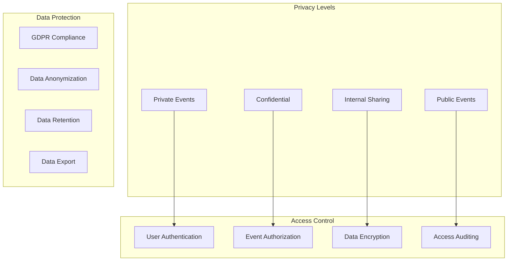

### Event Data Security

[⬆️ Back to Top](#-table-of-contents)

---


**Data Protection Measures**:
- End-to-end encryption for sensitive events
- Role-based access control
- Input validation and sanitization
- SQL injection prevention
- XSS protection for event content

## Accessibility Implementation

[⬆️ Back to Top](#-table-of-contents)

---


### Keyboard Navigation

[⬆️ Back to Top](#-table-of-contents)

---


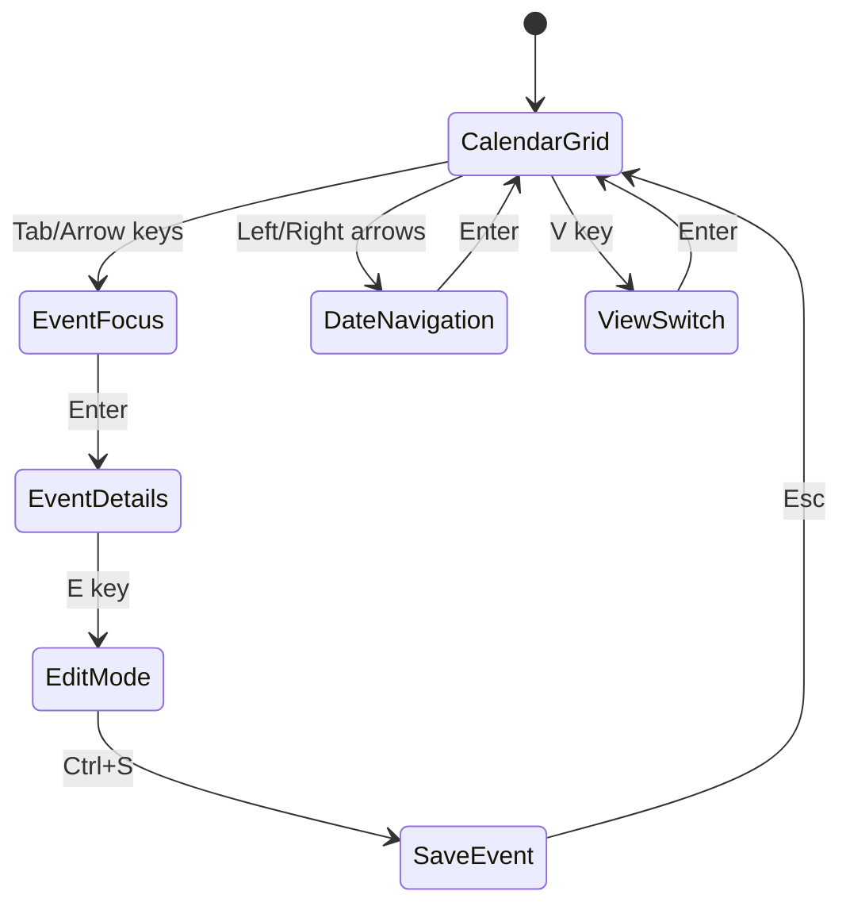

**Accessibility Features**:
- Full keyboard navigation support
- Screen reader compatibility
- ARIA labels for all calendar elements
- High contrast mode support
- Focus management during view changes

### Screen Reader Support

[⬆️ Back to Top](#-table-of-contents)

---


**Calendar Announcements**:
```
"Calendar grid, Month view, January 2024. 
Week of January 1st to 7th. 
Monday January 1st, 2 events: 
Meeting at 9 AM, Lunch at 12 PM. 
Press Enter to select date, 
Arrow keys to navigate."
```

## Testing Strategy

[⬆️ Back to Top](#-table-of-contents)

---


### Unit Testing Focus Areas

[⬆️ Back to Top](#-table-of-contents)

---


**Core Algorithm Testing**:
- Recurrence rule parsing accuracy
- Timezone conversion correctness
- Conflict detection logic
- Event scheduling algorithms

**Component Testing**:
- Calendar view rendering
- Event creation workflow
- Date navigation functionality
- Sharing and permissions

### Integration Testing

[⬆️ Back to Top](#-table-of-contents)

---


**Calendar Workflow Testing**:
- Complete event management cycle
- Cross-timezone functionality
- External calendar synchronization
- Multi-user collaboration scenarios

**Performance Testing**:
- Large calendar dataset handling
- Concurrent user access
- Real-time update performance
- Mobile device compatibility

### End-to-End Testing

[⬆️ Back to Top](#-table-of-contents)

---


**User Experience Testing**:
- Complete user workflows
- Accessibility compliance
- Cross-browser compatibility
- Mobile responsiveness

## Trade-offs and Considerations

[⬆️ Back to Top](#-table-of-contents)

---


### Performance vs Features

[⬆️ Back to Top](#-table-of-contents)

---

- **Real-time updates**: Synchronization overhead vs user experience
- **Recurrence complexity**: Feature richness vs computational cost
- **Timezone accuracy**: Precision vs performance impact
- **Offline support**: Data consistency vs offline capability

### Privacy vs Collaboration

[⬆️ Back to Top](#-table-of-contents)

---

- **Event visibility**: Privacy vs team coordination
- **Data sharing**: Collaboration vs data protection
- **External integration**: Convenience vs security risks
- **Analytics**: Insights vs user privacy

### Scalability Considerations

[⬆️ Back to Top](#-table-of-contents)

---

- **User growth**: Multi-tenancy vs performance isolation
- **Data volume**: Storage efficiency vs query performance
- **Global deployment**: Regional compliance vs unified experience
- **Feature complexity**: Functionality vs system maintainability

This calendar management system provides a comprehensive foundation for modern event scheduling with advanced features like intelligent scheduling, timezone management, and collaborative tools while maintaining high performance, security, and accessibility standards. 