# Pinterest-Style Grid Layout System


## 📋 Table of Contents

- [Pinterest-Style Grid Layout System](#pinterest-style-grid-layout-system)
  - [Table of Contents](#table-of-contents)
  - [Clarify the Problem and Requirements](#clarify-the-problem-and-requirements)
    - [Problem Understanding](#problem-understanding)
    - [Functional Requirements](#functional-requirements)
    - [Non-Functional Requirements](#non-functional-requirements)
    - [Key Assumptions](#key-assumptions)
  - [High-Level Design (HLD)](#high-level-design-hld)
    - [System Architecture Overview](#system-architecture-overview)
    - [Content Data Model](#content-data-model)
  - [Low-Level Design (LLD)](#low-level-design-lld)
    - [Masonry Layout Algorithm](#masonry-layout-algorithm)
    - [Virtual Scrolling Implementation](#virtual-scrolling-implementation)
    - [Image Loading State Machine](#image-loading-state-machine)
  - [Core Algorithms](#core-algorithms)
    - [1. Optimized Masonry Layout Algorithm](#1-optimized-masonry-layout-algorithm)
    - [2. Intelligent Virtual Scrolling](#2-intelligent-virtual-scrolling)
    - [3. Progressive Image Loading Algorithm](#3-progressive-image-loading-algorithm)
    - [4. Responsive Layout Adaptation](#4-responsive-layout-adaptation)
    - [5. Smooth Infinite Scroll Algorithm](#5-smooth-infinite-scroll-algorithm)
  - [Component Architecture](#component-architecture)
    - [Pinterest-Style Grid Component Hierarchy](#pinterest-style-grid-component-hierarchy)
    - [State Management Architecture](#state-management-architecture)
  - [Advanced Features](#advanced-features)
    - [Smart Image Optimization](#smart-image-optimization)
    - [Intelligent Content Curation](#intelligent-content-curation)
  - [Performance Optimizations](#performance-optimizations)
    - [Memory Management](#memory-management)
    - [Rendering Performance](#rendering-performance)
    - [Network Optimization](#network-optimization)
  - [Security Considerations](#security-considerations)
    - [Content Security](#content-security)
    - [Data Protection](#data-protection)
  - [Accessibility Implementation](#accessibility-implementation)
    - [Keyboard Navigation](#keyboard-navigation)
    - [Screen Reader Support](#screen-reader-support)
  - [Testing Strategy](#testing-strategy)
    - [Unit Testing Focus Areas](#unit-testing-focus-areas)
    - [Integration Testing](#integration-testing)
    - [End-to-End Testing](#end-to-end-testing)
  - [Trade-offs and Considerations](#trade-offs-and-considerations)
    - [Performance vs Visual Quality](#performance-vs-visual-quality)
    - [User Experience vs Technical Constraints](#user-experience-vs-technical-constraints)
    - [Scalability Considerations](#scalability-considerations)

---

## Table of Contents
1. [Clarify the Problem and Requirements](#clarify-the-problem-and-requirements)
2. [High-Level Design (HLD)](#high-level-design-hld)
3. [Low-Level Design (LLD)](#low-level-design-lld)
4. [Core Algorithms](#core-algorithms)
5. [Component Architecture](#component-architecture)
6. [Advanced Features](#advanced-features)
7. [TypeScript Interfaces & Component Props](#typescript-interfaces--component-props)
8. [API Reference](#api-reference)
9. [Performance Optimizations](#performance-optimizations)
10. [Security Considerations](#security-considerations)
11. [Accessibility Implementation](#accessibility-implementation)
12. [Testing Strategy](#testing-strategy)
13. [Trade-offs and Considerations](#trade-offs-and-considerations)

---

## Clarify the Problem and Requirements

[⬆️ Back to Top](#--table-of-contents)

---

### Problem Understanding

[⬆️ Back to Top](#--table-of-contents)

---

Design a Pinterest-style masonry grid layout system that efficiently displays content of varying dimensions in an aesthetically pleasing and performant manner. The system must handle dynamic content loading, responsive design, and smooth user interactions while maintaining optimal visual organization similar to Pinterest, Masonry.js, or Tumblr layouts.

### Functional Requirements

[⬆️ Back to Top](#--table-of-contents)

---

- **Masonry Layout**: Dynamic grid with variable height items, optimal space utilization
- **Infinite Scroll**: Seamless content loading as user scrolls, pagination management
- **Responsive Design**: Adaptive column count based on screen size and content
- **Image Optimization**: Lazy loading, progressive enhancement, multiple resolutions
- **Content Interaction**: Hover effects, click handling, modal overlays
- **Search & Filtering**: Real-time content filtering, category-based organization
- **Performance Optimization**: Virtual scrolling for large datasets, efficient rendering
- **Customization**: Configurable gap sizes, column widths, animation preferences

### Non-Functional Requirements

[⬆️ Back to Top](#--table-of-contents)

---

- **Performance**: <16ms layout calculations, 60fps scrolling, <200ms image load
- **Scalability**: Handle 10K+ items efficiently, smooth infinite scroll
- **Memory Management**: Optimal memory usage, garbage collection, DOM cleanup
- **Cross-browser**: Consistent experience across modern browsers
- **Mobile Optimization**: Touch-friendly interactions, optimized for mobile networks
- **Accessibility**: WCAG 2.1 AA compliance, keyboard navigation, screen reader support
- **Bundle Size**: Lightweight component, minimal dependencies, tree-shakeable
- **SEO Friendly**: Server-side rendering support, proper semantic markup

### Key Assumptions

[⬆️ Back to Top](#--table-of-contents)

---

- Content variety: Mixed aspect ratios, heights ranging from 200px to 800px
- Item count: 100-10,000 items per grid, potentially unlimited with infinite scroll
- Image sizes: 100KB-1MB per image, various formats (JPEG, PNG, WebP)
- User behavior: Browse-heavy with occasional interaction, scroll-focused navigation
- Screen sizes: 320px to 4K displays, responsive breakpoints
- Network conditions: 3G to high-speed connections, progressive enhancement
- Content updates: Dynamic content addition, real-time updates
- Device types: Desktop, tablet, mobile with varying performance capabilities

---

## High-Level Design (HLD)

[⬆️ Back to Top](#--table-of-contents)

---


### System Architecture Overview

[⬆️ Back to Top](#--table-of-contents)

---


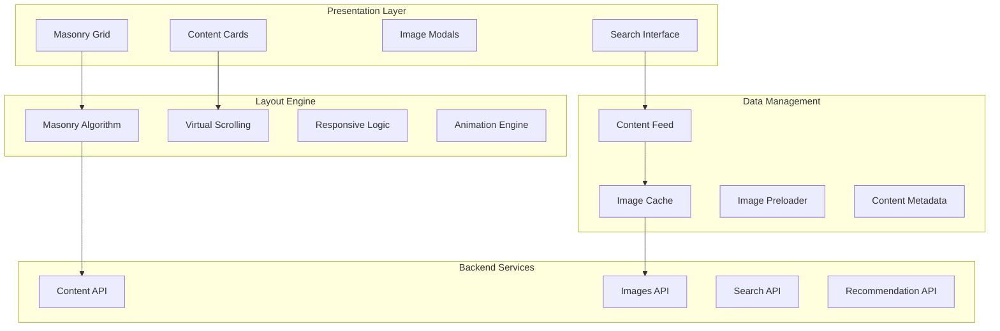

### Content Data Model

[⬆️ Back to Top](#--table-of-contents)

---


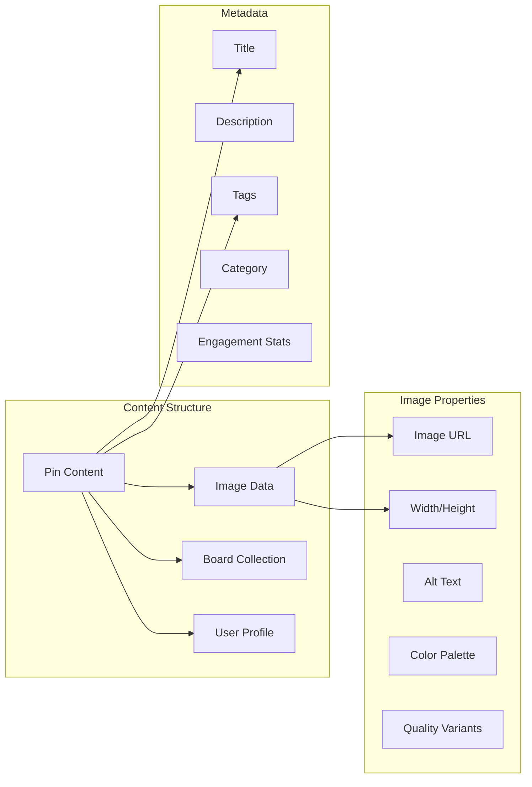

## Low-Level Design (LLD)

[⬆️ Back to Top](#--table-of-contents)

---


### Masonry Layout Algorithm

[⬆️ Back to Top](#--table-of-contents)

---


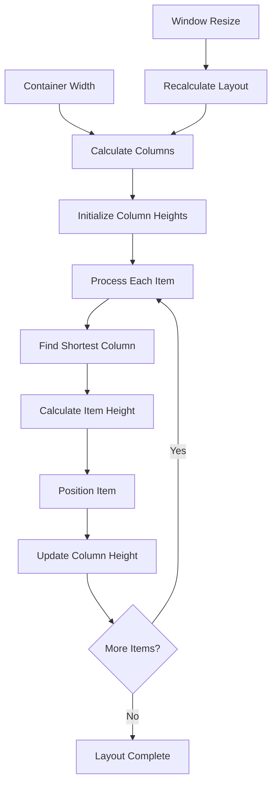

### Virtual Scrolling Implementation

[⬆️ Back to Top](#--table-of-contents)

---


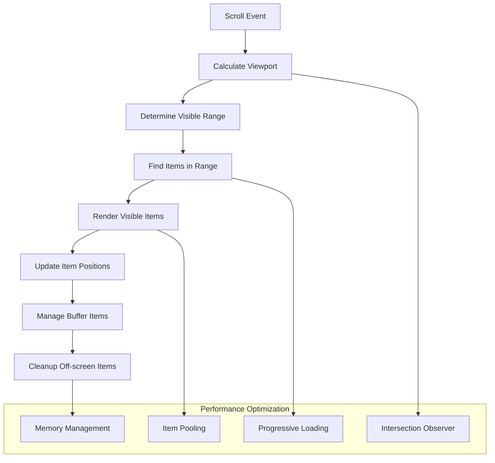

### Image Loading State Machine

[⬆️ Back to Top](#--table-of-contents)

---


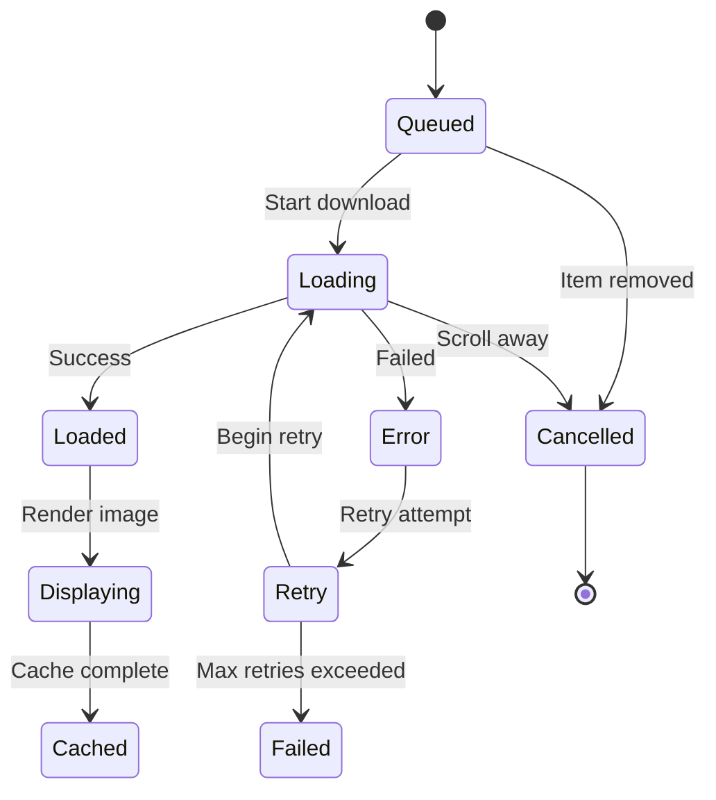

## Core Algorithms

[⬆️ Back to Top](#--table-of-contents)

---


### 1. Optimized Masonry Layout Algorithm

[⬆️ Back to Top](#--table-of-contents)

---


**Purpose**: Efficiently arrange variable-height items in a grid layout to minimize wasted space.

**Layout Configuration**:
```
MasonryConfig = {
  columnWidth: number,
  gutter: number,
  containerWidth: number,
  minColumns: number,
  maxColumns: number,
  itemMinHeight: number,
  itemMaxHeight: number
}
```

**Core Masonry Algorithm**:
```
function calculateMasonryLayout(items, config):
  columnCount = Math.floor(
    (config.containerWidth + config.gutter) / 
    (config.columnWidth + config.gutter)
  )
  
  columnCount = Math.max(config.minColumns, 
                Math.min(config.maxColumns, columnCount))
  
  columnHeights = new Array(columnCount).fill(0)
  itemPositions = []
  
  for item in items:
    // Find column with minimum height
    shortestColumn = findShortestColumn(columnHeights)
    
    // Calculate item dimensions
    itemHeight = calculateItemHeight(item, config.columnWidth)
    
    // Position item
    position = {
      x: shortestColumn * (config.columnWidth + config.gutter),
      y: columnHeights[shortestColumn],
      width: config.columnWidth,
      height: itemHeight,
      column: shortestColumn
    }
    
    itemPositions.push(position)
    
    // Update column height
    columnHeights[shortestColumn] += itemHeight + config.gutter
  
  return {
    positions: itemPositions,
    totalHeight: Math.max(...columnHeights),
    columnCount: columnCount
  }
```

**Advanced Column Balancing**:
```
function balanceColumns(items, positions, columnHeights):
  threshold = calculateHeightThreshold(columnHeights)
  
  // Find items that could be moved to balance layout
  candidates = []
  
  for i, position in positions:
    currentColumn = position.column
    currentHeight = columnHeights[currentColumn]
    
    if currentHeight > threshold:
      // Check if item can be moved to shorter column
      for targetColumn in range(0, columnHeights.length):
        if targetColumn !== currentColumn and 
           columnHeights[targetColumn] < threshold:
          
          // Calculate impact of moving item
          impact = calculateMoveImpact(position, targetColumn, columnHeights)
          
          if impact.improvement > 0:
            candidates.push({
              itemIndex: i,
              from: currentColumn,
              to: targetColumn,
              improvement: impact.improvement
            })
  
  // Apply best moves to balance layout
  return applyOptimalMoves(candidates, positions, columnHeights)
```

### 2. Intelligent Virtual Scrolling

[⬆️ Back to Top](#--table-of-contents)

---


**Purpose**: Render only visible items for optimal performance with large datasets.

**Virtual Viewport Calculation**:
```
VirtualViewport = {
  scrollTop: number,
  viewportHeight: number,
  bufferSize: number,
  itemPositions: ItemPosition[]
}

function calculateVisibleItems(viewport, layout):
  visibleTop = viewport.scrollTop - viewport.bufferSize
  visibleBottom = viewport.scrollTop + viewport.viewportHeight + viewport.bufferSize
  
  visibleItems = []
  
  for i, position in layout.positions:
    itemTop = position.y
    itemBottom = position.y + position.height
    
    // Check if item intersects with visible area
    if itemBottom >= visibleTop and itemTop <= visibleBottom:
      visibleItems.push({
        index: i,
        position: position,
        isInBuffer: itemTop < viewport.scrollTop or 
                   itemBottom > viewport.scrollTop + viewport.viewportHeight
      })
  
  return visibleItems
```

**Predictive Loading Strategy**:
```
function predictScrollDirection(scrollHistory):
  if scrollHistory.length < 3:
    return 'unknown'
  
  recentVelocities = []
  for i in range(1, scrollHistory.length):
    velocity = scrollHistory[i].position - scrollHistory[i-1].position
    recentVelocities.push(velocity)
  
  averageVelocity = recentVelocities.reduce((a, b) => a + b) / recentVelocities.length
  
  if averageVelocity > 5:
    return 'down'
  else if averageVelocity < -5:
    return 'up'
  else:
    return 'stationary'
```

### 3. Progressive Image Loading Algorithm

[⬆️ Back to Top](#--table-of-contents)

---


**Purpose**: Load images efficiently based on priority and viewport visibility.

**Image Loading Priority**:
```
ImagePriority = {
  CRITICAL: 1,    // Above fold, visible
  HIGH: 2,        // In viewport buffer
  MEDIUM: 3,      // Near viewport
  LOW: 4,         // Far from viewport
  LAZY: 5         // Very far, load on demand
}

function calculateImagePriority(itemPosition, viewport):
  itemCenter = itemPosition.y + (itemPosition.height / 2)
  viewportCenter = viewport.scrollTop + (viewport.viewportHeight / 2)
  
  distance = Math.abs(itemCenter - viewportCenter)
  
  if distance <= viewport.viewportHeight / 2:
    return ImagePriority.CRITICAL
  else if distance <= viewport.viewportHeight:
    return ImagePriority.HIGH
  else if distance <= viewport.viewportHeight * 2:
    return ImagePriority.MEDIUM
  else if distance <= viewport.viewportHeight * 4:
    return ImagePriority.LOW
  else:
    return ImagePriority.LAZY
```

**Adaptive Loading Queue**:
```
function manageImageLoadingQueue(visibleItems, networkCondition):
  loadingQueue = new PriorityQueue()
  
  // Determine concurrent loading limit based on network
  concurrentLimit = getConcurrentLimit(networkCondition)
  
  for item in visibleItems:
    priority = calculateImagePriority(item.position, viewport)
    
    // Adjust priority based on network conditions
    if networkCondition === 'slow':
      priority = Math.min(priority + 1, ImagePriority.LAZY)
    
    loadingQueue.enqueue(item, priority)
  
  // Process queue with concurrency limit
  return processLoadingQueue(loadingQueue, concurrentLimit)
```

### 4. Responsive Layout Adaptation

[⬆️ Back to Top](#--table-of-contents)

---


**Purpose**: Adapt layout to different screen sizes and orientations.

**Breakpoint Management**:
```
ResponsiveBreakpoints = {
  mobile: { maxWidth: 480, columns: 2, columnWidth: 160, gutter: 8 },
  tablet: { maxWidth: 768, columns: 3, columnWidth: 200, gutter: 12 },
  desktop: { maxWidth: 1200, columns: 4, columnWidth: 240, gutter: 16 },
  wide: { maxWidth: Infinity, columns: 6, columnWidth: 280, gutter: 20 }
}

function getResponsiveConfig(screenWidth):
  for breakpoint in ResponsiveBreakpoints:
    if screenWidth <= breakpoint.maxWidth:
      return {
        ...breakpoint,
        // Calculate actual column width based on container
        actualColumnWidth: calculateActualColumnWidth(screenWidth, breakpoint)
      }
  
  return ResponsiveBreakpoints.wide
```

**Dynamic Column Calculation**:
```
function calculateOptimalColumns(containerWidth, minColumnWidth, gutter):
  // Calculate maximum possible columns
  maxColumns = Math.floor((containerWidth + gutter) / (minColumnWidth + gutter))
  
  // Find best fit that uses full width
  bestFit = { columns: 1, columnWidth: containerWidth, wastedSpace: Infinity }
  
  for columns in range(1, maxColumns + 1):
    totalGutterSpace = (columns - 1) * gutter
    availableWidth = containerWidth - totalGutterSpace
    columnWidth = availableWidth / columns
    
    if columnWidth >= minColumnWidth:
      wastedSpace = availableWidth % columnWidth
      
      if wastedSpace < bestFit.wastedSpace:
        bestFit = { columns, columnWidth, wastedSpace }
  
  return bestFit
```

### 5. Smooth Infinite Scroll Algorithm

[⬆️ Back to Top](#--table-of-contents)

---


**Purpose**: Continuously load and display content as user scrolls.

**Scroll Threshold Detection**:
```
function detectScrollThreshold(scrollPosition, layoutHeight, viewportHeight):
  scrolledPercentage = (scrollPosition + viewportHeight) / layoutHeight
  
  thresholds = {
    preload: 0.7,    // Start loading new content
    urgent: 0.9,     // Priority loading
    critical: 0.95   // Immediate loading
  }
  
  if scrolledPercentage >= thresholds.critical:
    return 'critical'
  else if scrolledPercentage >= thresholds.urgent:
    return 'urgent'
  else if scrolledPercentage >= thresholds.preload:
    return 'preload'
  else:
    return 'none'
```

**Content Fetching Strategy**:
```
function manageContentFetching(threshold, currentItems, loadingState):
  if loadingState.isLoading:
    return // Prevent concurrent requests
  
  batchSize = calculateBatchSize(threshold)
  
  switch threshold:
    case 'critical':
      // Immediate fetch with larger batch
      return fetchContent(currentItems.length, batchSize * 2)
    
    case 'urgent':
      // Standard fetch
      return fetchContent(currentItems.length, batchSize)
    
    case 'preload':
      // Background fetch with smaller batch
      return fetchContent(currentItems.length, batchSize / 2)
    
    default:
      return null
```

## Component Architecture

[⬆️ Back to Top](#--table-of-contents)

---


### Pinterest-Style Grid Component Hierarchy

[⬆️ Back to Top](#--table-of-contents)

---


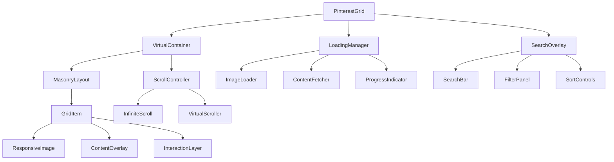

### State Management Architecture

[⬆️ Back to Top](#--table-of-contents)

---


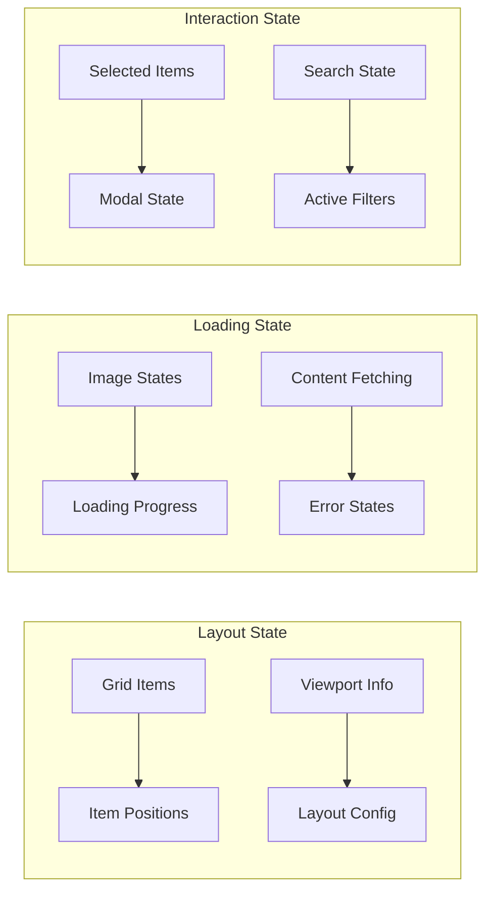

#### React Component Implementation

[⬆️ Back to Top](#--table-of-contents)

---

**PinterestGrid.jsx**

**What this code does:**
• **Main Purpose**: Pinterest-style masonry grid layout with infinite scroll and search
• **Dynamic Layout**: Calculates optimal item positioning for masonry layout
• **Key Functions**:
  - `calculateLayout()` - Computes item positions for masonry grid
  - `getColumnCount()` - Determines number of columns based on viewport width
  - `useInfiniteScroll()` - Loads more items as user scrolls
  - `handleItemClick()` - Opens item details in modal overlay
  - `handleSearch()` - Filters grid items based on search query
  - Responsive column adjustment and viewport tracking

```jsx
import React, { useState, useEffect, useCallback, useRef, useMemo } from 'react';
import { PinterestProvider } from './PinterestContext';
import MasonryLayout from './MasonryLayout';
import SearchOverlay from './SearchOverlay';
import { useInfiniteScroll } from './hooks/useInfiniteScroll';
import { useMasonryLayout } from './hooks/useMasonryLayout';

const PinterestGrid = ({ 
  columns = 'auto',
  gap = 16,
  itemMinWidth = 200,
  enableSearch = true,
  enableFilters = true,
  apiEndpoint = '/api/pins'
}) => {
  const [items, setItems] = useState([]);
  const [loading, setLoading] = useState(false);
  const [hasMore, setHasMore] = useState(true);
  const [searchQuery, setSearchQuery] = useState('');
  const [filters, setFilters] = useState({});
  const [selectedItem, setSelectedItem] = useState(null);
  const [viewport, setViewport] = useState({
    width: 0,
    height: 0,
    scrollTop: 0
  });
  
  const containerRef = useRef(null);
  
  const { 
    calculateLayout, 
    getColumnCount 
  } = useMasonryLayout({
    containerWidth: viewport.width,
    itemMinWidth,
    gap,
    columns: columns === 'auto' ? null : columns
  });

  const { 
    loadMore, 
    isLoadingMore 
  } = useInfiniteScroll({
    apiEndpoint,
    searchQuery,
    filters,
    onDataReceived: (newItems, hasMoreData) => {
      setItems(prev => [...prev, ...newItems]);
      setHasMore(hasMoreData);
    }
  });

  const columnCount = useMemo(() => {
    return getColumnCount();
  }, [viewport.width, getColumnCount]);

  const itemPositions = useMemo(() => {
    return calculateLayout(items);
  }, [items, calculateLayout]);

  const handleItemClick = useCallback((item) => {
    setSelectedItem(item);
  }, []);

  const handleSearch = useCallback((query) => {
    setSearchQuery(query);
  }, []);

  const value = {
    items,
    itemPositions,
    columnCount,
    gap,
    loading,
    viewport,
    selectedItem,
    searchQuery,
    filters,
    onItemClick: handleItemClick,
    onSearch: handleSearch,
    setSelectedItem
  };

  return (
    <PinterestProvider value={value}>
      <div className="pinterest-grid-container">
        {enableSearch && <SearchOverlay showFilters={enableFilters} />}
        
        <div 
          ref={containerRef}
          className="pinterest-grid"
          style={{ height: '100vh', overflow: 'auto' }}
        >
          {loading ? (
            <div className="loading-state">
              <div className="skeleton-grid">
                {Array.from({ length: 12 }).map((_, index) => (
                  <div key={index} className="skeleton-item" />
                ))}
              </div>
            </div>
          ) : (
            <MasonryLayout />
          )}
        </div>
      </div>
    </PinterestProvider>
  );
};

export default PinterestGrid;
```

**MasonryLayout.jsx**
```jsx
import React, { useContext, useMemo } from 'react';
import { PinterestContext } from './PinterestContext';
import GridItem from './GridItem';

const MasonryLayout = () => {
  const { 
    items, 
    itemPositions, 
    viewport, 
    gap,
    onItemClick 
  } = useContext(PinterestContext);

  const totalHeight = useMemo(() => {
    if (itemPositions.length === 0) return 0;
    return Math.max(...itemPositions.map(pos => pos.y + pos.height)) + gap;
  }, [itemPositions, gap]);

  const visibleItems = useMemo(() => {
    const buffer = viewport.height;
    const viewportTop = viewport.scrollTop - buffer;
    const viewportBottom = viewport.scrollTop + viewport.height + buffer;

    return items.filter((item, index) => {
      const position = itemPositions[index];
      if (!position) return false;
      
      const itemTop = position.y;
      const itemBottom = position.y + position.height;
      
      return itemBottom >= viewportTop && itemTop <= viewportBottom;
    });
  }, [items, itemPositions, viewport]);

  return (
    <div 
      className="masonry-layout"
      style={{
        position: 'relative',
        height: totalHeight,
        width: '100%'
      }}
    >
      {visibleItems.map((item, index) => {
        const originalIndex = items.indexOf(item);
        const position = itemPositions[originalIndex];
        
        if (!position) return null;

        return (
          <GridItem
            key={item.id || originalIndex}
            item={item}
            position={position}
            onClick={() => onItemClick(item)}
          />
        );
      })}
    </div>
  );
};

export default MasonryLayout;
```

## Advanced Features

[⬆️ Back to Top](#--table-of-contents)

---


### Smart Image Optimization

[⬆️ Back to Top](#--table-of-contents)

---


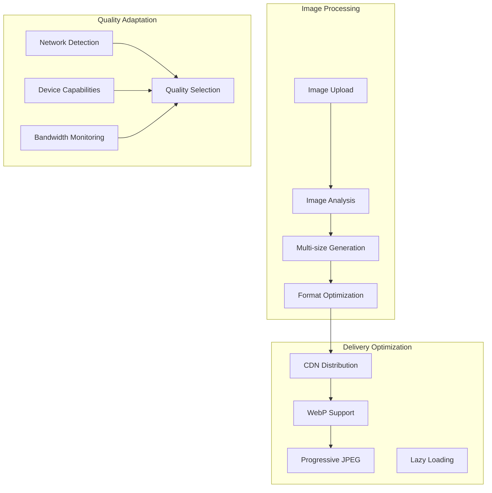

### Intelligent Content Curation

[⬆️ Back to Top](#--table-of-contents)

---


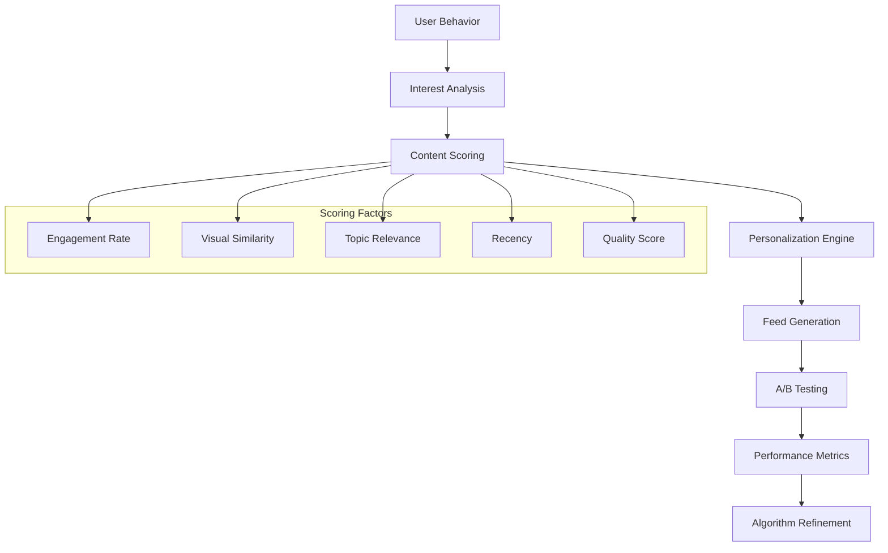

### TypeScript Interfaces & Component Props

[⬆️ Back to Top](#--table-of-contents)

---

#### Core Data Interfaces

```typescript
interface GridItem {
  id: string;
  src: string;
  alt: string;
  width: number;
  height: number;
  aspectRatio: number;
  title?: string;
  description?: string;
  author?: Author;
  tags?: string[];
  category?: string;
  dominantColor?: string;
  blurDataURL?: string;
  metadata?: ItemMetadata;
}

interface GridColumn {
  id: string;
  items: GridItem[];
  height: number;
  width: number;
  index: number;
}

interface LayoutConfig {
  columnCount: number;
  columnWidth: number;
  gap: number;
  containerWidth: number;
  maxColumns: number;
  minColumnWidth: number;
  responsiveBreakpoints: ResponsiveBreakpoint[];
}

interface ResponsiveBreakpoint {
  minWidth: number;
  columnCount: number;
  columnWidth: number;
  gap: number;
}

interface VirtualWindow {
  startIndex: number;
  endIndex: number;
  offsetY: number;
  viewportHeight: number;
  totalHeight: number;
  visibleItems: GridItem[];
}

interface LoadingState {
  isLoading: boolean;
  hasMore: boolean;
  error?: string;
  page: number;
  itemsPerPage: number;
  totalItems?: number;
}
```

#### Component Props Interfaces

```typescript
interface MasonryGridProps {
  items: GridItem[];
  onItemClick?: (item: GridItem, index: number) => void;
  onItemLoad?: (item: GridItem) => void;
  onItemError?: (item: GridItem, error: Error) => void;
  onLoadMore?: () => void;
  columnCount?: number;
  gap?: number;
  enableVirtualization?: boolean;
  enableLazyLoading?: boolean;
  renderItem?: (item: GridItem) => React.ReactNode;
}

interface GridItemProps {
  item: GridItem;
  onClick?: (item: GridItem) => void;
  onLoad?: (item: GridItem) => void;
  onError?: (item: GridItem, error: Error) => void;
  showOverlay?: boolean;
  showMetadata?: boolean;
  lazyLoad?: boolean;
  placeholder?: React.ReactNode;
  className?: string;
}

interface InfiniteScrollProps {
  onLoadMore: () => void;
  hasMore: boolean;
  isLoading: boolean;
  threshold?: number;
  loader?: React.ReactNode;
  endMessage?: React.ReactNode;
  scrollableTarget?: string;
  debounceMs?: number;
}

interface ResponsiveLayoutProps {
  breakpoints: ResponsiveBreakpoint[];
  onLayoutChange?: (layout: LayoutConfig) => void;
  children: React.ReactNode;
  fallback?: React.ReactNode;
}

interface FilterBarProps {
  categories: Category[];
  selectedCategory?: string;
  onCategoryChange: (category: string) => void;
  onSearch?: (query: string) => void;
  onSortChange?: (sort: SortOption) => void;
  showSearch?: boolean;
  showSort?: boolean;
}
```

### API Reference

[⬆️ Back to Top](#--table-of-contents)

---

#### Grid Content Management
- `GET /api/grid/items` - Get grid items with pagination and infinite scroll support
- `GET /api/grid/items/:id` - Get detailed item information with metadata
- `POST /api/grid/items` - Upload new item to grid with image processing
- `PUT /api/grid/items/:id` - Update item metadata, title, or description
- `DELETE /api/grid/items/:id` - Remove item from grid and delete associated media

#### Image Processing & Optimization
- `POST /api/images/upload` - Upload and process images with thumbnail generation
- `GET /api/images/:id/sizes` - Get available image sizes and optimized URLs
- `POST /api/images/:id/process` - Trigger image reprocessing and optimization
- `GET /api/images/:id/metadata` - Extract image metadata and dominant colors
- `POST /api/images/batch-process` - Process multiple images in batch operation

#### Layout & Positioning
- `GET /api/layout/calculate` - Calculate optimal grid layout for items
- `POST /api/layout/optimize` - Optimize layout for better visual balance
- `GET /api/layout/breakpoints` - Get responsive breakpoint configurations
- `PUT /api/layout/settings` - Update layout settings and column preferences
- `POST /api/layout/reflow` - Trigger layout reflow for updated content

#### Search & Filtering
- `GET /api/search/items` - Search grid items with text and visual similarity
- `GET /api/search/suggestions` - Get search suggestions and autocomplete
- `POST /api/search/visual` - Search for visually similar items using AI
- `GET /api/categories` - Get available categories and tag suggestions
- `POST /api/filters/apply` - Apply multiple filters to grid content

#### Performance & Caching
- `GET /api/performance/metrics` - Get grid performance metrics and timing
- `POST /api/cache/preload` - Preload grid items for faster loading
- `DELETE /api/cache/clear` - Clear cached grid data and images
- `GET /api/cache/status` - Get cache hit rates and performance stats
- `POST /api/optimization/analyze` - Analyze grid performance and suggest improvements

#### User Interactions
- `POST /api/items/:id/like` - Like or unlike grid item
- `POST /api/items/:id/save` - Save item to user's collection or board
- `GET /api/items/:id/related` - Get related items based on similarity
- `POST /api/items/:id/report` - Report inappropriate content or issues
- `GET /api/items/:id/analytics` - Get item view and interaction analytics

#### Responsive & Mobile
- `GET /api/mobile/layout` - Get mobile-optimized layout configuration
- `POST /api/mobile/gestures` - Handle mobile gesture interactions
- `GET /api/mobile/performance` - Get mobile-specific performance metrics
- `PUT /api/mobile/settings` - Update mobile display preferences
- `GET /api/responsive/test` - Test layout across different screen sizes

---

## Performance Optimizations

[⬆️ Back to Top](#--table-of-contents)

---


### Memory Management

[⬆️ Back to Top](#--table-of-contents)

---


**Item Recycling Strategy**:
```
ItemPool = {
  available: HTMLElement[],
  inUse: Map<number, HTMLElement>,
  maxSize: number,
  currentSize: number
}
```

**Optimization Techniques**:
- Implement object pooling for DOM elements
- Use WeakMap for metadata associations
- Implement garbage collection for off-screen items
- Optimize image memory usage with size variants
- Use requestIdleCallback for non-critical operations

### Rendering Performance

[⬆️ Back to Top](#--table-of-contents)

---


**Frame Rate Optimization**:
- Use CSS transforms for layout changes
- Implement will-change property strategically
- Batch DOM updates using DocumentFragment
- Use intersectionObserver for visibility detection
- Implement frame dropping during heavy scrolling

**Paint and Layout Optimization**:
```
PerformanceMetrics = {
  frameTime: number[],
  layoutTime: number,
  paintTime: number,
  scriptTime: number,
  idleTime: number
}
```

### Network Optimization

[⬆️ Back to Top](#--table-of-contents)

---


**Image Loading Strategy**:
- Implement progressive image enhancement
- Use HTTP/2 multiplexing for parallel requests
- Implement smart preloading based on scroll patterns
- Use service workers for advanced caching
- Implement image format negotiation

## Security Considerations

[⬆️ Back to Top](#--table-of-contents)

---


### Content Security

[⬆️ Back to Top](#--table-of-contents)

---


```mermaid
graph TB
    subgraph "Input Validation"
        Upload[Image Upload]
        Scan[Malware Scanning]
        Format[Format Validation]
        Size[Size Limits]
    end
    
    subgraph "Content Moderation"
        AI[AI Content Analysis]
        Human[Human Review]
        Reports[User Reports]
        Flagging[Content Flagging]
    end
    
    subgraph "Privacy Protection"
        Metadata[Metadata Stripping]
        Watermark[Watermark Detection]
        Copyright[Copyright Protection]
        GDPR[GDPR Compliance]
    end
    
    Upload --> Scan
    Scan --> Format
    Format --> Size
    
    AI --> Human
    Human --> Reports
    Reports --> Flagging
    
    Metadata --> Watermark
    Watermark --> Copyright
    Copyright --> GDPR
```

### Data Protection

[⬆️ Back to Top](#--table-of-contents)

---


**Privacy Framework**:
- Strip EXIF data from uploaded images
- Implement content-based duplicate detection
- Use secure CDN with access controls
- Implement rate limiting for API requests
- Ensure GDPR compliance for user data

## Accessibility Implementation

[⬆️ Back to Top](#--table-of-contents)

---


### Keyboard Navigation

[⬆️ Back to Top](#--table-of-contents)

---


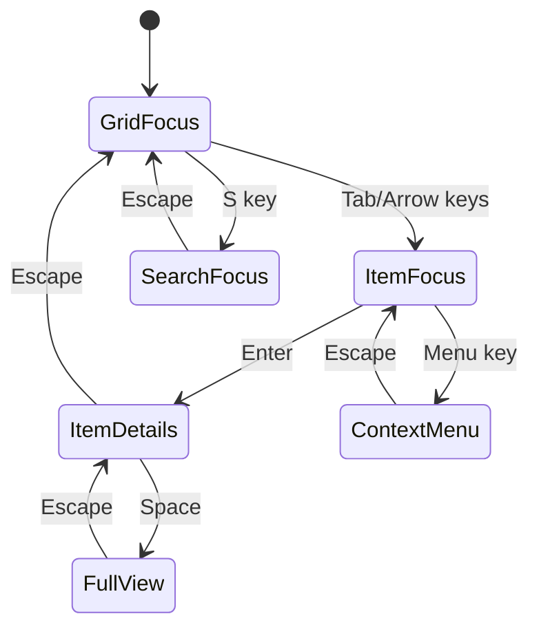

**Accessibility Features**:
- Comprehensive ARIA labels for grid structure
- Screen reader support for image descriptions
- High contrast mode compatibility
- Keyboard navigation for all interactions
- Focus management during infinite scroll

### Screen Reader Support

[⬆️ Back to Top](#--table-of-contents)

---


**Grid Announcement Pattern**:
```
"Grid with 247 items. Item 1 of 247, 
'Sunset over mountains' by John Doe, 
image, 4 likes, saved to 'Nature' board. 
Press Enter to view details, 
Arrow keys to navigate."
```

## Testing Strategy

[⬆️ Back to Top](#--table-of-contents)

---


### Unit Testing Focus Areas

[⬆️ Back to Top](#--table-of-contents)

---


**Core Algorithm Testing**:
- Masonry layout calculation accuracy
- Virtual scrolling performance
- Image loading queue management
- Responsive breakpoint calculations

**Component Testing**:
- Grid item rendering
- Scroll behavior
- Image loading states
- Search and filtering

### Integration Testing

[⬆️ Back to Top](#--table-of-contents)

---


**Performance Testing**:
- Large dataset handling (10k+ items)
- Memory usage patterns
- Scroll performance benchmarks
- Image loading optimization

**Cross-browser Testing**:
- Layout consistency across browsers
- Performance on different devices
- Touch interaction support
- Progressive enhancement

### End-to-End Testing

[⬆️ Back to Top](#--table-of-contents)

---


**User Experience Testing**:
- Complete browsing workflows
- Search and discovery flows
- Mobile responsiveness
- Accessibility compliance

## Trade-offs and Considerations

[⬆️ Back to Top](#--table-of-contents)

---


### Performance vs Visual Quality

[⬆️ Back to Top](#--table-of-contents)

---

- **Image resolution**: Visual quality vs loading speed
- **Animation smoothness**: Visual appeal vs performance impact
- **Layout precision**: Perfect layout vs calculation speed
- **Infinite scroll**: Seamless experience vs memory usage

### User Experience vs Technical Constraints

[⬆️ Back to Top](#--table-of-contents)

---

- **Loading strategy**: Immediate content vs bandwidth usage
- **Layout stability**: Consistent layout vs dynamic optimization
- **Search relevance**: Personalization vs privacy concerns
- **Content discovery**: Algorithm-driven vs user control

### Scalability Considerations

[⬆️ Back to Top](#--table-of-contents)

---

- **Content volume**: Performance with massive datasets
- **User growth**: Concurrent user handling
- **Global delivery**: CDN strategy vs cost optimization
- **Feature complexity**: Rich interactions vs system maintainability

This Pinterest-style grid layout system provides a comprehensive foundation for image-centric social platforms with advanced features like intelligent masonry layouts, optimized virtual scrolling, and progressive image loading while maintaining high performance, accessibility, and user experience standards. 