```mermaid
graph TD
    subgraph "User Action Flow"
        USER_ACTION[User Drags Card<br/>Column A → Column B]
        CLIENT_VALIDATION[Client Validation<br/>Local state update]
        OPTIMISTIC_UPDATE[Optimistic Update<br/>Immediate UI feedback]
        OPERATION_GENERATION[Operation Generation<br/>Create move operation]
    end
    
    subgraph "Server Processing"
        SERVER_VALIDATION[Server Validation<br/>Permissions & constraints]
        CONFLICT_DETECTION[Conflict Detection<br/>Concurrent modifications]
        OPERATION_TRANSFORM[Operation Transform<br/>Resolve conflicts]
        STATE_UPDATE[State Update<br/>Apply to source of truth]
    end
    
    subgraph "Broadcast & Sync"
        OPERATION_BROADCAST[Operation Broadcast<br/>Send to all clients]
        CLIENT_RECONCILIATION[Client Reconciliation<br/>Merge with local state]
        UI_SYNCHRONIZATION[UI Synchronization<br/>Update visual state]
        PERSISTENCE[Persistence<br/>Save to database]
    end
    
    subgraph "Conflict Resolution"
        CONCURRENT_EDIT[Concurrent Edit Detection]
        TRANSFORM_ALGORITHM[Transform Algorithm<br/>Operational Transform]
        MERGE_STRATEGY[Merge Strategy<br/>Last-write-wins vs rules]
        NOTIFICATION_SYSTEM[Notification System<br/>Alert users of conflicts]
    end
    
    USER_ACTION --> CLIENT_VALIDATION
    CLIENT_VALIDATION --> OPTIMISTIC_UPDATE
    OPTIMISTIC_UPDATE --> OPERATION_GENERATION
    
    OPERATION_GENERATION --> SERVER_VALIDATION
    SERVER_VALIDATION --> CONFLICT_DETECTION
    CONFLICT_DETECTION --> OPERATION_TRANSFORM
    OPERATION_TRANSFORM --> STATE_UPDATE
    
    STATE_UPDATE --> OPERATION_BROADCAST
    OPERATION_BROADCAST --> CLIENT_RECONCILIATION
    CLIENT_RECONCILIATION --> UI_SYNCHRONIZATION
    UI_SYNCHRONIZATION --> PERSISTENCE
    
    CONFLICT_DETECTION --> CONCURRENT_EDIT
    CONCURRENT_EDIT --> TRANSFORM_ALGORITHM
    TRANSFORM_ALGORITHM --> MERGE_STRATEGY
    MERGE_STRATEGY --> NOTIFICATION_SYSTEM
```

# Architect a Collaborative Kanban or Project Management Board (like Trello)


## 📋 Table of Contents

- [Architect a Collaborative Kanban or Project Management Board (like Trello)](#architect-a-collaborative-kanban-or-project-management-board-like-trello)
  - [Table of Contents](#table-of-contents)
  - [Clarify the Problem and Requirements](#clarify-the-problem-and-requirements)
    - [Problem Understanding](#problem-understanding)
    - [Functional Requirements](#functional-requirements)
    - [Non-Functional Requirements](#non-functional-requirements)
    - [Key Assumptions](#key-assumptions)
  - [High-Level Architecture](#high-level-architecture)
    - [Collaborative Board System Architecture](#collaborative-board-system-architecture)
    - [Real-time Collaboration Flow](#real-time-collaboration-flow)
  - [UI/UX and Component Structure](#uiux-and-component-structure)
    - [Frontend Component Architecture](#frontend-component-architecture)
    - [Drag & Drop Implementation](#drag-drop-implementation)
    - [Responsive Board Layout](#responsive-board-layout)
  - [Real-Time Sync, Data Modeling & APIs](#real-time-sync-data-modeling-apis)
    - [Operational Transform for Kanban Operations](#operational-transform-for-kanban-operations)
      - [Card Movement Algorithm](#card-movement-algorithm)
      - [Conflict Resolution Strategy](#conflict-resolution-strategy)
    - [Real-time Presence System](#real-time-presence-system)
      - [User Activity Tracking](#user-activity-tracking)
    - [Data Models](#data-models)
      - [Board Schema](#board-schema)
      - [Operation Schema](#operation-schema)
  - [Performance and Scalability](#performance-and-scalability)
    - [Client-Side Optimization](#client-side-optimization)
      - [Virtual Scrolling for Large Boards](#virtual-scrolling-for-large-boards)
    - [Real-time Scaling](#real-time-scaling)
      - [WebSocket Connection Management](#websocket-connection-management)
    - [Database Optimization](#database-optimization)
      - [Event Sourcing for Operations](#event-sourcing-for-operations)
  - [Security and Privacy](#security-and-privacy)
    - [Collaborative Security Model](#collaborative-security-model)
      - [Permission System](#permission-system)
    - [Data Protection](#data-protection)
      - [Real-time Data Security](#real-time-data-security)
  - [Testing, Monitoring, and Maintainability](#testing-monitoring-and-maintainability)
    - [Testing Strategy](#testing-strategy)
      - [Collaborative Feature Testing](#collaborative-feature-testing)
  - [Trade-offs, Deep Dives, and Extensions](#trade-offs-deep-dives-and-extensions)
    - [Operational Transform vs CRDT](#operational-transform-vs-crdt)
    - [Advanced Features](#advanced-features)
      - [AI-Powered Project Management](#ai-powered-project-management)
    - [Future Extensions](#future-extensions)
      - [Next-Generation Collaboration Features](#next-generation-collaboration-features)

---

## Table of Contents
1. [Clarify the Problem and Requirements](#clarify-the-problem-and-requirements)
2. [High-Level Architecture](#high-level-architecture)
3. [UI/UX and Component Structure](#uiux-and-component-structure)
4. [Real-Time Sync, Data Modeling & APIs](#real-time-sync-data-modeling--apis)
5. [Performance and Scalability](#performance-and-scalability)
6. [Security and Privacy](#security-and-privacy)
7. [Testing, Monitoring, and Maintainability](#testing-monitoring-and-maintainability)
8. [Trade-offs, Deep Dives, and Extensions](#trade-offs-deep-dives-and-extensions)

---

## Clarify the Problem and Requirements

[⬆️ Back to Top](#-table-of-contents)

---


### Problem Understanding

[⬆️ Back to Top](#-table-of-contents)

---

Design a collaborative Kanban board system that enables teams to manage projects through visual workflow management, similar to Trello, Asana, or Jira. The system must support real-time collaboration, drag-and-drop interactions, flexible board configurations, and seamless synchronization across multiple users and devices.

### Functional Requirements

[⬆️ Back to Top](#-table-of-contents)

---

- **Board Management**: Create, edit, delete boards with customizable workflows
- **Card System**: Tasks/cards with descriptions, attachments, comments, labels, due dates
- **Column/List Management**: Configurable workflow stages, WIP limits, custom fields
- **Drag & Drop**: Intuitive card movement between columns, reordering
- **Real-time Collaboration**: Multi-user editing, live cursor tracking, conflict resolution
- **Team Features**: User assignments, permissions, activity feeds, notifications
- **Rich Content**: Markdown support, file attachments, checklists, time tracking
- **Board Templates**: Pre-configured workflows for different project types

### Non-Functional Requirements

[⬆️ Back to Top](#-table-of-contents)

---

- **Performance**: <200ms card movement, <100ms real-time updates, 60fps animations
- **Scalability**: 10K+ boards, 100K+ cards, 1K+ concurrent users per board
- **Availability**: 99.9% uptime with offline capability and conflict resolution
- **Real-time**: <50ms latency for collaborative updates
- **Cross-platform**: Web, mobile apps, desktop with feature parity
- **Accessibility**: WCAG 2.1 AA compliance, keyboard navigation, screen reader support

### Key Assumptions

[⬆️ Back to Top](#-table-of-contents)

---

- Average board: 5-20 columns, 50-500 cards
- Team size: 5-50 members per board
- Concurrent editors: 5-20 users simultaneously
- Update frequency: 100-500 operations/hour during active use
- Attachment sizes: Max 10MB per file, 100MB per card
- Browser support: Modern browsers with HTML5 drag-and-drop API

---

## High-Level Architecture

[⬆️ Back to Top](#-table-of-contents)

---


### Collaborative Board System Architecture

[⬆️ Back to Top](#-table-of-contents)

---


### Real-time Collaboration Flow

[⬆️ Back to Top](#-table-of-contents)

---




---

## UI/UX and Component Structure

[⬆️ Back to Top](#-table-of-contents)

---


### Frontend Component Architecture

[⬆️ Back to Top](#-table-of-contents)

---


### Drag & Drop Implementation

[⬆️ Back to Top](#-table-of-contents)

---


### Responsive Board Layout

[⬆️ Back to Top](#-table-of-contents)

---


---

## Real-Time Sync, Data Modeling & APIs

[⬆️ Back to Top](#-table-of-contents)

---


### Operational Transform for Kanban Operations

[⬆️ Back to Top](#-table-of-contents)

---


#### Card Movement Algorithm

[⬆️ Back to Top](#-table-of-contents)

---


#### Conflict Resolution Strategy

[⬆️ Back to Top](#-table-of-contents)

---


### Real-time Presence System

[⬆️ Back to Top](#-table-of-contents)

---


#### User Activity Tracking

[⬆️ Back to Top](#-table-of-contents)

---


### Data Models

[⬆️ Back to Top](#-table-of-contents)

---


#### Board Schema

[⬆️ Back to Top](#-table-of-contents)

---

```typescript
interface Board {
  id: string
  name: string
  description?: string
  visibility: 'private' | 'team' | 'organization' | 'public'
  
  columns: Column[]
  members: BoardMember[]
  settings: BoardSettings
  
  created_at: Date
  updated_at: Date
  created_by: string
  
  // Collaboration
  version: number
  last_activity: Date
  
  // Configuration
  workflow_type: 'kanban' | 'scrum' | 'custom'
  labels: Label[]
  custom_fields: CustomField[]
}

interface Column {
  id: string
  board_id: string
  name: string
  position: number
  
  // Workflow
  wip_limit?: number
  column_type: 'backlog' | 'in_progress' | 'done' | 'custom'
  
  // Cards (ordered by position)
  card_ids: string[]
  
  // Styling
  color?: string
  collapsed: boolean
  
  created_at: Date
  updated_at: Date
}

interface Card {
  id: string
  board_id: string
  column_id: string
  position: number
  
  // Content
  title: string
  description?: string
  
  // Metadata
  labels: string[]
  assignees: string[]
  due_date?: Date
  
  // Rich content
  checklist: ChecklistItem[]
  attachments: Attachment[]
  comments: Comment[]
  
  // Tracking
  created_at: Date
  updated_at: Date
  created_by: string
  
  // Custom fields
  custom_field_values: Record<string, any>
}
```

#### Operation Schema

[⬆️ Back to Top](#-table-of-contents)

---

```typescript
interface Operation {
  id: string
  type: 'move_card' | 'create_card' | 'update_card' | 'delete_card' | 
        'create_column' | 'update_column' | 'delete_column'
  
  board_id: string
  user_id: string
  timestamp: number
  
  // Operation data
  data: {
    card_id?: string
    column_id?: string
    from_column?: string
    to_column?: string
    from_position?: number
    to_position?: number
    changes?: Record<string, any>
  }
  
  // Conflict resolution
  vector_clock: Record<string, number>
  causally_ready: boolean
  
  // Status
  applied: boolean
  conflicts: string[]
}
```

---

## Performance and Scalability

[⬆️ Back to Top](#-table-of-contents)

---


### Client-Side Optimization

[⬆️ Back to Top](#-table-of-contents)

---


#### Virtual Scrolling for Large Boards

[⬆️ Back to Top](#-table-of-contents)

---


### Real-time Scaling

[⬆️ Back to Top](#-table-of-contents)

---


#### WebSocket Connection Management

[⬆️ Back to Top](#-table-of-contents)

---


### Database Optimization

[⬆️ Back to Top](#-table-of-contents)

---


#### Event Sourcing for Operations

[⬆️ Back to Top](#-table-of-contents)

---


---

## Security and Privacy

[⬆️ Back to Top](#-table-of-contents)

---


### Collaborative Security Model

[⬆️ Back to Top](#-table-of-contents)

---


#### Permission System

[⬆️ Back to Top](#-table-of-contents)

---


### Data Protection

[⬆️ Back to Top](#-table-of-contents)

---


#### Real-time Data Security

[⬆️ Back to Top](#-table-of-contents)

---


---

## Testing, Monitoring, and Maintainability

[⬆️ Back to Top](#-table-of-contents)

---


### Testing Strategy

[⬆️ Back to Top](#-table-of-contents)

---


#### Collaborative Feature Testing

[⬆️ Back to Top](#-table-of-contents)

---


---

## Trade-offs, Deep Dives, and Extensions

[⬆️ Back to Top](#-table-of-contents)

---


### Operational Transform vs CRDT

[⬆️ Back to Top](#-table-of-contents)

---


| Aspect | Operational Transform | CRDT (Conflict-free Replicated Data Types) |
|--------|----------------------|-------------------------------------------|
| **Complexity** | High implementation | Moderate implementation |
| **Performance** | Good for small ops | Excellent for concurrent ops |
| **Memory Usage** | Low overhead | Higher memory usage |
| **Conflict Resolution** | Manual transform logic | Automatic convergence |
| **Undo/Redo** | Complex implementation | Very difficult |
| **Network Usage** | Efficient | Larger message size |

### Advanced Features

[⬆️ Back to Top](#-table-of-contents)

---


#### AI-Powered Project Management

[⬆️ Back to Top](#-table-of-contents)

---


### Future Extensions

[⬆️ Back to Top](#-table-of-contents)

---


#### Next-Generation Collaboration Features

[⬆️ Back to Top](#-table-of-contents)

---


1. **Immersive Collaboration**:
   - VR/AR board interfaces
   - 3D spatial organization
   - Gesture-based interactions
   - Voice-controlled operations

2. **Advanced AI Integration**:
   - Natural language task creation
   - Automated workflow optimization
   - Intelligent resource allocation
   - Predictive project analytics

3. **Enhanced Real-time Features**:
   - Live video collaboration
   - Shared cursors and annotations
   - Real-time co-editing
   - Synchronized presentations

4. **Integration Ecosystem**:
   - Deep tool integrations
   - Workflow automation
   - Custom app marketplace
   - API-first architecture

This comprehensive design provides a robust foundation for building a scalable, collaborative Kanban board system that handles real-time multi-user editing, maintains data consistency, and delivers excellent user experience across all platforms while supporting advanced project management workflows. 