# Server-Side Rendered Landing Page for SEO


## 📋 Table of Contents

- [Server-Side Rendered Landing Page for SEO](#server-side-rendered-landing-page-for-seo)
  - [High-Level Design (HLD)](#high-level-design-hld)
    - [System Architecture Overview](#system-architecture-overview)
    - [SEO Data Model](#seo-data-model)
  - [Low-Level Design (LLD)](#low-level-design-lld)
    - [Server-Side Rendering Pipeline](#server-side-rendering-pipeline)
    - [SEO Optimization Flow](#seo-optimization-flow)
    - [Progressive Enhancement State Machine](#progressive-enhancement-state-machine)
  - [Core Algorithms](#core-algorithms)
    - [1. Critical Path Optimization Algorithm](#1-critical-path-optimization-algorithm)
    - [2. Meta Tags Generation Algorithm](#2-meta-tags-generation-algorithm)
    - [3. Structured Data Generation Algorithm](#3-structured-data-generation-algorithm)
    - [4. Performance Budget Algorithm](#4-performance-budget-algorithm)
    - [5. Cache Strategy Algorithm](#5-cache-strategy-algorithm)
  - [Component Architecture](#component-architecture)
    - [SSR Landing Page Component Hierarchy](#ssr-landing-page-component-hierarchy)
    - [State Management Architecture](#state-management-architecture)
  - [Advanced Features](#advanced-features)
    - [Progressive Web App Integration](#progressive-web-app-integration)
    - [A/B Testing Framework](#ab-testing-framework)
  - [Performance Optimizations](#performance-optimizations)
    - [Critical CSS Extraction](#critical-css-extraction)
    - [Image Optimization Pipeline](#image-optimization-pipeline)
    - [Code Splitting and Bundling](#code-splitting-and-bundling)
  - [Security Considerations](#security-considerations)
    - [Content Security Policy](#content-security-policy)
    - [SEO Security](#seo-security)
  - [Accessibility Implementation](#accessibility-implementation)
    - [Semantic HTML Structure](#semantic-html-structure)
    - [Performance Accessibility](#performance-accessibility)
  - [SEO Best Practices](#seo-best-practices)
    - [Technical SEO Implementation](#technical-seo-implementation)
    - [Content SEO Strategy](#content-seo-strategy)
  - [Testing Strategy](#testing-strategy)
    - [SEO Testing Framework](#seo-testing-framework)
    - [A/B Testing Implementation](#ab-testing-implementation)
  - [Trade-offs and Considerations](#trade-offs-and-considerations)
    - [Performance vs SEO](#performance-vs-seo)
    - [Maintainability vs Optimization](#maintainability-vs-optimization)
    - [Scalability Considerations](#scalability-considerations)

---

## High-Level Design (HLD)

[⬆️ Back to Top](#-table-of-contents)

---


### System Architecture Overview

[⬆️ Back to Top](#-table-of-contents)

---


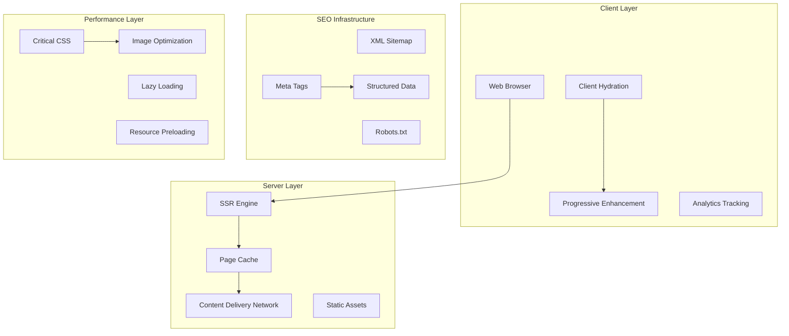

### SEO Data Model

[⬆️ Back to Top](#-table-of-contents)

---


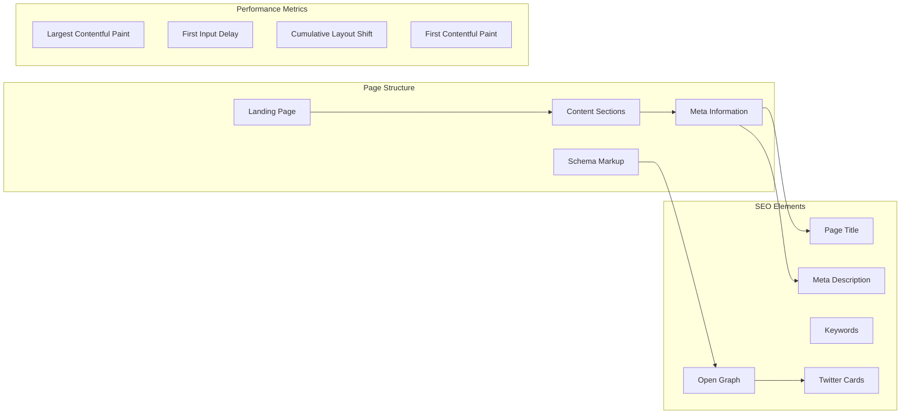

## Low-Level Design (LLD)

[⬆️ Back to Top](#-table-of-contents)

---


### Server-Side Rendering Pipeline

[⬆️ Back to Top](#-table-of-contents)

---


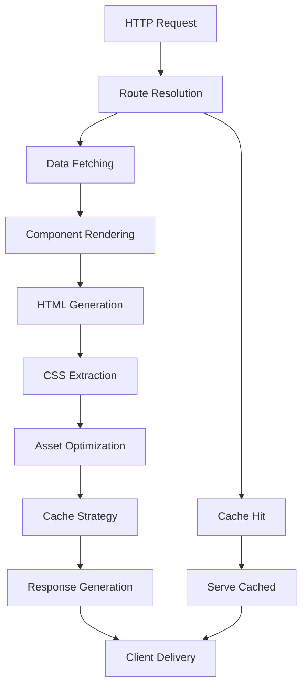

### SEO Optimization Flow

[⬆️ Back to Top](#-table-of-contents)

---


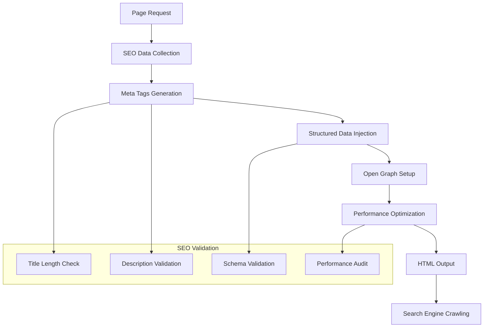

### Progressive Enhancement State Machine

[⬆️ Back to Top](#-table-of-contents)

---


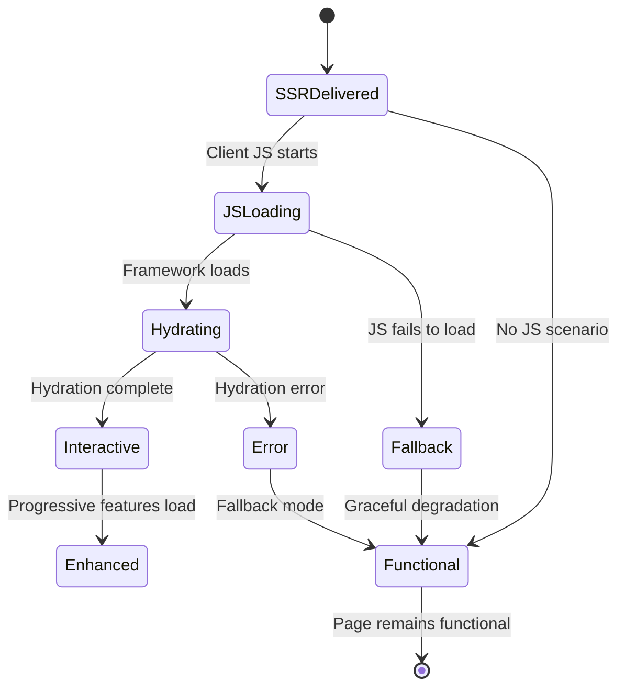

## Core Algorithms

[⬆️ Back to Top](#-table-of-contents)

---


### 1. Critical Path Optimization Algorithm

[⬆️ Back to Top](#-table-of-contents)

---


**Purpose**: Identify and prioritize critical resources for fastest initial page load.

**Critical Resource Identification**:
```
CriticalResource = {
  type: 'css' | 'js' | 'font' | 'image',
  priority: number,
  blocking: boolean,
  async: boolean,
  defer: boolean,
  preload: boolean
}
```

**Critical Path Analysis**:
```
function analyzeCriticalPath(pageContent, viewport):
  criticalResources = []
  
  // Identify above-the-fold content
  aboveFoldElements = extractAboveFoldElements(pageContent, viewport)
  
  for element in aboveFoldElements:
    // CSS required for styling
    requiredCSS = extractRequiredCSS(element)
    criticalResources.push({
      type: 'css',
      content: requiredCSS,
      priority: 1,
      blocking: true
    })
    
    // Critical images
    if element.type === 'image' and element.isVisible:
      criticalResources.push({
        type: 'image',
        url: element.src,
        priority: calculateImagePriority(element),
        preload: true
      })
    
    // Essential fonts
    requiredFonts = extractRequiredFonts(element)
    for font in requiredFonts:
      criticalResources.push({
        type: 'font',
        url: font.url,
        priority: 2,
        preload: true
      })
  
  return prioritizeResources(criticalResources)
```

**Resource Prioritization Strategy**:
- Above-the-fold CSS: Highest priority, inline critical styles
- Hero images: High priority, preload with appropriate formats
- Web fonts: Medium priority, with font-display optimization
- Below-the-fold resources: Lazy load or defer

### 2. Meta Tags Generation Algorithm

[⬆️ Back to Top](#-table-of-contents)

---


**Purpose**: Dynamically generate optimal meta tags for search engines and social media.

**Meta Data Structure**:
```
SEOMetaData = {
  title: string,
  description: string,
  keywords: string[],
  canonicalUrl: string,
  openGraph: OpenGraphData,
  twitterCard: TwitterCardData,
  structuredData: StructuredDataObject[]
}
```

**Meta Tags Optimization**:
```
function generateOptimalMetaTags(pageData, content):
  metaTags = []
  
  // Title optimization (50-60 characters)
  optimizedTitle = optimizeTitle(pageData.title, content.headings)
  metaTags.push({
    name: 'title',
    content: optimizedTitle,
    length: optimizedTitle.length
  })
  
  // Description optimization (150-160 characters)
  optimizedDescription = optimizeDescription(
    pageData.description,
    content.excerpts,
    content.keywords
  )
  metaTags.push({
    name: 'description',
    content: optimizedDescription,
    length: optimizedDescription.length
  })
  
  // Keywords extraction and optimization
  keywords = extractRelevantKeywords(content, pageData.targetKeywords)
  metaTags.push({
    name: 'keywords',
    content: keywords.join(', ')
  })
  
  // Canonical URL
  metaTags.push({
    name: 'canonical',
    href: generateCanonicalUrl(pageData.url)
  })
  
  return metaTags
```

**Dynamic Content Analysis**:
```
function analyzePageContent(content):
  return {
    headings: extractHeadings(content),
    excerpts: generateExcerpts(content),
    keywords: extractKeywords(content),
    images: analyzeImages(content),
    links: analyzeLinks(content),
    readingTime: calculateReadingTime(content)
  }
```

### 3. Structured Data Generation Algorithm

[⬆️ Back to Top](#-table-of-contents)

---


**Purpose**: Create JSON-LD structured data for rich search results.

**Schema Selection Algorithm**:
```
function selectOptimalSchema(pageType, content):
  schemaTypes = []
  
  switch pageType:
    case 'product':
      schemaTypes.push('Product')
      if content.reviews:
        schemaTypes.push('AggregateRating')
    
    case 'article':
      schemaTypes.push('Article')
      if content.author:
        schemaTypes.push('Person')
      if content.organization:
        schemaTypes.push('Organization')
    
    case 'service':
      schemaTypes.push('Service')
      schemaTypes.push('LocalBusiness')
    
    case 'landing':
      schemaTypes.push('WebPage')
      if content.breadcrumbs:
        schemaTypes.push('BreadcrumbList')
  
  return schemaTypes
```

**Schema Data Generation**:
```
function generateStructuredData(schemaTypes, pageData, content):
  structuredData = {
    '@context': 'https://schema.org',
    '@graph': []
  }
  
  for schemaType in schemaTypes:
    schemaObject = createSchemaObject(schemaType, pageData, content)
    
    // Validate schema against standards
    validationResult = validateSchema(schemaObject, schemaType)
    
    if validationResult.isValid:
      structuredData['@graph'].push(schemaObject)
    else:
      logSchemaErrors(validationResult.errors)
  
  return structuredData
```

### 4. Performance Budget Algorithm

[⬆️ Back to Top](#-table-of-contents)

---


**Purpose**: Ensure optimal loading performance through resource budgeting.

**Performance Budget Configuration**:
```
PerformanceBudget = {
  totalSize: 1500,      // KB
  jsSize: 300,          // KB
  cssSize: 100,         // KB
  imageSize: 800,       // KB
  fontSize: 100,        // KB
  requests: 50,         // Maximum requests
  timing: {
    fcp: 1.5,          // First Contentful Paint (seconds)
    lcp: 2.5,          // Largest Contentful Paint (seconds)
    fid: 100,          // First Input Delay (milliseconds)
    cls: 0.1           // Cumulative Layout Shift
  }
}
```

**Budget Enforcement Algorithm**:
```
function enforcePerformanceBudget(resources, budget):
  currentUsage = calculateResourceUsage(resources)
  
  if exceedsBudget(currentUsage, budget):
    optimizations = []
    
    // Image optimization
    if currentUsage.imageSize > budget.imageSize:
      optimizations.push(optimizeImages(resources.images))
    
    // CSS optimization
    if currentUsage.cssSize > budget.cssSize:
      optimizations.push(optimizeCSS(resources.css))
    
    // JavaScript optimization
    if currentUsage.jsSize > budget.jsSize:
      optimizations.push(optimizeJS(resources.js))
    
    // Request reduction
    if currentUsage.requests > budget.requests:
      optimizations.push(consolidateRequests(resources))
    
    return applyOptimizations(optimizations)
  
  return resources
```

### 5. Cache Strategy Algorithm

[⬆️ Back to Top](#-table-of-contents)

---


**Purpose**: Implement intelligent caching for optimal performance and freshness.

**Cache Strategy Selection**:
```
CacheStrategy = {
  static: {
    maxAge: 31536000,    // 1 year
    staleWhileRevalidate: false,
    immutable: true
  },
  dynamic: {
    maxAge: 300,         // 5 minutes
    staleWhileRevalidate: 86400,  // 24 hours
    mustRevalidate: true
  },
  api: {
    maxAge: 60,          // 1 minute
    staleWhileRevalidate: 300,    // 5 minutes
    etag: true
  }
}
```

**Cache Implementation Algorithm**:
```
function implementCacheStrategy(request, content):
  cacheKey = generateCacheKey(request)
  
  // Check cache freshness
  cachedContent = cache.get(cacheKey)
  if cachedContent and isFresh(cachedContent, getCacheStrategy(request)):
    return cachedContent
  
  // Generate fresh content
  freshContent = generateContent(request)
  
  // Apply cache headers
  cacheHeaders = generateCacheHeaders(request, freshContent)
  
  // Store in cache with appropriate strategy
  cache.set(cacheKey, freshContent, cacheHeaders)
  
  return freshContent
```

## Component Architecture

[⬆️ Back to Top](#-table-of-contents)

---


### SSR Landing Page Component Hierarchy

[⬆️ Back to Top](#-table-of-contents)

---


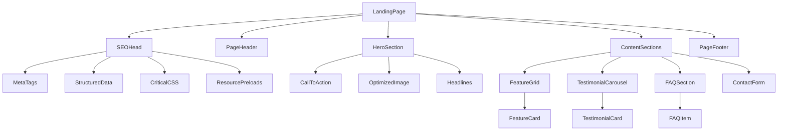

### State Management Architecture

[⬆️ Back to Top](#-table-of-contents)

---


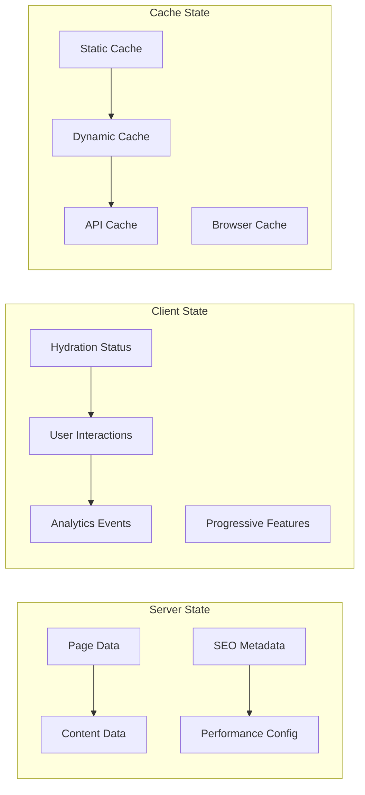

## Advanced Features

[⬆️ Back to Top](#-table-of-contents)

---


### Progressive Web App Integration

[⬆️ Back to Top](#-table-of-contents)

---


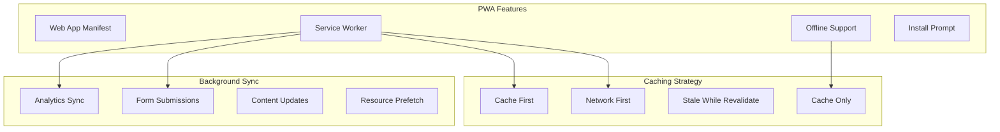

### A/B Testing Framework

[⬆️ Back to Top](#-table-of-contents)

---


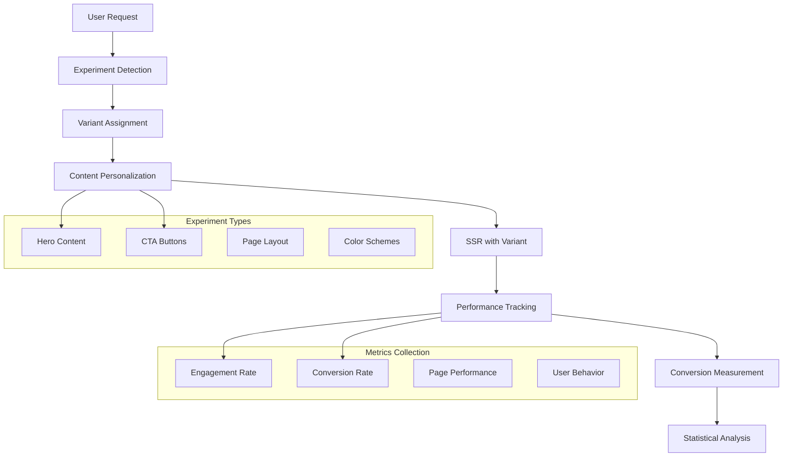

## Performance Optimizations

[⬆️ Back to Top](#-table-of-contents)

---


### Critical CSS Extraction

[⬆️ Back to Top](#-table-of-contents)

---


**Critical CSS Algorithm**:
```
CriticalCSS = {
  aboveFold: string,
  deferredCSS: string,
  mediaQueries: MediaQueryCSS[]
}
```

**Optimization Techniques**:
- Extract above-the-fold styles automatically
- Inline critical CSS in HTML head
- Defer non-critical CSS loading
- Implement font loading optimization
- Use CSS containment for performance

### Image Optimization Pipeline

[⬆️ Back to Top](#-table-of-contents)

---


**Responsive Image Strategy**:
- Generate multiple image sizes automatically
- Implement next-gen format support (WebP, AVIF)
- Use proper aspect ratios to prevent layout shift
- Implement lazy loading with intersection observer
- Optimize images based on device capabilities

### Code Splitting and Bundling

[⬆️ Back to Top](#-table-of-contents)

---


**Bundle Optimization**:
```
BundleStrategy = {
  critical: ['above-fold', 'interactive-elements'],
  deferred: ['below-fold', 'animations', 'analytics'],
  lazy: ['modals', 'forms', 'additional-features']
}
```

## Security Considerations

[⬆️ Back to Top](#-table-of-contents)

---


### Content Security Policy

[⬆️ Back to Top](#-table-of-contents)

---


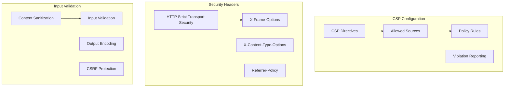

### SEO Security

[⬆️ Back to Top](#-table-of-contents)

---


**Protection Measures**:
- Implement proper canonical URLs to prevent duplicate content
- Use robots.txt strategically
- Protect against SEO spam and negative SEO
- Implement rate limiting for crawlers
- Validate structured data to prevent manipulation

## Accessibility Implementation

[⬆️ Back to Top](#-table-of-contents)

---


### Semantic HTML Structure

[⬆️ Back to Top](#-table-of-contents)

---


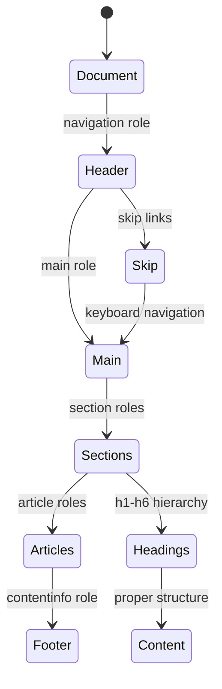

**Accessibility Features**:
- Proper semantic HTML structure
- ARIA labels and landmarks
- Keyboard navigation support
- Screen reader compatibility
- High contrast mode support
- Focus management
- Alternative text for images

### Performance Accessibility

[⬆️ Back to Top](#-table-of-contents)

---


**Inclusive Performance**:
- Respect prefers-reduced-motion
- Implement timeout warnings
- Provide progress indicators
- Support slow network conditions
- Ensure functionality without JavaScript

## SEO Best Practices

[⬆️ Back to Top](#-table-of-contents)

---


### Technical SEO Implementation

[⬆️ Back to Top](#-table-of-contents)

---


**Core Web Vitals Optimization**:
- LCP: Optimize largest contentful paint through image optimization and critical CSS
- FID: Minimize JavaScript execution time and use web workers
- CLS: Prevent layout shifts with proper sizing and loading strategies

**Mobile-First Indexing**:
- Ensure mobile-responsive design
- Implement proper viewport meta tag
- Optimize for mobile page speed
- Use structured data consistently across devices

### Content SEO Strategy

[⬆️ Back to Top](#-table-of-contents)

---


**Content Optimization Algorithm**:
```
function optimizeContentForSEO(content, keywords):
  optimizedContent = {
    title: optimizeTitle(content.title, keywords.primary),
    headings: optimizeHeadings(content.headings, keywords.semantic),
    body: optimizeBodyContent(content.body, keywords.related),
    meta: generateMetaDescription(content.summary, keywords.primary)
  }
  
  // Keyword density optimization
  keywordDensity = calculateKeywordDensity(optimizedContent, keywords)
  if keywordDensity.primary > 0.03: // 3% max density
    optimizedContent = reduceKeywordDensity(optimizedContent, keywords.primary)
  
  return optimizedContent
```

## Testing Strategy

[⬆️ Back to Top](#-table-of-contents)

---


### SEO Testing Framework

[⬆️ Back to Top](#-table-of-contents)

---


**SEO Validation Tests**:
- Meta tags completeness and optimization
- Structured data validation
- Page loading performance
- Mobile responsiveness
- Accessibility compliance

**Performance Testing**:
- Core Web Vitals measurement
- Real user monitoring (RUM)
- Synthetic performance testing
- Lighthouse CI integration
- Bundle analysis and optimization

### A/B Testing Implementation

[⬆️ Back to Top](#-table-of-contents)

---


**Statistical Testing**:
- Proper sample size calculation
- Statistical significance testing
- Conversion rate analysis
- Performance impact measurement
- SEO impact assessment

## Trade-offs and Considerations

[⬆️ Back to Top](#-table-of-contents)

---


### Performance vs SEO

[⬆️ Back to Top](#-table-of-contents)

---

- **Server-side rendering**: SEO benefits vs server load
- **Critical CSS**: Fast loading vs maintenance complexity
- **Image optimization**: Quality vs file size
- **JavaScript hydration**: Interactivity vs loading time

### Maintainability vs Optimization

[⬆️ Back to Top](#-table-of-contents)

---

- **Code splitting**: Performance vs complexity
- **Cache strategies**: Speed vs content freshness
- **Meta tag generation**: Automation vs control
- **Progressive enhancement**: Reliability vs feature richness

### Scalability Considerations

[⬆️ Back to Top](#-table-of-contents)

---

- **Server capacity**: SSR load vs static generation
- **CDN strategy**: Global performance vs cost
- **Cache invalidation**: Performance vs content accuracy
- **Monitoring overhead**: Observability vs performance impact

This server-side rendered landing page system provides a comprehensive foundation for SEO-optimized web pages with advanced features like intelligent caching, performance budgeting, and progressive enhancement while maintaining high search engine visibility and user experience standards. 