# Video Conferencing Frontend with Participant Management


## 📋 Table of Contents

- [Video Conferencing Frontend with Participant Management](#video-conferencing-frontend-with-participant-management)
  - [Table of Contents](#table-of-contents)
  - [Clarify the Problem and Requirements](#clarify-the-problem-and-requirements)
    - [Problem Understanding](#problem-understanding)
    - [Functional Requirements](#functional-requirements)
    - [Non-Functional Requirements](#non-functional-requirements)
    - [Key Assumptions](#key-assumptions)
  - [High-Level Design (HLD)](#high-level-design-hld)
    - [System Architecture Overview](#system-architecture-overview)
    - [Conference Data Model](#conference-data-model)
  - [Low-Level Design (LLD)](#low-level-design-lld)
    - [WebRTC Connection Establishment](#webrtc-connection-establishment)
    - [Participant Management Flow](#participant-management-flow)
    - [Media Processing Pipeline](#media-processing-pipeline)
  - [Core Algorithms](#core-algorithms)
    - [1. Adaptive Bitrate Algorithm for Video Quality](#1-adaptive-bitrate-algorithm-for-video-quality)
    - [2. Intelligent Audio Processing Algorithm](#2-intelligent-audio-processing-algorithm)
    - [3. Participant Layout Algorithm](#3-participant-layout-algorithm)
    - [4. Connection Quality Monitoring Algorithm](#4-connection-quality-monitoring-algorithm)
    - [5. Screen Sharing Optimization Algorithm](#5-screen-sharing-optimization-algorithm)
  - [Component Architecture](#component-architecture)
    - [Video Conferencing Component Hierarchy](#video-conferencing-component-hierarchy)
    - [State Management Architecture](#state-management-architecture)
  - [Advanced Features](#advanced-features)
    - [AI-Powered Features](#ai-powered-features)
    - [Real-time Collaboration Tools](#real-time-collaboration-tools)
  - [Performance Optimizations](#performance-optimizations)
    - [Media Stream Optimization](#media-stream-optimization)
    - [CPU and Memory Optimization](#cpu-and-memory-optimization)
    - [Network Optimization](#network-optimization)
  - [Security Considerations](#security-considerations)
    - [End-to-End Encryption](#end-to-end-encryption)
    - [Privacy Protection](#privacy-protection)
  - [Accessibility Implementation](#accessibility-implementation)
    - [Universal Design](#universal-design)
    - [Inclusive Design Elements](#inclusive-design-elements)
  - [Testing Strategy](#testing-strategy)
    - [Real-time Communication Testing](#real-time-communication-testing)
    - [Cross-platform Testing](#cross-platform-testing)
  - [Trade-offs and Considerations](#trade-offs-and-considerations)
    - [Quality vs Performance](#quality-vs-performance)
    - [Privacy vs Features](#privacy-vs-features)
    - [Scalability Considerations](#scalability-considerations)

---

## Table of Contents
1. [Clarify the Problem and Requirements](#clarify-the-problem-and-requirements)
2. [High-Level Design (HLD)](#high-level-design-hld)
3. [Low-Level Design (LLD)](#low-level-design-lld)
4. [Core Algorithms](#core-algorithms)
5. [Component Architecture](#component-architecture)
6. [Advanced Features](#advanced-features)
7. [TypeScript Interfaces & Component Props](#typescript-interfaces--component-props)
8. [API Reference](#api-reference)
9. [Performance Optimizations](#performance-optimizations)
10. [Security Considerations](#security-considerations)
11. [Accessibility Implementation](#accessibility-implementation)
12. [Testing Strategy](#testing-strategy)
13. [Trade-offs and Considerations](#trade-offs-and-considerations)

---

## Clarify the Problem and Requirements

[⬆️ Back to Top](#--table-of-contents)

---

### Problem Understanding

[⬆️ Back to Top](#--table-of-contents)

---

Design a comprehensive video conferencing frontend application that enables high-quality real-time communication with advanced participant management, collaboration tools, and cross-platform compatibility, similar to Zoom, Microsoft Teams, or Google Meet. The system must handle multiple video streams, audio processing, screen sharing, and interactive features while maintaining excellent performance across various devices and network conditions.

### Functional Requirements

[⬆️ Back to Top](#--table-of-contents)

---

- **Video/Audio Management**: Multi-participant video calls, audio controls, quality adaptation
- **Participant Management**: Join/leave handling, mute controls, participant list, roles/permissions
- **Screen Sharing**: Desktop/application sharing, annotation tools, remote control
- **Chat & Messaging**: Text chat, file sharing, emoji reactions, private messaging
- **Recording & Playback**: Session recording, cloud storage, playback controls
- **Collaboration Tools**: Whiteboard, polls, breakout rooms, hand raising
- **Cross-platform Support**: Web browsers, mobile apps, desktop applications
- **Accessibility Features**: Closed captions, keyboard navigation, screen reader support

### Non-Functional Requirements

[⬆️ Back to Top](#--table-of-contents)

---

- **Performance**: <200ms audio latency, <500ms video latency, 30fps video quality
- **Scalability**: Support 1000+ participants per call, multiple concurrent calls
- **Reliability**: 99.9% call success rate, automatic reconnection, fallback mechanisms
- **Quality**: Adaptive bitrate, echo cancellation, noise suppression
- **Security**: End-to-end encryption, secure authentication, privacy controls
- **Cross-browser**: Consistent experience across Chrome, Safari, Firefox, Edge
- **Mobile Optimization**: Touch-optimized UI, battery efficiency, mobile-specific features
- **Network Resilience**: Handle poor connectivity, bandwidth adaptation, offline indicators

### Key Assumptions

[⬆️ Back to Top](#--table-of-contents)

---

- Typical meeting size: 2-50 participants, maximum 1000 for webinars
- Average call duration: 30-60 minutes, maximum 8+ hours
- Device distribution: 60% desktop, 30% mobile, 10% tablets
- Network conditions: Variable from 3G mobile to high-speed broadband
- Primary use cases: Business meetings, education, social calls, webinars
- Geographic distribution: Global with regional clusters
- Browser capabilities: Modern browsers with WebRTC support
- Hardware requirements: Camera, microphone, speakers standard on most devices

---

## High-Level Design (HLD)

[⬆️ Back to Top](#--table-of-contents)

---


### System Architecture Overview

[⬆️ Back to Top](#--table-of-contents)

---


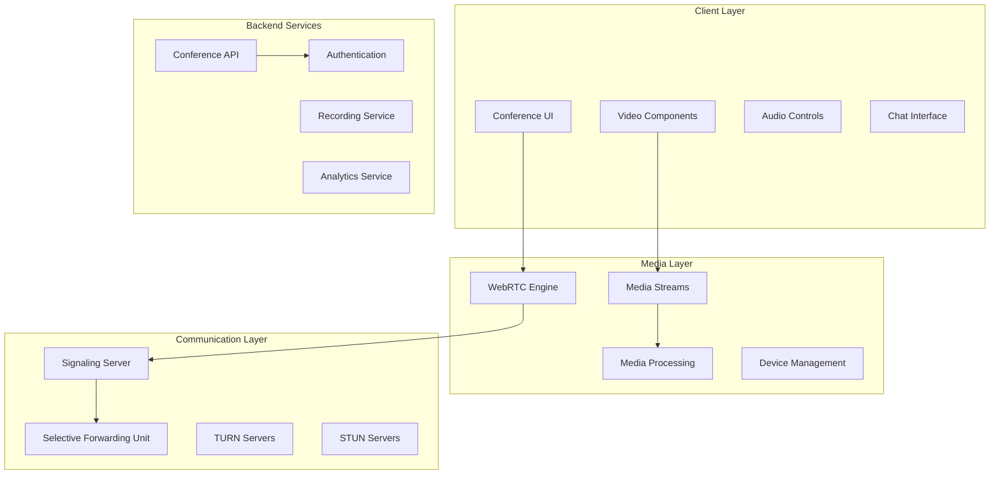

### Conference Data Model

[⬆️ Back to Top](#--table-of-contents)

---


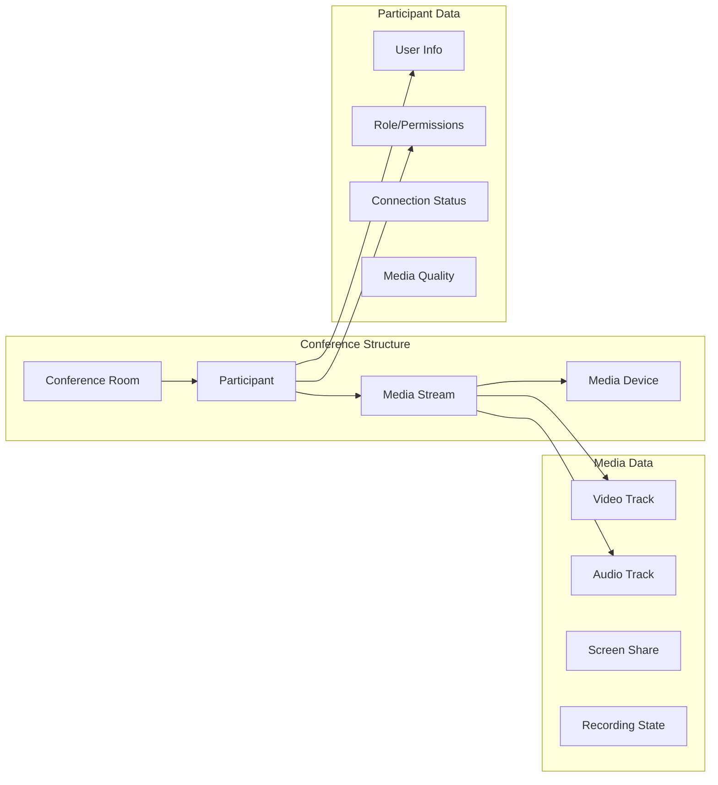

## Low-Level Design (LLD)

[⬆️ Back to Top](#--table-of-contents)

---


### WebRTC Connection Establishment

[⬆️ Back to Top](#--table-of-contents)

---


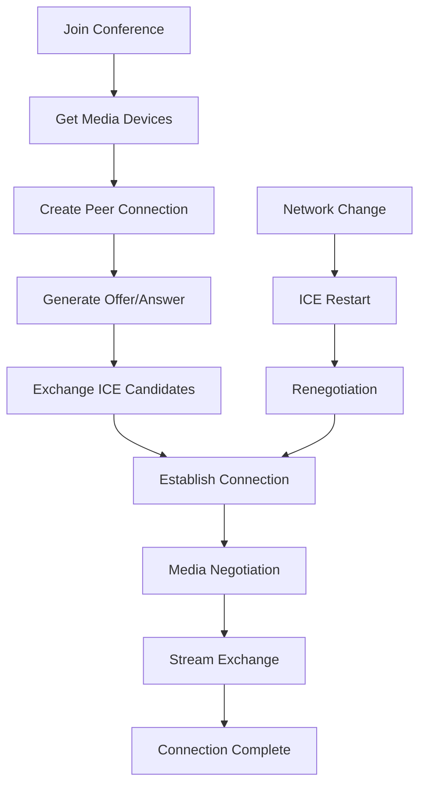

### Participant Management Flow

[⬆️ Back to Top](#--table-of-contents)

---


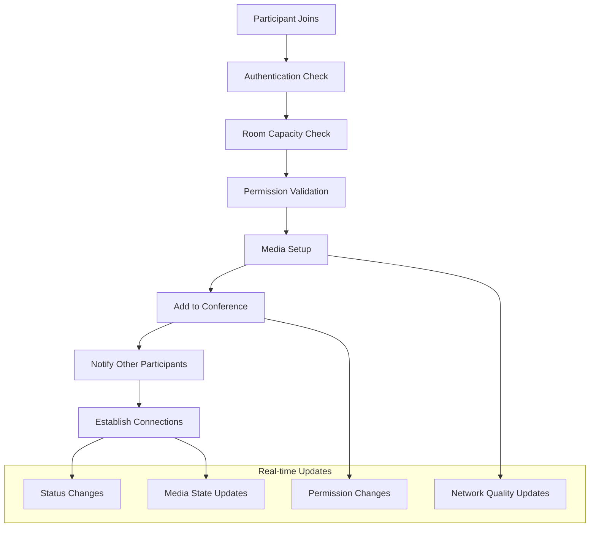

### Media Processing Pipeline

[⬆️ Back to Top](#--table-of-contents)

---


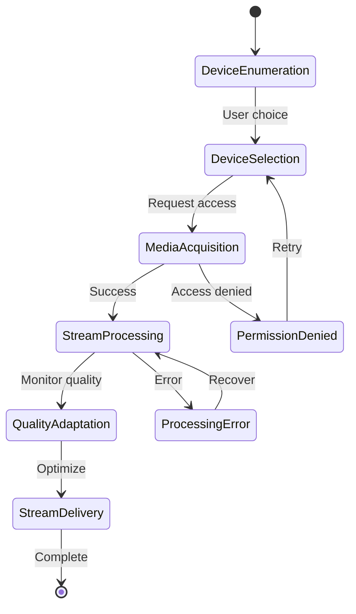

## Core Algorithms

[⬆️ Back to Top](#--table-of-contents)

---


### 1. Adaptive Bitrate Algorithm for Video Quality

[⬆️ Back to Top](#--table-of-contents)

---


**Purpose**: Dynamically adjust video quality based on network conditions and device capabilities.

**Quality Adaptation Parameters**:
```
VideoQualityConfig = {
  resolutions: [
    { width: 320, height: 240, bitrate: 150, fps: 15, name: 'low' },
    { width: 640, height: 480, bitrate: 500, fps: 24, name: 'medium' },
    { width: 1280, height: 720, bitrate: 1200, fps: 30, name: 'high' },
    { width: 1920, height: 1080, bitrate: 2500, fps: 30, name: 'hd' }
  ],
  thresholds: {
    upgrade: 0.8,    // Network quality threshold to upgrade
    downgrade: 0.3,  // Network quality threshold to downgrade
    stability: 5000  // Time to wait before quality change (ms)
  }
}
```

**Quality Adaptation Algorithm**:
```
function adaptVideoQuality(networkStats, currentQuality, participantCount):
  // Calculate network quality score (0-1)
  qualityScore = calculateNetworkQuality(networkStats)
  
  // Adjust thresholds based on participant count
  adjustedThresholds = adjustThresholdsForLoad(
    qualityConfig.thresholds, 
    participantCount
  )
  
  // Determine target quality
  targetQuality = currentQuality
  
  if qualityScore < adjustedThresholds.downgrade:
    targetQuality = getNextLowerQuality(currentQuality)
  else if qualityScore > adjustedThresholds.upgrade:
    targetQuality = getNextHigherQuality(currentQuality)
  
  // Apply stability filter to prevent oscillation
  if shouldApplyQualityChange(targetQuality, currentQuality, adjustedThresholds.stability):
    return applyQualityChange(targetQuality)
  
  return currentQuality
```

**Network Quality Calculation**:
```
function calculateNetworkQuality(stats):
  // Weighted factors for quality calculation
  factors = {
    bandwidth: stats.availableBandwidth / stats.requiredBandwidth,
    packetLoss: 1 - (stats.packetsLost / stats.packetsSent),
    latency: Math.max(0, 1 - (stats.roundTripTime / 1000)), // RTT in ms
    jitter: Math.max(0, 1 - (stats.jitter / 100)) // Jitter in ms
  }
  
  // Weighted average
  qualityScore = (
    factors.bandwidth * 0.4 +
    factors.packetLoss * 0.3 +
    factors.latency * 0.2 +
    factors.jitter * 0.1
  )
  
  return Math.max(0, Math.min(1, qualityScore))
```

### 2. Intelligent Audio Processing Algorithm

[⬆️ Back to Top](#--table-of-contents)

---


**Purpose**: Enhance audio quality through noise reduction, echo cancellation, and automatic gain control.

**Audio Processing Pipeline**:
```
AudioProcessingChain = {
  noiseSuppression: {
    enabled: true,
    level: 'high', // 'low', 'medium', 'high'
    adaptiveMode: true
  },
  echoCancellation: {
    enabled: true,
    aggressiveMode: false,
    tailLength: 200 // milliseconds
  },
  autoGainControl: {
    enabled: true,
    targetLevel: -18, // dBFS
    compression: 'medium'
  }
}
```

**Adaptive Audio Processing**:
```
function processAudioStream(audioTrack, environment, participants):
  processingSettings = { ...baseAudioProcessing }
  
  // Adjust based on environment
  if environment.noisyEnvironment:
    processingSettings.noiseSuppression.level = 'high'
    processingSettings.autoGainControl.compression = 'high'
  
  // Adjust based on participant count
  if participants.length > 5:
    processingSettings.echoCancellation.aggressiveMode = true
    processingSettings.noiseSuppression.adaptiveMode = true
  
  // Apply real-time audio analysis
  audioMetrics = analyzeAudioQuality(audioTrack)
  
  if audioMetrics.backgroundNoise > 0.3:
    processingSettings.noiseSuppression.level = 'high'
  
  if audioMetrics.echoDetected:
    processingSettings.echoCancellation.aggressiveMode = true
  
  return applyAudioProcessing(audioTrack, processingSettings)
```

### 3. Participant Layout Algorithm

[⬆️ Back to Top](#--table-of-contents)

---


**Purpose**: Optimize participant video layout based on screen size, participant count, and focus modes.

**Layout Configuration**:
```
LayoutConfig = {
  maxParticipantsInGrid: 25,
  aspectRatio: 16/9,
  minParticipantSize: { width: 160, height: 90 },
  maxParticipantSize: { width: 320, height: 180 },
  padding: 8,
  focusMode: 'speaker' | 'grid' | 'presentation'
}
```

**Dynamic Layout Calculation**:
```
function calculateOptimalLayout(participants, containerSize, focusMode):
  if focusMode === 'presentation':
    return calculatePresentationLayout(participants, containerSize)
  else if focusMode === 'speaker':
    return calculateSpeakerLayout(participants, containerSize)
  else:
    return calculateGridLayout(participants, containerSize)

function calculateGridLayout(participants, containerSize):
  participantCount = participants.length
  
  // Calculate optimal grid dimensions
  cols = Math.ceil(Math.sqrt(participantCount))
  rows = Math.ceil(participantCount / cols)
  
  // Calculate participant dimensions
  availableWidth = containerSize.width - (padding * (cols + 1))
  availableHeight = containerSize.height - (padding * (rows + 1))
  
  participantWidth = Math.min(
    availableWidth / cols,
    layoutConfig.maxParticipantSize.width
  )
  
  participantHeight = Math.min(
    availableHeight / rows,
    layoutConfig.maxParticipantSize.height
  )
  
  // Maintain aspect ratio
  if participantWidth / participantHeight > layoutConfig.aspectRatio:
    participantWidth = participantHeight * layoutConfig.aspectRatio
  else:
    participantHeight = participantWidth / layoutConfig.aspectRatio
  
  // Generate positions
  positions = []
  for i, participant in participants:
    row = Math.floor(i / cols)
    col = i % cols
    
    positions.push({
      participant: participant.id,
      x: padding + col * (participantWidth + padding),
      y: padding + row * (participantHeight + padding),
      width: participantWidth,
      height: participantHeight
    })
  
  return positions
```

### 4. Connection Quality Monitoring Algorithm

[⬆️ Back to Top](#--table-of-contents)

---


**Purpose**: Monitor and report connection quality metrics for all participants.

**Quality Metrics Collection**:
```
ConnectionMetrics = {
  video: {
    resolution: { width: number, height: number },
    framerate: number,
    bitrate: number,
    packetsLost: number,
    packetsReceived: number,
    jitter: number
  },
  audio: {
    bitrate: number,
    packetsLost: number,
    packetsReceived: number,
    audioLevel: number,
    jitter: number
  },
  network: {
    roundTripTime: number,
    availableBandwidth: number,
    connectionType: string
  }
}
```

**Quality Assessment Algorithm**:
```
function assessConnectionQuality(metrics, duration):
  scores = {
    video: calculateVideoQualityScore(metrics.video),
    audio: calculateAudioQualityScore(metrics.audio),
    network: calculateNetworkQualityScore(metrics.network)
  }
  
  // Weighted overall score
  overallScore = (
    scores.video * 0.4 +
    scores.audio * 0.3 +
    scores.network * 0.3
  )
  
  // Determine quality level
  if overallScore >= 0.8:
    return 'excellent'
  else if overallScore >= 0.6:
    return 'good'
  else if overallScore >= 0.4:
    return 'fair'
  else:
    return 'poor'
```

**Automatic Recovery Strategies**:
```
function handleConnectionIssues(qualityLevel, metrics, participant):
  recoveryActions = []
  
  if qualityLevel === 'poor':
    // Aggressive quality reduction
    recoveryActions.push('reduce_video_quality')
    recoveryActions.push('reduce_framerate')
    
    if metrics.network.roundTripTime > 500:
      recoveryActions.push('switch_to_audio_only')
  
  else if qualityLevel === 'fair':
    // Moderate adjustments
    recoveryActions.push('reduce_bitrate')
    
    if metrics.video.packetsLost / metrics.video.packetsReceived > 0.05:
      recoveryActions.push('reduce_video_quality')
  
  return applyRecoveryActions(recoveryActions, participant)
```

### 5. Screen Sharing Optimization Algorithm

[⬆️ Back to Top](#--table-of-contents)

---


**Purpose**: Optimize screen sharing quality based on content type and network conditions.

**Content Type Detection**:
```
function detectScreenContent(screenStream):
  contentAnalysis = analyzeFrames(screenStream)
  
  if contentAnalysis.motionLevel > 0.7:
    return 'video' // Video content detected
  else if contentAnalysis.textRatio > 0.5:
    return 'text' // Text/document content
  else if contentAnalysis.imageRatio > 0.6:
    return 'images' // Image-heavy content
  else:
    return 'mixed' // Mixed content
```

**Dynamic Optimization Strategy**:
```
function optimizeScreenShare(contentType, networkQuality, audienceSize):
  optimizationSettings = {}
  
  switch contentType:
    case 'text':
      optimizationSettings = {
        framerate: 5,
        bitrate: 500,
        resolution: 'high',
        encoding: 'screen'
      }
      break
    
    case 'video':
      optimizationSettings = {
        framerate: 30,
        bitrate: 2000,
        resolution: 'medium',
        encoding: 'motion'
      }
      break
    
    case 'images':
      optimizationSettings = {
        framerate: 10,
        bitrate: 1000,
        resolution: 'high',
        encoding: 'detail'
      }
      break
  
  // Adjust for network quality
  if networkQuality < 0.5:
    optimizationSettings.bitrate *= 0.6
    optimizationSettings.framerate *= 0.7
  
  // Adjust for audience size
  if audienceSize > 10:
    optimizationSettings.resolution = 'medium'
    optimizationSettings.bitrate *= 0.8
  
  return optimizationSettings
```

## Component Architecture

[⬆️ Back to Top](#--table-of-contents)

---


### Video Conferencing Component Hierarchy

[⬆️ Back to Top](#--table-of-contents)

---


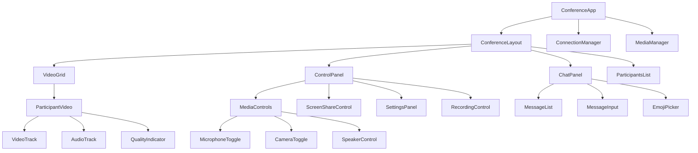

### State Management Architecture

[⬆️ Back to Top](#--table-of-contents)

---


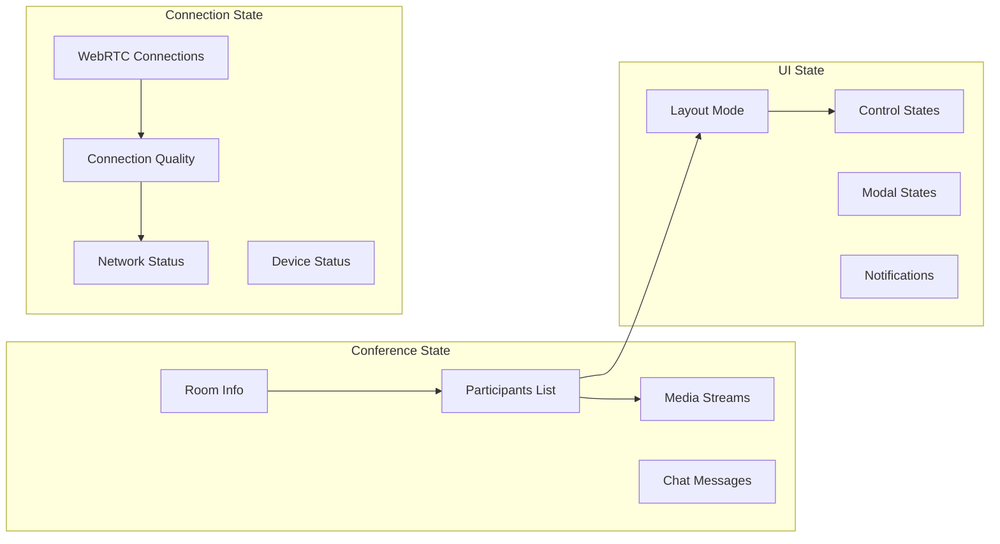

#### React Component Implementation

[⬆️ Back to Top](#--table-of-contents)

---

**ConferenceApp.jsx**
```jsx
import React, { useState, useEffect, useCallback } from 'react';
import { ConferenceProvider } from './ConferenceContext';
import ConferenceLayout from './ConferenceLayout';
import ConnectionManager from './ConnectionManager';
import MediaManager from './MediaManager';
import { useWebRTC } from './hooks/useWebRTC';
import { useMediaDevices } from './hooks/useMediaDevices';

const ConferenceApp = ({ roomId, userId, userName }) => {
  const [participants, setParticipants] = useState([]);
  const [localStream, setLocalStream] = useState(null);
  const [remoteStreams, setRemoteStreams] = useState(new Map());
  const [chatMessages, setChatMessages] = useState([]);
  const [connectionQuality, setConnectionQuality] = useState('good');
  const [isAudioMuted, setIsAudioMuted] = useState(false);
  const [isVideoMuted, setIsVideoMuted] = useState(false);
  const [isScreenSharing, setIsScreenSharing] = useState(false);
  const [layoutMode, setLayoutMode] = useState('grid'); // 'grid', 'speaker', 'sidebar'
  const [showChat, setShowChat] = useState(false);
  const [isRecording, setIsRecording] = useState(false);

  const {
    peerConnections,
    localPeerConnection,
    connectToRoom,
    disconnectFromRoom,
    sendMessage,
    isConnected
  } = useWebRTC({
    roomId,
    userId,
    onParticipantJoined: handleParticipantJoined,
    onParticipantLeft: handleParticipantLeft,
    onRemoteStream: handleRemoteStream,
    onMessage: handleMessage,
    onConnectionQualityChange: setConnectionQuality
  });

  const {
    devices,
    selectedCamera,
    selectedMicrophone,
    selectedSpeaker,
    switchCamera,
    switchMicrophone,
    switchSpeaker
  } = useMediaDevices();

  useEffect(() => {
    initializeMedia();
    return () => {
      cleanup();
    };
  }, []);

  const initializeMedia = async () => {
    try {
      const stream = await navigator.mediaDevices.getUserMedia({
        video: {
          width: { ideal: 1280 },
          height: { ideal: 720 },
          frameRate: { ideal: 30 }
        },
        audio: {
          echoCancellation: true,
          noiseSuppression: true,
          autoGainControl: true
        }
      });

      setLocalStream(stream);
      connectToRoom(stream);
    } catch (error) {
      console.error('Failed to initialize media:', error);
    }
  };

  const cleanup = () => {
    localStream?.getTracks().forEach(track => track.stop());
    disconnectFromRoom();
  };

  const handleParticipantJoined = useCallback((participant) => {
    setParticipants(prev => [...prev, participant]);
  }, []);

  const handleParticipantLeft = useCallback((participantId) => {
    setParticipants(prev => prev.filter(p => p.id !== participantId));
    setRemoteStreams(prev => {
      const newStreams = new Map(prev);
      newStreams.delete(participantId);
      return newStreams;
    });
  }, []);

  const handleRemoteStream = useCallback((participantId, stream) => {
    setRemoteStreams(prev => new Map(prev).set(participantId, stream));
  }, []);

  const handleMessage = useCallback((message) => {
    setChatMessages(prev => [...prev, {
      id: Date.now(),
      ...message,
      timestamp: new Date()
    }]);
  }, []);

  const toggleAudio = useCallback(() => {
    if (localStream) {
      const audioTrack = localStream.getAudioTracks()[0];
      if (audioTrack) {
        audioTrack.enabled = !audioTrack.enabled;
        setIsAudioMuted(!audioTrack.enabled);
      }
    }
  }, [localStream]);

  const toggleVideo = useCallback(() => {
    if (localStream) {
      const videoTrack = localStream.getVideoTracks()[0];
      if (videoTrack) {
        videoTrack.enabled = !videoTrack.enabled;
        setIsVideoMuted(!videoTrack.enabled);
      }
    }
  }, [localStream]);

  const startScreenShare = useCallback(async () => {
    try {
      const screenStream = await navigator.mediaDevices.getDisplayMedia({
        video: true,
        audio: true
      });

      // Replace video track in peer connections
      const videoTrack = screenStream.getVideoTracks()[0];
      
      peerConnections.forEach(pc => {
        const sender = pc.getSenders().find(s => s.track?.kind === 'video');
        if (sender) {
          sender.replaceTrack(videoTrack);
        }
      });

      setIsScreenSharing(true);
      
      videoTrack.onended = () => {
        stopScreenShare();
      };
    } catch (error) {
      console.error('Failed to start screen share:', error);
    }
  }, [peerConnections]);

  const stopScreenShare = useCallback(async () => {
    try {
      // Get camera stream back
      const cameraStream = await navigator.mediaDevices.getUserMedia({
        video: true
      });

      const videoTrack = cameraStream.getVideoTracks()[0];
      
      peerConnections.forEach(pc => {
        const sender = pc.getSenders().find(s => s.track?.kind === 'video');
        if (sender) {
          sender.replaceTrack(videoTrack);
        }
      });

      setIsScreenSharing(false);
    } catch (error) {
      console.error('Failed to stop screen share:', error);
    }
  }, [peerConnections]);

  const sendChatMessage = useCallback((message) => {
    const messageData = {
      text: message,
      userId,
      userName,
      timestamp: Date.now()
    };

    sendMessage(messageData);
    setChatMessages(prev => [...prev, messageData]);
  }, [sendMessage, userId, userName]);

  const value = {
    // State
    participants,
    localStream,
    remoteStreams,
    chatMessages,
    connectionQuality,
    isAudioMuted,
    isVideoMuted,
    isScreenSharing,
    layoutMode,
    showChat,
    isRecording,
    isConnected,
    devices,
    selectedCamera,
    selectedMicrophone,
    selectedSpeaker,
    
    // Actions
    toggleAudio,
    toggleVideo,
    startScreenShare,
    stopScreenShare,
    sendChatMessage,
    setLayoutMode,
    setShowChat,
    switchCamera,
    switchMicrophone,
    switchSpeaker
  };

  return (
    <ConferenceProvider value={value}>
      <div className="conference-app">
        <ConnectionManager />
        <MediaManager />
        <ConferenceLayout />
      </div>
    </ConferenceProvider>
  );
};

export default ConferenceApp;
```

**VideoGrid.jsx**
```jsx
import React, { useContext, useMemo } from 'react';
import { ConferenceContext } from './ConferenceContext';
import ParticipantVideo from './ParticipantVideo';

const VideoGrid = () => {
  const { 
    participants, 
    localStream, 
    remoteStreams, 
    layoutMode,
    userId 
  } = useContext(ConferenceContext);

  const allParticipants = useMemo(() => {
    const local = {
      id: userId,
      name: 'You',
      stream: localStream,
      isLocal: true
    };

    const remote = participants.map(p => ({
      ...p,
      stream: remoteStreams.get(p.id),
      isLocal: false
    }));

    return [local, ...remote];
  }, [participants, localStream, remoteStreams, userId]);

  const gridLayout = useMemo(() => {
    const count = allParticipants.length;
    
    if (count <= 1) return { cols: 1, rows: 1 };
    if (count <= 4) return { cols: 2, rows: 2 };
    if (count <= 9) return { cols: 3, rows: 3 };
    if (count <= 16) return { cols: 4, rows: 4 };
    
    return { cols: 5, rows: Math.ceil(count / 5) };
  }, [allParticipants.length]);

  const getParticipantStyle = (index) => {
    if (layoutMode === 'speaker') {
      // First participant (speaker) takes most space
      if (index === 0) {
        return {
          gridColumn: '1 / -1',
          gridRow: '1 / 3'
        };
      }
      // Others in sidebar
      return {
        gridColumn: gridLayout.cols,
        gridRow: index
      };
    }

    // Default grid layout
    return {};
  };

  return (
    <div 
      className={`video-grid ${layoutMode}`}
      style={{
        display: 'grid',
        gridTemplateColumns: `repeat(${gridLayout.cols}, 1fr)`,
        gridTemplateRows: `repeat(${gridLayout.rows}, 1fr)`,
        gap: '8px',
        padding: '16px'
      }}
    >
      {allParticipants.map((participant, index) => (
        <ParticipantVideo
          key={participant.id}
          participant={participant}
          style={getParticipantStyle(index)}
          isPrimary={layoutMode === 'speaker' && index === 0}
        />
      ))}
    </div>
  );
};

export default VideoGrid;
```

## Advanced Features

[⬆️ Back to Top](#--table-of-contents)

---


### AI-Powered Features

[⬆️ Back to Top](#--table-of-contents)

---


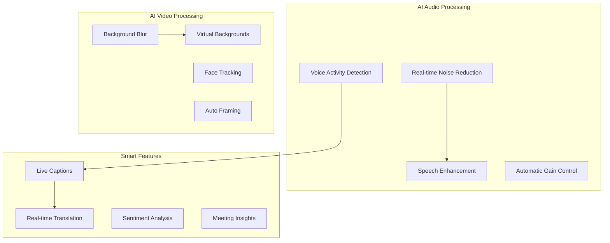

### Real-time Collaboration Tools

[⬆️ Back to Top](#--table-of-contents)

---


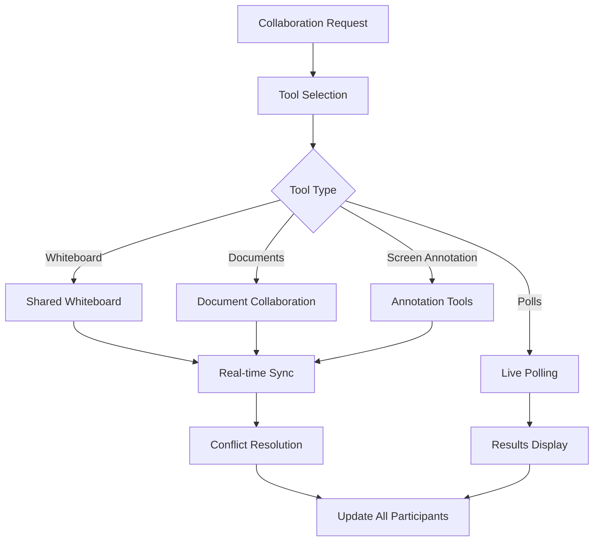

### TypeScript Interfaces & Component Props

[⬆️ Back to Top](#--table-of-contents)

---

#### Core Data Interfaces

```typescript
interface VideoRoom {
  id: string;
  name: string;
  hostId: string;
  participants: Participant[];
  settings: RoomSettings;
  recording?: RecordingSession;
  startTime: Date;
  endTime?: Date;
  maxParticipants: number;
  isLocked: boolean;
  waitingRoom: boolean;
}

interface Participant {
  id: string;
  userId: string;
  displayName: string;
  role: 'host' | 'moderator' | 'participant';
  audioEnabled: boolean;
  videoEnabled: boolean;
  screenShareEnabled: boolean;
  joinTime: Date;
  lastSeen: Date;
  connectionQuality: ConnectionQuality;
  permissions: ParticipantPermissions;
}

interface MediaStream {
  id: string;
  participantId: string;
  type: 'camera' | 'screen' | 'audio';
  track: MediaStreamTrack;
  constraints: MediaTrackConstraints;
  quality: 'low' | 'medium' | 'high' | 'auto';
  bandwidth: number;
  resolution?: VideoResolution;
  isActive: boolean;
}

interface RoomSettings {
  allowChat: boolean;
  allowScreenShare: boolean;
  allowRecording: boolean;
  requirePermissionToSpeak: boolean;
  enableWaitingRoom: boolean;
  maxDuration?: number;
  backgroundBlur: boolean;
  noiseSuppression: boolean;
  echoCancellation: boolean;
}

interface ChatMessage {
  id: string;
  senderId: string;
  senderName: string;
  content: string;
  timestamp: Date;
  type: 'text' | 'file' | 'emoji' | 'system';
  isPrivate: boolean;
  recipientId?: string;
  reactions: MessageReaction[];
}

interface ConnectionQuality {
  bandwidth: number;
  latency: number;
  packetLoss: number;
  jitter: number;
  resolution: VideoResolution;
  frameRate: number;
  rating: 'excellent' | 'good' | 'fair' | 'poor';
}
```

#### Component Props Interfaces

```typescript
interface VideoConferenceProps {
  roomId: string;
  userId: string;
  onRoomJoin: (room: VideoRoom) => void;
  onRoomLeave: () => void;
  onError: (error: ConferenceError) => void;
  enableChat?: boolean;
  enableScreenShare?: boolean;
  enableRecording?: boolean;
  autoJoinAudio?: boolean;
  autoJoinVideo?: boolean;
}

interface VideoGridProps {
  participants: Participant[];
  streams: MediaStream[];
  onParticipantClick: (participant: Participant) => void;
  onStreamToggle: (streamId: string, enabled: boolean) => void;
  layout: 'grid' | 'spotlight' | 'sidebar';
  maxVisible?: number;
  showConnectionQuality?: boolean;
  enablePinning?: boolean;
}

interface MediaControlsProps {
  isAudioEnabled: boolean;
  isVideoEnabled: boolean;
  isScreenSharing: boolean;
  onAudioToggle: () => void;
  onVideoToggle: () => void;
  onScreenShareToggle: () => void;
  onEndCall: () => void;
  onSettingsOpen: () => void;
  showRecordButton?: boolean;
  showChatButton?: boolean;
}

interface ChatPanelProps {
  messages: ChatMessage[];
  onMessageSend: (message: string) => void;
  onPrivateMessage: (recipientId: string, message: string) => void;
  onReaction: (messageId: string, emoji: string) => void;
  participants: Participant[];
  currentUserId: string;
  showEmojis?: boolean;
  enableFileSharing?: boolean;
}

interface ParticipantListProps {
  participants: Participant[];
  currentUserId: string;
  onParticipantAction: (participantId: string, action: string) => void;
  onPermissionChange: (participantId: string, permissions: Partial<ParticipantPermissions>) => void;
  showConnectionQuality?: boolean;
  enableModeration?: boolean;
  isHost?: boolean;
}

interface ScreenShareViewProps {
  stream: MediaStream;
  annotations: Annotation[];
  onAnnotationAdd: (annotation: Annotation) => void;
  onAnnotationUpdate: (id: string, updates: Partial<Annotation>) => void;
  enableAnnotations?: boolean;
  showControls?: boolean;
  quality?: 'low' | 'medium' | 'high';
}
```

### API Reference

[⬆️ Back to Top](#--table-of-contents)

---

#### Room Management
- `POST /api/rooms` - Create new video conference room with settings
- `GET /api/rooms/:id` - Get room details and current participants
- `PUT /api/rooms/:id` - Update room settings or metadata
- `DELETE /api/rooms/:id` - End room and disconnect all participants
- `POST /api/rooms/:id/join` - Join room with authentication and permissions

#### Participant Operations
- `GET /api/rooms/:id/participants` - Get current participants in room
- `POST /api/rooms/:id/participants/:userId/kick` - Remove participant from room
- `PUT /api/rooms/:id/participants/:userId/role` - Update participant role and permissions
- `POST /api/rooms/:id/participants/:userId/mute` - Mute or unmute participant
- `PUT /api/rooms/:id/participants/:userId/permissions` - Modify participant permissions

#### Media & Streaming
- `POST /api/rooms/:id/media/publish` - Publish audio/video stream to room
- `DELETE /api/rooms/:id/media/:streamId` - Stop publishing specific stream
- `PUT /api/rooms/:id/media/:streamId/quality` - Adjust stream quality settings
- `GET /api/rooms/:id/media/stats` - Get streaming statistics and quality metrics
- `POST /api/rooms/:id/screenshare/start` - Start screen sharing session

#### Real-time Communication
- `WS /api/rooms/:id/connect` - WebSocket connection for real-time updates
- `WS PARTICIPANT_JOINED` - Notify when participant joins room
- `WS MEDIA_STREAM_STARTED` - Broadcast new media stream availability
- `WS CHAT_MESSAGE` - Real-time chat message delivery
- `WS CONNECTION_QUALITY` - Real-time connection quality updates

#### Chat & Messaging
- `POST /api/rooms/:id/chat/message` - Send text message to room or participant
- `GET /api/rooms/:id/chat/history` - Get chat message history
- `POST /api/rooms/:id/chat/file` - Share file in chat with upload
- `PUT /api/chat/messages/:id/react` - Add reaction to chat message
- `DELETE /api/chat/messages/:id` - Delete chat message (moderator only)

#### Recording & Playback
- `POST /api/rooms/:id/recording/start` - Start recording conference session
- `POST /api/rooms/:id/recording/stop` - Stop recording and process video
- `GET /api/recordings/:id` - Get recording details and download link
- `GET /api/recordings/:id/thumbnail` - Get video thumbnail for recording
- `PUT /api/recordings/:id/settings` - Update recording privacy and settings

#### Screen Sharing & Collaboration
- `POST /api/rooms/:id/screenshare/annotations` - Add annotation to shared screen
- `PUT /api/annotations/:id` - Update annotation position or content
- `DELETE /api/annotations/:id` - Remove annotation from screen
- `GET /api/rooms/:id/screenshare/history` - Get screen sharing session history
- `POST /api/rooms/:id/whiteboard/create` - Create collaborative whiteboard

#### Quality & Diagnostics
- `GET /api/rooms/:id/quality/stats` - Get detailed quality statistics for room
- `POST /api/rooms/:id/quality/test` - Run network quality test for participant
- `GET /api/diagnostics/connection` - Get connection diagnostics and recommendations
- `POST /api/diagnostics/report` - Report technical issues with details
- `GET /api/rooms/:id/bandwidth` - Get bandwidth usage and optimization suggestions

#### Integration & Webhooks
- `POST /api/webhooks/room-events` - Configure webhooks for room events
- `GET /api/calendar/meetings` - Get upcoming scheduled meetings
- `POST /api/calendar/schedule` - Schedule new video conference meeting
- `PUT /api/integrations/settings` - Configure third-party integrations
- `GET /api/rooms/:id/export` - Export room data and analytics

---

## Performance Optimizations

[⬆️ Back to Top](#--table-of-contents)

---


### Media Stream Optimization

[⬆️ Back to Top](#--table-of-contents)

---


**Bandwidth Management**:
```
BandwidthAllocation = {
  totalBandwidth: number,
  allocation: {
    ownVideo: 0.3,
    ownAudio: 0.1,
    receivedStreams: 0.5,
    signaling: 0.05,
    chat: 0.05
  }
}
```

**Stream Prioritization**:
- Active speaker: Highest priority
- Participants in view: High priority
- Screen sharing: Maximum quality
- Background participants: Reduced quality

### CPU and Memory Optimization

[⬆️ Back to Top](#--table-of-contents)

---


**Resource Management**:
- Implement video frame pooling
- Use hardware acceleration where available
- Optimize DOM updates for participant changes
- Implement efficient audio/video processing
- Use WebAssembly for intensive operations

### Network Optimization

[⬆️ Back to Top](#--table-of-contents)

---


**Adaptive Networking**:
- Implement network condition detection
- Use multiple TURN servers for redundancy
- Implement bandwidth estimation
- Optimize signaling message efficiency
- Use delta compression for frequent updates

## Security Considerations

[⬆️ Back to Top](#--table-of-contents)

---


### End-to-End Encryption

[⬆️ Back to Top](#--table-of-contents)

---


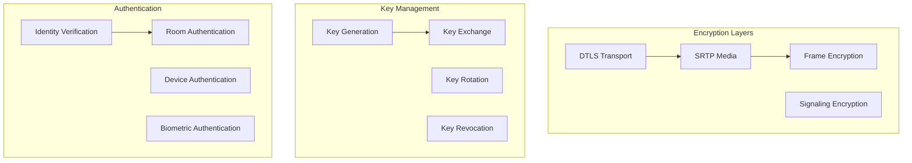

### Privacy Protection

[⬆️ Back to Top](#--table-of-contents)

---


**Data Protection Measures**:
- Implement waiting rooms for access control
- Provide meeting passwords and PINs
- Enable participant approval workflows
- Implement recording consent mechanisms
- Ensure GDPR/CCPA compliance

## Accessibility Implementation

[⬆️ Back to Top](#--table-of-contents)

---


### Universal Design

[⬆️ Back to Top](#--table-of-contents)

---


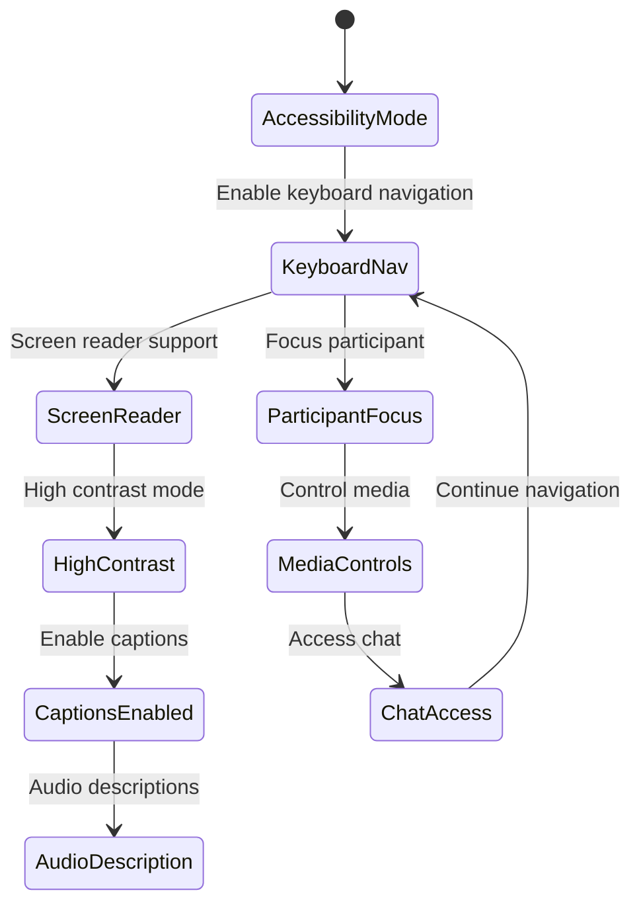

**Accessibility Features**:
- Comprehensive keyboard navigation
- Screen reader compatibility
- Live captions and transcripts
- High contrast visual modes
- Customizable font sizes
- Audio descriptions for visual content
- Sign language interpretation support

### Inclusive Design Elements

[⬆️ Back to Top](#--table-of-contents)

---


**Multi-modal Communication**:
- Text chat alongside video/audio
- Visual indicators for audio cues
- Gesture recognition support
- Voice command integration
- Multiple language support

## Testing Strategy

[⬆️ Back to Top](#--table-of-contents)

---


### Real-time Communication Testing

[⬆️ Back to Top](#--table-of-contents)

---


**WebRTC Testing Framework**:
- Simulate various network conditions
- Test codec compatibility
- Validate connection establishment
- Measure media quality metrics
- Test failover scenarios

**Load Testing**:
- Simulate large conference scenarios
- Test server capacity limits
- Measure client performance degradation
- Validate quality adaptation algorithms

### Cross-platform Testing

[⬆️ Back to Top](#--table-of-contents)

---


**Device Compatibility**:
- Test across different browsers
- Validate mobile device performance
- Test various camera/microphone combinations
- Verify touch interface functionality

## Trade-offs and Considerations

[⬆️ Back to Top](#--table-of-contents)

---


### Quality vs Performance

[⬆️ Back to Top](#--table-of-contents)

---

- **Video resolution**: Visual quality vs bandwidth usage
- **Audio processing**: Enhancement vs CPU utilization
- **Frame rate**: Smoothness vs network capacity
- **Participant count**: Features vs performance scalability

### Privacy vs Features

[⬆️ Back to Top](#--table-of-contents)

---

- **E2E encryption**: Security vs feature complexity
- **Analytics**: Insights vs user privacy
- **Recording**: Functionality vs consent management
- **AI features**: Enhancement vs data processing

### Scalability Considerations

[⬆️ Back to Top](#--table-of-contents)

---

- **Server architecture**: SFU vs P2P vs MCU trade-offs
- **Geographic distribution**: Latency vs infrastructure cost
- **Feature richness**: Capabilities vs system complexity
- **Mobile support**: Functionality vs battery life

This video conferencing system provides a comprehensive foundation for real-time communication with advanced features like intelligent quality adaptation, AI-powered enhancements, and robust participant management while maintaining high performance, security, and accessibility standards. 