# 🏗️ Code Sandbox Online Coding Platform - Frontend System Design

> **A comprehensive frontend system design for building an online IDE platform like CodeSandbox with real-time collaboration, code execution, and deployment capabilities.**

---

## 📋 Table of Contents

1. [📖 Overview](#-overview)
2. [✅ Functional Requirements](#-functional-requirements)
3. [⚡ Non-Functional Requirements](#-non-functional-requirements)
4. [🎯 Core Features](#-core-features)
5. [🏗️ High-Level Architecture](#️-high-level-architecture)
6. [🔧 Technology Stack](#-technology-stack)
7. [💾 Data Management & Storage](#-data-management--storage)
8. [🚀 Real-Time Features](#-real-time-features)
9. [🔒 Security Architecture](#-security-architecture)
10. [📱 Component Architecture](#-component-architecture)
11. [⚡ Performance Optimizations](#-performance-optimizations)
12. [🔍 Code Execution & Preview](#-code-execution--preview)
13. [🎨 UI/UX Considerations](#-uiux-considerations)
14. [📊 Monitoring & Analytics](#-monitoring--analytics)
15. [🚀 Deployment Strategy](#-deployment-strategy)
16. [🔮 Future Enhancements](#-future-enhancements)
17. [📚 Key Takeaways](#-key-takeaways)

---

## 📖 Overview

[⬆️ Back to Top](#--table-of-contents)

CodeSandbox is an online IDE that enables developers to create, edit, and share web applications directly in the browser. The platform provides instant feedback through real-time previews, supports multiple programming languages, and facilitates collaborative coding experiences.

### Key Characteristics
- **Instant Development Environment**: Zero-setup coding environment
- **Real-Time Collaboration**: Live coding sessions with multiple developers
- **Immediate Feedback**: Instant preview updates without server round-trips
- **Template Ecosystem**: Pre-configured templates for various frameworks
- **Seamless Deployment**: One-click deployment to various platforms

---

## ✅ Functional Requirements

[⬆️ Back to Top](#--table-of-contents)

### Core Functionality
1. **Template Management**
   - Pre-built templates for JavaScript, TypeScript, React, Vue, Angular
   - Custom template creation and sharing
   - Template marketplace and community contributions

2. **Code Editor Features**
   - Syntax highlighting for multiple languages
   - Code autocompletion and IntelliSense
   - Error detection and inline diagnostics
   - Code formatting and linting

3. **File Management**
   - File explorer with create, rename, delete operations
   - Folder organization and nested structures
   - File search and navigation
   - Drag-and-drop file operations

4. **Real-Time Preview**
   - Live code execution and preview updates
   - Hot module replacement (HMR)
   - Multi-device preview simulation
   - Console output and error display

5. **Version Control Integration**
   - GitHub repository import/export
   - Git operations (commit, push, pull)
   - Branch management
   - Merge conflict resolution

6. **Collaboration Features**
   - Real-time collaborative editing
   - Live cursors and selections
   - Voice/video chat integration
   - Shared workspace sessions

7. **Deployment Integration**
   - Direct deployment to Vercel, Netlify
   - Custom domain configuration
   - Environment variable management
   - Build process monitoring

### User Management
- **Authentication**: Google, GitHub, email login
- **Workspace Management**: Personal and team sandboxes
- **Sharing & Permissions**: Public/private sandbox controls
- **Profile Management**: User preferences and settings

---

## ⚡ Non-Functional Requirements

[⬆️ Back to Top](#--table-of-contents)

### Performance Requirements
- **Low Latency**: <100ms response time for code changes
- **Real-Time Updates**: <50ms for collaborative editing
- **Fast Boot Time**: <3 seconds for new sandbox initialization
- **Smooth Scrolling**: 60fps rendering in editor and preview

### Scalability Requirements
- **Concurrent Users**: Support 100K+ simultaneous users
- **Sandbox Capacity**: Handle 1M+ active sandboxes
- **File Operations**: Process 10K+ file operations per second
- **Build Performance**: Complete builds in <10 seconds

### Reliability Requirements
- **Uptime**: 99.9% availability
- **Data Persistence**: Auto-save every 5 seconds
- **Crash Recovery**: Automatic state restoration
- **Cross-Tab Sync**: Consistent state across browser tabs

### Security Requirements
- **Code Isolation**: Sandboxed execution environment
- **XSS Prevention**: Secure iframe implementation
- **Data Protection**: Encrypted data transmission
- **Access Control**: Role-based permissions

### Usability Requirements
- **Cross-Platform**: Desktop and mobile compatibility
- **Responsive Design**: Adaptive UI for different screen sizes
- **Customization**: Themes, layouts, and preferences
- **Accessibility**: WCAG 2.1 AA compliance

---

## 🎯 Core Features

[⬆️ Back to Top](#--table-of-contents)

### Essential Features (MVP)
1. **Online Code Editor** with Monaco Editor integration
2. **File Explorer** with CRUD operations
3. **Real-Time Preview** pane with iframe isolation
4. **Template Library** with popular frameworks
5. **Basic Authentication** and workspace management

### Advanced Features
1. **Terminal Integration** with shell access
2. **Package Manager** integration (npm, yarn)
3. **Extension System** for IDE customization
4. **Advanced Debugging** tools and DevTools integration
5. **AI-Powered Assistance** for code completion

### Collaboration Features
1. **Live Collaborative Editing** with operational transforms
2. **Real-Time Chat** and communication tools
3. **Screen Sharing** for pair programming
4. **Workspace Permissions** and team management

---

## 🏗️ High-Level Architecture

[⬆️ Back to Top](#--table-of-contents)

### System Architecture Overview

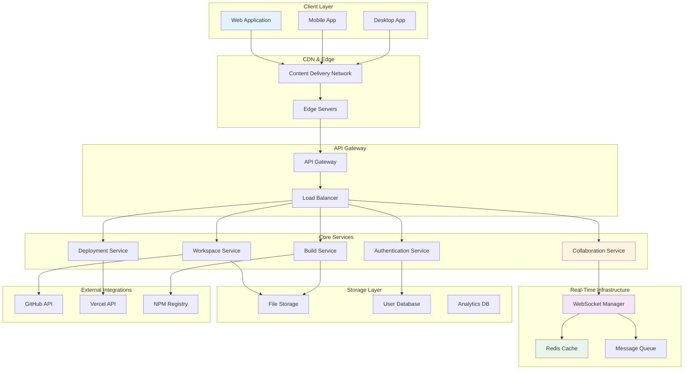

### Frontend Architecture

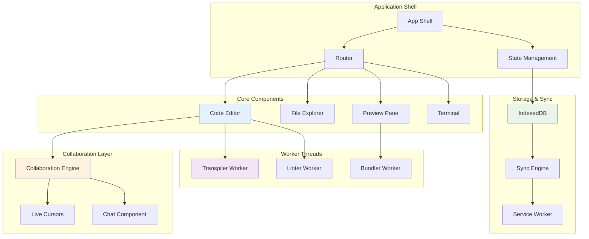

---

## 🔧 Technology Stack

[⬆️ Back to Top](#--table-of-contents)

### Frontend Technologies

#### Core Framework
- **React 18+**: Component-based architecture with concurrent features
- **TypeScript**: Type-safe development with enhanced IntelliSense
- **Next.js**: SSR/SSG framework for optimal performance

#### Code Editor
- **Monaco Editor**: VS Code's editor engine for rich editing experience
- **CodeMirror**: Alternative lightweight editor for specific use cases
- **Prettier**: Code formatting integration
- **ESLint**: Real-time linting and error detection

#### State Management
- **Zustand**: Lightweight state management for local state
- **React Query**: Server state management with caching
- **Jotai**: Atomic state management for collaborative features

#### Real-Time Communication
- **Socket.io**: WebSocket communication for collaboration
- **Y.js**: Conflict-free replicated data types (CRDTs)
- **WebRTC**: Peer-to-peer communication for voice/video

#### Build Tools
- **Vite**: Fast build tool with HMR
- **esbuild**: Ultra-fast JavaScript bundler
- **Babel**: JavaScript transpilation
- **PostCSS**: CSS processing and optimization

### Backend Technologies

#### Runtime Environment
- **Node.js**: JavaScript runtime for backend services
- **Docker**: Containerization for sandbox isolation
- **Kubernetes**: Container orchestration and scaling

#### Databases
- **PostgreSQL**: User data and workspace metadata
- **MongoDB**: File content and version storage
- **Redis**: Caching and session management
- **Elasticsearch**: Code search and indexing

#### Message Queue
- **Apache Kafka**: Event streaming for real-time updates
- **Redis Pub/Sub**: Lightweight messaging for collaboration

---

## 💾 Data Management & Storage

[⬆️ Back to Top](#--table-of-contents)

### Client-Side Storage

#### IndexedDB Schema
```javascript
// File System Store
{
  id: "file_uuid",
  path: "/src/components/App.tsx",
  content: "file_content",
  type: "file",
  language: "typescript",
  lastModified: "2024-01-01T10:00:00Z",
  size: 1024
}

// Project Store
{
  id: "project_uuid",
  name: "My React App",
  template: "react-typescript",
  dependencies: {...},
  settings: {...},
  lastAccessed: "2024-01-01T10:00:00Z"
}

// Collaboration Store
{
  sessionId: "session_uuid",
  users: [...],
  operations: [...],
  version: 42
}
```

#### Service Worker Caching
- **Static Assets**: Templates, dependencies, runtime files
- **Dynamic Content**: User code, compiled outputs
- **API Responses**: User data, project metadata

### Server-Side Storage

#### File Storage Architecture
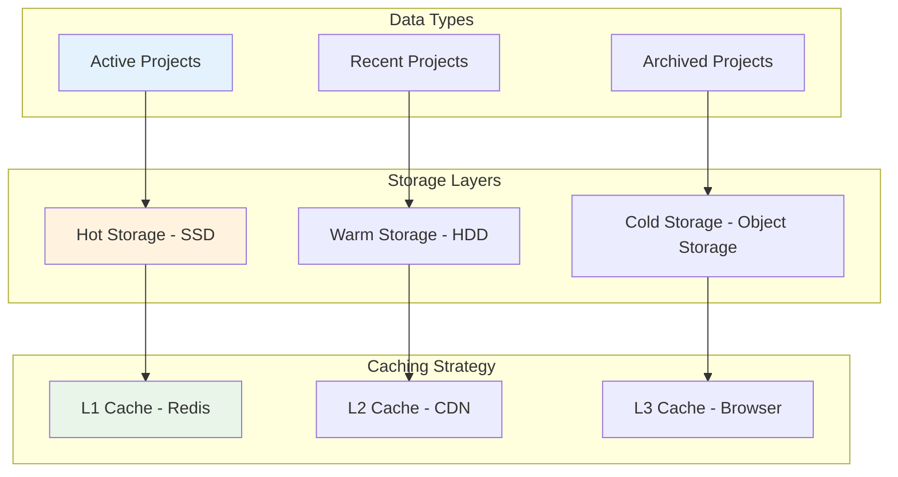

### Data Synchronization

#### Conflict Resolution Strategy
- **Operational Transform**: Real-time collaborative editing
- **Last-Write-Wins**: Simple conflict resolution for metadata
- **Three-Way Merge**: Git-style merge for version control
- **User Intervention**: Manual resolution for complex conflicts

---

## 🚀 Real-Time Features

[⬆️ Back to Top](#--table-of-contents)

### Collaborative Editing

#### Real-Time Architecture
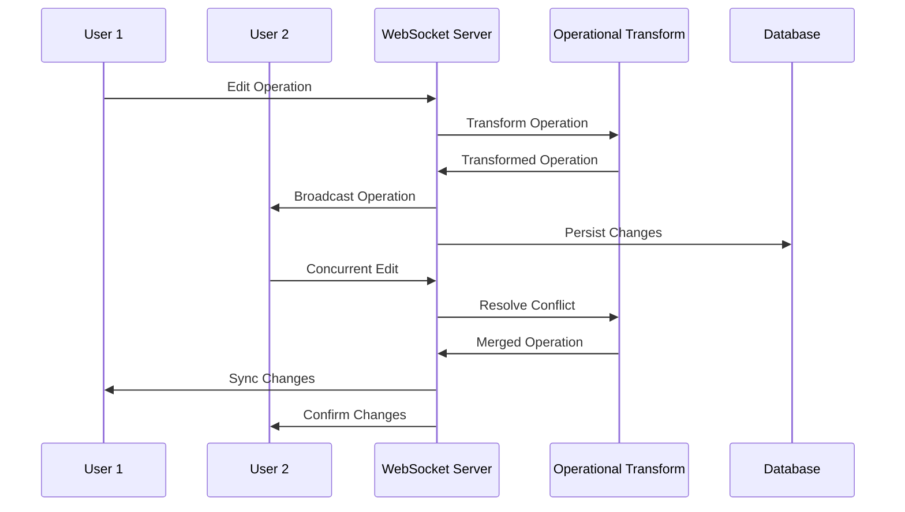

#### Operational Transform Implementation
- **Character-Level Operations**: Insert, delete, retain operations
- **Intention Preservation**: Maintain user's intended changes
- **Convergence Guarantee**: All clients reach the same final state
- **Causality Preservation**: Maintain operation ordering

### Live Preview System

#### Preview Update Flow
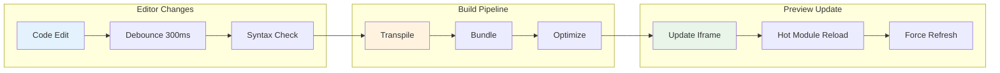

### WebSocket Communication

#### Message Types
```javascript
// Real-time editing
{
  type: 'operation',
  operation: {
    type: 'insert',
    position: 100,
    content: 'Hello',
    userId: 'user_123'
  }
}

// Cursor tracking
{
  type: 'cursor',
  position: { line: 10, column: 5 },
  selection: { start: 100, end: 110 },
  userId: 'user_123'
}

// Chat messages
{
  type: 'chat',
  message: 'Great idea!',
  userId: 'user_123',
  timestamp: '2024-01-01T10:00:00Z'
}

// Presence updates
{
  type: 'presence',
  status: 'active',
  userId: 'user_123'
}
```

---

## 🔒 Security Architecture

[⬆️ Back to Top](#--table-of-contents)

### Code Execution Security

#### Sandboxing Strategy
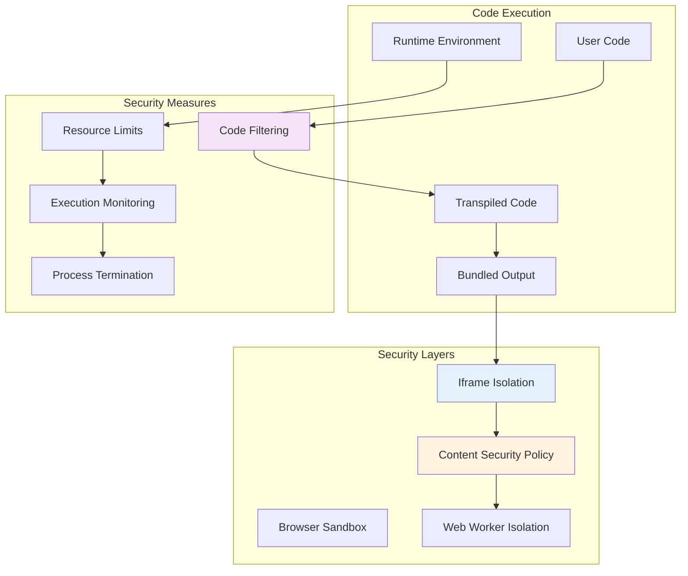

#### Security Policies
- **Content Security Policy**: Strict CSP headers for iframe content
- **Iframe Sandboxing**: Isolated execution environment
- **Resource Limits**: CPU, memory, and network throttling
- **Code Filtering**: Remove dangerous APIs and functions

### Authentication & Authorization

#### JWT Token Strategy
- **Access Tokens**: Short-lived (15 minutes) for API access
- **Refresh Tokens**: Long-lived (30 days) for token renewal
- **Session Tokens**: WebSocket authentication
- **API Keys**: Third-party service integration

#### Permission System
```javascript
// Role-based permissions
{
  user: {
    read: ['own_projects'],
    write: ['own_projects'],
    delete: ['own_projects']
  },
  collaborator: {
    read: ['shared_projects'],
    write: ['shared_projects'],
    delete: []
  },
  admin: {
    read: ['all_projects'],
    write: ['all_projects'],
    delete: ['all_projects']
  }
}
```

---

## 📱 Component Architecture

[⬆️ Back to Top](#--table-of-contents)

### Main Application Structure

#### Component Hierarchy
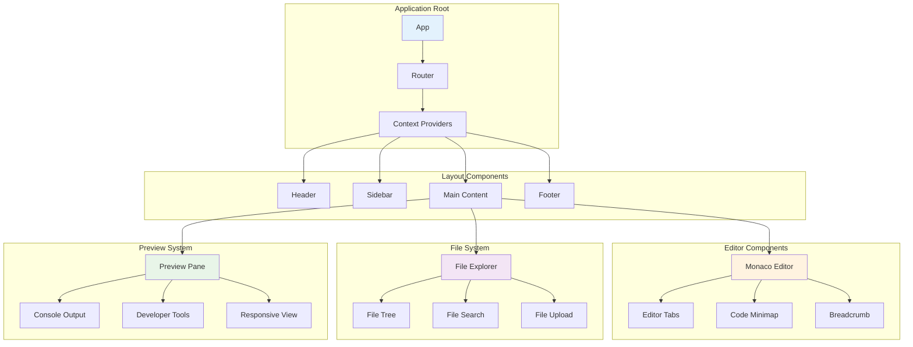

### State Management Architecture

#### Global State Structure
```javascript
// Application state
{
  user: {
    id: 'user_123',
    name: 'John Doe',
    email: 'john@example.com',
    preferences: {
      theme: 'dark',
      fontSize: 14,
      tabSize: 2
    }
  },
  
  workspace: {
    id: 'workspace_456',
    name: 'My React App',
    files: new Map(),
    activeFile: '/src/App.tsx',
    openTabs: ['/src/App.tsx', '/src/index.ts']
  },
  
  collaboration: {
    sessionId: 'session_789',
    users: new Map(),
    cursors: new Map(),
    operations: []
  },
  
  preview: {
    url: 'https://preview.codesandbox.io/...',
    status: 'ready',
    console: [],
    errors: []
  }
}
```

### Custom Hooks

#### Editor Hooks
```javascript
// useCodeEditor hook
const useCodeEditor = (initialValue, language) => {
  const [value, setValue] = useState(initialValue);
  const [editor, setEditor] = useState(null);
  
  const handleChange = useCallback((newValue) => {
    setValue(newValue);
    // Sync with collaboration engine
    // Update preview if needed
  }, []);
  
  return { value, editor, handleChange, setEditor };
};

// useFileSystem hook
const useFileSystem = () => {
  const [files, setFiles] = useState(new Map());
  
  const createFile = useCallback((path, content) => {
    // Create file logic
  }, []);
  
  const deleteFile = useCallback((path) => {
    // Delete file logic
  }, []);
  
  return { files, createFile, deleteFile };
};
```

---

## ⚡ Performance Optimizations

[⬆️ Back to Top](#--table-of-contents)

### Code Splitting Strategy

#### Bundle Optimization
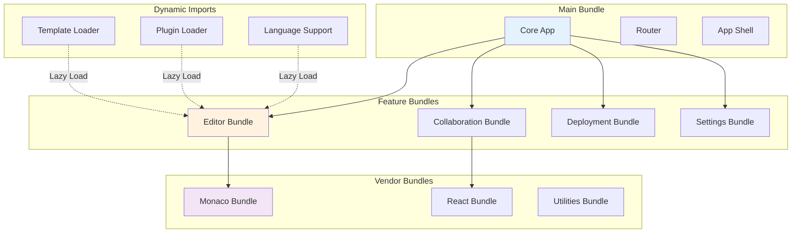

### Virtual Scrolling

#### Large File Handling
- **Viewport Rendering**: Only render visible lines
- **Buffer Management**: Pre-render adjacent content
- **Memory Optimization**: Recycle DOM elements
- **Smooth Scrolling**: Hardware-accelerated scrolling

### Caching Strategies

#### Multi-Level Caching
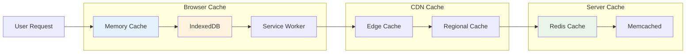

### Web Workers

#### Background Processing
- **Transpilation**: TypeScript to JavaScript conversion
- **Bundling**: Module bundling and optimization
- **Linting**: Code analysis and error detection
- **Search Indexing**: File content indexing for search

---

## 🔍 Code Execution & Preview

[⬆️ Back to Top](#--table-of-contents)

### Sandboxed Execution

#### Iframe Security Model
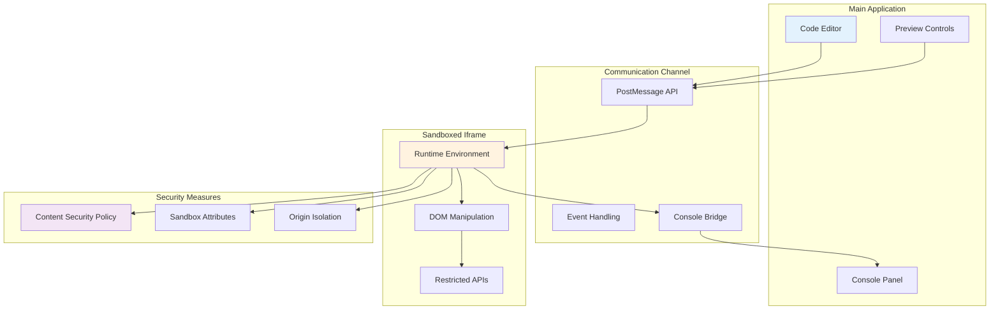

### Build Pipeline

#### Real-Time Compilation
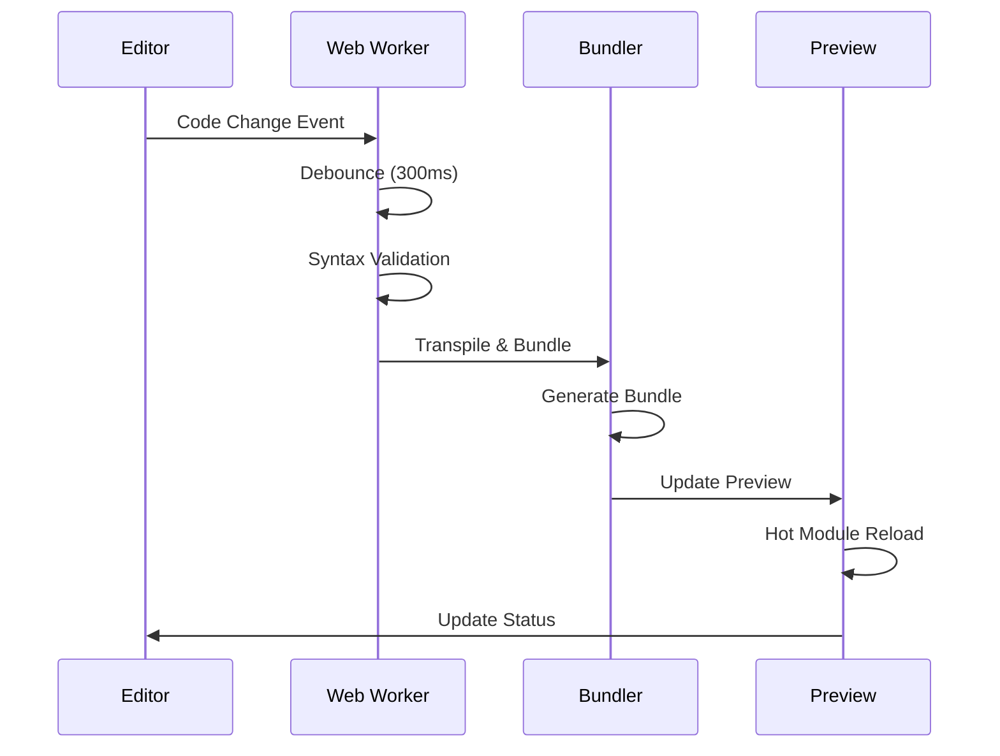

### Console Integration

#### Custom Console Implementation
- **Console Override**: Intercept console.log, error, warn
- **Stack Trace Mapping**: Source map integration
- **Rich Formatting**: Object inspection and formatting
- **History Management**: Console command history

---

## 🎨 UI/UX Considerations

[⬆️ Back to Top](#--table-of-contents)

### Responsive Design

#### Breakpoint Strategy
```javascript
const breakpoints = {
  mobile: '320px - 768px',    // Single panel view
  tablet: '768px - 1024px',   // Two panel view
  desktop: '1024px - 1440px', // Three panel view
  ultrawide: '1440px+'        // Four panel view
};
```

#### Adaptive Layout
- **Mobile**: Stack panels vertically, swipe navigation
- **Tablet**: Side-by-side editor and preview
- **Desktop**: Three-panel layout with file explorer
- **Ultrawide**: Four-panel with additional tools

### Theme System

#### CSS Custom Properties
```css
:root {
  /* Light theme */
  --bg-primary: #ffffff;
  --bg-secondary: #f5f5f5;
  --text-primary: #333333;
  --accent-color: #007acc;
}

[data-theme="dark"] {
  /* Dark theme */
  --bg-primary: #1e1e1e;
  --bg-secondary: #252526;
  --text-primary: #d4d4d4;
  --accent-color: #569cd6;
}
```

### Accessibility Features

#### WCAG 2.1 Compliance
- **Keyboard Navigation**: Full keyboard accessibility
- **Screen Reader Support**: ARIA labels and descriptions
- **High Contrast**: Color contrast ratios > 4.5:1
- **Focus Management**: Visible focus indicators

---

## 📊 Monitoring & Analytics

[⬆️ Back to Top](#--table-of-contents)

### Performance Monitoring

#### Core Web Vitals
- **First Contentful Paint (FCP)**: < 1.8 seconds
- **Largest Contentful Paint (LCP)**: < 2.5 seconds
- **First Input Delay (FID)**: < 100 milliseconds
- **Cumulative Layout Shift (CLS)**: < 0.1

### User Analytics

#### Key Metrics
```javascript
// User engagement metrics
{
  sessionDuration: number,
  filesCreated: number,
  linesOfCode: number,
  collaborativeSessions: number,
  deploymentsTriggered: number,
  templatesUsed: string[],
  featuresUsed: string[]
}

// Performance metrics
{
  editorLoadTime: number,
  previewUpdateTime: number,
  buildTime: number,
  errorRate: number,
  crashRate: number
}
```

### Error Tracking

#### Error Monitoring Strategy
- **JavaScript Errors**: Unhandled exceptions and promise rejections
- **Build Errors**: Compilation and bundling failures
- **Network Errors**: API failures and WebSocket disconnections
- **Performance Issues**: Memory leaks and CPU spikes

---

## 🚀 Deployment Strategy

[⬆️ Back to Top](#--table-of-contents)

### CI/CD Pipeline

#### Deployment Flow
```mermaid
graph LR
    subgraph "Development"
        DEV[Developer Push]
        PR[Pull Request]
        REVIEW[Code Review]
    end
    
    subgraph "Build Pipeline"
        BUILD[Build]
        TEST[Test Suite]
        LINT[Linting]
        AUDIT[Security Audit]
    end
    
    subgraph "Deployment"
        STAGING[Staging Deploy]
        E2E[E2E Tests]
        PROD[Production Deploy]
        MONITOR[Monitoring]
    end
    
    DEV --> PR
    PR --> REVIEW
    REVIEW --> BUILD
    BUILD --> TEST
    TEST --> LINT
    LINT --> AUDIT
    AUDIT --> STAGING
    STAGING --> E2E
    E2E --> PROD
    PROD --> MONITOR
    
    style BUILD fill:#e3f2fd
    style STAGING fill:#fff3e0
    style PROD fill:#e8f5e8
```

### Progressive Deployment

#### Feature Rollout Strategy
- **Feature Flags**: Gradual feature rollout
- **A/B Testing**: Compare feature variants
- **Canary Releases**: Limited user exposure
- **Blue-Green Deployment**: Zero-downtime updates

### CDN Strategy

#### Global Content Distribution
- **Static Assets**: JavaScript, CSS, images via CDN
- **Template Files**: Pre-built templates and boilerplates
- **Library Caching**: Popular npm packages
- **Edge Computing**: Preview generation at edge locations

---

## 🔮 Future Enhancements

[⬆️ Back to Top](#--table-of-contents)

### AI Integration

#### Intelligent Features
- **Code Completion**: AI-powered autocompletion
- **Bug Detection**: Automated bug identification
- **Code Review**: AI-assisted code review
- **Documentation**: Auto-generated documentation

### Advanced Collaboration

#### Enhanced Features
- **Voice Commands**: Voice-controlled coding
- **Gesture Control**: Touch and gesture navigation
- **AR/VR Support**: Immersive coding experiences
- **Brain-Computer Interface**: Direct neural input

### Platform Extensions

#### Ecosystem Growth
- **Mobile Development**: React Native, Flutter support
- **Desktop Applications**: Electron app development
- **Game Development**: Unity, Unreal Engine integration
- **Blockchain**: Smart contract development

### Performance Innovations

#### Next-Generation Optimizations
- **WebAssembly**: High-performance code execution
- **Edge Computing**: Distributed code compilation
- **Quantum Computing**: Quantum algorithm simulation
- **Neural Networks**: Hardware-accelerated ML

---

## 📚 Key Takeaways

[⬆️ Back to Top](#--table-of-contents)

### Technical Insights

#### Architecture Decisions
1. **Monaco Editor**: Leveraging VS Code's proven editor technology
2. **Web Workers**: Offloading heavy computations from main thread
3. **IndexedDB**: Persistent local storage for offline capability
4. **Iframe Sandboxing**: Secure code execution environment
5. **Operational Transform**: Conflict-free collaborative editing

#### Performance Strategies
1. **Code Splitting**: Lazy loading of features and templates
2. **Virtual Scrolling**: Efficient rendering of large files
3. **Service Workers**: Offline functionality and caching
4. **CDN Distribution**: Global content delivery optimization
5. **Real-Time Optimization**: Sub-100ms response times

#### Security Considerations
1. **Content Security Policy**: Strict CSP for iframe content
2. **Resource Limiting**: CPU and memory usage controls
3. **Code Filtering**: Removal of dangerous APIs
4. **Origin Isolation**: Separate origins for user code
5. **Encrypted Communication**: End-to-end encryption for collaboration

### Development Best Practices

#### Code Quality
- **TypeScript**: Type safety and enhanced developer experience
- **Testing Strategy**: Unit, integration, and E2E testing
- **Code Reviews**: Automated and manual review processes
- **Documentation**: Comprehensive API and component documentation
- **Accessibility**: WCAG 2.1 AA compliance throughout

#### Scalability Patterns
- **Microservices**: Modular service architecture
- **Horizontal Scaling**: Auto-scaling based on demand
- **Caching Layers**: Multi-level caching strategy
- **Database Optimization**: Efficient data storage and retrieval
- **Real-Time Infrastructure**: WebSocket scaling and load balancing

### Business Impact

#### User Experience
- **Zero Setup Time**: Instant development environment
- **Collaborative Features**: Seamless team collaboration
- **Template Ecosystem**: Rapid project initialization
- **Deployment Integration**: One-click production deployment
- **Cross-Platform Access**: Consistent experience across devices

#### Technical Benefits
- **Reduced Infrastructure**: No local development setup
- **Version Control**: Automatic project versioning
- **Security**: Isolated execution environment
- **Performance**: Optimized build and preview pipeline
- **Extensibility**: Plugin system for customization

### TypeScript Interfaces & Component Props

[⬆️ Back to Top](#--table-of-contents)

---

#### Core Data Interfaces

```typescript
interface Sandbox {
  id: string;
  name: string;
  description?: string;
  owner: User;
  collaborators: Collaborator[];
  template: SandboxTemplate;
  files: FileTree;
  dependencies: PackageDependency[];
  configuration: SandboxConfig;
  isPublic: boolean;
  createdAt: Date;
  updatedAt: Date;
  forkCount: number;
  viewCount: number;
}

interface FileNode {
  id: string;
  name: string;
  path: string;
  type: 'file' | 'directory';
  content?: string;
  children?: FileNode[];
  isOpen?: boolean;
  isModified: boolean;
  language: string;
  size: number;
  lastModified: Date;
}

interface CodeExecution {
  id: string;
  sandboxId: string;
  status: 'idle' | 'building' | 'running' | 'error' | 'stopped';
  buildOutput: BuildLog[];
  runtimeLogs: RuntimeLog[];
  preview: PreviewInfo;
  hotReload: boolean;
  bundleSize: number;
  buildTime: number;
}

interface Collaborator {
  userId: string;
  role: 'owner' | 'editor' | 'viewer';
  permissions: CollaboratorPermissions;
  cursor: EditorCursor;
  selection: EditorSelection;
  isActive: boolean;
  joinedAt: Date;
  color: string;
}

interface SandboxTemplate {
  id: string;
  name: string;
  description: string;
  tags: string[];
  framework: string;
  language: string;
  defaultFiles: FileTemplate[];
  dependencies: PackageDependency[];
  buildConfig: BuildConfiguration;
  previewConfig: PreviewConfiguration;
}

interface ContainerEnvironment {
  id: string;
  sandboxId: string;
  status: 'starting' | 'ready' | 'stopping' | 'stopped';
  resources: ResourceUsage;
  network: NetworkConfig;
  filesystem: FileSystemConfig;
  processes: ProcessInfo[];
  logs: ContainerLog[];
}
```

#### Component Props Interfaces

```typescript
interface CodeEditorProps {
  files: FileNode[];
  activeFileId: string;
  onFileChange: (fileId: string, content: string) => void;
  onFileSelect: (fileId: string) => void;
  onFileCreate: (path: string, type: 'file' | 'directory') => void;
  onFileDelete: (fileId: string) => void;
  theme: 'light' | 'dark' | 'auto';
  fontSize?: number;
  enableVim?: boolean;
  enableEmmet?: boolean;
}

interface FileExplorerProps {
  fileTree: FileNode[];
  selectedFileId?: string;
  onFileSelect: (fileId: string) => void;
  onFileCreate: (parentId: string, name: string, type: 'file' | 'directory') => void;
  onFileRename: (fileId: string, newName: string) => void;
  onFileDelete: (fileId: string) => void;
  onFileDrop: (sourceId: string, targetId: string) => void;
  showHiddenFiles?: boolean;
}

interface PreviewWindowProps {
  sandboxId: string;
  previewUrl: string;
  onRefresh: () => void;
  onAddressChange: (url: string) => void;
  onConsoleToggle: () => void;
  showDevTools?: boolean;
  responsive?: boolean;
  device?: DeviceType;
}

interface CollaborationPanelProps {
  collaborators: Collaborator[];
  currentUser: User;
  onInvite: (email: string, role: string) => void;
  onRoleChange: (userId: string, role: string) => void;
  onRemove: (userId: string) => void;
  showCursors?: boolean;
  showPresence?: boolean;
}

interface TerminalProps {
  sandboxId: string;
  onCommand: (command: string) => void;
  onClear: () => void;
  history: TerminalOutput[];
  isConnected: boolean;
  workingDirectory: string;
  environment: Record<string, string>;
}

interface PackageManagerProps {
  dependencies: PackageDependency[];
  onInstall: (packageName: string, version?: string) => void;
  onUninstall: (packageName: string) => void;
  onUpdate: (packageName: string, version: string) => void;
  onSearch: (query: string) => Promise<PackageSearchResult[]>;
  showDevDependencies?: boolean;
}
```

### API Reference

[⬆️ Back to Top](#--table-of-contents)

---

#### Sandbox Management
- `GET /api/sandboxes` - Get user's sandboxes with filtering and pagination
- `POST /api/sandboxes` - Create new sandbox from template or fork existing
- `GET /api/sandboxes/:id` - Get sandbox details with files and configuration
- `PUT /api/sandboxes/:id` - Update sandbox metadata, settings, or privacy
- `DELETE /api/sandboxes/:id` - Delete sandbox and all associated data

#### File Operations
- `GET /api/sandboxes/:id/files` - Get complete file tree with content
- `PUT /api/sandboxes/:id/files/*` - Update file content with version tracking
- `POST /api/sandboxes/:id/files` - Create new file or directory
- `DELETE /api/sandboxes/:id/files/*` - Delete file or directory recursively
- `POST /api/sandboxes/:id/files/upload` - Upload files with drag-and-drop support

#### Code Execution & Build
- `POST /api/sandboxes/:id/build` - Trigger build process with bundling
- `GET /api/sandboxes/:id/preview` - Get preview URL and deployment status
- `POST /api/sandboxes/:id/run` - Execute code in container environment
- `GET /api/sandboxes/:id/logs` - Get build and runtime logs with streaming
- `POST /api/sandboxes/:id/restart` - Restart sandbox container and clear cache

#### Real-time Collaboration
- `WS /api/sandboxes/:id/collaborate` - WebSocket for real-time editing
- `WS FILE_CHANGE` - Broadcast file modifications to collaborators
- `WS CURSOR_MOVE` - Share cursor position and selection updates
- `WS USER_JOIN` - Notify when collaborator joins or leaves
- `WS TERMINAL_OUTPUT` - Share terminal session with collaborators

#### Package Management
- `GET /api/sandboxes/:id/dependencies` - Get installed packages and versions
- `POST /api/sandboxes/:id/dependencies` - Install npm package with version resolution
- `DELETE /api/sandboxes/:id/dependencies/:package` - Uninstall package and update
- `PUT /api/sandboxes/:id/dependencies/:package` - Update package to specific version
- `GET /api/packages/search` - Search npm registry with autocomplete

#### Templates & Forking
- `GET /api/templates` - Browse available sandbox templates by framework
- `POST /api/templates` - Create template from existing sandbox
- `POST /api/sandboxes/:id/fork` - Fork sandbox with customizations
- `GET /api/sandboxes/:id/forks` - Get list of sandbox forks
- `POST /api/sandboxes/:id/deploy` - Deploy sandbox to hosting platform

#### Collaboration & Sharing
- `POST /api/sandboxes/:id/collaborators` - Invite collaborator with role
- `PUT /api/sandboxes/:id/collaborators/:userId` - Update collaborator permissions
- `DELETE /api/sandboxes/:id/collaborators/:userId` - Remove collaborator access
- `POST /api/sandboxes/:id/share` - Generate shareable link with permissions
- `GET /api/sandboxes/:id/activity` - Get collaboration activity feed

#### Container Management
- `GET /api/containers/:id/status` - Get container resource usage and health
- `POST /api/containers/:id/restart` - Restart container environment
- `GET /api/containers/:id/logs` - Get container system logs
- `PUT /api/containers/:id/resources` - Update container resource limits
- `POST /api/containers/:id/terminal` - Create new terminal session

#### Analytics & Insights
- `GET /api/sandboxes/:id/analytics` - Get sandbox usage and performance metrics
- `POST /api/analytics/track` - Track user interactions and feature usage
- `GET /api/analytics/performance` - Get build time and execution performance
- `GET /api/analytics/popular` - Get trending sandboxes and templates
- `POST /api/feedback` - Submit user feedback and feature requests

---

This comprehensive system design provides a robust foundation for building a modern online IDE platform like CodeSandbox, with emphasis on real-time collaboration, security, and performance optimization. 