# Design a Form Component that Accepts a JSON Schema


## 📋 Table of Contents

- [Design a Form Component that Accepts a JSON Schema](#design-a-form-component-that-accepts-a-json-schema)
  - [Table of Contents](#table-of-contents)
  - [Clarify the Problem and Requirements](#clarify-the-problem-and-requirements)
    - [Problem Understanding](#problem-understanding)
    - [Functional Requirements](#functional-requirements)
    - [Non-Functional Requirements](#non-functional-requirements)
    - [Key Assumptions](#key-assumptions)
  - [High-Level Architecture](#high-level-architecture)
    - [JSON Schema Form Architecture](#json-schema-form-architecture)
    - [Schema Processing Pipeline](#schema-processing-pipeline)
  - [UI/UX and Component Structure](#uiux-and-component-structure)
    - [Form Component Architecture](#form-component-architecture)
    - [Dynamic Field Rendering](#dynamic-field-rendering)
    - [Validation State Management](#validation-state-management)
  - [Real-Time Sync, Data Modeling & APIs](#real-time-sync-data-modeling-apis)
    - [Schema Validation Engine](#schema-validation-engine)
      - [Real-time Validation Algorithm](#real-time-validation-algorithm)
      - [Conditional Logic Processing](#conditional-logic-processing)
    - [Dynamic Schema Updates](#dynamic-schema-updates)
      - [Schema Diff and Merge](#schema-diff-and-merge)
    - [Data Models](#data-models)
      - [JSON Schema Structure](#json-schema-structure)
      - [Form State Schema](#form-state-schema)
    - [API Design Pattern](#api-design-pattern)
      - [Schema Management API](#schema-management-api)
  - [TypeScript Interfaces & Component Props](#typescript-interfaces--component-props)
    - [Core Data Interfaces](#core-data-interfaces)
    - [Component Props Interfaces](#component-props-interfaces)
  - [API Reference](#api-reference)
  - [Performance and Scalability](#performance-and-scalability)
    - [Form Rendering Optimization](#form-rendering-optimization)
      - [Virtual Field Rendering](#virtual-field-rendering)
    - [Validation Performance](#validation-performance)
      - [Debounced Validation Strategy](#debounced-validation-strategy)
    - [Memory Management](#memory-management)
      - [Schema Caching Strategy](#schema-caching-strategy)
  - [Security and Privacy](#security-and-privacy)
    - [Input Validation Framework](#input-validation-framework)
      - [Multi-Layer Validation Security](#multi-layer-validation-security)
    - [Data Sanitization Pipeline](#data-sanitization-pipeline)
      - [XSS Prevention in Dynamic Forms](#xss-prevention-in-dynamic-forms)
  - [Testing, Monitoring, and Maintainability](#testing-monitoring-and-maintainability)
    - [Testing Strategy](#testing-strategy)
      - [Schema-Driven Testing Framework](#schema-driven-testing-framework)
    - [Error Handling and Debugging](#error-handling-and-debugging)
      - [Schema Validation Error Tracking](#schema-validation-error-tracking)
  - [Trade-offs, Deep Dives, and Extensions](#trade-offs-deep-dives-and-extensions)
    - [Schema Flexibility vs Performance](#schema-flexibility-vs-performance)
    - [Client vs Server Validation](#client-vs-server-validation)
    - [Advanced Features](#advanced-features)
      - [AI-Powered Form Generation](#ai-powered-form-generation)
      - [Multi-Step Form Orchestration](#multi-step-form-orchestration)
    - [Future Extensions](#future-extensions)
      - [Next-Generation Form Features](#next-generation-form-features)

---

## Table of Contents
1. [Clarify the Problem and Requirements](#clarify-the-problem-and-requirements)
2. [High-Level Architecture](#high-level-architecture)
3. [UI/UX and Component Structure](#uiux-and-component-structure)
4. [Real-Time Sync, Data Modeling & APIs](#real-time-sync-data-modeling--apis)
5. [Performance and Scalability](#performance-and-scalability)
6. [Security and Privacy](#security-and-privacy)
7. [Testing, Monitoring, and Maintainability](#testing-monitoring-and-maintainability)
8. [Trade-offs, Deep Dives, and Extensions](#trade-offs-deep-dives-and-extensions)

---

## Clarify the Problem and Requirements

[⬆️ Back to Top](#--table-of-contents)

---

### Problem Understanding

[⬆️ Back to Top](#--table-of-contents)

---

Design a highly flexible and dynamic form component system that can generate complete forms based on JSON Schema specifications. The system must support complex field types, real-time validation, conditional logic, and custom UI components while maintaining high performance and accessibility standards. Similar to tools like React Hook Form, Formik with JSON Schema, or Ant Design's Form Builder.

### Functional Requirements

[⬆️ Back to Top](#--table-of-contents)

---

- **Dynamic Form Generation**: Generate complete forms from JSON Schema definitions
- **Field Type Support**: Text, number, select, checkbox, radio, date, file upload, nested objects/arrays
- **Real-time Validation**: Client-side validation with immediate feedback and error display
- **Conditional Logic**: Show/hide fields, enable/disable controls based on other field values
- **Custom Components**: Support for custom field components and UI extensions
- **Data Binding**: Two-way data binding with form state management and change tracking
- **Accessibility**: Full WCAG compliance with screen reader support and keyboard navigation
- **Internationalization**: Multi-language support for labels, errors, and help text
- **Schema Evolution**: Handle schema updates and migrations without data loss

### Non-Functional Requirements

[⬆️ Back to Top](#--table-of-contents)

---

- **Performance**: <16ms field rendering, <100ms form generation, smooth scrolling
- **Scalability**: Support forms with 1000+ fields, nested structures 10 levels deep
- **Flexibility**: Pluggable validation, theming, and custom field component architecture
- **Bundle Size**: <50KB gzipped for core functionality, tree-shakeable modules
- **Browser Support**: Modern browsers with graceful degradation for older versions
- **Memory Efficiency**: Minimal memory footprint with efficient garbage collection
- **Developer Experience**: TypeScript support, comprehensive documentation, debugging tools

### Key Assumptions

[⬆️ Back to Top](#--table-of-contents)

---

- JSON Schema Draft 7+ compliance with extensions
- Average form complexity: 20-50 fields with 2-3 levels of nesting
- Real-time validation requirements: <50ms response time
- Form submission frequency: 100-1000 submissions per minute
- Schema update frequency: 1-5 updates per day
- Custom component usage: 20-30% of fields use custom components
- Mobile-first design with responsive breakpoints
- Integration with popular form libraries and UI frameworks

---

## High-Level Architecture

[⬆️ Back to Top](#--table-of-contents)

---

### JSON Schema Form Architecture

[⬆️ Back to Top](#--table-of-contents)

---

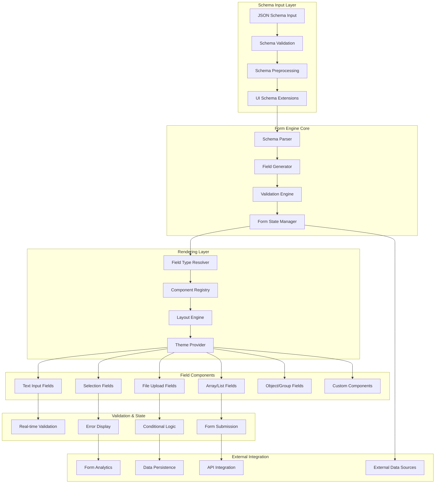
```mermaid
graph TB
    subgraph "Schema Input Layer"
        SCHEMA_INPUT[JSON Schema Input]
        SCHEMA_VALIDATION[Schema Validation]
        SCHEMA_PREPROCESSING[Schema Preprocessing]
        UI_SCHEMA[UI Schema Extensions]
    end
    
    subgraph "Form Engine Core"
        SCHEMA_PARSER[Schema Parser]
        FIELD_GENERATOR[Field Generator]
        VALIDATION_ENGINE[Validation Engine]
        STATE_MANAGER[Form State Manager]
    end
    
    subgraph "Rendering Layer"
        FIELD_RESOLVER[Field Type Resolver]
        COMPONENT_REGISTRY[Component Registry]
        LAYOUT_ENGINE[Layout Engine]
        THEME_PROVIDER[Theme Provider]
    end
    
    subgraph "Field Components"
        TEXT_FIELD[Text Input Fields]
        SELECTION_FIELDS[Selection Fields]
        FILE_FIELDS[File Upload Fields]
        ARRAY_FIELDS[Array/List Fields]
        OBJECT_FIELDS[Object/Group Fields]
        CUSTOM_FIELDS[Custom Components]
    end
    
    subgraph "Validation & State"
        REAL_TIME_VALIDATION[Real-time Validation]
        ERROR_DISPLAY[Error Display]
        CONDITIONAL_LOGIC[Conditional Logic]
        FORM_SUBMISSION[Form Submission]
    end
    
    subgraph "External Integration"
        API_CONNECTOR[API Integration]
        DATA_SOURCES[External Data Sources]
        ANALYTICS[Form Analytics]
        PERSISTENCE[Data Persistence]
    end
    
    SCHEMA_INPUT --> SCHEMA_VALIDATION
    SCHEMA_VALIDATION --> SCHEMA_PREPROCESSING
    SCHEMA_PREPROCESSING --> UI_SCHEMA
    UI_SCHEMA --> SCHEMA_PARSER
    
    SCHEMA_PARSER --> FIELD_GENERATOR
    FIELD_GENERATOR --> VALIDATION_ENGINE
    VALIDATION_ENGINE --> STATE_MANAGER
    
    STATE_MANAGER --> FIELD_RESOLVER
    FIELD_RESOLVER --> COMPONENT_REGISTRY
    COMPONENT_REGISTRY --> LAYOUT_ENGINE
    LAYOUT_ENGINE --> THEME_PROVIDER
    
    THEME_PROVIDER --> TEXT_FIELD
    THEME_PROVIDER --> SELECTION_FIELDS
    THEME_PROVIDER --> FILE_FIELDS
    THEME_PROVIDER --> ARRAY_FIELDS
    THEME_PROVIDER --> OBJECT_FIELDS
    THEME_PROVIDER --> CUSTOM_FIELDS
    
    TEXT_FIELD --> REAL_TIME_VALIDATION
    SELECTION_FIELDS --> ERROR_DISPLAY
    FILE_FIELDS --> CONDITIONAL_LOGIC
    ARRAY_FIELDS --> FORM_SUBMISSION
    
    FORM_SUBMISSION --> API_CONNECTOR
    STATE_MANAGER --> DATA_SOURCES
    ERROR_DISPLAY --> ANALYTICS
    CONDITIONAL_LOGIC --> PERSISTENCE
```

### Schema Processing Pipeline

[⬆️ Back to Top](#--table-of-contents)

---

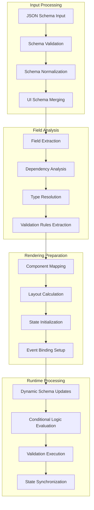
```mermaid
graph TD
    subgraph "Input Processing"
        JSON_SCHEMA[JSON Schema Input]
        SCHEMA_VALIDATION[Schema Validation]
        SCHEMA_NORMALIZATION[Schema Normalization]
        UI_ENHANCEMENT[UI Schema Merging]
    end
    
    subgraph "Field Analysis"
        FIELD_EXTRACTION[Field Extraction]
        DEPENDENCY_ANALYSIS[Dependency Analysis]
        TYPE_RESOLUTION[Type Resolution]
        VALIDATION_RULES[Validation Rules Extraction]
    end
    
    subgraph "Rendering Preparation"
        COMPONENT_MAPPING[Component Mapping]
        LAYOUT_CALCULATION[Layout Calculation]
        STATE_INITIALIZATION[State Initialization]
        EVENT_BINDING[Event Binding Setup]
    end
    
    subgraph "Runtime Processing"
        DYNAMIC_UPDATES[Dynamic Schema Updates]
        CONDITIONAL_EVALUATION[Conditional Logic Evaluation]
        VALIDATION_EXECUTION[Validation Execution]
        STATE_SYNCHRONIZATION[State Synchronization]
    end
    
    JSON_SCHEMA --> SCHEMA_VALIDATION
    SCHEMA_VALIDATION --> SCHEMA_NORMALIZATION
    SCHEMA_NORMALIZATION --> UI_ENHANCEMENT
    
    UI_ENHANCEMENT --> FIELD_EXTRACTION
    FIELD_EXTRACTION --> DEPENDENCY_ANALYSIS
    DEPENDENCY_ANALYSIS --> TYPE_RESOLUTION
    TYPE_RESOLUTION --> VALIDATION_RULES
    
    VALIDATION_RULES --> COMPONENT_MAPPING
    COMPONENT_MAPPING --> LAYOUT_CALCULATION
    LAYOUT_CALCULATION --> STATE_INITIALIZATION
    STATE_INITIALIZATION --> EVENT_BINDING
    
    EVENT_BINDING --> DYNAMIC_UPDATES
    DYNAMIC_UPDATES --> CONDITIONAL_EVALUATION
    CONDITIONAL_EVALUATION --> VALIDATION_EXECUTION
    VALIDATION_EXECUTION --> STATE_SYNCHRONIZATION
```

---

## UI/UX and Component Structure

[⬆️ Back to Top](#--table-of-contents)

---

### Form Component Architecture

[⬆️ Back to Top](#--table-of-contents)

---


```mermaid
graph TD
    subgraph "Form Container"
        FORM_PROVIDER[FormProvider<br/>Context & State Management]
        SCHEMA_PROCESSOR[SchemaProcessor<br/>Schema parsing & validation]
        LAYOUT_MANAGER[LayoutManager<br/>Form structure & positioning]
        ERROR_BOUNDARY[ErrorBoundary<br/>Error handling & recovery]
    end
    
    subgraph "Field Management"
        FIELD_FACTORY[FieldFactory<br/>Dynamic field creation]
        FIELD_RESOLVER[FieldResolver<br/>Component type mapping]
        FIELD_WRAPPER[FieldWrapper<br/>Common field functionality]
        VALIDATION_PROVIDER[ValidationProvider<br/>Real-time validation]
    end
    
    subgraph "Core Field Types"
        TEXT_INPUT[TextInput<br/>Text, email, password, URL]
        NUMBER_INPUT[NumberInput<br/>Number, range, integer]
        SELECT_INPUT[SelectInput<br/>Dropdown, autocomplete]
        CHECKBOX_INPUT[CheckboxInput<br/>Boolean, multi-select]
        RADIO_INPUT[RadioInput<br/>Single selection]
        DATE_INPUT[DateInput<br/>Date, time, datetime]
        FILE_INPUT[FileInput<br/>File upload, drag & drop]
        TEXTAREA_INPUT[TextareaInput<br/>Multi-line text]
    end
    
    subgraph "Complex Field Types"
        ARRAY_FIELD[ArrayField<br/>Dynamic lists & arrays]
        OBJECT_FIELD[ObjectField<br/>Nested object forms]
        CONDITIONAL_FIELD[ConditionalField<br/>Show/hide logic]
        CUSTOM_FIELD[CustomField<br/>User-defined components]
    end
    
    subgraph "UI Enhancement Components"
        FIELD_LABEL[FieldLabel<br/>Labels & required indicators]
        FIELD_DESCRIPTION[FieldDescription<br/>Help text & tooltips]
        FIELD_ERROR[FieldError<br/>Error display & messaging]
        FIELD_GROUP[FieldGroup<br/>Section grouping]
        PROGRESS_INDICATOR[ProgressIndicator<br/>Form completion status]
    end
    
    subgraph "Form Actions"
        SUBMIT_BUTTON[SubmitButton<br/>Form submission]
        RESET_BUTTON[ResetButton<br/>Form reset]
        SAVE_DRAFT[SaveDraft<br/>Auto-save functionality]
        VALIDATION_SUMMARY[ValidationSummary<br/>All errors overview]
    end
    
    FORM_PROVIDER --> SCHEMA_PROCESSOR
    FORM_PROVIDER --> LAYOUT_MANAGER
    FORM_PROVIDER --> ERROR_BOUNDARY
    
    SCHEMA_PROCESSOR --> FIELD_FACTORY
    FIELD_FACTORY --> FIELD_RESOLVER
    FIELD_RESOLVER --> FIELD_WRAPPER
    FIELD_WRAPPER --> VALIDATION_PROVIDER
    
    VALIDATION_PROVIDER --> TEXT_INPUT
    VALIDATION_PROVIDER --> NUMBER_INPUT
    VALIDATION_PROVIDER --> SELECT_INPUT
    VALIDATION_PROVIDER --> CHECKBOX_INPUT
    VALIDATION_PROVIDER --> RADIO_INPUT
    VALIDATION_PROVIDER --> DATE_INPUT
    VALIDATION_PROVIDER --> FILE_INPUT
    VALIDATION_PROVIDER --> TEXTAREA_INPUT
    
    FIELD_FACTORY --> ARRAY_FIELD
    FIELD_FACTORY --> OBJECT_FIELD
    FIELD_FACTORY --> CONDITIONAL_FIELD
    FIELD_FACTORY --> CUSTOM_FIELD
    
    FIELD_WRAPPER --> FIELD_LABEL
    FIELD_WRAPPER --> FIELD_DESCRIPTION
    FIELD_WRAPPER --> FIELD_ERROR
    LAYOUT_MANAGER --> FIELD_GROUP
    LAYOUT_MANAGER --> PROGRESS_INDICATOR
    
    FORM_PROVIDER --> SUBMIT_BUTTON
    FORM_PROVIDER --> RESET_BUTTON
    FORM_PROVIDER --> SAVE_DRAFT
    ERROR_BOUNDARY --> VALIDATION_SUMMARY
```

### Data Models

[⬆️ Back to Top](#--table-of-contents)

---

#### JSON Schema Structure

[⬆️ Back to Top](#--table-of-contents)

---

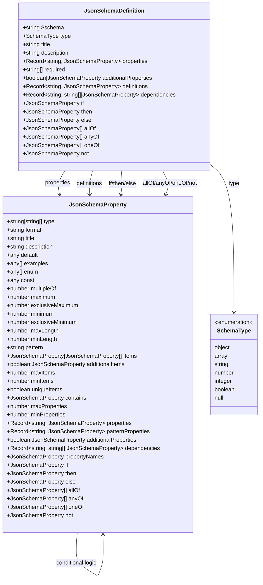
```mermaid
classDiagram
    class JsonSchemaDefinition {
        +string $schema
        +SchemaType type
        +string title
        +string description
        +Record~string, JsonSchemaProperty~ properties
        +string[] required
        +boolean|JsonSchemaProperty additionalProperties
        +Record~string, JsonSchemaProperty~ definitions
        +Record~string, string[]|JsonSchemaProperty~ dependencies
        +JsonSchemaProperty if
        +JsonSchemaProperty then
        +JsonSchemaProperty else
        +JsonSchemaProperty[] allOf
        +JsonSchemaProperty[] anyOf
        +JsonSchemaProperty[] oneOf
        +JsonSchemaProperty not
    }
    
    class JsonSchemaProperty {
        +string|string[] type
        +string format
        +string title
        +string description
        +any default
        +any[] examples
        +any[] enum
        +any const
        +number multipleOf
        +number maximum
        +number exclusiveMaximum
        +number minimum
        +number exclusiveMinimum
        +number maxLength
        +number minLength
        +string pattern
        +JsonSchemaProperty|JsonSchemaProperty[] items
        +boolean|JsonSchemaProperty additionalItems
        +number maxItems
        +number minItems
        +boolean uniqueItems
        +JsonSchemaProperty contains
        +number maxProperties
        +number minProperties
        +Record~string, JsonSchemaProperty~ properties
        +Record~string, JsonSchemaProperty~ patternProperties
        +boolean|JsonSchemaProperty additionalProperties
        +Record~string, string[]|JsonSchemaProperty~ dependencies
        +JsonSchemaProperty propertyNames
        +JsonSchemaProperty if
        +JsonSchemaProperty then
        +JsonSchemaProperty else
        +JsonSchemaProperty[] allOf
        +JsonSchemaProperty[] anyOf
        +JsonSchemaProperty[] oneOf
        +JsonSchemaProperty not
    }
    
    class SchemaType {
        <<enumeration>>
        object
        array
        string
        number
        integer
        boolean
        null
    }
    
    JsonSchemaDefinition --> JsonSchemaProperty : properties
    JsonSchemaDefinition --> JsonSchemaProperty : definitions
    JsonSchemaDefinition --> JsonSchemaProperty : if/then/else
    JsonSchemaDefinition --> JsonSchemaProperty : allOf/anyOf/oneOf/not
    JsonSchemaDefinition --> SchemaType : type
    JsonSchemaProperty --> JsonSchemaProperty : nested properties
    JsonSchemaProperty --> JsonSchemaProperty : items/contains
    JsonSchemaProperty --> JsonSchemaProperty : conditional logic
```

#### Form State Schema

[⬆️ Back to Top](#--table-of-contents)

---

**Key Components and Relationships:**

• **FormState** - Central state container holding all form data and metadata
  - `data`: Object containing actual field values (e.g., `{name: "John", age: 25}`)
  - `errors`: Field-specific validation errors mapped by field path
  - `touched`: Tracks which fields user has interacted with for UX feedback
  - `pristine`: Indicates if field values have changed from initial state
  - `valid`: Overall form validation status computed from all field errors
  - `submitting`: Loading state during form submission to prevent double-submit
  - `submitted`: Flag indicating if form has been submitted at least once
  - `validating`: Per-field async validation status for showing loading indicators
  - `meta`: Contains schema definitions and computed field configurations

• **FormMetadata** - Derived state computed from JSON schema
  - `schema`: The original JSON schema definition provided by developer
  - `uiSchema`: UI-specific overrides for field appearance and behavior
  - `fieldDefinitions`: Flattened, computed field configs from nested schema
  - `dependencies`: Map of field dependencies for conditional logic
  - `conditionalFields`: Rules for showing/hiding fields based on other values
  - `validationRules`: Extracted validation rules from schema for efficient processing
  - `customComponents`: Registry of custom field components for complex inputs

• **FieldDefinition** - Individual field configuration
  - `path`: Dot-notation path to field in form data (e.g., "user.address.street")
  - `type`: Field data type (string, number, boolean, array, object)
  - `label`: Human-readable field label derived from schema title
  - `required`: Whether field is mandatory (from schema.required array)
  - `component`: Which React component to render (TextInput, Select, etc.)
  - `props`: Component-specific props computed from schema constraints
  - `validation`: Array of validation rules to apply during field changes
  - `dependencies`: Other field paths this field depends on for conditional logic

• **ValidationRule** - Individual validation constraint
  - `type`: Validation type (required, pattern, minLength, custom function)
  - `value`: Constraint value (e.g., min length of 5, regex pattern)
  - `message`: Error message to display when validation fails
  - `validator`: Custom validation function for complex business rules
  - `async`: Whether validation requires server-side checking
  - `debounce`: Delay before triggering validation to avoid excessive API calls

• **ConditionalRule** - Logic for dynamic form behavior
  - `if`: Logical expression to evaluate (e.g., "age >= 18")
  - `then`: Actions to take when condition is true (show field, set required)
  - `else`: Actions to take when condition is false (hide field, clear value)

**How Components Relate in Code:**

```typescript
// Form state flows from schema to UI
const formState = useFormState(jsonSchema, uiSchema);

// Field definitions are computed from schema
const fieldDefs = useMemo(() => 
  computeFieldDefinitions(formState.meta.schema), [schema]);

// Validation runs when field values change
const handleFieldChange = (path: string, value: any) => {
  const fieldDef = getFieldDefinition(path);
  const errors = validateField(value, fieldDef.validation);
  updateFormState({ data: setValue(path, value), errors });
};

// Conditional logic re-evaluates on every state change
useEffect(() => {
  const visibleFields = evaluateConditionalRules(
    formState.data, 
    formState.meta.conditionalFields
  );
  updateFieldVisibility(visibleFields);
}, [formState.data]);
```

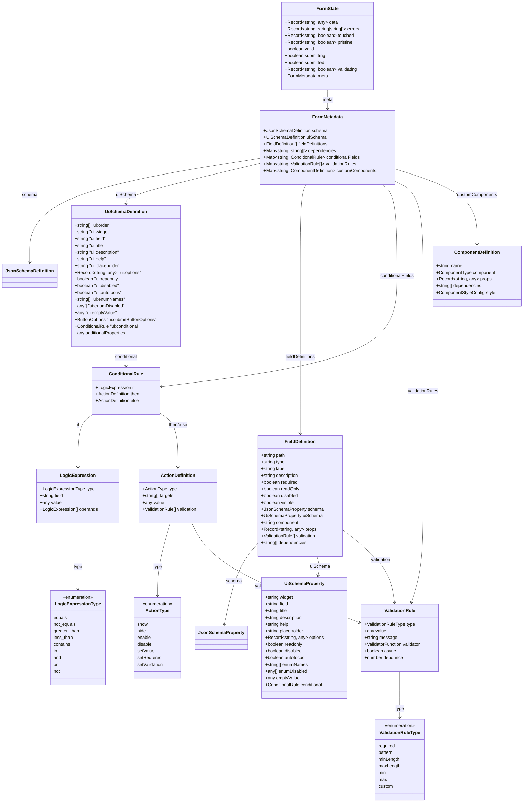
```mermaid
classDiagram
    class FormState {
        +Record~string, any~ data
        +Record~string, string|string[]~ errors
        +Record~string, boolean~ touched
        +Record~string, boolean~ pristine
        +boolean valid
        +boolean submitting
        +boolean submitted
        +Record~string, boolean~ validating
        +FormMetadata meta
    }
    
    class FormMetadata {
        +JsonSchemaDefinition schema
        +UiSchemaDefinition uiSchema
        +FieldDefinition[] fieldDefinitions
        +Map~string, string[]~ dependencies
        +Map~string, ConditionalRule~ conditionalFields
        +Map~string, ValidationRule[]~ validationRules
        +Map~string, ComponentDefinition~ customComponents
    }
    
    class FieldDefinition {
        +string path
        +string type
        +string label
        +string description
        +boolean required
        +boolean readOnly
        +boolean disabled
        +boolean visible
        +JsonSchemaProperty schema
        +UiSchemaProperty uiSchema
        +string component
        +Record~string, any~ props
        +ValidationRule[] validation
        +string[] dependencies
    }
    
    class UiSchemaDefinition {
        +string[] "ui:order"
        +string "ui:widget"
        +string "ui:field"
        +string "ui:title"
        +string "ui:description"
        +string "ui:help"
        +string "ui:placeholder"
        +Record~string, any~ "ui:options"
        +boolean "ui:readonly"
        +boolean "ui:disabled"
        +boolean "ui:autofocus"
        +string[] "ui:enumNames"
        +any[] "ui:enumDisabled"
        +any "ui:emptyValue"
        +ButtonOptions "ui:submitButtonOptions"
        +ConditionalRule "ui:conditional"
        +any additionalProperties
    }
    
    class UiSchemaProperty {
        +string widget
        +string field
        +string title
        +string description
        +string help
        +string placeholder
        +Record~string, any~ options
        +boolean readonly
        +boolean disabled
        +boolean autofocus
        +string[] enumNames
        +any[] enumDisabled
        +any emptyValue
        +ConditionalRule conditional
    }
    
    class ValidationRule {
        +ValidationRuleType type
        +any value
        +string message
        +ValidatorFunction validator
        +boolean async
        +number debounce
    }
    
    class ConditionalRule {
        +LogicExpression if
        +ActionDefinition then
        +ActionDefinition else
    }
    
    class LogicExpression {
        +LogicExpressionType type
        +string field
        +any value
        +LogicExpression[] operands
    }
    
    class ActionDefinition {
        +ActionType type
        +string[] targets
        +any value
        +ValidationRule[] validation
    }
    
    class ComponentDefinition {
        +string name
        +ComponentType component
        +Record~string, any~ props
        +string[] dependencies
        +ComponentStyleConfig style
    }
    
    class ValidationRuleType {
        <<enumeration>>
        required
        pattern
        minLength
        maxLength
        min
        max
        custom
    }
    
    class LogicExpressionType {
        <<enumeration>>
        equals
        not_equals
        greater_than
        less_than
        contains
        in
        and
        or
        not
    }
    
    class ActionType {
        <<enumeration>>
        show
        hide
        enable
        disable
        setValue
        setRequired
        setValidation
    }
    
    FormState --> FormMetadata : meta
    FormMetadata --> JsonSchemaDefinition : schema
    FormMetadata --> UiSchemaDefinition : uiSchema
    FormMetadata --> FieldDefinition : fieldDefinitions
    FormMetadata --> ConditionalRule : conditionalFields
    FormMetadata --> ValidationRule : validationRules
    FormMetadata --> ComponentDefinition : customComponents
    FieldDefinition --> JsonSchemaProperty : schema
    FieldDefinition --> UiSchemaProperty : uiSchema
    FieldDefinition --> ValidationRule : validation
    UiSchemaDefinition --> ConditionalRule : conditional
    ValidationRule --> ValidationRuleType : type
    ConditionalRule --> LogicExpression : if
    ConditionalRule --> ActionDefinition : then/else
    LogicExpression --> LogicExpressionType : type
    ActionDefinition --> ActionType : type
    ActionDefinition --> ValidationRule : validation
```

#### Component Hierarchy (JSX Structure)

```jsx
<JsonSchemaForm schema={schema} uiSchema={uiSchema} formData={data}>
  <FormProvider value={formState}>
    <ValidationProvider rules={validationRules}>
      <ErrorBoundary>
        <FormRenderer>
          <ConditionalLogicEngine>
            <FieldFactory>
              {/* Dynamic field components based on schema */}
              <ObjectField path="user">
                <StringField path="user.name" />
                <NumberField path="user.age" />
                <ArrayField path="user.skills">
                  <StringField path="user.skills[0]" />
                </ArrayField>
              </ObjectField>
            </FieldFactory>
          </ConditionalLogicEngine>
          <ValidationSummary />
          <SubmitButton />
        </FormRenderer>
      </ErrorBoundary>
    </ValidationProvider>
  </FormProvider>
</JsonSchemaForm>
```

#### React Component Implementation

[⬆️ Back to Top](#--table-of-contents)

---

**JsonSchemaForm.jsx**

**What this code does:**
• **Main Purpose**: Dynamic form generation from JSON Schema with real-time validation
• **Schema Processing**: Parses JSON Schema and UI Schema to generate form structure
• **Key Functions**:
  - `processSchema()` - Converts JSON Schema to internal field definitions
  - `renderField()` - Dynamically renders appropriate field components
  - `validateField()` - Real-time validation using JSON Schema rules
  - `handleFieldChange()` - Updates form state and triggers conditional logic
  - `evaluateConditionals()` - Processes show/hide and enable/disable conditions
  - `submitForm()` - Validates and submits form data

```jsx
import React, { useState, useEffect, useCallback, useMemo } from 'react';
import { FormProvider } from './FormContext';
import FieldFactory from './FieldFactory';
import ValidationEngine from './ValidationEngine';
import { useSchemaProcessor } from './hooks/useSchemaProcessor';
import { useFormValidation } from './hooks/useFormValidation';
import { useConditionalLogic } from './hooks/useConditionalLogic';

const JsonSchemaForm = ({ 
  schema, 
  uiSchema = {}, 
  formData = {}, 
  onSubmit, 
  onChange,
  onError,
  validateOnChange = true,
  showErrorSummary = true,
  theme = 'default'
}) => {
  const [formState, setFormState] = useState(formData);
  const [errors, setErrors] = useState({});
  const [touched, setTouched] = useState({});
  const [isSubmitting, setIsSubmitting] = useState(false);
  
  // Process schema into field definitions
  const { fieldDefinitions, dependencies } = useSchemaProcessor(schema, uiSchema);
  
  // Setup validation engine
  const { validateField, validateForm, getFieldSchema } = useFormValidation(schema);
  
  // Handle conditional logic
  const { evaluateConditionals, getFieldVisibility } = useConditionalLogic(
    schema, 
    uiSchema, 
    formState
  );

  // Memoize field visibility to prevent unnecessary re-renders
  const fieldVisibility = useMemo(() => {
    return evaluateConditionals(formState);
  }, [formState, evaluateConditionals]);

  const handleFieldChange = useCallback(async (fieldPath, value, shouldValidate = validateOnChange) => {
    const newFormState = setNestedValue(formState, fieldPath, value);
    setFormState(newFormState);
    
    // Mark field as touched
    setTouched(prev => ({ ...prev, [fieldPath]: true }));
    
    // Trigger onChange callback
    if (onChange) {
      onChange(newFormState, fieldPath, value);
    }
    
    // Validate field if enabled
    if (shouldValidate) {
      try {
        const fieldSchema = getFieldSchema(fieldPath);
        const fieldError = await validateField(fieldPath, value, fieldSchema, newFormState);
        
        setErrors(prev => ({
          ...prev,
          [fieldPath]: fieldError
        }));
      } catch (error) {
        console.error('Validation error:', error);
        setErrors(prev => ({
          ...prev,
          [fieldPath]: 'Validation failed'
        }));
      }
    }
  }, [formState, validateOnChange, onChange, validateField, getFieldSchema]);

  const handleFieldBlur = useCallback((fieldPath) => {
    setTouched(prev => ({ ...prev, [fieldPath]: true }));
    
    // Validate on blur if not already validating on change
    if (!validateOnChange) {
      const value = getNestedValue(formState, fieldPath);
      const fieldSchema = getFieldSchema(fieldPath);
      const fieldError = validateField(fieldPath, value, fieldSchema, formState);
      
      setErrors(prev => ({
        ...prev,
        [fieldPath]: fieldError
      }));
    }
  }, [formState, validateOnChange, validateField, getFieldSchema]);

  const handleSubmit = useCallback(async (e) => {
    e.preventDefault();
    setIsSubmitting(true);
    
    try {
      // Validate entire form
      const formErrors = await validateForm(formState);
      
      if (Object.keys(formErrors).length > 0) {
        setErrors(formErrors);
        
        // Mark all fields as touched to show errors
        const touchedFields = {};
        Object.keys(formErrors).forEach(path => {
          touchedFields[path] = true;
        });
        setTouched(touchedFields);
        
        if (onError) {
          onError(formErrors, formState);
        }
        
        return;
      }
      
      // Clear errors and submit
      setErrors({});
      
      if (onSubmit) {
        await onSubmit(formState);
      }
      
    } catch (error) {
      console.error('Form submission error:', error);
      if (onError) {
        onError({ _form: 'Submission failed' }, formState);
      }
    } finally {
      setIsSubmitting(false);
    }
  }, [formState, validateForm, onSubmit, onError]);

  const renderField = useCallback((fieldDef, index) => {
    const { path, type, properties } = fieldDef;
    const isVisible = getFieldVisibility(path, fieldVisibility);
    
    if (!isVisible) {
      return null;
    }
    
    const value = getNestedValue(formState, path);
    const error = errors[path];
    const isTouched = touched[path];
    const showError = isTouched && error;
    
    return (
      <FieldFactory
        key={path}
        path={path}
        type={type}
        value={value}
        error={showError ? error : null}
        schema={properties}
        uiSchema={uiSchema[path] || {}}
        onChange={handleFieldChange}
        onBlur={handleFieldBlur}
        disabled={isSubmitting}
        theme={theme}
      />
    );
  }, [
    formState, 
    errors, 
    touched, 
    fieldVisibility, 
    getFieldVisibility, 
    handleFieldChange, 
    handleFieldBlur, 
    isSubmitting, 
    uiSchema, 
    theme
  ]);

  const contextValue = {
    formState,
    errors,
    touched,
    isSubmitting,
    schema,
    uiSchema,
    fieldDefinitions,
    dependencies,
    fieldVisibility,
    onFieldChange: handleFieldChange,
    onFieldBlur: handleFieldBlur,
    onSubmit: handleSubmit,
    theme
  };

  return (
    <FormProvider value={contextValue}>
      <form onSubmit={handleSubmit} className={`json-schema-form theme-${theme}`}>
        <div className="form-fields">
          {fieldDefinitions.map(renderField)}
        </div>
        
        {showErrorSummary && Object.keys(errors).length > 0 && (
          <div className="form-error-summary">
            <h3>Please correct the following errors:</h3>
            <ul>
              {Object.entries(errors).map(([path, error]) => (
                <li key={path}>
                  <button 
                    type="button" 
                    onClick={() => focusField(path)}
                    className="error-link"
                  >
                    {getFieldLabel(path, fieldDefinitions)}: {error}
                  </button>
                </li>
              ))}
            </ul>
          </div>
        )}
        
        <div className="form-actions">
          <button 
            type="submit" 
            disabled={isSubmitting}
            className="submit-button"
          >
            {isSubmitting ? 'Submitting...' : 'Submit'}
          </button>
          
          <button 
            type="button" 
            onClick={() => setFormState(formData)}
            disabled={isSubmitting}
            className="reset-button"
          >
            Reset
          </button>
        </div>
      </form>
    </FormProvider>
  );
};

// Helper functions
const setNestedValue = (obj, path, value) => {
  const keys = path.split('.');
  const result = { ...obj };
  let current = result;
  
  for (let i = 0; i < keys.length - 1; i++) {
    const key = keys[i];
    if (!(key in current) || typeof current[key] !== 'object') {
      current[key] = {};
    } else {
      current[key] = { ...current[key] };
    }
    current = current[key];
  }
  
  current[keys[keys.length - 1]] = value;
  return result;
};

const getNestedValue = (obj, path) => {
  return path.split('.').reduce((current, key) => {
    return current?.[key];
  }, obj);
};

const focusField = (path) => {
  const element = document.querySelector(`[data-field-path="${path}"]`);
  element?.focus();
};

const getFieldLabel = (path, fieldDefinitions) => {
  const field = fieldDefinitions.find(f => f.path === path);
  return field?.label || path;
};

export default JsonSchemaForm;
```

**FieldFactory.jsx**

**What this code does:**
• **Main Purpose**: Factory component that renders appropriate field type based on schema
• **Component Resolution**: Maps JSON Schema types to React components
• **Key Functions**:
  - `resolveFieldComponent()` - Determines which component to render
  - `resolveFieldProps()` - Extracts and normalizes props from schema
  - `handleArrayOperations()` - Manages add/remove operations for array fields
  - `renderCustomComponent()` - Renders user-defined custom components

```jsx
import React, { memo } from 'react';
import TextInput from './fields/TextInput';
import NumberInput from './fields/NumberInput';
import SelectInput from './fields/SelectInput';
import CheckboxInput from './fields/CheckboxInput';
import RadioInput from './fields/RadioInput';
import DateInput from './fields/DateInput';
import FileInput from './fields/FileInput';
import TextareaInput from './fields/TextareaInput';
import ArrayField from './fields/ArrayField';
import ObjectField from './fields/ObjectField';
import ConditionalField from './fields/ConditionalField';

const FieldFactory = memo(({ 
  path, 
  type, 
  value, 
  error, 
  schema, 
  uiSchema, 
  onChange, 
  onBlur, 
  disabled,
  theme 
}) => {
  const resolveFieldComponent = () => {
    // Check for custom component first
    if (uiSchema['ui:widget']) {
      return uiSchema['ui:widget'];
    }
    
    // Check for custom field type
    if (uiSchema['ui:field']) {
      return uiSchema['ui:field'];
    }
    
    // Resolve based on JSON Schema type and format
    switch (type) {
      case 'string':
        if (schema.format === 'date') return DateInput;
        if (schema.format === 'date-time') return DateInput;
        if (schema.format === 'email') return TextInput;
        if (schema.format === 'uri') return TextInput;
        if (schema.format === 'password') return TextInput;
        if (schema.enum) return SelectInput;
        if (uiSchema['ui:widget'] === 'textarea') return TextareaInput;
        if (uiSchema['ui:widget'] === 'radio') return RadioInput;
        return TextInput;
        
      case 'number':
      case 'integer':
        if (uiSchema['ui:widget'] === 'range') return NumberInput;
        return NumberInput;
        
      case 'boolean':
        if (uiSchema['ui:widget'] === 'radio') return RadioInput;
        return CheckboxInput;
        
      case 'array':
        return ArrayField;
        
      case 'object':
        return ObjectField;
        
      case 'null':
        return () => null;
        
      default:
        console.warn(`Unknown field type: ${type}`);
        return TextInput;
    }
  };
  
  const resolveFieldProps = () => {
    const baseProps = {
      path,
      value,
      error,
      onChange,
      onBlur,
      disabled,
      theme,
      required: schema.required || false,
      readOnly: uiSchema['ui:readonly'] || false,
      placeholder: uiSchema['ui:placeholder'] || schema.description,
      title: uiSchema['ui:title'] || schema.title,
      description: uiSchema['ui:description'] || schema.description,
      help: uiSchema['ui:help'],
      'data-field-path': path,
      'aria-describedby': error ? `${path}-error` : undefined,
      'aria-invalid': !!error
    };
    
    // Type-specific props
    switch (type) {
      case 'string':
        return {
          ...baseProps,
          minLength: schema.minLength,
          maxLength: schema.maxLength,
          pattern: schema.pattern,
          format: schema.format,
          enum: schema.enum,
          enumNames: schema.enumNames || uiSchema['ui:enumNames']
        };
        
      case 'number':
      case 'integer':
        return {
          ...baseProps,
          minimum: schema.minimum,
          maximum: schema.maximum,
          multipleOf: schema.multipleOf,
          step: uiSchema['ui:step'] || (type === 'integer' ? 1 : 'any')
        };
        
      case 'array':
        return {
          ...baseProps,
          items: schema.items,
          minItems: schema.minItems,
          maxItems: schema.maxItems,
          uniqueItems: schema.uniqueItems,
          additionalItems: schema.additionalItems,
          uiSchema: uiSchema.items || {}
        };
        
      case 'object':
        return {
          ...baseProps,
          properties: schema.properties,
          required: schema.required || [],
          additionalProperties: schema.additionalProperties,
          uiSchema: uiSchema || {}
        };
        
      case 'boolean':
        return {
          ...baseProps,
          trueLabel: uiSchema['ui:trueLabel'] || 'Yes',
          falseLabel: uiSchema['ui:falseLabel'] || 'No'
        };
        
      default:
        return baseProps;
    }
  };
  
  const FieldComponent = resolveFieldComponent();
  const fieldProps = resolveFieldProps();
  
  // Handle conditional rendering
  if (uiSchema['ui:conditional']) {
    return (
      <ConditionalField
        condition={uiSchema['ui:conditional']}
        {...fieldProps}
      >
        <FieldComponent {...fieldProps} />
      </ConditionalField>
    );
  }
  
  return <FieldComponent {...fieldProps} />;
});

FieldFactory.displayName = 'FieldFactory';

export default FieldFactory;
```

**Custom Hook Examples**

```jsx
// hooks/useSchemaProcessor.js
import { useMemo } from 'react';

export const useSchemaProcessor = (schema, uiSchema) => {
  return useMemo(() => {
    const fieldDefinitions = [];
    const dependencies = new Map();
    
    const processObject = (properties, required = [], path = '') => {
      Object.entries(properties).forEach(([key, fieldSchema]) => {
        const fieldPath = path ? `${path}.${key}` : key;
        const isRequired = required.includes(key);
        
        fieldDefinitions.push({
          path: fieldPath,
          type: fieldSchema.type,
          properties: fieldSchema,
          required: isRequired,
          label: fieldSchema.title || key,
          description: fieldSchema.description
        });
        
        // Process nested objects
        if (fieldSchema.type === 'object' && fieldSchema.properties) {
          processObject(
            fieldSchema.properties, 
            fieldSchema.required || [], 
            fieldPath
          );
        }
        
        // Track dependencies for conditional logic
        if (fieldSchema.dependencies) {
          dependencies.set(fieldPath, fieldSchema.dependencies);
        }
      });
    };
    
    if (schema.properties) {
      processObject(schema.properties, schema.required || []);
    }
    
    return { fieldDefinitions, dependencies };
  }, [schema, uiSchema]);
};

// hooks/useFormValidation.js
import { useCallback } from 'react';
import Ajv from 'ajv';
import addFormats from 'ajv-formats';

export const useFormValidation = (schema) => {
  const ajv = useMemo(() => {
    const validator = new Ajv({ allErrors: true });
    addFormats(validator);
    return validator;
  }, []);
  
  const validateField = useCallback(async (fieldPath, value, fieldSchema, formData) => {
    try {
      const valid = ajv.validate(fieldSchema, value);
      if (!valid) {
        return ajv.errorsText(ajv.errors);
      }
      return null;
    } catch (error) {
      console.error('Field validation error:', error);
      return 'Validation error';
    }
  }, [ajv]);
  
  const validateForm = useCallback(async (formData) => {
    const errors = {};
    
    try {
      const valid = ajv.validate(schema, formData);
      if (!valid) {
        ajv.errors?.forEach(error => {
          const path = error.instancePath.slice(1).replace(/\//g, '.');
          errors[path] = error.message;
        });
      }
    } catch (error) {
      console.error('Form validation error:', error);
      errors._form = 'Validation failed';
    }
    
    return errors;
  }, [ajv, schema]);
  
  const getFieldSchema = useCallback((fieldPath) => {
    const paths = fieldPath.split('.');
    let currentSchema = schema;
    
    for (const path of paths) {
      if (currentSchema.properties?.[path]) {
        currentSchema = currentSchema.properties[path];
      } else {
        return null;
      }
    }
    
    return currentSchema;
  }, [schema]);
  
  return { validateField, validateForm, getFieldSchema };
};

// hooks/useConditionalLogic.js
import { useCallback, useMemo } from 'react';

export const useConditionalLogic = (schema, uiSchema, formData) => {
  const evaluateConditionals = useCallback((data) => {
    const visibility = {};
    
    const evaluateCondition = (condition, currentData) => {
      if (condition.if && condition.then) {
        const conditionMet = evaluateJsonLogic(condition.if, currentData);
        return conditionMet ? condition.then : condition.else || true;
      }
      
      if (condition.properties) {
        return Object.entries(condition.properties).every(([path, expected]) => {
          const value = getNestedValue(currentData, path);
          return value === expected;
        });
      }
      
      return true;
    };
    
    const processFields = (properties, path = '') => {
      Object.entries(properties).forEach(([key, fieldSchema]) => {
        const fieldPath = path ? `${path}.${key}` : key;
        const fieldUiSchema = uiSchema[fieldPath] || {};
        
        // Check visibility conditions
        if (fieldUiSchema['ui:conditional']) {
          visibility[fieldPath] = evaluateCondition(
            fieldUiSchema['ui:conditional'], 
            data
          );
        } else {
          visibility[fieldPath] = true;
        }
        
        // Process nested objects
        if (fieldSchema.type === 'object' && fieldSchema.properties) {
          processFields(fieldSchema.properties, fieldPath);
        }
      });
    };
    
    if (schema.properties) {
      processFields(schema.properties);
    }
    
    return visibility;
  }, [schema, uiSchema]);
  
  const getFieldVisibility = useCallback((fieldPath, visibility) => {
    return visibility[fieldPath] !== false;
  }, []);
  
  return { evaluateConditionals, getFieldVisibility };
};
```

### Dynamic Field Rendering

[⬆️ Back to Top](#--table-of-contents)

---

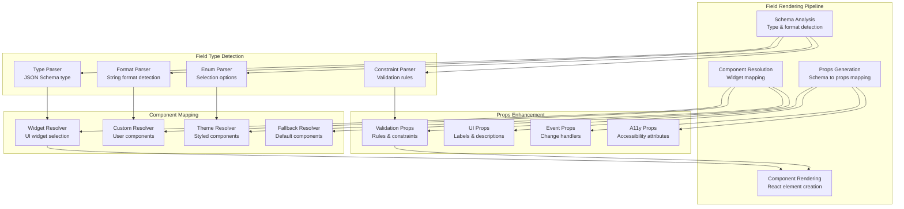
```mermaid
graph TD
    subgraph "Field Rendering Pipeline"
        SCHEMA_ANALYSIS[Schema Analysis<br/>Type & format detection]
        COMPONENT_RESOLUTION[Component Resolution<br/>Widget mapping]
        PROPS_GENERATION[Props Generation<br/>Schema to props mapping]
        COMPONENT_RENDERING[Component Rendering<br/>React element creation]
    end
    
    subgraph "Field Type Detection"
        TYPE_PARSER[Type Parser<br/>JSON Schema type]
        FORMAT_PARSER[Format Parser<br/>String format detection]
        ENUM_PARSER[Enum Parser<br/>Selection options]
        CONSTRAINT_PARSER[Constraint Parser<br/>Validation rules]
    end
    
    subgraph "Component Mapping"
        WIDGET_RESOLVER[Widget Resolver<br/>UI widget selection]
        CUSTOM_RESOLVER[Custom Resolver<br/>User components]
        THEME_RESOLVER[Theme Resolver<br/>Styled components]
        FALLBACK_RESOLVER[Fallback Resolver<br/>Default components]
    end
    
    subgraph "Props Enhancement"
        VALIDATION_PROPS[Validation Props<br/>Rules & constraints]
        UI_PROPS[UI Props<br/>Labels & descriptions]
        EVENT_PROPS[Event Props<br/>Change handlers]
        A11Y_PROPS[A11y Props<br/>Accessibility attributes]
    end
    
    SCHEMA_ANALYSIS --> TYPE_PARSER
    SCHEMA_ANALYSIS --> FORMAT_PARSER
    SCHEMA_ANALYSIS --> ENUM_PARSER
    SCHEMA_ANALYSIS --> CONSTRAINT_PARSER
    
    COMPONENT_RESOLUTION --> WIDGET_RESOLVER
    COMPONENT_RESOLUTION --> CUSTOM_RESOLVER
    COMPONENT_RESOLUTION --> THEME_RESOLVER
    COMPONENT_RESOLUTION --> FALLBACK_RESOLVER
    
    PROPS_GENERATION --> VALIDATION_PROPS
    PROPS_GENERATION --> UI_PROPS
    PROPS_GENERATION --> EVENT_PROPS
    PROPS_GENERATION --> A11Y_PROPS
    
    TYPE_PARSER --> WIDGET_RESOLVER
    FORMAT_PARSER --> CUSTOM_RESOLVER
    ENUM_PARSER --> THEME_RESOLVER
    CONSTRAINT_PARSER --> VALIDATION_PROPS
    
    WIDGET_RESOLVER --> COMPONENT_RENDERING
    VALIDATION_PROPS --> COMPONENT_RENDERING
```

### Validation State Management

[⬆️ Back to Top](#--table-of-contents)

---

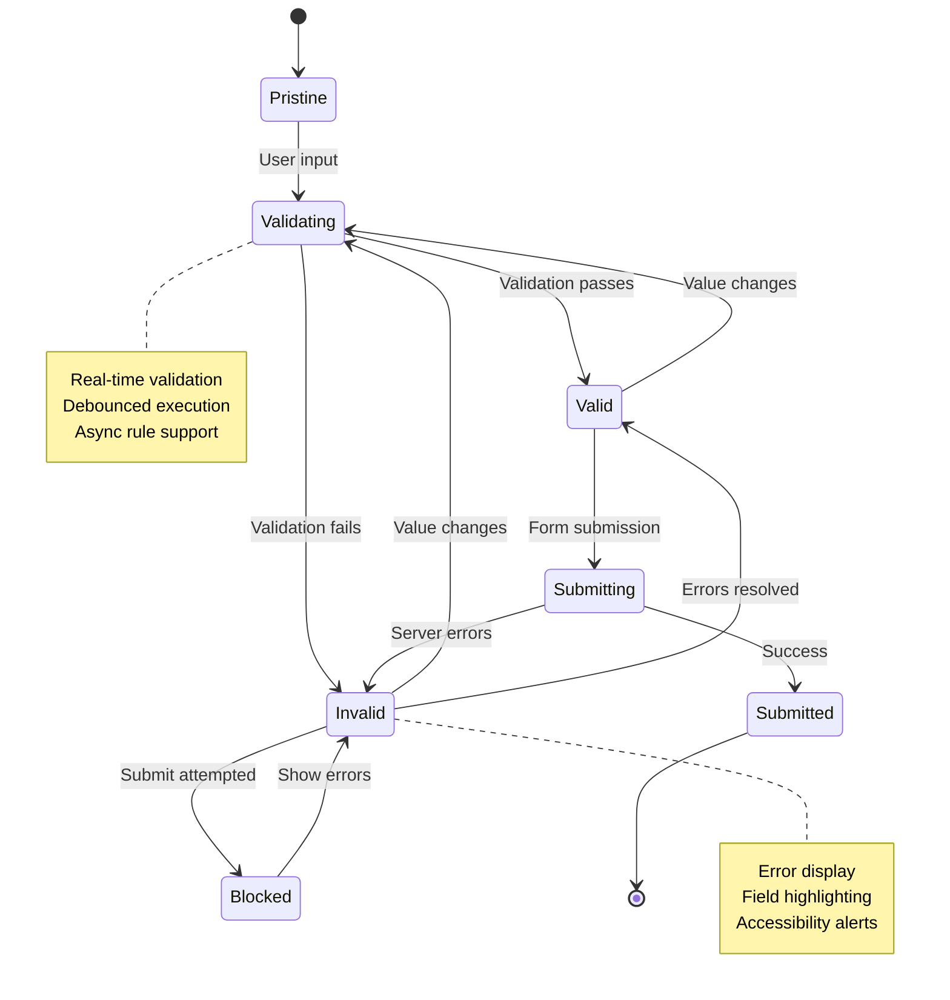
```mermaid
stateDiagram-v2
    [*] --> Pristine
    Pristine --> Validating : User input
    Validating --> Valid : Validation passes
    Validating --> Invalid : Validation fails
    Valid --> Validating : Value changes
    Invalid --> Validating : Value changes
    Invalid --> Valid : Errors resolved
    Valid --> Submitting : Form submission
    Invalid --> Blocked : Submit attempted
    Submitting --> Submitted : Success
    Submitting --> Invalid : Server errors
    Blocked --> Invalid : Show errors
    Submitted --> [*]
    
    note right of Validating
        Real-time validation
        Debounced execution
        Async rule support
    end note
    
    note right of Invalid
        Error display
        Field highlighting
        Accessibility alerts
    end note
```

---

## Real-Time Sync, Data Modeling & APIs

[⬆️ Back to Top](#--table-of-contents)

---

### Schema Validation Engine

[⬆️ Back to Top](#--table-of-contents)

---

#### Real-time Validation Algorithm

[⬆️ Back to Top](#--table-of-contents)

---

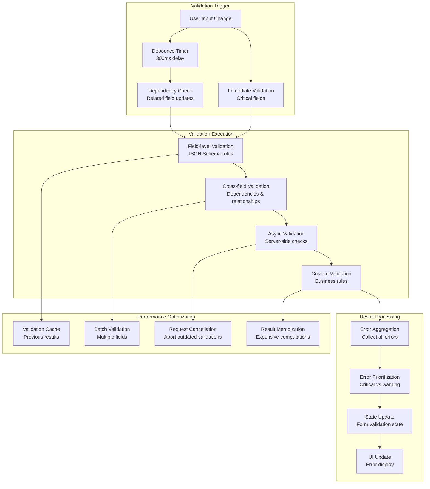
```mermaid
graph TD
    subgraph "Validation Trigger"
        USER_INPUT[User Input Change]
        DEBOUNCE_TIMER[Debounce Timer<br/>300ms delay]
        IMMEDIATE_VALIDATION[Immediate Validation<br/>Critical fields]
        DEPENDENCY_CHECK[Dependency Check<br/>Related field updates]
    end
    
    subgraph "Validation Execution"
        FIELD_VALIDATION[Field-level Validation<br/>JSON Schema rules]
        CROSS_VALIDATION[Cross-field Validation<br/>Dependencies & relationships]
        ASYNC_VALIDATION[Async Validation<br/>Server-side checks]
        CUSTOM_VALIDATION[Custom Validation<br/>Business rules]
    end
    
    subgraph "Result Processing"
        ERROR_AGGREGATION[Error Aggregation<br/>Collect all errors]
        ERROR_PRIORITIZATION[Error Prioritization<br/>Critical vs warning]
        STATE_UPDATE[State Update<br/>Form validation state]
        UI_UPDATE[UI Update<br/>Error display]
    end
    
    subgraph "Performance Optimization"
        VALIDATION_CACHE[Validation Cache<br/>Previous results]
        BATCH_VALIDATION[Batch Validation<br/>Multiple fields]
        CANCELLATION[Request Cancellation<br/>Abort outdated validations]
        MEMOIZATION[Result Memoization<br/>Expensive computations]
    end
    
    USER_INPUT --> DEBOUNCE_TIMER
    USER_INPUT --> IMMEDIATE_VALIDATION
    DEBOUNCE_TIMER --> DEPENDENCY_CHECK
    
    DEPENDENCY_CHECK --> FIELD_VALIDATION
    IMMEDIATE_VALIDATION --> FIELD_VALIDATION
    FIELD_VALIDATION --> CROSS_VALIDATION
    CROSS_VALIDATION --> ASYNC_VALIDATION
    ASYNC_VALIDATION --> CUSTOM_VALIDATION
    
    CUSTOM_VALIDATION --> ERROR_AGGREGATION
    ERROR_AGGREGATION --> ERROR_PRIORITIZATION
    ERROR_PRIORITIZATION --> STATE_UPDATE
    STATE_UPDATE --> UI_UPDATE
    
    FIELD_VALIDATION --> VALIDATION_CACHE
    CROSS_VALIDATION --> BATCH_VALIDATION
    ASYNC_VALIDATION --> CANCELLATION
    CUSTOM_VALIDATION --> MEMOIZATION
```

#### Conditional Logic Processing

[⬆️ Back to Top](#--table-of-contents)

---

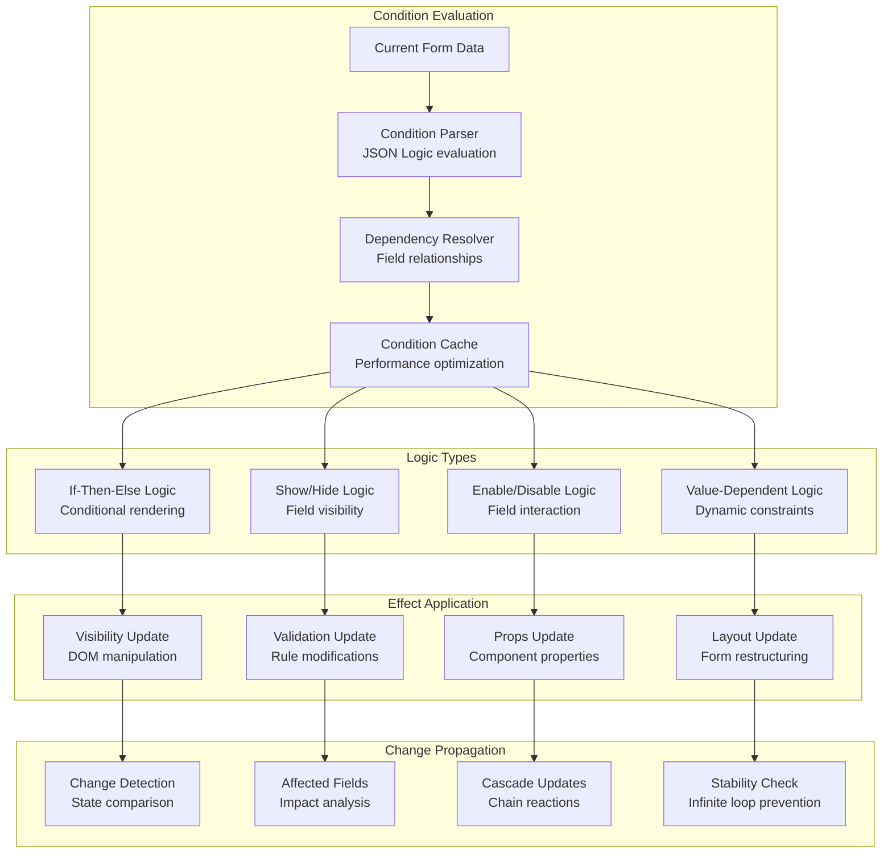
```mermaid
graph TD
    subgraph "Condition Evaluation"
        FORM_DATA[Current Form Data]
        CONDITION_PARSER[Condition Parser<br/>JSON Logic evaluation]
        DEPENDENCY_RESOLVER[Dependency Resolver<br/>Field relationships]
        CONDITION_CACHE[Condition Cache<br/>Performance optimization]
    end
    
    subgraph "Logic Types"
        IF_THEN_ELSE[If-Then-Else Logic<br/>Conditional rendering]
        SHOW_HIDE[Show/Hide Logic<br/>Field visibility]
        ENABLE_DISABLE[Enable/Disable Logic<br/>Field interaction]
        VALUE_DEPENDENT[Value-Dependent Logic<br/>Dynamic constraints]
    end
    
    subgraph "Effect Application"
        VISIBILITY_UPDATE[Visibility Update<br/>DOM manipulation]
        VALIDATION_UPDATE[Validation Update<br/>Rule modifications]
        PROPS_UPDATE[Props Update<br/>Component properties]
        LAYOUT_UPDATE[Layout Update<br/>Form restructuring]
    end
    
    subgraph "Change Propagation"
        CHANGE_DETECTION[Change Detection<br/>State comparison]
        AFFECTED_FIELDS[Affected Fields<br/>Impact analysis]
        CASCADE_UPDATES[Cascade Updates<br/>Chain reactions]
        STABILITY_CHECK[Stability Check<br/>Infinite loop prevention]
    end
    
    FORM_DATA --> CONDITION_PARSER
    CONDITION_PARSER --> DEPENDENCY_RESOLVER
    DEPENDENCY_RESOLVER --> CONDITION_CACHE
    
    CONDITION_CACHE --> IF_THEN_ELSE
    CONDITION_CACHE --> SHOW_HIDE
    CONDITION_CACHE --> ENABLE_DISABLE
    CONDITION_CACHE --> VALUE_DEPENDENT
    
    IF_THEN_ELSE --> VISIBILITY_UPDATE
    SHOW_HIDE --> VALIDATION_UPDATE
    ENABLE_DISABLE --> PROPS_UPDATE
    VALUE_DEPENDENT --> LAYOUT_UPDATE
    
    VISIBILITY_UPDATE --> CHANGE_DETECTION
    VALIDATION_UPDATE --> AFFECTED_FIELDS
    PROPS_UPDATE --> CASCADE_UPDATES
    LAYOUT_UPDATE --> STABILITY_CHECK
```

### Dynamic Schema Updates

[⬆️ Back to Top](#--table-of-contents)

---

#### Schema Diff and Merge

[⬆️ Back to Top](#--table-of-contents)

---

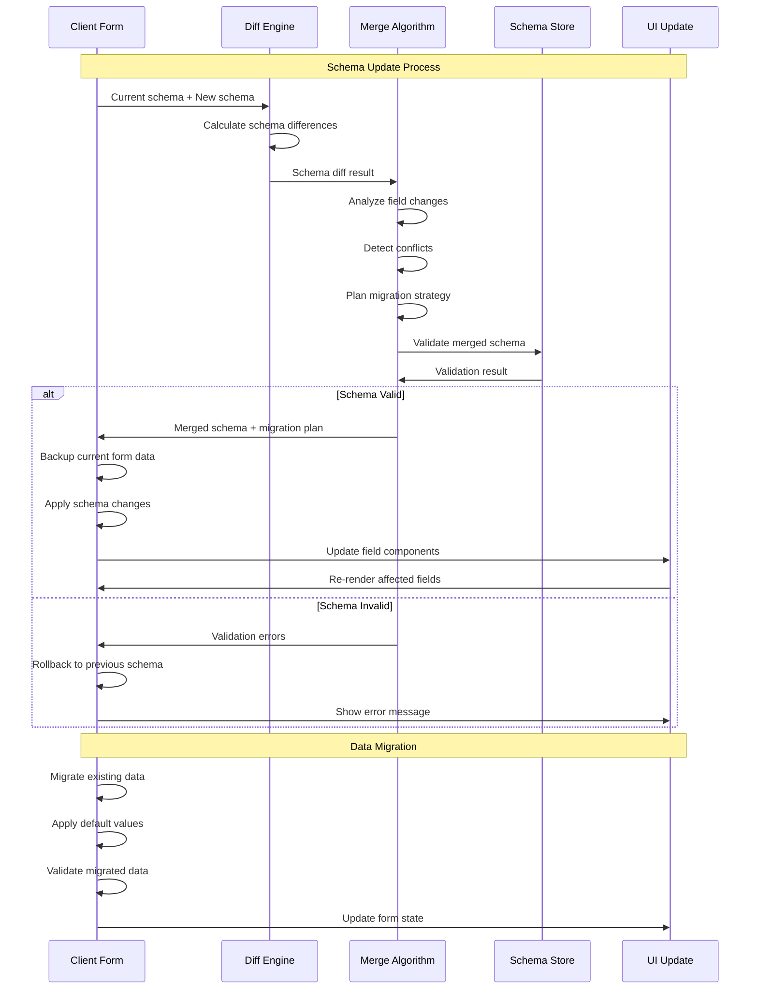
```mermaid
sequenceDiagram
    participant C as Client Form
    participant D as Diff Engine
    participant M as Merge Algorithm
    participant S as Schema Store
    participant U as UI Update
    
    Note over C,U: Schema Update Process
    
    C->>D: Current schema + New schema
    D->>D: Calculate schema differences
    D->>M: Schema diff result
    
    M->>M: Analyze field changes
    M->>M: Detect conflicts
    M->>M: Plan migration strategy
    
    M->>S: Validate merged schema
    S->>M: Validation result
    
    alt Schema Valid
        M->>C: Merged schema + migration plan
        C->>C: Backup current form data
        C->>C: Apply schema changes
        C->>U: Update field components
        U->>C: Re-render affected fields
    else Schema Invalid
        M->>C: Validation errors
        C->>C: Rollback to previous schema
        C->>U: Show error message
    end
    
    Note over C,U: Data Migration
    
    C->>C: Migrate existing data
    C->>C: Apply default values
    C->>C: Validate migrated data
    C->>U: Update form state
```

### API Design Pattern

[⬆️ Back to Top](#--table-of-contents)

---

#### Schema Management API

[⬆️ Back to Top](#--table-of-contents)

---

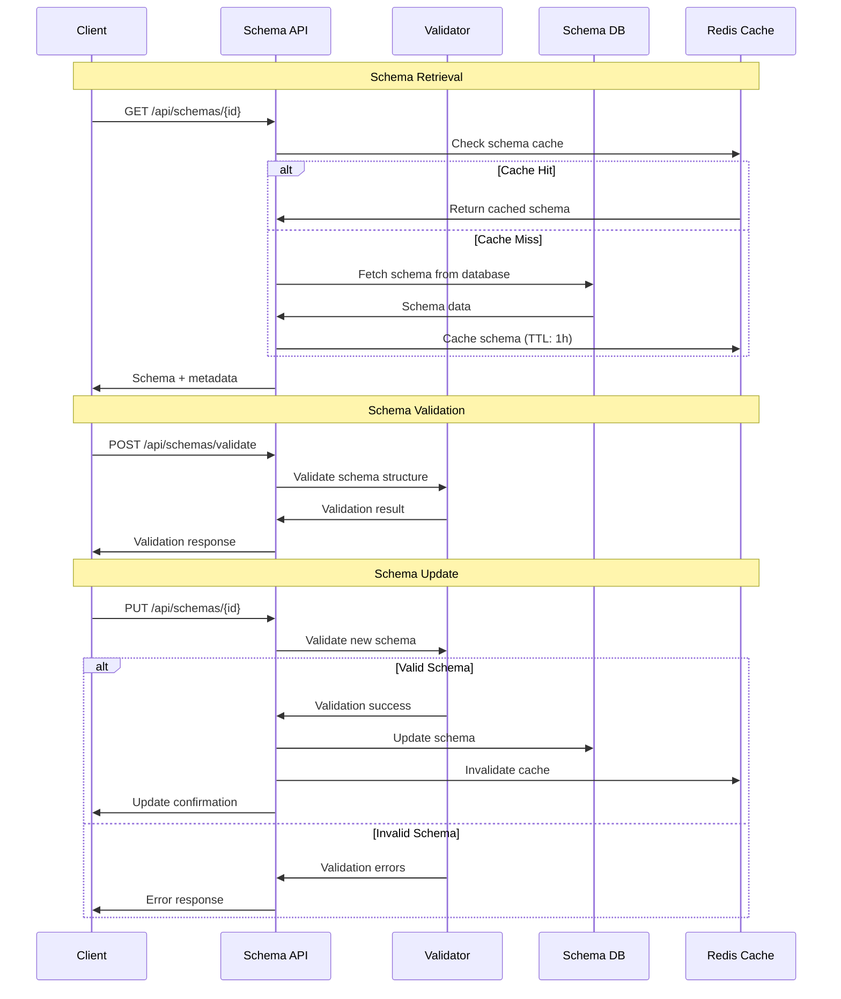
```mermaid
sequenceDiagram
    participant C as Client
    participant API as Schema API
    participant V as Validator
    participant DB as Schema DB
    participant Cache as Redis Cache
    
    Note over C,Cache: Schema Retrieval
    
    C->>API: GET /api/schemas/{id}
    API->>Cache: Check schema cache
    
    alt Cache Hit
        Cache->>API: Return cached schema
    else Cache Miss
        API->>DB: Fetch schema from database
        DB->>API: Schema data
        API->>Cache: Cache schema (TTL: 1h)
    end
    
    API->>C: Schema + metadata
    
    Note over C,Cache: Schema Validation
    
    C->>API: POST /api/schemas/validate
    API->>V: Validate schema structure
    V->>API: Validation result
    API->>C: Validation response
    
    Note over C,Cache: Schema Update
    
    C->>API: PUT /api/schemas/{id}
    API->>V: Validate new schema
    
    alt Valid Schema
        V->>API: Validation success
        API->>DB: Update schema
        API->>Cache: Invalidate cache
        API->>C: Update confirmation
    else Invalid Schema
        V->>API: Validation errors
        API->>C: Error response
    end
```

### TypeScript Interfaces & Component Props

[⬆️ Back to Top](#--table-of-contents)

---

#### Core Data Interfaces


```mermaid
classDiagram
    class JsonSchemaFormProps {
        +JsonSchemaDefinition schema
        +UiSchemaDefinition uiSchema
        +Record~string, any~ formData
        +SubmitHandler onSubmit
        +ChangeHandler onChange
        +ErrorHandler onError
        +ValidateHandler onValidate
        +boolean validateOnChange
        +boolean validateOnBlur
        +boolean showErrorSummary
        +boolean autoFocus
        +boolean disabled
        +boolean readOnly
        +string|ThemeConfig theme
        +Record~string, ReactComponent~ customComponents
        +Record~string, ValidatorFunction~ customValidators
        +ErrorTransformer transformErrors
        +boolean noHtml5Validate
        +boolean liveValidate
        +ReactNode children
    }
    
    class FieldComponentProps {
        +string path
        +any value
        +string|string[] error
        +FieldChangeHandler onChange
        +FieldBlurHandler onBlur
        +FieldFocusHandler onFocus
        +JsonSchemaProperty schema
        +UiSchemaProperty uiSchema
        +boolean required
        +boolean disabled
        +boolean readOnly
        +boolean autofocus
        +string placeholder
        +string title
        +string description
        +string help
        +ThemeConfig theme
        +ComponentRegistry registry
        +FormContextType formContext
    }
    
    class ComponentRegistry {
        +Record~string, ReactComponent~ widgets
        +Record~string, ReactComponent~ fields
        +Record~string, ReactComponent~ templates
        +Record~string, ValidatorFunction~ validators
        +Record~string, TransformerFunction~ transformers
    }
    
    class ThemeConfig {
        +string name
        +Record~string, ComponentStyleConfig~ components
        +Record~string, any~ tokens
        +Record~string, string~ breakpoints
        +Record~string, string~ spacing
        +Record~string, string~ colors
        +Record~string, any~ typography
    }
    
    class ComponentStyleConfig {
        +string className
        +CSSProperties style
        +Record~string, any~ props
        +Record~string, string~ variants
        +MediaQueries responsive
    }
    
    class ValidatorFunction {
        <<interface>>
        +validate(value: any, schema: JsonSchemaProperty, formData: any) ValidationResult
    }
    
    class ValidationResult {
        +boolean valid
        +string[] errors
        +string[] warnings
        +any transformedValue
    }
    
    class SubmitHandler {
        <<interface>>
        +onSubmit(data: Record~string, any~) void|Promise~void~
    }
    
    class ChangeHandler {
        <<interface>>
        +onChange(data: Record~string, any~, path: string, value: any) void
    }
    
    class ErrorHandler {
        <<interface>>
        +onError(errors: Record~string, string~, data: Record~string, any~) void
    }
    
    class ValidateHandler {
        <<interface>>
        +onValidate(data: Record~string, any~) Record~string, string~|Promise~Record~string, string~~
    }
    
    class ErrorTransformer {
        <<interface>>
        +transform(errors: ValidationError[]) ValidationError[]
    }
    
    class FieldChangeHandler {
        <<interface>>
        +onChange(path: string, value: any) void
    }
    
    class FieldBlurHandler {
        <<interface>>
        +onBlur(path: string) void
    }
    
    class FieldFocusHandler {
        <<interface>>
        +onFocus(path: string) void
    }
    
    class FormContextType {
        +FormState formState
        +FormMetadata metadata
        +FormActions actions
        +ThemeConfig theme
        +ComponentRegistry registry
    }
    
    class ValidationError {
        +string field
        +string message
        +string code
        +any value
        +JsonSchemaProperty schema
        +ErrorSeverity severity
    }
    
    class ErrorSeverity {
        <<enumeration>>
        error
        warning
        info
    }
    
    JsonSchemaFormProps --> JsonSchemaDefinition : schema
    JsonSchemaFormProps --> UiSchemaDefinition : uiSchema
    JsonSchemaFormProps --> ThemeConfig : theme
    JsonSchemaFormProps --> SubmitHandler : onSubmit
    JsonSchemaFormProps --> ChangeHandler : onChange
    JsonSchemaFormProps --> ErrorHandler : onError
    JsonSchemaFormProps --> ValidateHandler : onValidate
    JsonSchemaFormProps --> ErrorTransformer : transformErrors
    FieldComponentProps --> JsonSchemaProperty : schema
    FieldComponentProps --> UiSchemaProperty : uiSchema
    FieldComponentProps --> ThemeConfig : theme
    FieldComponentProps --> ComponentRegistry : registry
    FieldComponentProps --> FormContextType : formContext
    FieldComponentProps --> FieldChangeHandler : onChange
    FieldComponentProps --> FieldBlurHandler : onBlur
    FieldComponentProps --> FieldFocusHandler : onFocus
    ComponentRegistry --> ValidatorFunction : validators
    ThemeConfig --> ComponentStyleConfig : components
    ValidatorFunction --> ValidationResult : returns
    ErrorTransformer --> ValidationError : transforms
    FormContextType --> FormState : formState
    FormContextType --> FormMetadata : metadata
    FormContextType --> ThemeConfig : theme
    FormContextType --> ComponentRegistry : registry
    ValidationError --> ErrorSeverity : severity
```

#### Component Props Interfaces


```mermaid
classDiagram
    class FieldComponentProps {
        <<abstract>>
        +string path
        +any value
        +string|string[] error
        +FieldChangeHandler onChange
        +FieldBlurHandler onBlur
        +FieldFocusHandler onFocus
        +JsonSchemaProperty schema
        +UiSchemaProperty uiSchema
        +boolean required
        +boolean disabled
        +boolean readOnly
        +boolean autofocus
        +string placeholder
        +string title
        +string description
        +string help
        +ThemeConfig theme
        +ComponentRegistry registry
        +FormContextType formContext
    }
    
    class TextInputProps {
        +TextInputType type
        +number minLength
        +number maxLength
        +string pattern
        +string autoComplete
        +boolean spellCheck
    }
    
    class NumberInputProps {
        +NumberInputType type
        +number min
        +number max
        +number|string step
        +number precision
    }
    
    class SelectInputProps {
        +SelectOption[] options
        +boolean multiple
        +boolean searchable
        +boolean clearable
        +boolean loading
        +OptionsLoader onLoadOptions
    }
    
    class ArrayFieldProps {
        +JsonSchemaProperty items
        +number minItems
        +number maxItems
        +boolean uniqueItems
        +boolean addable
        +boolean removable
        +boolean reorderable
        +ReactComponent itemComponent
        +string addButtonText
        +string removeButtonText
    }
    
    class ObjectFieldProps {
        +Record~string, JsonSchemaProperty~ properties
        +string[] required
        +boolean|JsonSchemaProperty additionalProperties
        +string[] fieldOrder
        +boolean collapsible
        +boolean defaultExpanded
        +string title
    }
    
    class FileInputProps {
        +string accept
        +boolean multiple
        +number maxSize
        +number maxFiles
        +boolean preview
        +string uploadUrl
        +FileUploadHandler onUpload
        +boolean dragAndDrop
    }
    
    class ConditionalFieldProps {
        +ConditionalRule condition
        +ReactNode children
        +ReactNode fallback
    }
    
    class FormLayoutProps {
        +ReactNode children
        +number|string columns
        +string gap
        +LayoutDirection direction
        +boolean wrap
        +AlignmentType align
        +JustifyType justify
    }
    
    class ErrorDisplayProps {
        +string|string[] error
        +string path
        +ErrorDisplayType type
        +boolean showIcon
        +boolean dismissible
        +DismissHandler onDismiss
    }
    
    class ProgressIndicatorProps {
        +FormStep[] steps
        +number currentStep
        +number[] completedSteps
        +StepClickHandler onStepClick
        +boolean showLabels
        +OrientationType orientation
    }
    
    class SelectOption {
        +string|number value
        +string label
        +boolean disabled
        +string group
        +any data
    }
    
    class FormStep {
        +string id
        +string title
        +string description
        +boolean completed
        +boolean disabled
        +any data
    }
    
    class TextInputType {
        <<enumeration>>
        text
        email
        password
        url
        tel
    }
    
    class NumberInputType {
        <<enumeration>>
        number
        range
    }
    
    class LayoutDirection {
        <<enumeration>>
        row
        column
    }
    
    class AlignmentType {
        <<enumeration>>
        start
        center
        end
        stretch
    }
    
    class JustifyType {
        <<enumeration>>
        start
        center
        end
        between
        around
        evenly
    }
    
    class ErrorDisplayType {
        <<enumeration>>
        inline
        tooltip
        summary
    }
    
    class OrientationType {
        <<enumeration>>
        horizontal
        vertical
    }
    
    class OptionsLoader {
        <<interface>>
        +onLoadOptions(search: string) Promise~SelectOption[]~
    }
    
    class FileUploadHandler {
        <<interface>>
        +onUpload(files: File[]) Promise~string[]~
    }
    
    class DismissHandler {
        <<interface>>
        +onDismiss() void
    }
    
    class StepClickHandler {
        <<interface>>
        +onStepClick(step: number) void
    }
    
    FieldComponentProps <|-- TextInputProps : extends
    FieldComponentProps <|-- NumberInputProps : extends
    FieldComponentProps <|-- SelectInputProps : extends
    FieldComponentProps <|-- ArrayFieldProps : extends
    FieldComponentProps <|-- ObjectFieldProps : extends
    FieldComponentProps <|-- FileInputProps : extends
    FieldComponentProps <|-- ConditionalFieldProps : extends
    
    TextInputProps --> TextInputType : type
    NumberInputProps --> NumberInputType : type
    SelectInputProps --> SelectOption : options
    SelectInputProps --> OptionsLoader : onLoadOptions
    ArrayFieldProps --> JsonSchemaProperty : items
    ObjectFieldProps --> JsonSchemaProperty : properties
    FileInputProps --> FileUploadHandler : onUpload
    ConditionalFieldProps --> ConditionalRule : condition
    FormLayoutProps --> LayoutDirection : direction
    FormLayoutProps --> AlignmentType : align
    FormLayoutProps --> JustifyType : justify
    ErrorDisplayProps --> ErrorDisplayType : type
    ErrorDisplayProps --> DismissHandler : onDismiss
    ProgressIndicatorProps --> FormStep : steps
    ProgressIndicatorProps --> StepClickHandler : onStepClick
    ProgressIndicatorProps --> OrientationType : orientation
```

### API Reference

[⬆️ Back to Top](#--table-of-contents)

---

#### Schema Management
- `GET /api/schemas` - List available form schemas with metadata and permissions
- `GET /api/schemas/:id` - Get specific schema definition with version information
- `POST /api/schemas` - Create new schema with validation and conflict checking
- `PUT /api/schemas/:id` - Update schema with migration strategy for existing data
- `DELETE /api/schemas/:id` - Archive schema and handle dependent form instances

#### Schema Validation
- `POST /api/schemas/validate` - Validate schema structure and syntax
- `POST /api/schemas/validate-data` - Validate form data against schema
- `GET /api/schemas/:id/validation-rules` - Get extracted validation rules
- `POST /api/schemas/compatibility` - Check schema compatibility between versions
- `GET /api/schemas/:id/errors` - Get common validation error patterns

#### Form Data Management
- `POST /api/forms/data/validate` - Real-time form data validation
- `POST /api/forms/data/submit` - Submit form data with processing
- `GET /api/forms/data/:id` - Retrieve saved form data by identifier
- `PUT /api/forms/data/:id` - Update existing form data with versioning
- `DELETE /api/forms/data/:id` - Delete form data with audit trail

#### Dynamic Schema Operations
- `POST /api/schemas/merge` - Merge multiple schemas with conflict resolution
- `POST /api/schemas/diff` - Compare schema versions and generate differences
- `POST /api/schemas/migrate` - Migrate data between schema versions
- `GET /api/schemas/:id/dependencies` - Get schema field dependencies
- `POST /api/schemas/conditional` - Evaluate conditional logic expressions

#### Custom Components
- `GET /api/components/registry` - Get available custom components
- `POST /api/components/register` - Register new custom component
- `GET /api/components/:name` - Get component definition and metadata
- `PUT /api/components/:name` - Update component configuration
- `POST /api/components/validate` - Validate custom component definition

#### Theming & Customization
- `GET /api/themes` - List available form themes and variants
- `GET /api/themes/:name` - Get theme configuration and assets
- `POST /api/themes` - Create custom theme with component mappings
- `PUT /api/themes/:name` - Update theme configuration
- `GET /api/themes/:name/preview` - Generate theme preview examples

#### Analytics & Monitoring
- `POST /api/analytics/form-events` - Track form interaction events
- `GET /api/analytics/schemas/:id/usage` - Get schema usage statistics
- `GET /api/analytics/validation-errors` - Get common validation error patterns
- `POST /api/analytics/performance` - Track form rendering performance
- `GET /api/analytics/conversion` - Get form completion and conversion rates

#### Internationalization
- `GET /api/i18n/translations` - Get available translations for forms
- `POST /api/i18n/translations` - Add translation for schema or components
- `GET /api/i18n/schemas/:id` - Get localized schema for specific language
- `PUT /api/i18n/translations/:lang` - Update translations for language
- `GET /api/i18n/validation-messages` - Get localized validation messages

---

## Performance and Scalability

[⬆️ Back to Top](#--table-of-contents)

---

### Form Rendering Optimization

[⬆️ Back to Top](#--table-of-contents)

---

#### Virtual Field Rendering

[⬆️ Back to Top](#--table-of-contents)

---

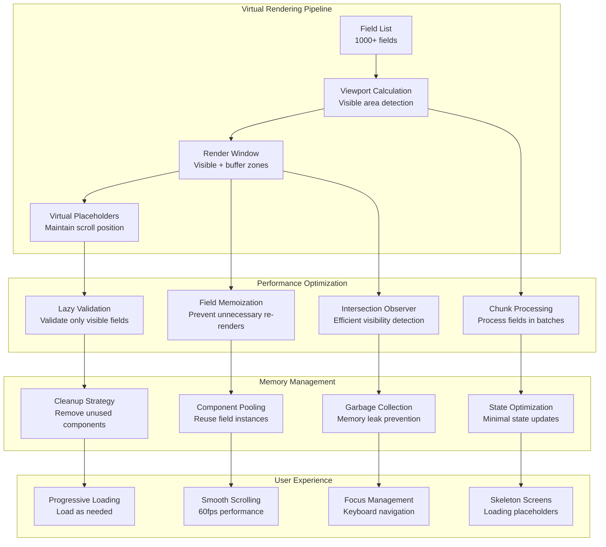
```mermaid
graph TD
    subgraph "Virtual Rendering Pipeline"
        FIELD_LIST[Field List<br/>1000+ fields]
        VIEWPORT_CALCULATION[Viewport Calculation<br/>Visible area detection]
        RENDER_WINDOW[Render Window<br/>Visible + buffer zones]
        VIRTUAL_PLACEHOLDERS[Virtual Placeholders<br/>Maintain scroll position]
    end
    
    subgraph "Performance Optimization"
        FIELD_MEMOIZATION[Field Memoization<br/>Prevent unnecessary re-renders]
        LAZY_VALIDATION[Lazy Validation<br/>Validate only visible fields]
        CHUNK_PROCESSING[Chunk Processing<br/>Process fields in batches]
        INTERSECTION_OBSERVER[Intersection Observer<br/>Efficient visibility detection]
    end
    
    subgraph "Memory Management"
        COMPONENT_POOLING[Component Pooling<br/>Reuse field instances]
        CLEANUP_STRATEGY[Cleanup Strategy<br/>Remove unused components]
        STATE_OPTIMIZATION[State Optimization<br/>Minimal state updates]
        GARBAGE_COLLECTION[Garbage Collection<br/>Memory leak prevention]
    end
    
    subgraph "User Experience"
        SMOOTH_SCROLLING[Smooth Scrolling<br/>60fps performance]
        PROGRESSIVE_LOADING[Progressive Loading<br/>Load as needed]
        SKELETON_SCREENS[Skeleton Screens<br/>Loading placeholders]
        FOCUS_MANAGEMENT[Focus Management<br/>Keyboard navigation]
    end
    
    FIELD_LIST --> VIEWPORT_CALCULATION
    VIEWPORT_CALCULATION --> RENDER_WINDOW
    RENDER_WINDOW --> VIRTUAL_PLACEHOLDERS
    
    RENDER_WINDOW --> FIELD_MEMOIZATION
    VIRTUAL_PLACEHOLDERS --> LAZY_VALIDATION
    VIEWPORT_CALCULATION --> CHUNK_PROCESSING
    RENDER_WINDOW --> INTERSECTION_OBSERVER
    
    FIELD_MEMOIZATION --> COMPONENT_POOLING
    LAZY_VALIDATION --> CLEANUP_STRATEGY
    CHUNK_PROCESSING --> STATE_OPTIMIZATION
    INTERSECTION_OBSERVER --> GARBAGE_COLLECTION
    
    COMPONENT_POOLING --> SMOOTH_SCROLLING
    CLEANUP_STRATEGY --> PROGRESSIVE_LOADING
    STATE_OPTIMIZATION --> SKELETON_SCREENS
    GARBAGE_COLLECTION --> FOCUS_MANAGEMENT
```

### Validation Performance

[⬆️ Back to Top](#--table-of-contents)

---

#### Debounced Validation Strategy

[⬆️ Back to Top](#--table-of-contents)

---

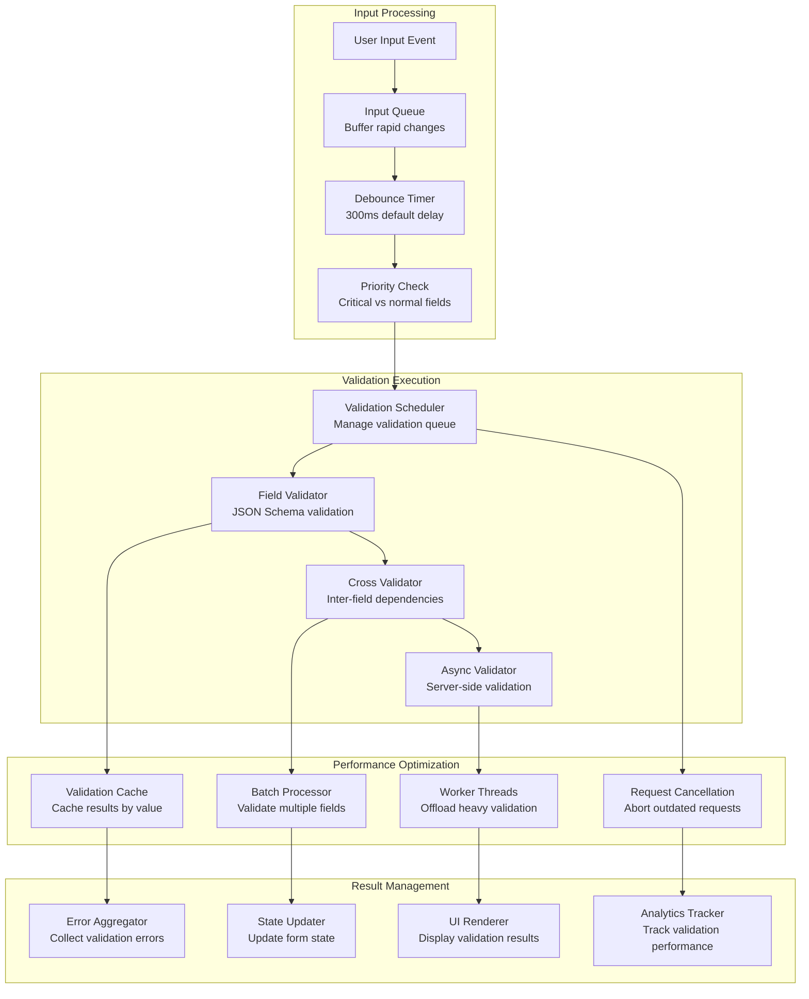
```mermaid
graph TD
    subgraph "Input Processing"
        USER_INPUT[User Input Event]
        INPUT_QUEUE[Input Queue<br/>Buffer rapid changes]
        DEBOUNCE_TIMER[Debounce Timer<br/>300ms default delay]
        PRIORITY_CHECK[Priority Check<br/>Critical vs normal fields]
    end
    
    subgraph "Validation Execution"
        VALIDATION_SCHEDULER[Validation Scheduler<br/>Manage validation queue]
        FIELD_VALIDATOR[Field Validator<br/>JSON Schema validation]
        CROSS_VALIDATOR[Cross Validator<br/>Inter-field dependencies]
        ASYNC_VALIDATOR[Async Validator<br/>Server-side validation]
    end
    
    subgraph "Performance Optimization"
        VALIDATION_CACHE[Validation Cache<br/>Cache results by value]
        BATCH_PROCESSOR[Batch Processor<br/>Validate multiple fields]
        WORKER_THREADS[Worker Threads<br/>Offload heavy validation]
        REQUEST_CANCELLATION[Request Cancellation<br/>Abort outdated requests]
    end
    
    subgraph "Result Management"
        ERROR_AGGREGATOR[Error Aggregator<br/>Collect validation errors]
        STATE_UPDATER[State Updater<br/>Update form state]
        UI_RENDERER[UI Renderer<br/>Display validation results]
        ANALYTICS_TRACKER[Analytics Tracker<br/>Track validation performance]
    end
    
    USER_INPUT --> INPUT_QUEUE
    INPUT_QUEUE --> DEBOUNCE_TIMER
    DEBOUNCE_TIMER --> PRIORITY_CHECK
    
    PRIORITY_CHECK --> VALIDATION_SCHEDULER
    VALIDATION_SCHEDULER --> FIELD_VALIDATOR
    FIELD_VALIDATOR --> CROSS_VALIDATOR
    CROSS_VALIDATOR --> ASYNC_VALIDATOR
    
    FIELD_VALIDATOR --> VALIDATION_CACHE
    CROSS_VALIDATOR --> BATCH_PROCESSOR
    ASYNC_VALIDATOR --> WORKER_THREADS
    VALIDATION_SCHEDULER --> REQUEST_CANCELLATION
    
    VALIDATION_CACHE --> ERROR_AGGREGATOR
    BATCH_PROCESSOR --> STATE_UPDATER
    WORKER_THREADS --> UI_RENDERER
    REQUEST_CANCELLATION --> ANALYTICS_TRACKER
```

### Memory Management

[⬆️ Back to Top](#--table-of-contents)

---

#### Schema Caching Strategy

[⬆️ Back to Top](#--table-of-contents)

---

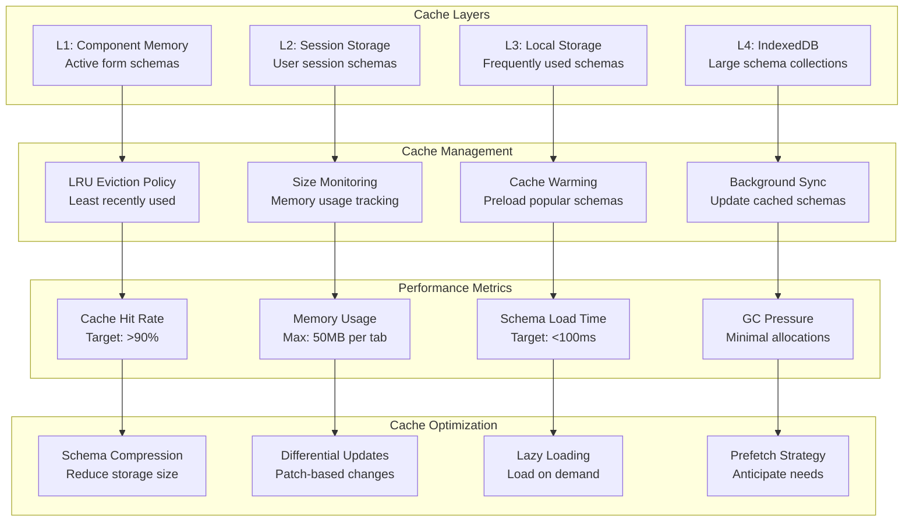
```mermaid
graph TB
    subgraph "Cache Layers"
        L1_MEMORY[L1: Component Memory<br/>Active form schemas]
        L2_SESSION[L2: Session Storage<br/>User session schemas]
        L3_LOCAL[L3: Local Storage<br/>Frequently used schemas]
        L4_INDEXEDDB[L4: IndexedDB<br/>Large schema collections]
    end
    
    subgraph "Cache Management"
        LRU_POLICY[LRU Eviction Policy<br/>Least recently used]
        SIZE_MONITORING[Size Monitoring<br/>Memory usage tracking]
        CACHE_WARMING[Cache Warming<br/>Preload popular schemas]
        BACKGROUND_SYNC[Background Sync<br/>Update cached schemas]
    end
    
    subgraph "Performance Metrics"
        HIT_RATE[Cache Hit Rate<br/>Target: >90%]
        MEMORY_USAGE[Memory Usage<br/>Max: 50MB per tab]
        LOAD_TIME[Schema Load Time<br/>Target: <100ms]
        GARBAGE_COLLECTION[GC Pressure<br/>Minimal allocations]
    end
    
    subgraph "Cache Optimization"
        SCHEMA_COMPRESSION[Schema Compression<br/>Reduce storage size]
        DIFFERENTIAL_UPDATES[Differential Updates<br/>Patch-based changes]
        LAZY_LOADING[Lazy Loading<br/>Load on demand]
        PREFETCH_STRATEGY[Prefetch Strategy<br/>Anticipate needs]
    end
    
    L1_MEMORY --> LRU_POLICY
    L2_SESSION --> SIZE_MONITORING
    L3_LOCAL --> CACHE_WARMING
    L4_INDEXEDDB --> BACKGROUND_SYNC
    
    LRU_POLICY --> HIT_RATE
    SIZE_MONITORING --> MEMORY_USAGE
    CACHE_WARMING --> LOAD_TIME
    BACKGROUND_SYNC --> GARBAGE_COLLECTION
    
    HIT_RATE --> SCHEMA_COMPRESSION
    MEMORY_USAGE --> DIFFERENTIAL_UPDATES
    LOAD_TIME --> LAZY_LOADING
    GARBAGE_COLLECTION --> PREFETCH_STRATEGY
```

---

## Security and Privacy

[⬆️ Back to Top](#--table-of-contents)

---

### Input Validation Framework

[⬆️ Back to Top](#--table-of-contents)

---

#### Multi-Layer Validation Security

[⬆️ Back to Top](#--table-of-contents)

---

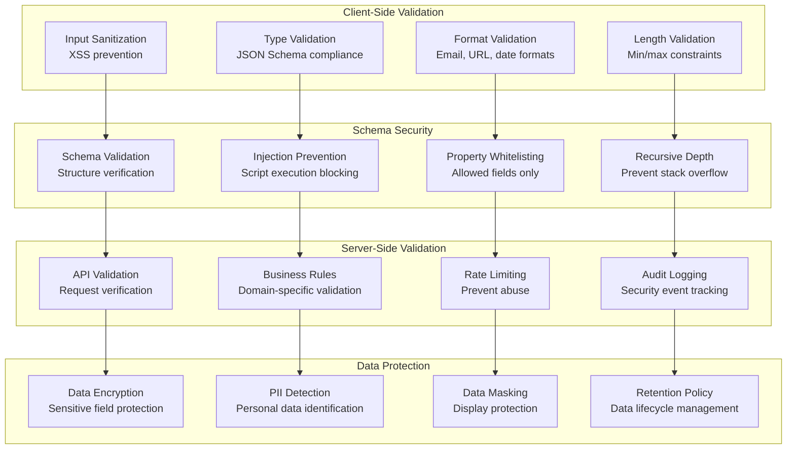
```mermaid
graph TD
    subgraph "Client-Side Validation"
        INPUT_SANITIZATION[Input Sanitization<br/>XSS prevention]
        TYPE_VALIDATION[Type Validation<br/>JSON Schema compliance]
        FORMAT_VALIDATION[Format Validation<br/>Email, URL, date formats]
        LENGTH_VALIDATION[Length Validation<br/>Min/max constraints]
    end
    
    subgraph "Schema Security"
        SCHEMA_VALIDATION[Schema Validation<br/>Structure verification]
        INJECTION_PREVENTION[Injection Prevention<br/>Script execution blocking]
        PROPERTY_WHITELISTING[Property Whitelisting<br/>Allowed fields only]
        RECURSIVE_DEPTH[Recursive Depth<br/>Prevent stack overflow]
    end
    
    subgraph "Server-Side Validation"
        API_VALIDATION[API Validation<br/>Request verification]
        BUSINESS_RULES[Business Rules<br/>Domain-specific validation]
        RATE_LIMITING[Rate Limiting<br/>Prevent abuse]
        AUDIT_LOGGING[Audit Logging<br/>Security event tracking]
    end
    
    subgraph "Data Protection"
        ENCRYPTION[Data Encryption<br/>Sensitive field protection]
        PII_DETECTION[PII Detection<br/>Personal data identification]
        MASKING[Data Masking<br/>Display protection]
        RETENTION_POLICY[Retention Policy<br/>Data lifecycle management]
    end
    
    INPUT_SANITIZATION --> SCHEMA_VALIDATION
    TYPE_VALIDATION --> INJECTION_PREVENTION
    FORMAT_VALIDATION --> PROPERTY_WHITELISTING
    LENGTH_VALIDATION --> RECURSIVE_DEPTH
    
    SCHEMA_VALIDATION --> API_VALIDATION
    INJECTION_PREVENTION --> BUSINESS_RULES
    PROPERTY_WHITELISTING --> RATE_LIMITING
    RECURSIVE_DEPTH --> AUDIT_LOGGING
    
    API_VALIDATION --> ENCRYPTION
    BUSINESS_RULES --> PII_DETECTION
    RATE_LIMITING --> MASKING
    AUDIT_LOGGING --> RETENTION_POLICY
```

### Data Sanitization Pipeline

[⬆️ Back to Top](#--table-of-contents)

---

#### XSS Prevention in Dynamic Forms

[⬆️ Back to Top](#--table-of-contents)

---

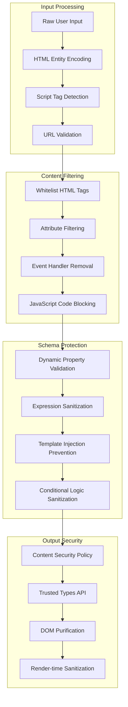
```mermaid
graph TD
    subgraph "Input Processing"
        RAW_INPUT[Raw User Input]
        HTML_ENCODING[HTML Entity Encoding]
        SCRIPT_DETECTION[Script Tag Detection]
        URL_VALIDATION[URL Validation]
    end
    
    subgraph "Content Filtering"
        WHITELIST_TAGS[Whitelist HTML Tags]
        ATTRIBUTE_FILTERING[Attribute Filtering]
        EVENT_HANDLER_REMOVAL[Event Handler Removal]
        JAVASCRIPT_BLOCKING[JavaScript Code Blocking]
    end
    
    subgraph "Schema Protection"
        DYNAMIC_PROPERTY_VALIDATION[Dynamic Property Validation]
        EXPRESSION_SANITIZATION[Expression Sanitization]
        TEMPLATE_INJECTION_PREVENTION[Template Injection Prevention]
        CONDITIONAL_LOGIC_SANITIZATION[Conditional Logic Sanitization]
    end
    
    subgraph "Output Security"
        CSP_ENFORCEMENT[Content Security Policy]
        TRUSTED_TYPES[Trusted Types API]
        DOM_PURIFICATION[DOM Purification]
        RENDER_SANITIZATION[Render-time Sanitization]
    end
    
    RAW_INPUT --> HTML_ENCODING
    HTML_ENCODING --> SCRIPT_DETECTION
    SCRIPT_DETECTION --> URL_VALIDATION
    
    URL_VALIDATION --> WHITELIST_TAGS
    WHITELIST_TAGS --> ATTRIBUTE_FILTERING
    ATTRIBUTE_FILTERING --> EVENT_HANDLER_REMOVAL
    EVENT_HANDLER_REMOVAL --> JAVASCRIPT_BLOCKING
    
    JAVASCRIPT_BLOCKING --> DYNAMIC_PROPERTY_VALIDATION
    DYNAMIC_PROPERTY_VALIDATION --> EXPRESSION_SANITIZATION
    EXPRESSION_SANITIZATION --> TEMPLATE_INJECTION_PREVENTION
    TEMPLATE_INJECTION_PREVENTION --> CONDITIONAL_LOGIC_SANITIZATION
    
    CONDITIONAL_LOGIC_SANITIZATION --> CSP_ENFORCEMENT
    CSP_ENFORCEMENT --> TRUSTED_TYPES
    TRUSTED_TYPES --> DOM_PURIFICATION
    DOM_PURIFICATION --> RENDER_SANITIZATION
```

---

## Testing, Monitoring, and Maintainability

[⬆️ Back to Top](#--table-of-contents)

---

### Testing Strategy

[⬆️ Back to Top](#--table-of-contents)

---

#### Schema-Driven Testing Framework

[⬆️ Back to Top](#--table-of-contents)

---

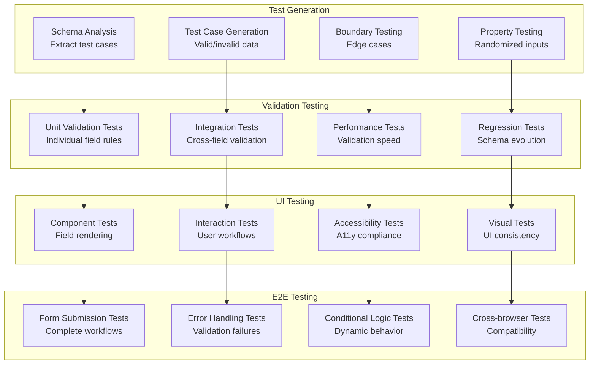
```mermaid
graph TD
    subgraph "Test Generation"
        SCHEMA_ANALYSIS[Schema Analysis<br/>Extract test cases]
        TEST_CASE_GENERATION[Test Case Generation<br/>Valid/invalid data]
        BOUNDARY_TESTING[Boundary Testing<br/>Edge cases]
        PROPERTY_TESTING[Property Testing<br/>Randomized inputs]
    end
    
    subgraph "Validation Testing"
        UNIT_VALIDATION[Unit Validation Tests<br/>Individual field rules]
        INTEGRATION_VALIDATION[Integration Tests<br/>Cross-field validation]
        PERFORMANCE_VALIDATION[Performance Tests<br/>Validation speed]
        REGRESSION_TESTING[Regression Tests<br/>Schema evolution]
    end
    
    subgraph "UI Testing"
        COMPONENT_TESTING[Component Tests<br/>Field rendering]
        INTERACTION_TESTING[Interaction Tests<br/>User workflows]
        ACCESSIBILITY_TESTING[Accessibility Tests<br/>A11y compliance]
        VISUAL_TESTING[Visual Tests<br/>UI consistency]
    end
    
    subgraph "E2E Testing"
        FORM_SUBMISSION[Form Submission Tests<br/>Complete workflows]
        ERROR_HANDLING[Error Handling Tests<br/>Validation failures]
        CONDITIONAL_LOGIC[Conditional Logic Tests<br/>Dynamic behavior]
        CROSS_BROWSER[Cross-browser Tests<br/>Compatibility]
    end
    
    SCHEMA_ANALYSIS --> UNIT_VALIDATION
    TEST_CASE_GENERATION --> INTEGRATION_VALIDATION
    BOUNDARY_TESTING --> PERFORMANCE_VALIDATION
    PROPERTY_TESTING --> REGRESSION_TESTING
    
    UNIT_VALIDATION --> COMPONENT_TESTING
    INTEGRATION_VALIDATION --> INTERACTION_TESTING
    PERFORMANCE_VALIDATION --> ACCESSIBILITY_TESTING
    REGRESSION_TESTING --> VISUAL_TESTING
    
    COMPONENT_TESTING --> FORM_SUBMISSION
    INTERACTION_TESTING --> ERROR_HANDLING
    ACCESSIBILITY_TESTING --> CONDITIONAL_LOGIC
    VISUAL_TESTING --> CROSS_BROWSER
```

### Error Handling and Debugging

[⬆️ Back to Top](#--table-of-contents)

---

#### Schema Validation Error Tracking

[⬆️ Back to Top](#--table-of-contents)

---

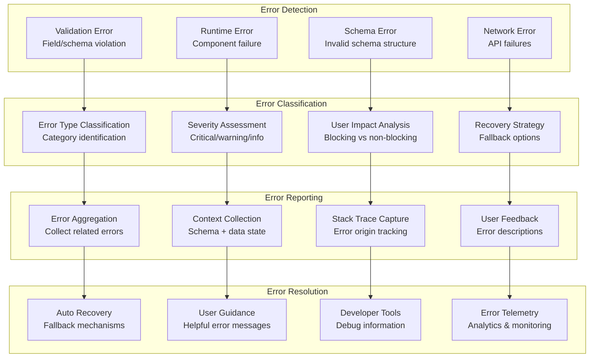
```mermaid
graph TD
    subgraph "Error Detection"
        VALIDATION_ERROR[Validation Error<br/>Field/schema violation]
        RUNTIME_ERROR[Runtime Error<br/>Component failure]
        SCHEMA_ERROR[Schema Error<br/>Invalid schema structure]
        NETWORK_ERROR[Network Error<br/>API failures]
    end
    
    subgraph "Error Classification"
        ERROR_TYPE[Error Type Classification<br/>Category identification]
        SEVERITY_ASSESSMENT[Severity Assessment<br/>Critical/warning/info]
        USER_IMPACT[User Impact Analysis<br/>Blocking vs non-blocking]
        RECOVERY_STRATEGY[Recovery Strategy<br/>Fallback options]
    end
    
    subgraph "Error Reporting"
        ERROR_AGGREGATION[Error Aggregation<br/>Collect related errors]
        CONTEXT_COLLECTION[Context Collection<br/>Schema + data state]
        STACK_TRACE[Stack Trace Capture<br/>Error origin tracking]
        USER_FEEDBACK[User Feedback<br/>Error descriptions]
    end
    
    subgraph "Error Resolution"
        AUTO_RECOVERY[Auto Recovery<br/>Fallback mechanisms]
        USER_GUIDANCE[User Guidance<br/>Helpful error messages]
        DEVELOPER_TOOLS[Developer Tools<br/>Debug information]
        TELEMETRY[Error Telemetry<br/>Analytics & monitoring]
    end
    
    VALIDATION_ERROR --> ERROR_TYPE
    RUNTIME_ERROR --> SEVERITY_ASSESSMENT
    SCHEMA_ERROR --> USER_IMPACT
    NETWORK_ERROR --> RECOVERY_STRATEGY
    
    ERROR_TYPE --> ERROR_AGGREGATION
    SEVERITY_ASSESSMENT --> CONTEXT_COLLECTION
    USER_IMPACT --> STACK_TRACE
    RECOVERY_STRATEGY --> USER_FEEDBACK
    
    ERROR_AGGREGATION --> AUTO_RECOVERY
    CONTEXT_COLLECTION --> USER_GUIDANCE
    STACK_TRACE --> DEVELOPER_TOOLS
    USER_FEEDBACK --> TELEMETRY
```

---

## Trade-offs, Deep Dives, and Extensions

[⬆️ Back to Top](#--table-of-contents)

---

### Schema Flexibility vs Performance

[⬆️ Back to Top](#--table-of-contents)

---

| Aspect | High Flexibility | High Performance |
|--------|------------------|------------------|
| **Schema Complexity** | Unlimited nesting, any structure | Limited depth, optimized patterns |
| **Validation** | Comprehensive rules, custom logic | Basic validation, fast execution |
| **Dynamic Updates** | Real-time schema changes | Static schemas, rebuild required |
| **Memory Usage** | Higher overhead for flexibility | Optimized data structures |
| **Bundle Size** | Larger due to feature completeness | Minimal, tree-shakeable |
| **Developer Experience** | Rich features, easy customization | Streamlined API, fewer options |

### Client vs Server Validation

[⬆️ Back to Top](#--table-of-contents)

---

```mermaid
graph LR
    subgraph "Client-Side Validation"
        CLIENT_PROS[Pros:<br/>• Immediate feedback<br/>• Better UX<br/>• Reduced server load<br/>• Offline support]
        CLIENT_CONS[Cons:<br/>• Security risk<br/>• Can be bypassed<br/>• Inconsistent results<br/>• Limited resources]
    end
    
    subgraph "Server-Side Validation"
        SERVER_PROS[Pros:<br/>• Security guarantee<br/>• Authoritative source<br/>• Business rule enforcement<br/>• Data integrity]
        SERVER_CONS[Cons:<br/>• Network latency<br/>• Server load<br/>• Poor UX<br/>• Requires connectivity]
    end
    
    CLIENT_PROS -.->|Trade-off| SERVER_CONS
    SERVER_PROS -.->|Trade-off| CLIENT_CONS
```

### Advanced Features

[⬆️ Back to Top](#--table-of-contents)

---

#### AI-Powered Form Generation

[⬆️ Back to Top](#--table-of-contents)

---

```mermaid
graph TD
    subgraph "AI Input Processing"
        NATURAL_LANGUAGE[Natural Language Input<br/>Form requirements in text]
        INTENT_RECOGNITION[Intent Recognition<br/>Extract form purpose]
        ENTITY_EXTRACTION[Entity Extraction<br/>Identify field types]
        REQUIREMENT_ANALYSIS[Requirement Analysis<br/>Business logic extraction]
    end
    
    subgraph "Schema Generation"
        FIELD_INFERENCE[Field Inference<br/>Type and validation rules]
        RELATIONSHIP_MAPPING[Relationship Mapping<br/>Field dependencies]
        UI_OPTIMIZATION[UI Optimization<br/>Layout and flow]
        VALIDATION_RULES[Validation Rules<br/>Business constraints]
    end
    
    subgraph "Continuous Learning"
        USER_FEEDBACK[User Feedback<br/>Form effectiveness]
        USAGE_ANALYTICS[Usage Analytics<br/>Field interaction patterns]
        MODEL_TRAINING[Model Training<br/>Improve accuracy]
        PATTERN_RECOGNITION[Pattern Recognition<br/>Common form structures]
    end
    
    subgraph "Quality Assurance"
        SCHEMA_VALIDATION[Schema Validation<br/>Generated schema quality]
        ACCESSIBILITY_CHECK[Accessibility Check<br/>A11y compliance]
        PERFORMANCE_ANALYSIS[Performance Analysis<br/>Form efficiency]
        HUMAN_REVIEW[Human Review<br/>Expert validation]
    end
    
    NATURAL_LANGUAGE --> INTENT_RECOGNITION
    INTENT_RECOGNITION --> ENTITY_EXTRACTION
    ENTITY_EXTRACTION --> REQUIREMENT_ANALYSIS
    
    REQUIREMENT_ANALYSIS --> FIELD_INFERENCE
    FIELD_INFERENCE --> RELATIONSHIP_MAPPING
    RELATIONSHIP_MAPPING --> UI_OPTIMIZATION
    UI_OPTIMIZATION --> VALIDATION_RULES
    
    VALIDATION_RULES --> USER_FEEDBACK
    USER_FEEDBACK --> USAGE_ANALYTICS
    USAGE_ANALYTICS --> MODEL_TRAINING
    MODEL_TRAINING --> PATTERN_RECOGNITION
    
    PATTERN_RECOGNITION --> SCHEMA_VALIDATION
    SCHEMA_VALIDATION --> ACCESSIBILITY_CHECK
    ACCESSIBILITY_CHECK --> PERFORMANCE_ANALYSIS
    PERFORMANCE_ANALYSIS --> HUMAN_REVIEW
```

#### Multi-Step Form Orchestration

[⬆️ Back to Top](#--table-of-contents)

---

```mermaid
graph TD
    subgraph "Step Management"
        STEP_DEFINITION[Step Definition<br/>Schema partitioning]
        FLOW_CONTROL[Flow Control<br/>Navigation logic]
        CONDITIONAL_BRANCHING[Conditional Branching<br/>Dynamic step paths]
        PROGRESS_TRACKING[Progress Tracking<br/>Completion status]
    end
    
    subgraph "Data Persistence"
        AUTO_SAVE[Auto Save<br/>Periodic data backup]
        DRAFT_MANAGEMENT[Draft Management<br/>Resume capability]
        CROSS_STEP_VALIDATION[Cross-step Validation<br/>Multi-step dependencies]
        DATA_MIGRATION[Data Migration<br/>Step schema changes]
    end
    
    subgraph "User Experience"
        STEP_PREVIEW[Step Preview<br/>Upcoming fields]
        NAVIGATION_CONTROLS[Navigation Controls<br/>Back/next/skip]
        VALIDATION_SUMMARY[Validation Summary<br/>All step errors]
        COMPLETION_TRACKING[Completion Tracking<br/>Visual progress]
    end
    
    subgraph "Advanced Features"
        PARALLEL_STEPS[Parallel Steps<br/>Independent sections]
        DYNAMIC_INSERTION[Dynamic Insertion<br/>Add steps at runtime]
        STEP_PERSONALIZATION[Step Personalization<br/>User-specific flows]
        ANALYTICS_TRACKING[Analytics Tracking<br/>Step completion rates]
    end
    
    STEP_DEFINITION --> AUTO_SAVE
    FLOW_CONTROL --> DRAFT_MANAGEMENT
    CONDITIONAL_BRANCHING --> CROSS_STEP_VALIDATION
    PROGRESS_TRACKING --> DATA_MIGRATION
    
    AUTO_SAVE --> STEP_PREVIEW
    DRAFT_MANAGEMENT --> NAVIGATION_CONTROLS
    CROSS_STEP_VALIDATION --> VALIDATION_SUMMARY
    DATA_MIGRATION --> COMPLETION_TRACKING
    
    STEP_PREVIEW --> PARALLEL_STEPS
    NAVIGATION_CONTROLS --> DYNAMIC_INSERTION
    VALIDATION_SUMMARY --> STEP_PERSONALIZATION
    COMPLETION_TRACKING --> ANALYTICS_TRACKING
```

### Future Extensions

[⬆️ Back to Top](#--table-of-contents)

---

#### Next-Generation Form Features

[⬆️ Back to Top](#--table-of-contents)

---

1. **Voice-Driven Forms**:
   - Speech-to-text field input
   - Voice navigation commands
   - Audio form reading for accessibility
   - Conversational form filling experience

2. **AR/VR Form Interfaces**:
   - Spatial form layouts in 3D
   - Gesture-based input methods
   - Immersive data visualization
   - Virtual collaborative form editing

3. **Blockchain Integration**:
   - Immutable form submissions
   - Decentralized schema storage
   - Cryptographic form verification
   - Smart contract form processing

4. **Advanced AI Features**:
   - Predictive field completion
   - Intelligent form optimization
   - Natural language schema generation
   - Automated accessibility improvements

5. **Real-time Collaboration**:
   - Multi-user form editing
   - Live cursor tracking
   - Conflict resolution
   - Collaborative validation

This comprehensive JSON Schema form component provides a robust foundation for building highly flexible, performant, and secure dynamic forms that can adapt to any data structure while maintaining excellent user experience and developer productivity. 