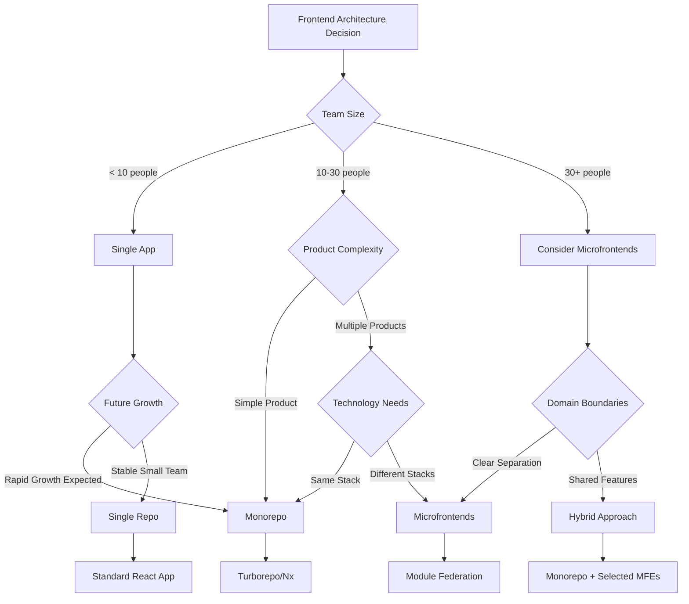

# Frontend Frameworks & Technologies Comparison Guide
## System Design Interview Reference

---

## 📋 Table of Contents

- [Project Structure & Best Practices](#project-structure--best-practices)
- [Monorepo Solutions](#monorepo-solutions)
- [Microfrontend Architecture](#microfrontend-architecture)
- [React Meta-Frameworks](#react-meta-frameworks)
- [Frontend Frameworks Comparison](#frontend-frameworks-comparison)
- [Build Tools & Bundlers](#build-tools--bundlers)
- [State Management Solutions](#state-management-solutions)
- [CSS Frameworks & Design Systems](#css-frameworks--design-systems)
- [Database & Backend Solutions](#database--backend-solutions)
- [Deployment & Hosting Platforms](#deployment--hosting-platforms)
- [Testing Frameworks](#testing-frameworks)
- [CI/CD & DevOps Solutions](#cicd--devops-solutions)
- [Performance Metrics & Core Web Vitals](#performance-metrics--core-web-vitals)
- [Authentication Solutions](#authentication-solutions)
- [Monitoring & Analytics](#monitoring--analytics)

---

## Project Structure & Best Practices

### **Frontend Application Structure**

```
my-frontend-app/
├── 📁 public/                    # Static assets
│   ├── favicon.ico
│   ├── manifest.json
│   └── index.html
├── 📁 src/
│   ├── 📁 components/            # Reusable UI components
│   │   ├── 📁 ui/               # Base UI components
│   │   │   ├── Button/
│   │   │   │   ├── Button.tsx
│   │   │   │   ├── Button.test.tsx
│   │   │   │   ├── Button.stories.tsx
│   │   │   │   └── index.ts
│   │   │   └── Input/
│   │   └── 📁 layout/           # Layout components
│   │       ├── Header/
│   │       ├── Sidebar/
│   │       └── Footer/
│   ├── 📁 pages/                # Page components (Next.js style)
│   │   ├── HomePage/
│   │   ├── ProfilePage/
│   │   └── SettingsPage/
│   ├── 📁 hooks/                # Custom React hooks
│   │   ├── useAuth.ts
│   │   ├── useApi.ts
│   │   └── useLocalStorage.ts
│   ├── 📁 services/             # API calls & external services
│   │   ├── api/
│   │   │   ├── auth.ts
│   │   │   ├── users.ts
│   │   │   └── index.ts
│   │   └── analytics/
│   ├── 📁 store/                # State management
│   │   ├── slices/              # Redux slices
│   │   ├── providers/           # Context providers
│   │   └── index.ts
│   ├── 📁 utils/                # Utility functions
│   │   ├── helpers/
│   │   ├── constants/
│   │   ├── validators/
│   │   └── formatters/
│   ├── 📁 types/                # TypeScript definitions
│   │   ├── api.ts
│   │   ├── global.ts
│   │   └── components.ts
│   ├── 📁 styles/               # Global styles
│   │   ├── globals.css
│   │   ├── variables.css
│   │   └── components.css
│   ├── 📁 assets/               # Images, fonts, icons
│   │   ├── images/
│   │   ├── fonts/
│   │   └── icons/
│   └── 📁 __tests__/            # Test utilities
│       ├── setup.ts
│       ├── mocks/
│       └── fixtures/
├── 📁 docs/                     # Documentation
├── 📁 scripts/                  # Build & deployment scripts
├── 📁 .github/                  # GitHub workflows
│   └── workflows/
├── package.json
├── tsconfig.json
├── tailwind.config.js
├── jest.config.js
├── .eslintrc.js
├── .prettierrc
└── README.md
```


## Monorepo Solutions

| Solution | **Pros** | **Cons** | **Best Use Cases** |
|----------|----------|----------|-------------------|
| **Turborepo** | • **Incremental builds**<br/>• **Remote caching**<br/>• **Pipeline optimization**<br/>• **TypeScript** first<br/>• **Vercel** integration | • **Learning curve**<br/>• **Newer** tool<br/>• **Configuration** complexity<br/>• **Vercel** ecosystem focus | • **Next.js** projects<br/>• **Fast** CI/CD<br/>• **Shared** libraries<br/>• **Modern** monorepos |
| **Nx** | • **Smart rebuilds**<br/>• **Code generation**<br/>• **Dependency graph**<br/>• **Plugin** ecosystem<br/>• **Angular** integration | • **Complex** setup<br/>• **Learning curve**<br/>• **Opinionated** structure<br/>• **Large** toolchain | • **Enterprise** applications<br/>• **Multiple** frameworks<br/>• **Large** teams<br/>• **Angular** projects |
| **Lerna** | • **Package publishing**<br/>• **Version management**<br/>• **Git** integration<br/>• **Mature** ecosystem<br/>• **Simple** setup | • **No** build optimization<br/>• **Manual** configuration<br/>• **Limited** caching<br/>• **Maintenance** mode | • **Library** publishing<br/>• **NPM** packages<br/>• **Simple** monorepos<br/>• **Legacy** projects |
| **Rush** | • **Phantom dependencies** protection<br/>• **Scalable** builds<br/>• **Incremental** publishing<br/>• **Enterprise** focused | • **Complex** setup<br/>• **Microsoft** ecosystem<br/>• **Learning curve**<br/>• **Limited** adoption | • **Large** enterprises<br/>• **Strict** dependency management<br/>• **Microsoft** stack<br/>• **Security** focus |
| **Yarn Workspaces** | • **Built-in** workspace support<br/>• **Dependency** hoisting<br/>• **Simple** configuration<br/>• **NPM** compatible | • **No** build orchestration<br/>• **Limited** caching<br/>• **Manual** optimization<br/>• **Basic** features | • **Simple** workspaces<br/>• **Shared** dependencies<br/>• **Basic** monorepos<br/>• **Getting** started |

### **Turborepo Project Structure**

```
my-turborepo/
├── 📁 apps/                     # Applications
│   ├── 📁 web/                  # Main web app (Next.js)
│   │   ├── package.json
│   │   ├── next.config.js
│   │   └── src/
│   ├── 📁 admin/                # Admin dashboard
│   │   ├── package.json
│   │   └── src/
│   ├── 📁 mobile/               # React Native app
│   │   ├── package.json
│   │   └── src/
│   └── 📁 docs/                 # Documentation site
│       ├── package.json
│       └── src/
├── 📁 packages/                 # Shared packages
│   ├── 📁 ui/                   # Shared UI components
│   │   ├── package.json
│   │   ├── src/
│   │   │   ├── Button/
│   │   │   ├── Input/
│   │   │   └── index.ts
│   │   └── tsconfig.json
│   ├── 📁 config/               # Shared configurations
│   │   ├── eslint-config/
│   │   ├── tsconfig/
│   │   └── tailwind-config/
│   ├── 📁 utils/                # Shared utilities
│   │   ├── package.json
│   │   └── src/
│   ├── 📁 api-client/           # Shared API client
│   │   ├── package.json
│   │   └── src/
│   └── 📁 types/                # Shared TypeScript types
│       ├── package.json
│       └── src/
├── 📁 tools/                    # Build tools & scripts
├── package.json                 # Root package.json
├── turbo.json                   # Turborepo configuration
├── tsconfig.json               # Root TypeScript config
└── README.md
```

### **Turborepo Configuration Example**

```json
// turbo.json
{
  "pipeline": {
    "build": {
      "dependsOn": ["^build"],
      "outputs": [".next/**", "dist/**"]
    },
    "test": {
      "dependsOn": ["^build"],
      "outputs": ["coverage/**"]
    },
    "lint": {},
    "dev": {
      "cache": false
    }
  }
}
```

---

## Microfrontend Architecture

### **Microfrontend Patterns**

| Pattern | **Description** | **Pros** | **Cons** | **Best Use Cases** |
|---------|-----------------|----------|----------|-------------------|
| **Module Federation** | • **Webpack 5** native<br/>• **Runtime** composition<br/>• **Shared** dependencies<br/>• **Independent** deployment | • **Dynamic** loading<br/>• **Version** flexibility<br/>• **Technology** diversity<br/>• **Team** autonomy | • **Complexity**<br/>• **Runtime** overhead<br/>• **Debugging** challenges<br/>• **Network** requests | • **Large** applications<br/>• **Multiple** teams<br/>• **Different** tech stacks<br/>• **Independent** releases |
| **Micro-apps** | • **Route-based** splitting<br/>• **SPA** per domain<br/>• **Shared** shell app<br/>• **Navigation** orchestration | • **Clear** boundaries<br/>• **Technology** independence<br/>• **Team** ownership<br/>• **Scalable** development | • **Navigation** complexity<br/>• **Shared** state challenges<br/>• **User** experience gaps<br/>• **SEO** considerations | • **Multi-domain** apps<br/>• **Large** organizations<br/>• **Different** user journeys<br/>• **Team** boundaries |
| **Component Library** | • **Shared** component system<br/>• **Design** system approach<br/>• **Centralized** UI<br/>• **Consistent** experience | • **UI** consistency<br/>• **Development** speed<br/>• **Maintenance** efficiency<br/>• **Quality** control | • **Coordination** overhead<br/>• **Version** management<br/>• **Breaking** changes<br/>• **Team** dependencies | • **Design** systems<br/>• **Brand** consistency<br/>• **UI** standardization<br/>• **Component** reuse |

### **Module Federation Architecture**

```
┌─────────────────────────────────────────────────────────────┐
│                    Host Application (Shell)                 │
│  ┌─────────────────┐  ┌─────────────────┐  ┌─────────────────┐│
│  │   Header MFE    │  │  Navigation MFE │  │   Footer MFE    ││
│  └─────────────────┘  └─────────────────┘  └─────────────────┘│
│  ┌─────────────────┐  ┌─────────────────┐  ┌─────────────────┐│
│  │ Dashboard MFE   │  │  Profile MFE    │  │ Settings MFE    ││
│  │ (React + TS)    │  │ (Vue.js)        │  │ (Angular)       ││
│  └─────────────────┘  └─────────────────┘  └─────────────────┘│
└─────────────────────────────────────────────────────────────┘
```

### **Microfrontend Tools & Frameworks**

| Tool | **Approach** | **Pros** | **Cons** | **Best Use Cases** |
|------|-------------|----------|----------|-------------------|
| **Single-SPA** | • **Framework agnostic**<br/>• **Runtime** composition<br/>• **Lifecycle** management<br/>• **Routing** orchestration | • **Technology** diversity<br/>• **Mature** ecosystem<br/>• **Flexible** architecture<br/>• **Migration** friendly | • **Configuration** complexity<br/>• **Performance** overhead<br/>• **Learning curve**<br/>• **Debugging** challenges | • **Legacy** migration<br/>• **Mixed** frameworks<br/>• **Large** applications<br/>• **Gradual** adoption |
| **Module Federation** | • **Webpack** native<br/>• **Build-time** + **Runtime**<br/>• **Shared** dependencies<br/>• **Dynamic** imports | • **Native** support<br/>• **Shared** chunks<br/>• **Type** safety<br/>• **Development** experience | • **Webpack** dependency<br/>• **Complex** configuration<br/>• **Version** conflicts<br/>• **Bundle** size | • **React** ecosystems<br/>• **Modern** builds<br/>• **Shared** libraries<br/>• **Team** independence |
| **Bit** | • **Component** composition<br/>• **Version** management<br/>• **Build** orchestration<br/>• **Dependency** tracking | • **Component** focus<br/>• **Version** control<br/>• **Build** optimization<br/>• **Team** collaboration | • **Learning curve**<br/>• **Bit** ecosystem<br/>• **Migration** effort<br/>• **Tooling** dependency | • **Component** libraries<br/>• **Design** systems<br/>• **Shared** components<br/>• **Version** management |

### **Microfrontend Project Structure with Turborepo**

```
microfrontend-turborepo/
├── 📁 apps/                           # Frontend applications (consumers)
│   ├── 📁 shell-nextjs/               # Main host app - orchestrates all microfrontends
│   │   ├── next.config.js
│   │   ├── package.json
│   │   ├── webpack.config.js          # Module Federation config
│   │   └── src/
│   ├── 📁 admin-dashboard-vite/       # Admin panel - user & content management
│   │   ├── vite.config.ts
│   │   ├── package.json
│   │   ├── rollup.config.js           # Microfrontend build config
│   │   └── src/
│   ├── 📁 customer-portal-react/      # Customer-facing app - orders & support
│   │   ├── webpack.config.js
│   │   ├── package.json
│   │   └── src/
│   ├── 📁 analytics-vue/              # Analytics dashboard - reports & insights
│   │   ├── vue.config.js
│   │   ├── package.json
│   │   └── src/
│   └── 📁 docs-gatsby/               # Documentation site - API docs & guides
│       ├── gatsby-config.js
│       ├── package.json
│       └── src/
├── 📁 packages/                       # Shared libraries (dependencies)
│   ├── 📁 ui-components/              # Shared React components - buttons, inputs, modals
│   │   ├── package.json
│   │   ├── rollup.config.js           # Bundle as ESM for tree-shaking
│   │   ├── src/
│   │   │   ├── Button/
│   │   │   ├── Input/
│   │   │   ├── Modal/
│   │   │   └── index.ts
│   │   └── dist/
│   ├── 📁 design-tokens/              # Design system tokens - colors, spacing, typography
│   │   ├── package.json
│   │   ├── rollup.config.js
│   │   ├── src/
│   │   │   ├── colors.ts
│   │   │   ├── spacing.ts
│   │   │   └── typography.ts
│   │   └── dist/
│   ├── 📁 api-client/                 # HTTP client library - REST & GraphQL calls
│   │   ├── package.json
│   │   ├── rollup.config.js
│   │   ├── src/
│   │   │   ├── rest/
│   │   │   ├── graphql/
│   │   │   └── index.ts
│   │   └── dist/
│   ├── 📁 utils/                      # Common utilities - date, validation, formatters
│   │   ├── package.json
│   │   ├── rollup.config.js
│   │   ├── src/
│   │   │   ├── date.ts
│   │   │   ├── validation.ts
│   │   │   └── formatters.ts
│   │   └── dist/
│   ├── 📁 types/                      # Shared TypeScript definitions - API & domain types
│   │   ├── package.json
│   │   ├── rollup.config.js
│   │   ├── src/
│   │   │   ├── api.ts
│   │   │   ├── user.ts
│   │   │   └── product.ts
│   │   └── dist/
│   ├── 📁 auth/                       # Authentication module - SSO, JWT, permissions
│   │   ├── package.json
│   │   ├── rollup.config.js
│   │   ├── src/
│   │   └── dist/
│   ├── 📁 state-management/           # Shared state logic - Zustand stores & hooks
│   │   ├── package.json
│   │   ├── rollup.config.js
│   │   ├── src/
│   │   └── dist/
│   └── 📁 eslint-config/              # Shared linting rules - code standards across teams
│       ├── package.json
│       ├── index.js
│       └── rules/
├── 📁 tools/                          # Build & development tools
│   ├── 📁 webpack/                    # Shared webpack configurations
│   ├── 📁 rollup/                     # Shared rollup configurations
│   └── 📁 scripts/                    # Deployment & utility scripts
├── turbo.json                         # Turborepo pipeline configuration
├── package.json                       # Root package.json with workspaces
└── README.md
```

### **Build Order & Dependencies**

```json
// turbo.json - Build pipeline with dependencies
{
  "pipeline": {
    "build": {
      "dependsOn": ["^build"],
      "outputs": ["dist/**", ".next/**", "build/**"]
    },
    "build:packages": {
      "dependsOn": [],
      "outputs": ["dist/**"]
    },
    "build:apps": {
      "dependsOn": ["^build:packages"],
      "outputs": [".next/**", "build/**", "dist/**"]
    },
    "dev": {
      "dependsOn": ["^build:packages"],
      "cache": false
    },
    "test": {
      "dependsOn": ["^build:packages"]
    }
  }
}
```

### **Package Build Order (Bottom-up)**

| **Order** | **Package** | **Purpose** | **Dependencies** |
|-----------|-------------|-------------|------------------|
| **1** | `types` | TypeScript definitions | None |
| **2** | `design-tokens` | Design system foundation | `types` |
| **3** | `utils` | Core utilities | `types` |
| **4** | `api-client` | HTTP client | `types`, `utils` |
| **5** | `auth` | Authentication logic | `api-client`, `utils`, `types` |
| **6** | `state-management` | Shared state stores | `api-client`, `auth`, `types` |
| **7** | `ui-components` | React components | `design-tokens`, `types` |
| **8** | `eslint-config` | Linting configuration | None |


### **App Build Order (Top-down)**

| **Order** | **App** | **Framework** | **Dependencies** |
|-----------|---------|---------------|------------------|
| **1** | `shell-nextjs` | Next.js | All packages |
| **2** | `admin-dashboard-vite` | Vite + React | `ui-components`, `auth`, `api-client` |
| **3** | `customer-portal-react` | React + Webpack | `ui-components`, `state-management` |
| **4** | `analytics-vue` | Vue.js | `design-tokens`, `api-client`, `types` |
| **5** | `docs-gatsby` | Gatsby | `design-tokens`, `ui-components` |

### **Rollup Configuration for Packages**

```javascript
// packages/ui-components/rollup.config.js
export default {
  input: 'src/index.ts',
  output: [
    {
      file: 'dist/index.esm.js',
      format: 'esm',
      sourcemap: true
    },
    {
      file: 'dist/index.cjs.js',
      format: 'cjs',
      sourcemap: true
    }
  ],
  external: ['react', 'react-dom'],
  plugins: [
    typescript(),
    resolve(),
    commonjs(),
    terser()
  ]
};
```


## React Meta-Frameworks

| Framework | **Pros** | **Cons** | **Best Use Cases** |
|-----------|----------|----------|-------------------|
| **Next.js** | • **SSR/SSG** built-in<br/>• **App Router** (React 18)<br/>• **Image optimization**<br/>• **API routes**<br/>• **Vercel integration**<br/>• **File-based routing** | • **Learning curve** for beginners<br/>• **Bundle size** can be large<br/>• **Opinionated** structure<br/>• **Vendor lock-in** with Vercel | • **E-commerce** platforms<br/>• **Content-heavy** sites<br/>• **SEO-critical** applications<br/>• **Full-stack** React apps |
| **Remix** | • **Web standards** focused<br/>• **Nested routing**<br/>• **Data loading** co-location<br/>• **Progressive enhancement**<br/>• **Error boundaries** | • **Smaller ecosystem**<br/>• **Learning curve**<br/>• **Limited** static generation<br/>• **New framework** | • **Data-intensive** applications<br/>• **Form-heavy** apps<br/>• **Traditional** web apps<br/>• **Progressive** enhancement needs |
| **Gatsby** | • **Static generation**<br/>• **GraphQL** data layer<br/>• **Plugin ecosystem**<br/>• **Performance** optimized<br/>• **Image processing** | • **Build times** for large sites<br/>• **Complex** data layer<br/>• **Over-engineering** for simple sites<br/>• **Learning curve** | • **Static websites**<br/>• **Blogs** and portfolios<br/>• **Documentation** sites<br/>• **JAMstack** applications |

---

## Frontend Frameworks Comparison

| Framework | **Pros** | **Cons** | **Best Use Cases** |
|-----------|----------|----------|-------------------|
| **React** | • **Large ecosystem**<br/>• **Component reusability**<br/>• **Virtual DOM**<br/>• **JSX** syntax<br/>• **Meta backing**<br/>• **DevTools** | • **Learning curve**<br/>• **Boilerplate** heavy<br/>• **Rapid changes**<br/>• **SEO challenges** | • **SPAs**<br/>• **Complex** UIs<br/>• **Enterprise** applications<br/>• **Mobile** apps (React Native) |
| **Vue.js** | • **Gentle learning** curve<br/>• **Two-way** data binding<br/>• **Template syntax**<br/>• **Progressive** adoption<br/>• **Single file** components | • **Smaller ecosystem**<br/>• **Less** job market<br/>• **TypeScript** support improving<br/>• **Enterprise** adoption | • **Rapid prototyping**<br/>• **Small to medium** projects<br/>• **Legacy** integration<br/>• **Developer-friendly** apps |
| **Angular** | • **Full framework**<br/>• **TypeScript** first<br/>• **Dependency injection**<br/>• **CLI tools**<br/>• **Enterprise** features | • **Steep learning** curve<br/>• **Heavy framework**<br/>• **Complex** for simple apps<br/>• **Frequent** major updates | • **Enterprise** applications<br/>• **Large teams**<br/>• **Complex** business logic<br/>• **Long-term** projects |
| **Svelte/SvelteKit** | • **No virtual DOM**<br/>• **Compile-time** optimization<br/>• **Small bundle** size<br/>• **Simple syntax**<br/>• **Performance** | • **Smaller ecosystem**<br/>• **Less** mature tooling<br/>• **Learning** resources limited<br/>• **Job market** | • **Performance-critical** apps<br/>• **Small projects**<br/>• **Interactive** visualizations<br/>• **Bundle size** conscious |
| **Solid.js** | • **Fine-grained** reactivity<br/>• **No virtual DOM**<br/>• **JSX** without React<br/>• **Performance**<br/>• **Small bundle** | • **Very new**<br/>• **Limited ecosystem**<br/>• **Small community**<br/>• **Beta status** | • **Performance** apps<br/>• **Real-time** applications<br/>• **Small** interactive UIs<br/>• **Experimental** projects |

---

## Build Tools & Bundlers

| Tool | **Pros** | **Cons** | **Best Use Cases** |
|------|----------|----------|-------------------|
| **Vite** | • **Fast HMR**<br/>• **ES modules** native<br/>• **Plugin ecosystem**<br/>• **Framework agnostic**<br/>• **Dev server** speed | • **Newer** tool<br/>• **Build** complexity<br/>• **Legacy browser** support<br/>• **Learning curve** | • **Modern** development<br/>• **Vue/React** projects<br/>• **Fast** iteration cycles<br/>• **ES6+** environments |
| **Webpack** | • **Mature ecosystem**<br/>• **Flexible** configuration<br/>• **Code splitting**<br/>• **Plugin system**<br/>• **Industry standard** | • **Complex** configuration<br/>• **Slow** build times<br/>• **Learning curve**<br/>• **Maintenance** overhead | • **Large** applications<br/>• **Legacy** projects<br/>• **Complex** build needs<br/>• **Enterprise** setups |
| **Parcel** | • **Zero configuration**<br/>• **Fast** builds<br/>• **Automatic** transforms<br/>• **Built-in** dev server<br/>• **Easy** to use | • **Less** control<br/>• **Plugin** ecosystem smaller<br/>• **Complex** scenarios limited<br/>• **Debugging** harder | • **Rapid prototyping**<br/>• **Simple** projects<br/>• **Beginner** friendly<br/>• **Quick** setups |
| **Rollup** | • **Tree shaking**<br/>• **ES modules** focus<br/>• **Small bundles**<br/>• **Library** building<br/>• **Plugin** based | • **Complex** app building<br/>• **Development** server lacking<br/>• **Learning curve**<br/>• **Configuration** needed | • **Library** development<br/>• **Package** creation<br/>• **Small** applications<br/>• **Bundle** optimization |
| **Turbopack** | • **Rust-based** bundler<br/>• **Incremental** compilation<br/>• **Next.js** integration<br/>• **Fast** HMR<br/>• **Future** of Webpack | • **Beta** status<br/>• **Limited** ecosystem<br/>• **Next.js** focused<br/>• **New** technology | • **Next.js** applications<br/>• **Performance** critical builds<br/>• **Modern** development<br/>• **Future** projects |
| **SWC** | • **Rust-based** compiler<br/>• **TypeScript** support<br/>• **Babel** replacement<br/>• **Next.js** integration<br/>• **Fast** compilation | • **Newer** tool<br/>• **Plugin** ecosystem smaller<br/>• **Beta** features<br/>• **Learning curve** | • **TypeScript** projects<br/>• **Performance** builds<br/>• **Next.js** applications<br/>• **Modern** toolchains |

---

## State Management Solutions

| Solution | **Pros** | **Cons** | **Best Use Cases** |
|----------|----------|----------|-------------------|
| **Redux Toolkit** | • **Predictable** state<br/>• **DevTools**<br/>• **Time travel** debugging<br/>• **Immutable** updates<br/>• **Community** | • **Boilerplate** heavy<br/>• **Learning curve**<br/>• **Over-engineering** simple apps<br/>• **Async** complexity | • **Large** applications<br/>• **Complex** state logic<br/>• **Team** collaboration<br/>• **Debugging** needs |
| **Zustand** | • **Simple** API<br/>• **No providers**<br/>• **TypeScript** friendly<br/>• **Small** bundle<br/>• **Flexible** | • **Less** mature<br/>• **Smaller** ecosystem<br/>• **DevTools** limited<br/>• **Less** opinionated | • **Medium** applications<br/>• **Quick** development<br/>• **Simple** state needs<br/>• **React** focus |
| **Jotai** | • **Atomic** approach<br/>• **Bottom-up** state<br/>• **No providers**<br/>• **TypeScript** first<br/>• **Composable** | • **New** paradigm<br/>• **Learning curve**<br/>• **Smaller** community<br/>• **Less** resources | • **Component-focused** state<br/>• **Atomic** updates<br/>• **React** Suspense<br/>• **Modern** patterns |
| **React Query/TanStack** | • **Server state** management<br/>• **Caching** built-in<br/>• **Background** refetching<br/>• **Optimistic** updates<br/>• **DevTools** | • **Learning curve**<br/>• **API-focused** only<br/>• **Bundle** size<br/>• **Complexity** | • **API-heavy** apps<br/>• **Data fetching**<br/>• **Caching** needs<br/>• **Real-time** data |
| **Context API** | • **Built-in** React<br/>• **No dependencies**<br/>• **Simple** setup<br/>• **Provider** pattern<br/>• **Native** | • **Performance** issues<br/>• **Prop drilling** alternative only<br/>• **Re-render** problems<br/>• **No DevTools** | • **Simple** state sharing<br/>• **Theme** management<br/>• **Authentication** context<br/>• **Small** applications |

---

## CSS Frameworks & Design Systems

| Framework | **Pros** | **Cons** | **Best Use Cases** |
|-----------|----------|----------|-------------------|
| **Tailwind CSS** | • **Utility-first**<br/>• **Responsive** design<br/>• **Customizable**<br/>• **Small** production bundle<br/>• **JIT** compilation | • **Learning curve**<br/>• **HTML cluttered**<br/>• **Design** consistency challenges<br/>• **Class** memorization | • **Rapid** prototyping<br/>• **Custom** designs<br/>• **Component** libraries<br/>• **Modern** applications |
| **Styled Components** | • **CSS-in-JS**<br/>• **Component** scoped<br/>• **Dynamic** styling<br/>• **Theme** support<br/>• **No class names** | • **Runtime** overhead<br/>• **Bundle** size<br/>• **Learning curve**<br/>• **SSR** complexity | • **Component** libraries<br/>• **Dynamic** theming<br/>• **React** applications<br/>• **Design** systems |
| **Material-UI (MUI)** | • **Google** design<br/>• **Component** library<br/>• **Accessibility**<br/>• **Theme** system<br/>• **TypeScript** | • **Bundle** size<br/>• **Google** look<br/>• **Customization** complexity<br/>• **Learning curve** | • **Admin** dashboards<br/>• **Business** applications<br/>• **Rapid** development<br/>• **Material** design needs |
| **Chakra UI** | • **Simple** API<br/>• **Modular**<br/>• **Accessibility**<br/>• **Theme** system<br/>• **TypeScript** | • **React** only<br/>• **Smaller** ecosystem<br/>• **Learning** resources<br/>• **Bundle** size | • **React** applications<br/>• **Accessible** UIs<br/>• **Design** systems<br/>• **Developer** experience |
| **Ant Design** | • **Enterprise** focused<br/>• **Rich** components<br/>• **International**<br/>• **Design** language<br/>• **TypeScript** | • **Large** bundle<br/>• **Chinese** origins<br/>• **Opinionated** design<br/>• **Customization** limited | • **Admin** interfaces<br/>• **Enterprise** apps<br/>• **Data-heavy** UIs<br/>• **B2B** applications |

---

## Database & Backend Solutions

| Solution | **Pros** | **Cons** | **Best Use Cases** |
|----------|----------|----------|-------------------|
| **Supabase** | • **Open source**<br/>• **PostgreSQL**<br/>• **Real-time** subscriptions<br/>• **Auth** built-in<br/>• **Row-level** security | • **Newer** platform<br/>• **Limited** ecosystem<br/>• **Learning curve**<br/>• **Postgres** dependency | • **Real-time** applications<br/>• **Open source** preference<br/>• **PostgreSQL** users<br/>• **Self-hosting** option |
| **Firebase** | • **Google** backing<br/>• **Real-time** database<br/>• **Easy** setup<br/>• **Authentication**<br/>• **Hosting** included | • **Vendor** lock-in<br/>• **NoSQL** limitations<br/>• **Pricing** scaling<br/>• **Limited** querying | • **MVP** development<br/>• **Real-time** apps<br/>• **Mobile** applications<br/>• **Rapid** prototyping |
| **PlanetScale** | • **MySQL** compatible<br/>• **Branching** database<br/>• **Serverless**<br/>• **Auto-scaling**<br/>• **Developer** experience | • **MySQL** only<br/>• **Newer** service<br/>• **Pricing** model<br/>• **Limited** features | • **MySQL** applications<br/>• **Serverless** needs<br/>• **Database** branching<br/>• **Scaling** requirements |
| **Prisma** | • **Type-safe** queries<br/>• **Database** agnostic<br/>• **Auto-generated** client<br/>• **Migration** system<br/>• **Great** DX | • **Learning curve**<br/>• **Bundle** size<br/>• **Complex** queries<br/>• **Performance** overhead | • **TypeScript** projects<br/>• **Type safety**<br/>• **Multiple** databases<br/>• **Modern** development |

---

## Deployment & Hosting Platforms

| Platform | **Pros** | **Cons** | **Best Use Cases** |
|----------|----------|----------|-------------------|
| **Vercel** | • **Next.js** optimized<br/>• **Edge** functions<br/>• **Git** integration<br/>• **Automatic** deployments<br/>• **Performance** analytics | • **Pricing** for scale<br/>• **Vendor** lock-in<br/>• **Limited** server control<br/>• **Cold starts** | • **JAMstack** sites<br/>• **Next.js** applications<br/>• **Frontend** focus<br/>• **Static** sites |
| **Netlify** | • **JAMstack** focused<br/>• **Form** handling<br/>• **Functions**<br/>• **Branch** previews<br/>• **Easy** setup | • **Limited** backend<br/>• **Function** limitations<br/>• **Pricing** model<br/>• **Performance** varies | • **Static** sites<br/>• **JAMstack** applications<br/>• **Form-heavy** sites<br/>• **Content** sites |
| **AWS Amplify** | • **AWS** ecosystem<br/>• **Full-stack**<br/>• **Authentication**<br/>• **GraphQL** API<br/>• **Mobile** support | • **AWS** complexity<br/>• **Learning curve**<br/>• **Vendor** lock-in<br/>• **Cost** management | • **AWS** users<br/>• **Full-stack** apps<br/>• **Enterprise** scale<br/>• **Mobile** apps |
| **Railway** | • **Simple** deployment<br/>• **Database** included<br/>• **Git** integration<br/>• **Environment** management<br/>• **Developer** friendly | • **Smaller** platform<br/>• **Limited** features<br/>• **Scaling** limitations<br/>• **New** service | • **Full-stack** apps<br/>• **Simple** deployment<br/>• **Database** needs<br/>• **Hobby** projects |

---

## Testing Frameworks

| Framework | **Pros** | **Cons** | **Best Use Cases** |
|-----------|----------|----------|-------------------|
| **Jest** | • **Zero** configuration<br/>• **Snapshot** testing<br/>• **Mocking** built-in<br/>• **Code** coverage<br/>• **React** integration | • **Large** bundle<br/>• **Slow** for large suites<br/>• **Memory** usage<br/>• **Configuration** complexity | • **Unit** testing<br/>• **React** applications<br/>• **Snapshot** testing<br/>• **JavaScript** projects |
| **Vitest** | • **Vite** compatible<br/>• **Fast** execution<br/>• **Jest** compatible API<br/>• **ESM** support<br/>• **Watch** mode | • **Newer** tool<br/>• **Smaller** ecosystem<br/>• **Limited** plugins<br/>• **Learning** resources | • **Vite** projects<br/>• **Modern** testing<br/>• **Fast** feedback<br/>• **ESM** environments |
| **Cypress** | • **Real** browser testing<br/>• **Time travel** debugging<br/>• **Visual** testing<br/>• **Easy** setup<br/>• **Great** DX | • **Slow** execution<br/>• **Flaky** tests<br/>• **Chrome** focus<br/>• **Resource** heavy | • **E2E** testing<br/>• **Integration** testing<br/>• **User** workflows<br/>• **Visual** regression |
| **Playwright** | • **Multi-browser**<br/>• **Fast** execution<br/>• **Parallel** testing<br/>• **Auto-wait**<br/>• **Mobile** testing | • **Learning curve**<br/>• **Setup** complexity<br/>• **Resource** usage<br/>• **Debugging** harder | • **Cross-browser** testing<br/>• **E2E** testing<br/>• **CI/CD** pipelines<br/>• **Mobile** testing |
| **React Testing Library** | • **User-focused** testing<br/>• **Simple** API<br/>• **Best practices** enforced<br/>• **Accessibility** testing<br/>• **Community** support | • **React** specific<br/>• **Learning curve**<br/>• **Limited** to behavior testing<br/>• **No** shallow rendering | • **React** component testing<br/>• **User behavior** testing<br/>• **Accessibility** validation<br/>• **Integration** testing |
| **Storybook** | • **Component** isolation<br/>• **Visual** testing<br/>• **Documentation**<br/>• **Add-ons** ecosystem<br/>• **Design** system support | • **Setup** complexity<br/>• **Build** time overhead<br/>• **Maintenance** effort<br/>• **Version** compatibility | • **Component** development<br/>• **Design** systems<br/>• **Visual** regression<br/>• **Documentation** |

---

## CI/CD & DevOps Solutions

| Platform | **Pros** | **Cons** | **Best Use Cases** |
|----------|----------|----------|-------------------|
| **GitHub Actions** | • **Integrated** with GitHub<br/>• **Free** for public repos<br/>• **Matrix** builds<br/>• **Marketplace** actions<br/>• **YAML** configuration | • **Learning curve**<br/>• **Pricing** for private repos<br/>• **Limited** parallel jobs<br/>• **GitHub** dependency | • **GitHub** repositories<br/>• **Open source** projects<br/>• **Simple** CI/CD workflows<br/>• **Multi-platform** builds |
| **Vercel CI/CD** | • **Zero** configuration<br/>• **Preview** deployments<br/>• **Git** integration<br/>• **Edge** deployment<br/>• **Performance** insights | • **Vercel** ecosystem only<br/>• **Limited** customization<br/>• **Pricing** scaling<br/>• **Frontend** focused | • **Next.js** applications<br/>• **JAMstack** sites<br/>• **Frontend** deployment<br/>• **Preview** workflows |
| **Netlify CI/CD** | • **Git-based** deployment<br/>• **Branch** previews<br/>• **Build** plugins<br/>• **Form** handling<br/>• **CDN** integration | • **Build** time limits<br/>• **Limited** backend support<br/>• **Pricing** tiers<br/>• **Static** site focus | • **Static** sites<br/>• **JAMstack** applications<br/>• **Form-based** sites<br/>• **Content** management |
| **CircleCI** | • **Docker** support<br/>• **Parallel** execution<br/>• **SSH** debugging<br/>• **Orbs** ecosystem<br/>• **Performance** insights | • **Complex** configuration<br/>• **Pricing** model<br/>• **Learning curve**<br/>• **Credit** system | • **Complex** pipelines<br/>• **Docker** workflows<br/>• **Multi-stage** builds<br/>• **Enterprise** CI/CD |
| **Jenkins** | • **Self-hosted**<br/>• **Plugin** ecosystem<br/>• **Flexible** configuration<br/>• **Pipeline** as code<br/>• **Free** and open source | • **Maintenance** overhead<br/>• **Security** management<br/>• **UI/UX** dated<br/>• **Complex** setup | • **On-premise** deployment<br/>• **Custom** requirements<br/>• **Enterprise** control<br/>• **Legacy** integration |
| **GitLab CI/CD** | • **Integrated** platform<br/>• **Auto DevOps**<br/>• **Docker** registry<br/>• **Security** scanning<br/>• **Kubernetes** deployment | • **GitLab** dependency<br/>• **Resource** intensive<br/>• **Complex** for simple needs<br/>• **Learning curve** | • **GitLab** repositories<br/>• **DevSecOps** pipelines<br/>• **Kubernetes** deployments<br/>• **Security-focused** projects |

---

## Performance Metrics & Core Web Vitals

| Metric | **Description** | **Good Score** | **Poor Score** | **Optimization Strategies** |
|--------|-----------------|----------------|----------------|---------------------------|
| **FCP (First Contentful Paint)** | • Time until **first** content renders<br/>• **User perception** of loading<br/>• **Critical** for user experience<br/>• **Measured** in seconds | • **< 1.8s** | • **> 3.0s** | • **Critical CSS** inlining<br/>• **Font** optimization<br/>• **Server-side** rendering<br/>• **CDN** usage |
| **LCP (Largest Contentful Paint)** | • Time until **largest** element renders<br/>• **Loading** performance indicator<br/>• **Main content** visibility<br/>• **Core Web Vital** | • **< 2.5s** | • **> 4.0s** | • **Image** optimization<br/>• **Lazy loading**<br/>• **Resource** prioritization<br/>• **Code splitting** |
| **FID (First Input Delay)** | • Time until page **responds** to interaction<br/>• **Interactivity** measurement<br/>• **User experience** metric<br/>• **Core Web Vital** | • **< 100ms** | • **> 300ms** | • **JavaScript** optimization<br/>• **Code splitting**<br/>• **Web Workers**<br/>• **Bundle** reduction |
| **CLS (Cumulative Layout Shift)** | • **Visual stability** during loading<br/>• **Layout shift** measurement<br/>• **User experience** factor<br/>• **Core Web Vital** | • **< 0.1** | • **> 0.25** | • **Image** dimensions<br/>• **Font** loading strategies<br/>• **Ad** space reservation<br/>• **Skeleton** screens |
| **INP (Interaction to Next Paint)** | • **Responsiveness** to user interactions<br/>• **Replaces** FID in 2024<br/>• **All interactions** measured<br/>• **New Core Vital** | • **< 200ms** | • **> 500ms** | • **Event handler** optimization<br/>• **Main thread** management<br/>• **Priority** scheduling<br/>• **Debouncing** techniques |
| **TTFB (Time to First Byte)** | • **Server response** time<br/>• **Network** latency indicator<br/>• **Backend** performance<br/>• **Foundation** metric | • **< 800ms** | • **> 1.8s** | • **Server** optimization<br/>• **CDN** implementation<br/>• **Caching** strategies<br/>• **Database** optimization |

### **Performance Tools & Monitoring**

| Tool | **Metrics Measured** | **Best Use Cases** |
|------|---------------------|-------------------|
| **Lighthouse** | • **All Core Web Vitals**<br/>• **Performance** score<br/>• **Accessibility**<br/>• **SEO** analysis | • **Development** auditing<br/>• **CI/CD** integration<br/>• **Baseline** measurements |
| **PageSpeed Insights** | • **Real user** data (CrUX)<br/>• **Lab** data<br/>• **Core Web Vitals**<br/>• **Field** vs lab comparison | • **Production** monitoring<br/>• **Real user** experience<br/>• **SEO** optimization |
| **Web Vitals Extension** | • **Real-time** monitoring<br/>• **Core Web Vitals**<br/>• **Debug** information<br/>• **Overlay** metrics | • **Development** debugging<br/>• **Real-time** feedback<br/>• **Quick** assessments |
| **Chrome DevTools** | • **Performance** profiling<br/>• **Network** analysis<br/>• **Coverage** reports<br/>• **Memory** usage | • **Deep** debugging<br/>• **Performance** optimization<br/>• **Bundle** analysis |

---

## Authentication Solutions

| Solution | **Pros** | **Cons** | **Best Use Cases** |
|----------|----------|----------|-------------------|
| **Auth0** | • **Enterprise** ready<br/>• **Multiple** providers<br/>• **Compliance**<br/>• **Customizable**<br/>• **SDK** support | • **Pricing** for scale<br/>• **Vendor** lock-in<br/>• **Complex** setup<br/>• **Learning curve** | • **Enterprise** applications<br/>• **Multiple** auth methods<br/>• **Compliance** needs<br/>• **Custom** flows |
| **NextAuth.js** | • **Next.js** integration<br/>• **Multiple** providers<br/>• **Open** source<br/>• **TypeScript** support<br/>• **Serverless** ready | • **Next.js** only<br/>• **Configuration** complexity<br/>• **Limited** customization<br/>• **Database** required | • **Next.js** applications<br/>• **Open source** preference<br/>• **Multiple** providers<br/>• **Serverless** deployment |
| **Clerk** | • **Developer** experience<br/>• **Pre-built** components<br/>• **Multi-tenant**<br/>• **Organization** support<br/>• **Modern** UI | • **Newer** service<br/>• **Pricing** model<br/>• **Limited** customization<br/>• **Vendor** dependency | • **Modern** applications<br/>• **Multi-tenant** SaaS<br/>• **Quick** implementation<br/>• **Organization** features |
| **Firebase Auth** | • **Google** integration<br/>• **Easy** setup<br/>• **Multiple** providers<br/>• **Real-time**<br/>• **Mobile** support | • **Firebase** ecosystem<br/>• **Limited** customization<br/>• **Vendor** lock-in<br/>• **UI** limitations | • **Firebase** projects<br/>• **Mobile** applications<br/>• **Google** ecosystem<br/>• **Rapid** development |

---

## Monitoring & Analytics

| Tool | **Pros** | **Cons** | **Best Use Cases** |
|------|----------|----------|-------------------|
| **Sentry** | • **Error** tracking<br/>• **Performance** monitoring<br/>• **Release** tracking<br/>• **Alerts**<br/>• **Source map** support | • **Pricing** for volume<br/>• **Setup** complexity<br/>• **Alert** fatigue<br/>• **Learning curve** | • **Error** monitoring<br/>• **Production** apps<br/>• **Performance** tracking<br/>• **Release** monitoring |
| **LogRocket** | • **Session** replay<br/>• **Performance** monitoring<br/>• **User** analytics<br/>• **Error** tracking<br/>• **Network** monitoring | • **Privacy** concerns<br/>• **High** pricing<br/>• **Performance** impact<br/>• **Storage** costs | • **User** experience<br/>• **Debugging** issues<br/>• **Product** analytics<br/>• **Support** teams |
| **Vercel Analytics** | • **Core** web vitals<br/>• **Real** user monitoring<br/>• **Simple** setup<br/>• **Privacy** focused<br/>• **Vercel** integration | • **Vercel** only<br/>• **Basic** features<br/>• **Limited** customization<br/>• **New** service | • **Vercel** deployments<br/>• **Performance** monitoring<br/>• **Web** vitals tracking<br/>• **Simple** analytics |
| **Google Analytics** | • **Free** tier<br/>• **Comprehensive**<br/>• **Industry** standard<br/>• **Integration**<br/>• **Reports** | • **Privacy** concerns<br/>• **Complex** setup<br/>• **Data** ownership<br/>• **GDPR** compliance | • **Marketing** analytics<br/>• **User** behavior<br/>• **Traffic** analysis<br/>• **E-commerce** tracking |

---

## 🎯 Quick Decision Framework

### **Choose Based On Project Type:**

**🚀 Startup/MVP:**
- Architecture: **Single** app
- Framework: **React** + **Next.js**
- State: **Zustand** or **Context API**
- CSS: **Tailwind CSS**
- Backend: **Supabase** or **Firebase**
- Deploy: **Vercel**
- Testing: **Jest** + **React Testing Library**
- CI/CD: **GitHub Actions** or **Vercel**

**🏢 Enterprise:**
- Architecture: **Monorepo** (Turborepo/Nx)
- Framework: **React** or **Angular**
- State: **Redux Toolkit**
- CSS: **Material-UI** or **Ant Design**
- Backend: **Custom API** + **PostgreSQL**
- Deploy: **AWS** or **Azure**
- Testing: **Jest** + **Cypress** + **Storybook**
- CI/CD: **Jenkins** or **GitLab CI/CD**

**🏗️ Microfrontend/Multi-team:**
- Architecture: **Module Federation** or **Single-SPA**
- Framework: **Framework agnostic**
- State: **Distributed** state management
- CSS: **Shared** design system
- Backend: **Microservices**
- Deploy: **Independent** deployments
- Testing: **Contract** testing + **E2E**
- CI/CD: **Pipeline** per microfrontend

**⚡ Performance-Critical:**
- Architecture: **Optimized** monolith
- Framework: **Svelte** or **Solid.js**
- Build: **Vite** + **Rollup** + **SWC**
- CSS: **Tailwind** + **Critical CSS**
- Deploy: **CDN** + **Edge**
- Monitoring: **Core Web Vitals** focus
- Testing: **Lighthouse** CI + **Playwright**

**🎨 Content/Marketing:**
- Architecture: **JAMstack**
- Framework: **Next.js** or **Gatsby**
- CSS: **Tailwind** + **Design System**
- Backend: **Headless CMS**
- Deploy: **Netlify** or **Vercel**
- Metrics: **LCP** + **CLS** optimization
- CI/CD: **Netlify** or **GitHub Actions**

---

## 📊 **Core Web Vitals Targets Summary**

| **Metric** | **Excellent** | **Needs Improvement** | **Poor** | **Impact** |
|------------|---------------|----------------------|----------|------------|
| **LCP** | **< 2.5s** | **2.5s - 4.0s** | **> 4.0s** | **SEO ranking** + **User experience** |
| **FID/INP** | **< 100ms/200ms** | **100-300ms/200-500ms** | **> 300ms/500ms** | **Interactivity** + **Conversion rates** |
| **CLS** | **< 0.1** | **0.1 - 0.25** | **> 0.25** | **Visual stability** + **User frustration** |
| **FCP** | **< 1.8s** | **1.8s - 3.0s** | **> 3.0s** | **Perceived performance** |
| **TTFB** | **< 800ms** | **800ms - 1.8s** | **> 1.8s** | **Server performance** + **SEO** | 


### **Key Structure Principles**

| **Principle** | **Description** | **Benefits** |
|---------------|-----------------|-------------|
| **Feature-Based** | • Organize by **business features**<br/>• Co-locate related files<br/>• **Domain-driven** structure | • **Easier navigation**<br/>• **Better maintainability**<br/>• **Team ownership** |
| **Atomic Design** | • **Atoms** → **Molecules** → **Organisms**<br/>• Hierarchical component structure<br/>• **Reusable** components | • **Consistent** UI<br/>• **Scalable** design system<br/>• **Testing** efficiency |
| **Separation of Concerns** | • **Logic** vs **Presentation**<br/>• **Services** vs **Components**<br/>• **Types** vs **Implementation** | • **Code clarity**<br/>• **Testing** isolation<br/>• **Team collaboration** |

---

### **SDK Sharing Strategy**

| **SDK Type** | **When to Share** | **Package Structure** | **Best Practices** |
|--------------|-------------------|----------------------|-------------------|
| **API Client SDK** | • **Multiple apps** use same backend<br/>• **Consistent** API interface needed<br/>• **Type safety** across teams | `packages/api-sdk/`<br/>├── `src/`<br/>│   ├── `clients/`<br/>│   ├── `types/`<br/>│   └── `utils/`<br/>└── `dist/` | • **Auto-generated** from OpenAPI<br/>• **Version** with backend releases<br/>• **Backward compatibility**<br/>• **Tree-shakable** exports |
| **Analytics SDK** | • **Unified** tracking across apps<br/>• **Consistent** event schemas<br/>• **Compliance** requirements | `packages/analytics-sdk/`<br/>├── `src/`<br/>│   ├── `trackers/`<br/>│   ├── `events/`<br/>│   └── `providers/`<br/>└── `dist/` | • **Type-safe** event definitions<br/>• **Provider** abstraction layer<br/>• **GDPR/CCPA** compliance built-in<br/>• **Batching** and offline support |
| **Authentication SDK** | • **SSO** across multiple apps<br/>• **Shared** user context<br/>• **Security** consistency | `packages/auth-sdk/`<br/>├── `src/`<br/>│   ├── `providers/`<br/>│   ├── `hooks/`<br/>│   ├── `guards/`<br/>│   └── `types/`<br/>└── `dist/` | • **Framework agnostic** core<br/>• **React/Vue** specific wrappers<br/>• **Token** management<br/>• **Permission** based access |
| **Payment SDK** | • **Consistent** payment flow<br/>• **PCI compliance**<br/>• **Multiple** payment providers | `packages/payment-sdk/`<br/>├── `src/`<br/>│   ├── `providers/`<br/>│   ├── `components/`<br/>│   ├── `hooks/`<br/>│   └── `types/`<br/>└── `dist/` | • **PCI DSS** compliant<br/>• **Provider** abstraction<br/>• **Secure** tokenization<br/>• **Error** handling |

### **SDK Sharing Best Practices**

#### **✅ When SDK Sharing Makes Sense**

| **Scenario** | **Benefits** | **Implementation** |
|--------------|--------------|-------------------|
| **🔄 Same API Across Apps** | • **DRY principle**<br/>• **Type consistency**<br/>• **Centralized** updates | • Generate SDK from **OpenAPI spec**<br/>• Version with **backend releases**<br/>• Use **semantic versioning** |
| **📊 Cross-App Analytics** | • **Unified** data collection<br/>• **Consistent** event schemas<br/>• **Compliance** adherence | • **Type-safe** event definitions<br/>• **Provider** pattern for flexibility<br/>• **Built-in** privacy controls |
| **🔐 Shared Authentication** | • **Single sign-on**<br/>• **Consistent** user experience<br/>• **Security** standardization | • **Framework agnostic** core<br/>• **Platform-specific** wrappers<br/>• **Token** lifecycle management |
| **💳 Payment Processing** | • **PCI compliance**<br/>• **Consistent** UX<br/>• **Provider** flexibility | • **Secure** by default<br/>• **Multiple** payment gateways<br/>• **Tokenization** built-in |

#### **❌ When NOT to Share SDKs**

| **Anti-Pattern** | **Why Avoid** | **Better Approach** |
|------------------|---------------|-------------------|
| **🎨 UI Component SDK** | • **Framework** coupling<br/>• **Design** inconsistencies<br/>• **Bundle** bloat | • Use **design system** packages<br/>• **Framework-specific** components<br/>• **Atomic** design principles |
| **🏢 Business Logic SDK** | • **Domain** coupling<br/>• **Tight** dependencies<br/>• **Testing** complexity | • Keep business logic in **apps**<br/>• Share **utilities** only<br/>• **Domain** boundaries respect |
| **⚙️ Configuration SDK** | • **Environment** coupling<br/>• **Deployment** complexity<br/>• **Security** risks | • **Environment-specific** configs<br/>• **Runtime** configuration<br/>• **Secret** management tools |

### **SDK Development Guidelines**

```typescript
// packages/api-sdk/src/index.ts - Good SDK Structure
export class ApiClient {
  constructor(private config: ApiConfig) {}
  
  // Auto-generated from OpenAPI
  users = new UsersApi(this.config);
  products = new ProductsApi(this.config);
  
  // Shared utilities
  setAuthToken(token: string) { /* ... */ }
  handleError(error: ApiError) { /* ... */ }
}

// Framework-agnostic core
export { ApiClient, ApiConfig, ApiError };

// React-specific exports
export { useApiClient, ApiProvider } from './react';

// Vue-specific exports (optional)
export { useApiClient as useApiClientVue } from './vue';
```

#### **SDK Versioning Strategy**

| **Change Type** | **Version Bump** | **Backward Compatibility** |
|-----------------|------------------|---------------------------|
| **New API endpoint** | **Minor** (1.1.0) | ✅ **Fully compatible** |
| **New optional parameter** | **Minor** (1.1.0) | ✅ **Fully compatible** |
| **Deprecated field** | **Minor** (1.1.0) | ✅ **With deprecation warning** |
| **Required parameter change** | **Major** (2.0.0) | ❌ **Breaking change** |
| **Removed endpoint** | **Major** (2.0.0) | ❌ **Breaking change** |
| **Bug fix** | **Patch** (1.0.1) | ✅ **Fully compatible** |

#### **SDK Package Configuration**

```json
// packages/api-sdk/package.json
{
  "name": "@company/api-sdk",
  "version": "1.2.3",
  "main": "dist/index.cjs.js",
  "module": "dist/index.esm.js",
  "types": "dist/index.d.ts",
  "exports": {
    ".": {
      "import": "./dist/index.esm.js",
      "require": "./dist/index.cjs.js",
      "types": "./dist/index.d.ts"
    },
    "./react": {
      "import": "./dist/react.esm.js",
      "require": "./dist/react.cjs.js",
      "types": "./dist/react.d.ts"
    }
  },
  "peerDependencies": {
    "react": ">=16.8.0"
  },
  "sideEffects": false
}
```


### **Architecture Decision Matrix: Monorepo vs Microfrontend**

| **Factor** | **Monorepo** | **Microfrontend** | **Hybrid (Monorepo + MFE)** |
|------------|--------------|-------------------|------------------------------|
| **Team Size** | **2-20** developers | **20+** developers | **10-50** developers |
| **Deployment** | **Coordinated** releases | **Independent** deployments | **Mixed** strategy |
| **Complexity** | **Low-Medium** | **High** | **Medium-High** |
| **Technology** | **Unified** stack | **Diverse** frameworks | **Selective** diversity |
| **Sharing** | **Easy** via packages | **Challenging** | **Package-based** sharing |

### **When to Use Monorepo**

| **Scenario** | **Why Monorepo** | **Benefits** |
|--------------|------------------|--------------|
| **🚀 Startup/Small Team** | • **Simple** coordination<br/>• **Fast** development<br/>• **Shared** codebase | • **Code reuse**<br/>• **Consistent** tooling<br/>• **Easy** refactoring |
| **📱 Single Product** | • **Unified** user experience<br/>• **Shared** design system<br/>• **Coordinated** releases | • **Consistency**<br/>• **Performance** optimization<br/>• **Simple** deployment |
| **🏢 Medium Enterprise** | • **Multiple** related apps<br/>• **Shared** libraries<br/>• **Same** technology stack | • **Code sharing**<br/>• **Unified** CI/CD<br/>• **Team** collaboration |
| **⚡ Performance Critical** | • **Bundle** optimization<br/>• **Tree shaking**<br/>• **Shared** chunks | • **Smaller** bundles<br/>• **Better** performance<br/>• **Unified** optimization |

### **When to Use Microfrontends**

| **Scenario** | **Why Microfrontends** | **Benefits** |
|--------------|------------------------|--------------|
| **🏢 Large Enterprise** | • **Multiple** teams<br/>• **Different** domains<br/>• **Independent** releases | • **Team** autonomy<br/>• **Scalable** development<br/>• **Technology** freedom |
| **🌐 Multi-Brand Platform** | • **Different** user bases<br/>• **Separate** branding<br/>• **Independent** features | • **Brand** isolation<br/>• **Feature** independence<br/>• **Market** flexibility |
| **🔄 Legacy Migration** | • **Gradual** modernization<br/>• **Risk** mitigation<br/>• **Incremental** updates | • **Safe** migration<br/>• **Parallel** development<br/>• **Reduced** risk |
| **⚖️ Compliance/Security** | • **Isolated** environments<br/>• **Different** security needs<br/>• **Audit** boundaries | • **Security** isolation<br/>• **Compliance** separation<br/>• **Risk** containment |

### **Detailed Pros & Cons Comparison**

#### **Monorepo Architecture**

| **Pros** | **Cons** |
|----------|----------|
| • **Code Sharing** - Easy library reuse<br/>• **Atomic Changes** - Cross-package refactoring<br/>• **Unified Tooling** - Single build system<br/>• **Dependency Management** - Version consistency<br/>• **Developer Experience** - Single checkout<br/>• **Testing** - Easy integration testing<br/>• **Performance** - Shared chunks & tree-shaking | • **Build Times** - Slower as codebase grows<br/>• **Coordination** - Requires team alignment<br/>• **Single Point of Failure** - One broken build affects all<br/>• **Git Conflicts** - More merge conflicts<br/>• **Scaling** - Difficult with 50+ developers<br/>• **Technology Lock-in** - Hard to use different frameworks<br/>• **CI/CD Complexity** - Need smart build orchestration |

#### **Microfrontend Architecture**

| **Pros** | **Cons** |
|----------|----------|
| • **Team Autonomy** - Independent development<br/>• **Technology Freedom** - Framework diversity<br/>• **Independent Deployment** - Faster releases<br/>• **Scalability** - Unlimited team scaling<br/>• **Fault Isolation** - Failures don't cascade<br/>• **Domain Boundaries** - Clear ownership<br/>• **Legacy Integration** - Gradual modernization | • **Complexity** - Complex orchestration<br/>• **Duplication** - Code & dependency duplication<br/>• **Communication** - Inter-team coordination overhead<br/>• **Testing** - Complex integration testing<br/>• **Performance** - Multiple bundles & network requests<br/>• **User Experience** - Potential inconsistencies<br/>• **Debugging** - Harder to trace issues across boundaries |

### **Decision Framework**



### **Migration Strategies**

#### **Monorepo → Microfrontends**

| **Phase** | **Strategy** | **Timeline** |
|-----------|--------------|-------------|
| **Phase 1** | • Extract **shared packages**<br/>• Establish **domain boundaries**<br/>• Create **shell application** | **2-3 months** |
| **Phase 2** | • Convert **one domain** to MFE<br/>• Implement **Module Federation**<br/>• Test **integration** | **3-4 months** |
| **Phase 3** | • Migrate **remaining domains**<br/>• Optimize **performance**<br/>• Establish **governance** | **6-12 months** |

#### **Legacy → Modern Architecture**

| **Approach** | **Best For** | **Implementation** |
|--------------|--------------|-------------------|
| **Strangler Fig** | • **Large legacy** apps<br/>• **Risk-averse** organizations | • Gradually replace pages with MFEs<br/>• Route traffic to new components |
| **Big Bang** | • **Small-medium** apps<br/>• **Greenfield** projects | • Complete rewrite in monorepo<br/>• Single migration event |
| **Hybrid** | • **Mixed** requirements<br/>• **Incremental** modernization | • Core in monorepo + select MFEs<br/>• Best of both approaches |

---
