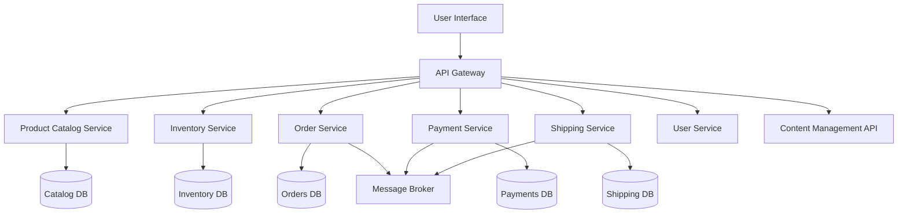
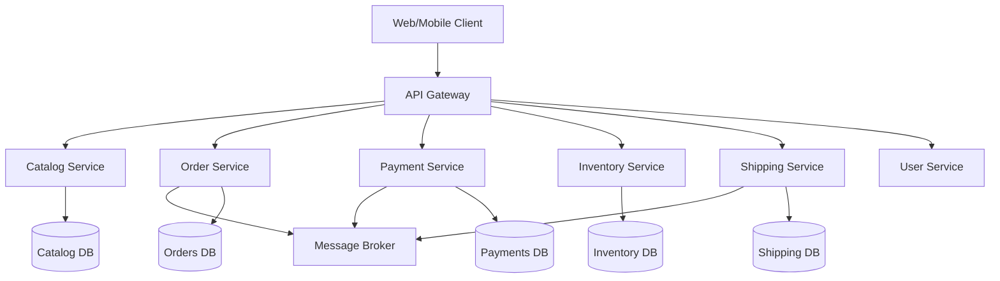
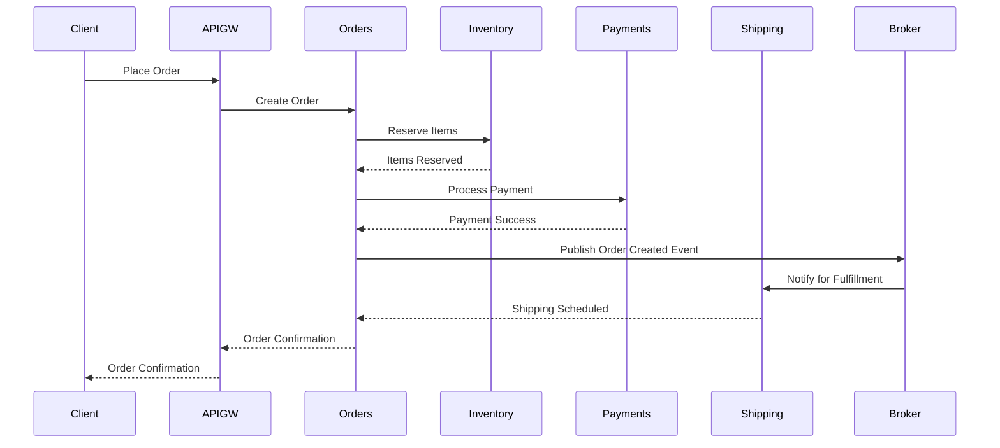

**Executive Summary**

Designing a **scalable microservices architecture** for an e-commerce platform involves decomposing the system into independent, business-focused services that communicate via APIs, enabling rapid scaling, resilience, and technology flexibility[1][2][3][4]. This approach supports high traffic, modular development, and continuous delivery, making it ideal for modern, growth-oriented e-commerce businesses[2][3].

---

## 1. Core Concepts and Definitions

- **Microservices Architecture:** An architectural style where an application is structured as a collection of loosely coupled, independently deployable services, each responsible for a specific business capability[1][2][3].
- **Scalability:** The system’s ability to handle increased load by adding resources, often achieved by scaling individual microservices based on demand[3][4].
- **API Gateway:** A single entry point for client requests, routing them to appropriate microservices and handling cross-cutting concerns like authentication and rate limiting[1][2].
- **Service Registry & Discovery:** Mechanisms for dynamically locating service instances, crucial for scaling and resilience[1].

---

## 2. Key Components and Their Relationships

- **User Interface (UI):** Web/mobile apps built with frameworks like React or Angular, interacting with backend services via APIs[1].
- **API Gateway:** Manages routing, authentication, and aggregation of responses from multiple services[1][2].
- **Microservices:** Each handles a distinct domain (e.g., product catalog, inventory, orders, payments, shipping, user management)[1][3][4].
- **Databases:** Each service may have its own database (polyglot persistence), supporting autonomy and scalability[1][4].
- **Message Broker:** Enables asynchronous communication and event-driven workflows (e.g., RabbitMQ, Kafka)[1][4].
- **Service Registry:** Tracks available service instances for dynamic discovery[1].
- **Third-party Integrations:** Payment gateways, shipping APIs, CMS for content[1].

**Component Relationship Diagram:**


---

## 3. Current Best Practices and Methodologies

- **Domain-Driven Design (DDD):** Aligns microservices with business domains for clear boundaries and autonomy[3].
- **API-First Development:** Define service contracts before implementation to ensure interoperability[2].
- **Continuous Integration/Continuous Deployment (CI/CD):** Automates testing and deployment for rapid iteration[2][4].
- **Containerization & Orchestration:** Use Docker and Kubernetes for packaging, deployment, and scaling[4].
- **Event-Driven Architecture:** Employ message brokers for decoupled, asynchronous workflows[1][4].
- **Observability:** Implement centralized logging, monitoring, and tracing for troubleshooting and optimization[4].

---

## 4. Advantages and Limitations

**Advantages:**
- **Independent Scaling:** Scale only the services under heavy load (e.g., checkout during sales)[3][4].
- **Resilience:** Failures in one service do not cascade to others[2][3].
- **Technology Diversity:** Teams can choose the best tech stack per service[2][4].
- **Faster Time-to-Market:** Parallel development and deployment[2].

**Limitations:**
- **Operational Complexity:** More moving parts require robust DevOps and monitoring[3][4].
- **Data Consistency:** Distributed data management is challenging; eventual consistency is common[4].
- **Network Overhead:** Increased inter-service communication can impact latency[3][4].

---

## 5. Real-World Applications and Examples

- **Amazon:** Pioneered microservices for e-commerce, enabling massive scale and rapid feature delivery.
- **Netflix:** Uses microservices for streaming and e-commerce-like features (subscriptions, recommendations).
- **Google Cloud Retail Demo:** Implements a microservices-based retail app with Kubernetes, Redis, and gRPC[4].

---

## 6. Technical Implementation

### Architecture Patterns

- **API Gateway Pattern:** Centralizes client communication and cross-cutting concerns.
- **Database per Service:** Each microservice manages its own data store.
- **Event-Driven Pattern:** Services communicate via events for decoupling.

### Technology Stack Recommendations

- **Frontend:** React, Angular, Vue.js
- **API Gateway:** Kong, NGINX, AWS API Gateway
- **Backend:** Node.js, Java (Spring Boot), Python (FastAPI), .NET Core
- **Databases:** PostgreSQL, MongoDB, Redis (for caching/session)
- **Message Broker:** RabbitMQ, Apache Kafka
- **Containerization:** Docker
- **Orchestration:** Kubernetes
- **CI/CD:** Jenkins, GitHub Actions, GitLab CI
- **Monitoring:** Prometheus, Grafana, ELK Stack

### Step-by-Step Implementation Guidance

1. **Identify Business Domains:** Break down the platform into core domains (catalog, orders, payments, etc.).
2. **Define Service Boundaries:** Use DDD to map services to business capabilities.
3. **Design APIs:** Specify REST/gRPC interfaces for each service.
4. **Choose Tech Stack:** Select languages and frameworks per service requirements.
5. **Implement Services:** Develop, test, and containerize each service.
6. **Set Up API Gateway:** Route and secure external/internal requests.
7. **Configure Service Discovery:** Use tools like Consul or Kubernetes DNS.
8. **Integrate Message Broker:** Enable asynchronous communication for workflows.
9. **Deploy on Kubernetes:** Use Helm charts or manifests for deployment.
10. **Implement CI/CD:** Automate build, test, and deployment pipelines.
11. **Monitor and Log:** Centralize logs and metrics for observability.

### Code Example (Pseudocode: Order Service API)
```python
# FastAPI example for Order Service
from fastapi import FastAPI, HTTPException

app = FastAPI()

@app.post("/orders")
def create_order(order: Order):
    # Validate order, check inventory, process payment
    # Publish event to message broker
    return {"order_id": "12345", "status": "created"}
```

---

## 7. Considerations & Trade-offs

- **Performance:** Network latency and serialization overhead; mitigate with efficient protocols (gRPC, HTTP/2)[4].
- **Scalability:** Horizontal scaling per service; use auto-scaling in Kubernetes[4].
- **Security:** Secure APIs (OAuth2, JWT), encrypt data in transit, isolate services with network policies[1][4].
- **Cost:** Potentially higher infrastructure and operational costs due to distributed nature[2][3].
- **Maintenance:** Requires robust DevOps, monitoring, and incident response[3][4].

---

## 8. Recent Developments & Trends

- **Service Mesh Adoption:** Tools like Istio and Linkerd for advanced traffic management and security.
- **Serverless Microservices:** Using FaaS (e.g., AWS Lambda) for certain stateless components.
- **AI/ML Integration:** Personalized recommendations and dynamic pricing as microservices.
- **Edge Computing:** Deploying microservices closer to users for lower latency.
- **Industry Adoption:** Retailers, fintech, and logistics companies increasingly migrate to microservices for agility and scale[4].

---

## 9. Practical Recommendations

- **When to Use:** For platforms expecting rapid growth, frequent feature updates, or high availability requirements.
- **Getting Started Guide:**
  - Start with a pilot project (e.g., migrate the product catalog).
  - Invest in DevOps and automation early.
  - Prioritize observability and monitoring.
- **Common Pitfalls to Avoid:**
  - Overly fine-grained services (avoid nano-services).
  - Neglecting data consistency and transaction management.
  - Insufficient API versioning and documentation.
- **Success Metrics:**
  - Deployment frequency
  - Mean time to recovery (MTTR)
  - Service response times
  - System uptime and error rates

---

## 10. Mermaid Diagrams

**System Architecture Overview**


**Order Processing Flow**


---

## 11. Additional Resources

- **Key References:**
  - [Hygraph: Microservices-based architecture in e-commerce][1]
  - [ScienceSoft: Microservices-Based Architecture in Ecommerce][2]
  - [TatvaSoft: E-commerce Microservices Architecture Explained][3]
  - [Google Cloud: Build a microservice-based ecommerce web application][4]

- **Further Reading:**
  - "Building Microservices" by Sam Newman
  - "Microservices Patterns" by Chris Richardson

- **Relevant Tools and Frameworks:**
  - Kubernetes, Docker, Istio (service mesh)
  - Spring Boot, FastAPI, Express.js
  - RabbitMQ, Kafka
  - Prometheus, Grafana, ELK Stack

---

**Citations:**  
[1] Hygraph  
[2] ScienceSoft  
[3] TatvaSoft  
[4] Google Cloud